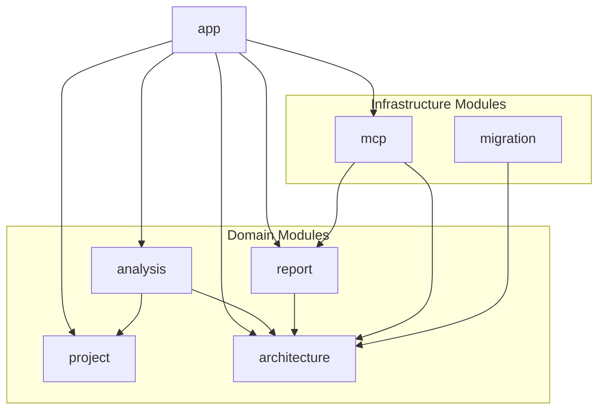
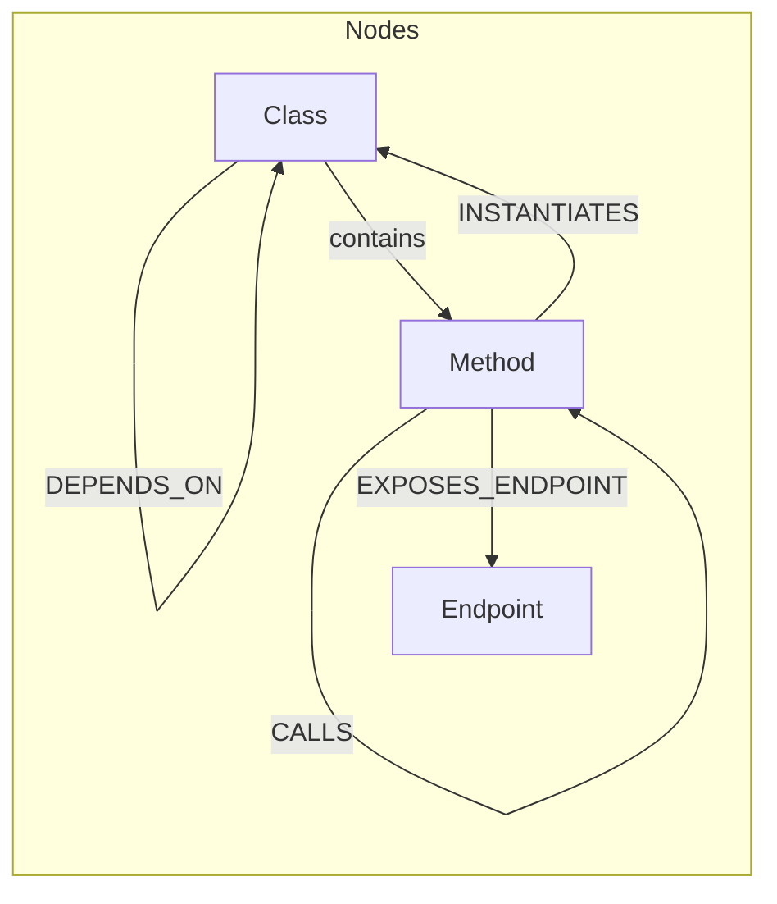

# AGENTS.md: Регламент разработки проекта SpringTwin MCP

Данный документ определяет технологический стек, стандарты качества кода и итерационный цикл разработки, а также правила использования базы знаний (специализированного MCP агента, заменяющего memory bank).

---

## О проекте

Spring Twin — MCP-агент для анализа Spring Boot проектов с построением архитектурного графа и формированием контекстных отчетов для использования совместно с Cloud LLM.

Проект не является полноценным цифровым двойником на текущем этапе, однако закладывает архитектурный фундамент для дальнейшего развития в этом направлении.

### Слоган

Понимай архитектуру. Управляй сложностью.

### Цели проекта

1. Индексация Spring Boot проектов и построение графа зависимостей (DI-граф)
2. Расширение графа связями на основе анализа байткода
3. Формирование explain-отчетов по endpoint, классу и методу
4. Экспорт структурированного контекста для Cloud LLM
5. Предоставление веб-интерфейса для анализа и генерации отчетов
6. Интеграция с Cursor AI и Kilo Code

### Архитектурные принципы

1. **Модульность** - Проект организован как модульный монолит с четким разделением ответственности по доменам
2. **Реактивность** - Использование реактивного стека для обеспечения эффективной обработки данных
3. **Расширяемость** - Архитектура должна поддерживать добавление новых типов анализа и отчетов
4. **Тестируемость** - Код должен быть организован для эффективного покрытия тестами
5. **Изоляция** - Модули должны иметь четкие границы и минимальные зависимости между собой

---

## Технологический стек

- Backend: Java 21+ / Spring Boot 3.x / WebFlux, язык Java (не Kotlin)
- Архитектура: Модульный монолит (Spring Modulith)
- Database: Neo4j
- Frontend: npm 11+, node 24+, Vue.js (компилируется в обычный JavaScript, для хостинга всех статических ресурсов используется Spring Boot)
- Архитектура UI: SPA, модули, такое же разбиение на модули как и на backend, те же модули, с теми же именами
- Сборка: Gradle 8.5+/Kotlin, в том числе для TypeScript (Kotlin используется только для сборки)
- Тесты: Junit для unit тестов на бэкенд, Vitest для unit тестов на frontend, Cypress для e2e тестов, интеграция Cypress со Spring Boot через testcontainers

---

## CLI

локально при разработке используется операционная система windows, используй команды для windows (bat файлы итп)

сборка: gradlew.bat build

очистка и сборка: gradlew.bat clean build

выполнение тестов: gradlew.bat test

выполнение тестов для конкретного модуля: gradlew.bat :module-name:test

---

## Структура проекта

Структура проекта оптимизирована под одиночную разработку проекта в режиме solo vibe coding.

### Общие принципы организации

- Проект организован как модульный монолит с использованием Spring Modulith
- Разбивка на модули идет по доменам, но не по слоям
- Исходный код на верхнем уровне разбивается сначала по модулям, и только модули уже внутри разбиваются по слоям
- Модули в backend и frontend должны соответствовать друг другу по названиям и ответственности

### Модули проекта

Проект разбит на следующие доменные и инфраструктурные модули:

#### Доменные модули

| Модуль | Описание | Ответственность |
|--------|----------|-----------------|
| **project** | Анализируемый проект | Конфигурация include/exclude пакетов, метаданные проекта, управление проектом для анализа |
| **architecture** | Архитектурные сущности | Модели графа: Class, Method, Endpoint, связи между ними (DEPENDS_ON, CALLS, INSTANTIATES, ACCESSES_FIELD, EXPOSES_ENDPOINT) |
| **analysis** | Процессы анализа | AST индексация Java исходников, анализ байткода .class файлов, обнаружение Spring аннотаций |
| **report** | Генерация отчетов | Explain-отчеты по endpoint/class/method, экспорт контекста для LLM в JSON формате |

#### Инфраструктурные модули

| Модуль | Описание | Ответственность |
|--------|----------|-----------------|
| **migration** | Миграции БД | Миграции Neo4j: создание индексов, ограничений, начальных данных |
| **mcp** | MCP-интеграция | MCP tools для интеграции с Cursor AI и Kilo Code |

#### Корневой модуль

| Модуль | Описание | Ответственность |
|--------|----------|-----------------|
| **app** | Корневое приложение | Агрегация модулей, общие компоненты UI, главная страница, навигация |

### Диаграмма зависимостей модулей



### Структура каталогов

```
src/
├── main/
│   ├── java/
│   │   └── twin/
│   │       └── spring/
│   │           ├── app/                    # Корневой модуль
│   │           │   ├── api/
│   │           │   ├── domain/
│   │           │   ├── service/
│   │           │   └── repository/
│   │           ├── project/                # Домен: анализируемый проект
│   │           │   ├── api/
│   │           │   ├── domain/
│   │           │   ├── service/
│   │           │   └── repository/
│   │           ├── architecture/           # Домен: архитектурные сущности
│   │           │   ├── api/
│   │           │   ├── domain/
│   │           │   ├── service/
│   │           │   └── repository/
│   │           ├── analysis/               # Домен: процессы анализа
│   │           │   ├── api/
│   │           │   ├── domain/
│   │           │   ├── service/
│   │           │   └── repository/
│   │           ├── report/                 # Домен: генерация отчетов
│   │           │   ├── api/
│   │           │   ├── domain/
│   │           │   ├── service/
│   │           │   └── repository/
│   │           ├── migration/              # Инфраструктура: миграции БД
│   │           │   ├── v0001/
│   │           │   │   └── *Migration.java
│   │           │   └── v0002/
│   │           │       └── *Migration.java
│   │           └── mcp/                    # Инфраструктура: MCP интеграция
│   │               ├── api/
│   │               ├── domain/
│   │               ├── service/
│   │               └── repository/
│   ├── vue/
│   │   ├── app/                            # Корневой модуль UI
│   │   │   ├── asset/
│   │   │   ├── view/
│   │   │   ├── store/
│   │   │   ├── router/
│   │   │   ├── service/
│   │   │   └── api/
│   │   ├── project/                        # UI модуля project
│   │   │   └── ...
│   │   ├── architecture/                   # UI модуля architecture
│   │   │   └── ...
│   │   ├── analysis/                       # UI модуля analysis
│   │   │   └── ...
│   │   ├── report/                         # UI модуля report
│   │   │   └── ...
│   │   └── mcp/                            # UI модуля mcp
│   │       └── ...
│   └── resources/
│       ├── application.yaml
│       └── ...
└── test/
    ├── java/
    │   └── twin/
    │       └── spring/
    │           ├── app/
    │           ├── project/
    │           ├── architecture/
    │           ├── analysis/
    │           ├── report/
    │           ├── migration/
    │           └── mcp/
    └── vue/
        ├── app/
        ├── project/
        ├── architecture/
        ├── analysis/
        ├── report/
        └── mcp/
```

### Особенности организации

- Код TypeScript должен храниться в стандартной для Spring Boot структуре: src/main/vue и src/test/vue
- Скомпилированные JS файлы (из TypeScript) должны помещаться в resources/public/js в папке build/
- Статические ресурсы из Vue.js (<module>/asset/) помещаются в resources/public/<module>/asset в папке build/
- Модули в backend и frontend должны соответствовать друг другу по названиям и ответственности

---

## Графовая модель данных

### Узлы графа

| Узел | Описание | Атрибуты |
|------|----------|----------|
| **Class** | Java класс | name, fullName, packageName, labels |
| **Method** | Метод класса | name, signature, returnType, modifiers |
| **Endpoint** | REST endpoint | path, httpMethod, produces, consumes |

### Метки узлов (Labels)

Для узлов Class используются метки Neo4j, формируемые на основе Spring аннотаций:

**Текущие метки (MVP):**
- Controller
- RestController
- Service
- Repository
- Component
- Configuration

**Планируемые метки (будущие фазы):**
- Factory
- Event
- Listener
- Adapter
- Facade
- Utility

Механизм меток должен быть расширяемым без изменения базовой модели графа.

### Связи графа

| Связь | От | К | Описание |
|-------|-----|---|----------|
| **DEPENDS_ON** | Class | Class | Dependency Injection связь |
| **CALLS** | Method | Method | Вызов метода |
| **INSTANTIATES** | Method | Class | Создание экземпляра класса |
| **ACCESSES_FIELD** | Method | Field | Доступ к полю |
| **EXPOSES_ENDPOINT** | Method | Endpoint | Метод暴露 REST endpoint |

### Диаграмма графовой модели



---

## Область анализа

### Индексация исходного кода

- Анализ Java AST
- Обнаружение аннотированных компонентов: Controller, RestController, Service, Repository, Component, Configuration, Bean
- Определение зависимостей через constructor injection

### Анализ байткода

- Анализ .class файлов после сборки
- Добавление связей: Field reference, Method invocation, Object instantiation
- Фильтрация классов по include/exclude маске пакетов

### Конфигурация области анализа

```yaml
spring:
  twin:
    include-packages:
      - com.example.myapp
      - org.example.core
    exclude-packages:
      - com.example.myapp.config
      - com.example.myapp.dto
```

Внешние библиотеки не индексируются.

---

## Хранение данных

### Neo4j

- В рамках MVP используется Neo4j embedded (in-memory режим)
- Поддержка standalone Neo4j сервера откладывается на последующие фазы
- Конфигурация минимизирована для упрощения запуска pet-проекта

### Текстовые embeddings

В рамках MVP поддержка embeddings отсутствует. Функциональность семантического поиска откладывается на будущие фазы.

---

## Вектор развития

После MVP возможное развитие:

- Детекция архитектурных аномалий
- Анализ транзакционных границ
- Анализ security-потоков
- Расширенный call graph
- Частичный runtime-анализ
- Кластеризация проекта (выделение логических модулей и bounded context)
- Поддержка сценариев архитектурного и структурного рефакторинга
- Поддержка standalone Neo4j
- Хранение текстовых embeddings и семантический поиск

---

## Тесты

- Используй тестовые профили для заполнения данных, вместо прямого заполнения данных в тестах, чтобы повторно использовать данные в различных тестах. 
- В качестве профилей будут выступать специальные классы, заполнющие соотсветствующие модели и DTO.
- Все API методы сервисов бизнес-логики должны покрываться unit тестами
- Все методы контроллеров должны покрываться end-to-end тестами
- При end-to-end тестов мы заполняем данные в БД и проверяем отобржаение в UI с помошью cypress
- Используй имена и роли в качестве семантических селекторов в cypress тестах
- При исправлении ошибок, нужно добавлять автотесты на найденные ошибочные сценарии
- Пиши тесты до реализации логики, используй TDD
- Всегда запускай выполнение тестов, после выполнения задачи, чтобы удостоверится, что задача выполнена правильно

---

## Spring Boot

- Применение принципов SOLID при разработке
- Использовать реактивный стэк, все методы должны возвращать Mono/Flux
- Используй Spring Data для инетграции с Neo4j
- Базовый пакет: twin.spring
- Полный пакет: twin.spring.<module>.<layer>
- Использовать lombok аннотации, где они допустимы
- Используй Sl4j lombok аннотацию для логирования
- Используй lombok Builder аннотацию для моделей и DTO. используй методы Builder-а для инициализации моделей и DTO.
- Используй lombok аннотации NoArgsConstructor и AllArgsConstructor для моделей и DTO, чтобы поддерживать Builder и конструктор по умолчанию
- Используй lombok аннотацию RequiredArgsConstructor и модификаторы final для полей для работы с DI в Spring Boot (для контроллеров, сервисов и прочих компонентов)
- Использовать Spring Boot аннотации, где они допустимы
- Имена классов, полей, методов и переменных должны соответствовать правилам семантической разметки, код должен быть самодокументируемым
- Используй суффиксы в именах классов, которые описывают роль класса
- Используй развернутые значения суффиксов, например:
  AggregateService (Сервис-агрегатор данных), 
  DomainService (Бизнес-логика предметной области),
  ApplicationService (Координация use cases)
- Обязательно заполнять JavaDoc для классов и методов
- Для доступа к БД использовать ReactiveNeo4jRepository, работа с БД так же должна быть реактивной через Mono/Flux
- Использовать DTO объекты для запросов и ответов. При этом для запросов и ответов должны использоваться различные классы, даже при совпадении полей.
- DTO должны использовать одинаковые названия полей для ответов в различных классах (name, url итп), для унификации обработки. 
- Использовать специальные Mapper классы для преобразования моделей в DTO и обратно
- Преобразование между моделями и DTO должно происходить в сервисах

---

## Vue.js

- Применение принципов SOLID при разработке
- Используй Vuex для управления состоянием UI
- Имена классов, полей, методов и переменных должны соответствовать правилам семантической разметки, код должен быть самодокументируемым
- Каждый модуль должен иметь отдельное пространство состояний/свой контекст, получаемый из глобального
- Для каждого модуля и его контекста задается свое пространство имен
- Глобальное пространство имен, общее для модулей идет с префиксом app
- Используй асинхронную обработку событий, так как используется реактивный стэк технологий
- Каждый модуль должен покрываться unit тестами
- структура каталогов аналогично backend: в src/main/vue сначала идут папки с модулями (src/main/vue/<module>), а внутри них уже идут слои:
  asset/ - статические файлы: css, шрифты, картинки
  view/ - шаблоны отображения
  store/ - хранилище данных
  router/ - маршрутизация
  service/ - сервисы
  api/ - api 
- корневое приложение рассматриваем как модуль app
- используй семантические значения для атрибутов name и role, для значимых эдементов

---

## Neo4j

- В стартовом варианте используется Neo4j embedded
- Должна быть настройка в application.yml чтобы заменить Neo4j embedded на отдельный Neo4j сервер
- выноси миграции Neo4j в отдельный модуль, внутри модуля пакеты будут соответствовать версиям миграций: code.alchemist.<module>.<version aka v0001> внутри пакета классы миграций, 
  имена которых соответствуют мигрируемым сущностям + суффикс Migration
- Настрой автозапуск миграций при запуске приложения
- Узлами в БД выступают классы, а связями использование одного класса другим, явное или через DI в Spring Boot
- Должны сохраняться информации по связям: имена полей, методов, имена аргументов методов
- Структура базы должна быть оптимизированна под кластеризацию данных

---

## База знаний

База знаний - это набор файлов AGENTS.md с разбивкой по блокам ответственности:
- Глобальный (AGENTS.md) - содержит общие правила, принципы и стандарты разработки
- Отдельные файлы для backend (src/main/java/AGENTS.md) и frontend (src/main/vue/AGENTS.md) - содержат специфические правила для соответствующих частей проекта
- Отдельные файлы для каждого модуля (src/main/java/<module>/AGENTS.md и src/main/vue/<module>/AGENTS.md) - содержат специфические правила для конкретных модулей

### Структура файлов базы знаний

- src/main/java/AGENTS.md - правила для бэкенд
- src/test/java/AGENTS.md - правила для тестирования бэкенд 
- src/main/vue/AGENTS.md - правила для фронтенд
- src/test/vue/AGENTS.md - правила для тестированияфронтенд
- src/main/java/<module>/AGENTS.md - правила для конкретного модуля бэкенд
- src/test/java/<module>/AGENTS.md - правила для конкретного модуля тестирования бэкенд 
- src/main/vue/<module>/AGENTS.md - правила для конкретного модуля фронтенд
- src/test/vue/<module>/AGENTS.md - правила для конкретного модуля тестированияфронтенд

### Принципы обновления базы знаний

- База знаний должна обновляться после завершения каждой задачи
- Обновления должны включать архитектурные изменения, новые компоненты и методы
- Изменения должны быть согласованы с общими принципами проекта
- При добавлении новых модулей необходимо создавать соответствующие файлы AGENTS.md

---

## Задачи

- Задачи дожны быть минималистичного размера с минимальным содержанием функционала. Принцип одной ответственности как в SOLID. 
- Все задачи обязательно должны содержать: тесты, критерии приемки и mermaid диаграммы как часть постановки задач

### Постановка задачи
- Название задачи
- Дата создания задачи
- Статус задачи: Новая, В разработке, На проверке, Выполнена, Отклонена
- Текстовое описание
- Mermaid диаграмма сценария.
- Определение DTO (Request/Response отдельно).
- Описание тестовых сценариев для приемки задачи, включая тестовые данные, для заполнения тестовых профилей и данных, отображаемых на экране
- Критерии приемки задачи

### Этапы реализации

Этапы разработки заточены под TDD. Разработка ведется с акцентом на автоматическое тестирование проекта.

1. **API с заглушками** - Реализация эндпоинтов без логики, API компонентов в UI без реализации
2. **Заполнение тестовых профилей** - Реализация классов с тестовыми профилями, заполняющих БД и DTO объекты
3. **Тестирование** - Unit-тесты логики + E2E тесты
4. **Реализация логики** - Замена заглушек, внедрение мапперов и сервисов
5. **Реализация интерфейса** - Реализация UI компонентов, интеграция компонентов с backend, размещение компонентов на странице
6. **Верификация** - Запуск тестов, исправление замечаний. Этап не считается выполненым, пока все тесты не пройдут
7. **Обновление базы знаний** - Журналируем все внесенные изменения: архитекурные изменения, список измененных файлов, новые компоненты и методы, текстовое описание изменений (в файле задачи)
8. **Code review** - Автоматическое и ручное. Пока пользователь не даст свое подтверждение, задача не считается выполненной
9. **Обновление статуса задачи** - Помечаем задачу как выполненную

---

## Архитектурные шаблоны и паттерны

### Общие паттерны

- **Dependency Injection** - Использование Spring DI для управления зависимостями
- **Repository Pattern** - Для доступа к данным в Neo4j
- **Service Layer** - Для инкапсуляции бизнес-логики
- **DTO Pattern** - Для передачи данных между слоями
- **Mapper Pattern** - Для преобразования между моделями и DTO

---

## Стандарты качества кода

### Общие принципы

- **Чистый код** - Код должен быть читаемым, понятным и самодокументируемым
- **SOLID** - Следование принципам SOLID во всех компонентах
- **DRY** - Избегание дублирования кода
- **KISS** - Простота решений предпочтительнее сложности
- **YAGNI** - Не добавлять функциональность, пока она действительно не нужна

### Стандарты документации

- Все публичные классы и методы должны иметь JavaDoc
- Комментарии должны объяснять "почему", а не "что" делает код
- Сложные алгоритмы должны сопровождаться подробными комментариями
- README.md должен содержать актуальную информацию о проекте
- Изменения API должны документироваться

### Стандарты именования

- Имена классов, методов и переменных должны быть семантически значимыми
- Использовать суффиксы для обозначения роли класса
- Придерживаться Java Code Conventions для backend
- Придерживаться Vue Style Guide для frontend