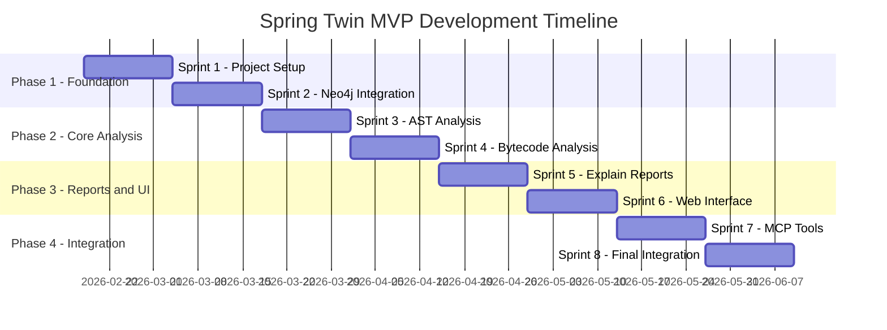
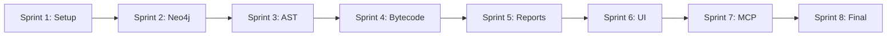

# Spring Twin MVP Roadmap

**Слоган:** Понимай архитектуру. Управляй сложностью.

**Цель MVP:** Создать MCP-агент для анализа Spring Boot проектов с построением архитектурного графа и формированием контекстных отчетов.

**Срок разработки:** 12 недель (3 месяца) в режиме solo vibe coding.

---

## Обзор фаз разработки

---

## Phase 1: Foundation (Недели 1-4)

### Sprint 1: Project Setup (Недели 1-2)

**Цель:** Настроить базовую инфраструктуру проекта и скелет модулей.

#### Backend Tasks

| Задача | Описание | Приоритет |
|--------|----------|-----------|
| [x] B1.1 | Настроить Gradle multi-module структуру | High |
| [x] B1.2 | Создать package структуру для всех модулей | High |
| B1.3 | Настроить Spring Modulith для модульного монолита | High |
| B1.4 | Создать базовые domain модели для architecture модуля | High |
| B1.5 | Настроить Lombok конфигурацию | Medium |
| B1.6 | Создать базовые тестовые профили | Medium |

#### Frontend Tasks

| Задача | Описание | Приоритет |
|--------|----------|-----------|
| F1.1 | Настроить Vue.js проект в src/main/vue | High |
| F1.2 | Настроить Vitest для unit тестов | High |
| F1.3 | Создать базовую структуру модулей Vue | High |
| F1.4 | Настроить Vuex store с модульной структурой | Medium |
| F1.5 | Создать базовый layout и навигацию | Medium |
| F1.6 | Настроить сборку Vue через Gradle | Medium |

#### Инфраструктура

| Задача | Описание | Приоритет |
|--------|----------|-----------|
| I1.1 | Настроить Cypress для e2e тестов | High |
| I1.2 | Создать testcontainers конфигурацию | High |
| I1.3 | Настроить CI/CD pipeline (опционально) | Low |

#### Критерии приемки Sprint 1

- [ ] `gradlew.bat build` успешно выполняется
- [ ] `gradlew.bat test` успешно выполняется
- [ ] Приложение запускается на localhost:8080
- [ ] Vue.js приложение открывается в браузере
- [ ] Базовая навигация работает

---

### Sprint 2: Neo4j Integration (Недели 3-4)

**Цель:** Интегрировать Neo4j и создать базовую графовую модель.

#### Backend Tasks

| Задача | Описание | Приоритет |
|--------|----------|-----------|
| B2.1 | Создать domain модели: Class, Method, Endpoint | High |
| B2.2 | Создать domain модели связей: DEPENDS_ON, CALLS, etc. | High |
| B2.3 | Создать ReactiveNeo4jRepository для каждого узла | High |
| B2.4 | Реализовать migration модуль для Neo4j | High |
| B2.5 | Создать индексы и constraints в Neo4j | High |
| B2.6 | Реализовать базовые Cypher запросы | Medium |

#### Frontend Tasks

| Задача | Описание | Приоритет |
|--------|----------|-----------|
| F2.1 | Создать architecture module UI структуру | Medium |
| F2.2 | Создать API сервисы для architecture | Medium |
| F2.3 | Создать базовые компоненты для отображения графа | Low |

#### Migration Module

| Задача | Описание | Приоритет |
|--------|----------|-----------|
| M2.1 | Создать v0001 миграции для Class узлов | High |
| M2.2 | Создать v0001 миграции для Method узлов | High |
| M2.3 | Создать v0001 миграции для Endpoint узлов | High |
| M2.4 | Создать v0001 миграции для связей | High |
| M2.5 | Настроить автозапуск миграций | High |

#### Критерии приемки Sprint 2

- [ ] Neo4j embedded запускается корректно
- [ ] Миграции выполняются автоматически при старте
- [ ] Можно создавать и читать узлы через API
- [ ] Unit тесты для repository проходят
- [ ] E2E тест для создания узла проходит

---

## Phase 2: Core Analysis (Недели 5-8)

### Sprint 3: AST Analysis (Недели 5-6)

**Цель:** Реализовать анализ Java исходного кода через AST.

#### Backend Tasks

| Задача | Описание | Приоритет |
|--------|----------|-----------|
| B3.1 | Создать project module: конфигурация include/exclude | High |
| B3.2 | Реализовать Java AST парсер (JavaParser) | High |
| B3.3 | Обнаружение Spring аннотаций | High |
| B3.4 | Извлечение constructor injection зависимостей | High |
| B3.5 | Создание узлов Class в графе | High |
| B3.6 | Создание связей DEPENDS_ON | High |
| B3.7 | Формирование labels на основе аннотаций | Medium |

#### Frontend Tasks

| Задача | Описание | Приоритет |
|--------|----------|-----------|
| F3.1 | Создать project module UI | High |
| F3.2 | Форма настройки include/exclude пакетов | High |
| F3.3 | Кнопка запуска индексации | High |
| F3.4 | Отображение прогресса индексации | Medium |
| F3.5 | Отображение списка найденных классов | Medium |

#### Analysis Module

| Задача | Описание | Приоритет |
|--------|----------|-----------|
| A3.1 | Создать AnalysisApplicationService | High |
| A3.2 | Реализовать AstIndexerService | High |
| A3.3 | Реализовать SpringAnnotationDetector | High |
| A3.4 | Реализовать DependencyExtractor | High |
| A3.5 | Создать тестовые профили с примерами классов | High |

#### Критерии приемки Sprint 3

- [ ] Можно настроить include/exclude пакеты через UI
- [ ] Запуск индексации создает узлы Class в Neo4j
- [ ] Связи DEPENDS_ON корректно создаются
- [ ] Labels формируются на основе Spring аннотаций
- [ ] Unit тесты покрывают AST анализ
- [ ] E2E тест проверяет полный цикл индексации

---

### Sprint 4: Bytecode Analysis (Недели 7-8)

**Цель:** Расширить граф связями из анализа байткода.

#### Backend Tasks

| Задача | Описание | Приоритет |
|--------|----------|-----------|
| B4.1 | Интегрировать ASM библиотеку для байткод анализа | High |
| B4.2 | Реализовать BytecodeAnalyzerService | High |
| B4.3 | Извлечение Method invocations | High |
| B4.4 | Извлечение Field accesses | High |
| B4.5 | Извлечение Object instantiations | High |
| B4.6 | Создание узлов Method в графе | High |
| B4.7 | Создание связей CALLS, ACCESSES_FIELD, INSTANTIATES | High |
| B4.8 | Обнаружение @RequestMapping и создание Endpoint узлов | Medium |
| B4.9 | Создание связей EXPOSES_ENDPOINT | Medium |

#### Frontend Tasks

| Задача | Описание | Приоритет |
|--------|----------|-----------|
| F4.1 | Обновить UI для отображения методов | Medium |
| F4.2 | Обновить UI для отображения endpoints | Medium |
| F4.3 | Визуализация связей в графе | Medium |

#### Критерии приемки Sprint 4

- [ ] Анализ байткода создает узлы Method
- [ ] Связи CALLS корректно создаются
- [ ] Связи INSTANTIATES корректно создаются
- [ ] Endpoints обнаруживаются и создаются
- [ ] Фильтрация по include/exclude работает
- [ ] Unit и E2E тесты проходят

---

## Phase 3: Reports and UI (Недели 9-10)

### Sprint 5: Explain Reports (Недели 9-10)

**Цель:** Реализовать генерацию explain-отчетов.

#### Backend Tasks

| Задача | Описание | Приоритет |
|--------|----------|-----------|
| B5.1 | Создать report module структуру | High |
| B5.2 | Реализовать ExplainEndpointService | High |
| B5.3 | Реализовать ExplainClassService | High |
| B5.4 | Реализовать ExplainMethodService | High |
| B5.5 | Создать DTO для отчетов | High |
| B5.6 | Реализовать экспорт в JSON для LLM | High |
| B5.7 | Создать REST API endpoints для отчетов | High |

#### Frontend Tasks

| Задача | Описание | Приоритет |
|--------|----------|-----------|
| F5.1 | Создать report module UI | High |
| F5.2 | Страница выбора типа отчета | High |
| F5.3 | Форма выбора endpoint/class/method | High |
| F5.4 | Отображение отчета в читаемом формате | High |
| F5.5 | Кнопка экспорта JSON | Medium |
| F5.6 | История сгенерированных отчетов | Low |

#### Report Module

| Задача | Описание | Приоритет |
|--------|----------|-----------|
| R5.1 | Создать ReportApplicationService | High |
| R5.2 | Реализовать EndpointReportGenerator | High |
| R5.3 | Реализовать ClassReportGenerator | High |
| R5.4 | Реализовать MethodReportGenerator | High |
| R5.5 | Создать LlmContextExporter | High |

#### Критерии приемки Sprint 5

- [ ] Можно сгенерировать отчет по endpoint
- [ ] Можно сгенерировать отчет по классу
- [ ] Можно сгенерировать отчет по методу
- [ ] Отчет содержит зависимости и связи
- [ ] JSON экспорт работает корректно
- [ ] Unit и E2E тесты проходят

---

### Sprint 6: Web Interface (Недели 11-12)

**Цель:** Завершить веб-интерфейс и визуализацию графа.

#### Frontend Tasks

| Задача | Описание | Приоритет |
|--------|----------|-----------|
| F6.1 | Интегрировать библиотеку визуализации графа (vis.js/D3) | High |
| F6.2 | Интерактивное отображение DI-графа | High |
| F6.3 | Фильтрация узлов по labels | High |
| F6.4 | Навигация по графу (zoom, pan) | Medium |
| F6.5 | Клик по узлу открывает детали | High |
| F6.6 | Поиск по имени класса/метода | Medium |
| F6.7 | Экспорт графа в изображение | Low |

#### Backend Tasks

| Задача | Описание | Приоритет |
|--------|----------|-----------|
| B6.1 | API для получения подграфа | High |
| B6.2 | API для поиска по имени | High |
| B6.3 | API для фильтрации по labels | Medium |

#### Критерии приемки Sprint 6

- [ ] Граф отображается визуально
- [ ] Можно фильтровать по типу компонента
- [ ] Клик по узлу показывает детали
- [ ] Поиск работает корректно
- [ ] E2E тесты покрывают UI

---

## Phase 4: Integration (Недели 13-14)

### Sprint 7: MCP Tools (Недели 13-14)

**Цель:** Реализовать MCP интеграцию для Cursor AI и Kilo Code.

#### Backend Tasks

| Задача | Описание | Приоритет |
|--------|----------|-----------|
| B7.1 | Создать mcp module структуру | High |
| B7.2 | Реализовать MCP protocol handler | High |
| B7.3 | MCP Tool: get_endpoint_context | High |
| B7.4 | MCP Tool: get_class_context | High |
| B7.5 | MCP Tool: get_method_context | High |
| B7.6 | Документация MCP API | Medium |

#### MCP Module

| Задача | Описание | Приоритет |
|--------|----------|-----------|
| M7.1 | Создать McpApplicationService | High |
| M7.2 | Реализовать MCP tool registry | High |
| M7.3 | Создать контекстные провайдеры | High |
| M7.4 | Интеграция с report module | High |

#### Критерии приемки Sprint 7

- [ ] MCP сервер запускается
- [ ] Tools корректно возвращают контекст
- [ ] Интеграция с Cursor AI работает
- [ ] Интеграция с Kilo Code работает
- [ ] Документация актуальна

---

### Sprint 8: Final Integration (Недели 15-16)

**Цель:** Финальная интеграция, тестирование и документация.

#### Tasks

| Задача | Описание | Приоритет |
|--------|----------|-----------|
| I8.1 | Полное тестирование всех модулей | High |
| I8.2 | Исправление найденных багов | High |
| I8.3 | Обновление README.md | High |
| I8.4 | Создание user documentation | Medium |
| I8.5 | Оптимизация производительности | Medium |
| I8.6 | Финальный code review | High |
| I8.7 | Подготовка release notes | Medium |

#### Критерии приемки Sprint 8

- [ ] Все тесты проходят
- [ ] Документация актуальна
- [ ] README содержит инструкции по запуску
- [ ] MVP готов к использованию

---

## Диаграмма зависимостей между спринтами

---

## Риски и митигация

| Риск | Вероятность | Влияние | Митигация |
|------|-------------|---------|-----------|
| Сложность AST анализа | Средняя | Высокое | Использовать проверенную библиотеку JavaParser |
| Проблемы с Neo4j embedded | Низкая | Среднее | Иметь план перехода на standalone Neo4j |
| Время на Vue.js разработку | Средняя | Среднее | Использовать UI компоненты из библиотек |
| MCP интеграция | Средняя | Среднее | Изучить MCP спецификацию заранее |

---

## Технический стек (напоминание)

- **Backend:** Java 21+, Spring Boot 4.x, WebFlux, Neo4j
- **Frontend:** Vue.js, TypeScript, Vuex
- **Сборка:** Gradle 8.5+, Kotlin DSL
- **Тесты:** JUnit, Vitest, Cypress, Testcontainers

---

## Результат MVP

После завершения всех спринтов будет готов:

1. **Индексация** Spring Boot проектов через AST и байткод анализ
2. **Граф зависимостей** в Neo4j с визуализацией
3. **Explain-отчеты** по endpoint, class, method
4. **Веб-интерфейс** для управления и просмотра
5. **MCP интеграция** с Cursor AI и Kilo Code
6. **JSON экспорт** контекста для Cloud LLM

---

*Документ создан: 2026-02-18*
*Последнее обновление: 2026-02-18*