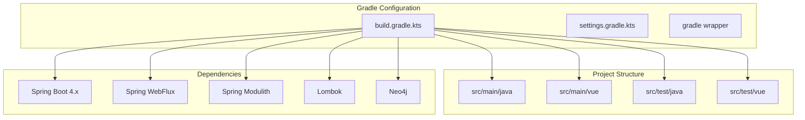

# B1.1 - Настроить Gradle multi-module структуру

## Метаданные задачи

| Поле | Значение |
|------|----------|
| **Название** | Настроить Gradle multi-module структуру |
| **Дата создания** | 2026-02-18 |
| **Статус** | Выполнена |
| **Приоритет** | High |
| **Спринт** | Sprint 1 |
| **Категория** | Backend |

---

## Описание

Настроить базовую конфигурацию Gradle для проекта SpringTwin с поддержкой модульного монолита. Конфигурация должна обеспечивать:

1. Единый файл `build.gradle.kts` для всего проекта (не создавать подмодули через Gradle)
2. Поддержку Java 21+
3. Поддержку Spring Boot 4.x
4. Настройку зависимостей для всех доменных модулей
5. Конфигурацию плагинов: Spring Boot, Spring Dependency Management, Lombok

**Важно:** Модули создаются через Spring Modulith, а не через Gradle submodules. Gradle используется только для управления зависимостями и сборки единого проекта.

---

## Mermaid диаграмма

---

## DTO определения

Для данной задачи DTO не требуются, так как это инфраструктурная задача по настройке сборки.

---

## Тестовые сценарии

### Unit тесты

| ID | Описание | Ожидаемый результат |
|----|----------|---------------------|
| UT-B1.1-01 | Проверка версии Java в build.gradle.kts | Версия Java должна быть 21+ |
| UT-B1.1-02 | Проверка наличия Spring Boot плагина | Плагин должен быть применен |
| UT-B1.1-03 | Проверка наличия Lombok зависимости | Зависимость должна быть в compileOnly и annotationProcessor |

### Интеграционные тесты

| ID | Описание | Шаги | Ожидаемый результат |
|----|----------|------|---------------------|
| IT-B1.1-01 | Сборка проекта | 1. Выполнить `gradlew.bat build` | BUILD SUCCESSFUL |
| IT-B1.1-02 | Очистка и сборка | 1. Выполнить `gradlew.bat clean build` | BUILD SUCCESSFUL |
| IT-B1.1-03 | Выполнение тестов | 1. Выполнить `gradlew.bat test` | Все тесты проходят |

### E2E тесты

| ID | Описание | Шаги | Ожидаемый результат |
|----|----------|------|---------------------|
| E2E-B1.1-01 | Запуск приложения | 1. Выполнить `gradlew.bat bootRun` 2. Открыть localhost:8080 | Приложение запускается без ошибок |

---

## Критерии приемки

- [ ] Файл `build.gradle.kts` содержит все необходимые зависимости
- [ ] Файл `settings.gradle.kts` корректно настроен
- [ ] Команда `gradlew.bat build` выполняется успешно
- [ ] Команда `gradlew.bat test` выполняется успешно
- [ ] Приложение запускается командой `gradlew.bat bootRun`
- [ ] Версия Java 21+ используется в проекте
- [ ] Spring Boot 4.x используется в проекте
- [ ] Lombok настроен корректно (compileOnly + annotationProcessor)

---

## Зависимости

Нет зависимостей от других задач.

---

## Примечания

- Использовать Kotlin DSL для build.gradle.kts
- Gradle wrapper должен быть версии 8.5+
- Не создавать submodules через settings.gradle.kts - модули управляются Spring Modulith