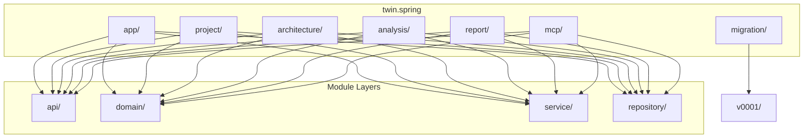

# B1.2 - Создать package структуру для всех модулей

## Метаданные задачи

| Поле | Значение |
|------|----------|
| **Название** | Создать package структуру для всех модулей |
| **Дата создания** | 2026-02-18 |
| **Статус** | Новая |
| **Приоритет** | High |
| **Спринт** | Sprint 1 |
| **Категория** | Backend |

---

## Описание

Создать базовую package структуру для всех доменных и инфраструктурных модулей проекта. Структура должна соответствовать принципам модульного монолита и обеспечивать четкое разделение ответственности.

### Модули для создания структуры

**Доменные модули:**
- `project` - Анализируемый проект
- `architecture` - Архитектурные сущности
- `analysis` - Процессы анализа
- `report` - Генерация отчетов

**Инфраструктурные модули:**
- `migration` - Миграции БД
- `mcp` - MCP-интеграция

**Корневой модуль:**
- `app` - Корневое приложение

### Слои внутри каждого модуля

- `api` - REST контроллеры и API endpoints
- `domain` - Доменные модели и сущности
- `service` - Бизнес-логика
- `repository` - Доступ к данным

---

## Mermaid диаграмма

---

## DTO определения

Для данной задачи DTO не требуются, так как это задача по созданию структуры каталогов.

---

## Тестовые сценарии

### Unit тесты

| ID | Описание | Ожидаемый результат |
|----|----------|---------------------|
| UT-B1.2-01 | Проверка наличия package-info.java в каждом модуле | Файлы существуют во всех модулях |
| UT-B1.2-02 | Проверка структуры слоев api/domain/service/repository | Все слои существуют в доменных модулях |

### Интеграционные тесты

| ID | Описание | Шаги | Ожидаемый результат |
|----|----------|------|---------------------|
| IT-B1.2-01 | Компиляция проекта после создания структуры | 1. Создать структуру 2. Выполнить `gradlew.bat build` | BUILD SUCCESSFUL |
| IT-B1.2-02 | Проверка загрузки контекста Spring | 1. Запустить приложение | Контекст загружается без ошибок |

### E2E тесты

| ID | Описание | Шаги | Ожидаемый результат |
|----|----------|------|---------------------|
| E2E-B1.2-01 | Запуск приложения с новой структурой | 1. Выполнить `gradlew.bat bootRun` 2. Открыть localhost:8080 | Приложение запускается корректно |

---

## Критерии приемки

- [ ] Созданы все package для доменных модулей: project, architecture, analysis, report
- [ ] Созданы все package для инфраструктурных модулей: migration, mcp
- [ ] Создан package для корневого модуля: app
- [ ] В каждом доменном модуле созданы слои: api, domain, service, repository
- [ ] В модуле migration создан package v0001 для первых миграций
- [ ] В каждом package создан файл package-info.java с JavaDoc описанием
- [ ] Базовый пакет: `twin.spring`
- [ ] Полный путь: `twin.spring.<module>.<layer>`
- [ ] Команда `gradlew.bat build` выполняется успешно

---

## Зависимости

- **B1.1** - Настроить Gradle multi-module структуру

---

## Примечания

- Не создавать подмодули через Gradle - только package структуру
- Файлы package-info.java должны содержать краткое описание назначения package
- Структура должна соответствовать принципам SOLID и DDD