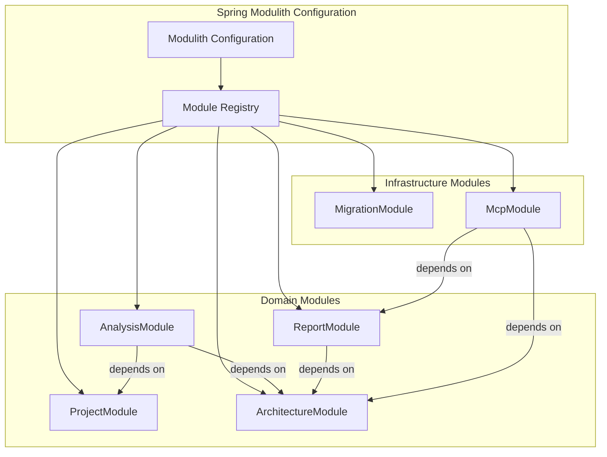

# B1.3 - Настроить Spring Modulith для модульного монолита

## Метаданные задачи

| Поле | Значение |
|------|----------|
| **Название** | Настроить Spring Modulith для модульного монолита |
| **Дата создания** | 2026-02-18 |
| **Статус** | Новая |
| **Приоритет** | High |
| **Спринт** | Sprint 1 |
| **Категория** | Backend |

---

## Описание

Настроить Spring Modulith для организации модульного монолита. Spring Modulith обеспечивает:

1. Формальное определение модулей приложения
2. Автоматическую проверку границ модулей
3. Документирование структуры модулей
4. Интеграцию с Spring Boot

### Модули для регистрации

**Доменные модули:**
- `ProjectModule` - Анализируемый проект
- `ArchitectureModule` - Архитектурные сущности
- `AnalysisModule` - Процессы анализа
- `ReportModule` - Генерация отчетов

**Инфраструктурные модули:**
- `MigrationModule` - Миграции БД
- `McpModule` - MCP-интеграция

---

## Mermaid диаграмма

---

## DTO определения

Для данной задачи DTO не требуются, так как это инфраструктурная задача.

---

## Тестовые сценарии

### Unit тесты

| ID | Описание | Ожидаемый результат |
|----|----------|---------------------|
| UT-B1.3-01 | Проверка наличия @Module аннотации в каждом модуле | Все модули аннотированы |
| UT-B1.3-02 | Проверка корректности имен модулей | Имена соответствуют соглашениям |

### Интеграционные тесты

| ID | Описание | Шаги | Ожидаемый результат |
|----|----------|------|---------------------|
| IT-B1.3-01 | Верификация структуры модулей | 1. Запустить Modulith verification test | Все модули проходят проверку |
| IT-B1.3-02 | Проверка границ модулей | 1. Запустить boundary tests | Границы модулей не нарушены |
| IT-B1.3-03 | Генерация документации модулей | 1. Запустить документацию | Документация создана корректно |

### E2E тесты

| ID | Описание | Шаги | Ожидаемый результат |
|----|----------|------|---------------------|
| E2E-B1.3-01 | Запуск приложения с Modulith | 1. Выполнить `gradlew.bat bootRun` 2. Проверить логи | Модули инициализированы корректно |

---

## Критерии приемки

- [ ] Добавлена зависимость spring-modulith-starter в build.gradle.kts
- [ ] Созданы классы конфигурации для каждого модуля с аннотацией @Module
- [ ] Настроены зависимости между модулями через @Module annotation
- [ ] Модуль app агрегирует все остальные модули
- [ ] Modulith verification test проходит успешно
- [ ] Границы модулей проверяются автоматически
- [ ] Документация модулей генерируется корректно
- [ ] Команда `gradlew.bat build` выполняется успешно

---

## Зависимости

- **B1.1** - Настроить Gradle multi-module структуру
- **B1.2** - Создать package структуру для всех модулей

---

## Примечания

- Использовать Spring Modulith 1.x+ для совместимости с Spring Boot 3.x
- Каждый модуль должен иметь класс конфигурации с аннотацией @Module
- Модули должны явно объявлять свои зависимости через параметр `dependsOn`
- Не использовать Gradle submodules - модули управляются только через Spring Modulith