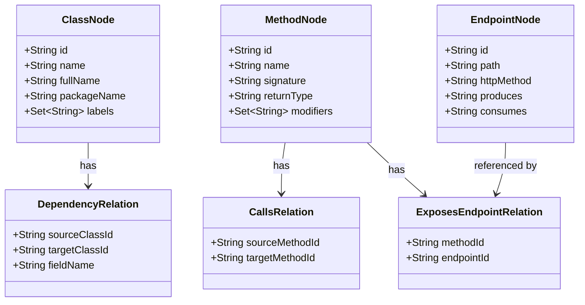

# B1.4 - Создать базовые domain модели для architecture модуля

## Метаданные задачи

| Поле | Значение |
|------|----------|
| **Название** | Создать базовые domain модели для architecture модуля |
| **Дата создания** | 2026-02-18 |
| **Статус** | Выполнена |
| **Приоритет** | High |
| **Спринт** | Sprint 1 |
| **Категория** | Backend |

---

## Описание

Создать базовые доменные модели для модуля architecture. Модели представляют узлы и связи графа архитектуры Spring Boot приложения.

### Узлы графа

1. **ClassNode** - Java класс (имя ClassNode используется вместо Class, так как Class - зарезервированное слово Java)
2. **MethodNode** - Метод класса
3. **EndpointNode** - REST endpoint

### Связи графа

1. **DependencyRelation** - DEPENDS_ON связь между классами
2. **CallsRelation** - CALLS связь между методами
3. **ExposesEndpointRelation** - EXPOSES_ENDPOINT связь метода и endpoint

---

## Mermaid диаграмма



---

## DTO определения

### ClassNodeRequest

```java
public class ClassNodeRequest {
    private String name;           // Простое имя класса
    private String fullName;       // Полное имя с пакетом
    private String packageName;    // Имя пакета
    private Set<String> labels;    // Метки: Controller, Service, Repository, etc.
}
```

### ClassNodeResponse

```java
public class ClassNodeResponse {
    private String id;
    private String name;
    private String fullName;
    private String packageName;
    private Set<String> labels;
    private LocalDateTime createdAt;
}
```

### MethodNodeRequest

```java
public class MethodNodeRequest {
    private String name;           // Имя метода
    private String signature;      // Полная сигнатура
    private String returnType;     // Возвращаемый тип
    private Set<String> modifiers; // Модификаторы: public, private, static, etc.
    private String classId;        // ID родительского класса
}
```

### MethodNodeResponse

```java
public class MethodNodeResponse {
    private String id;
    private String name;
    private String signature;
    private String returnType;
    private Set<String> modifiers;
    private String classId;
    private LocalDateTime createdAt;
}
```

### EndpointNodeRequest

```java
public class EndpointNodeRequest {
    private String path;           // URL путь
    private String httpMethod;     // GET, POST, PUT, DELETE, etc.
    private String produces;       // Content-Type ответа
    private String consumes;       // Content-Type запроса
    private String methodId;       // ID метода-обработчика
}
```

### EndpointNodeResponse

```java
public class EndpointNodeResponse {
    private String id;
    private String path;
    private String httpMethod;
    private String produces;
    private String consumes;
    private String methodId;
    private LocalDateTime createdAt;
}
```

---

## Тестовые сценарии

### Unit тесты

| ID | Описание | Ожидаемый результат |
|----|----------|---------------------|
| UT-B1.4-01 | Создание ClassNode через Builder | Объект создан с корректными полями |
| UT-B1.4-02 | Создание MethodNode через Builder | Объект создан с корректными полями |
| UT-B1.4-03 | Создание EndpointNode через Builder | Объект создан с корректными полями |
| UT-B1.4-04 | Проверка equals/hashCode для ClassNode | Корректное сравнение объектов |
| UT-B1.4-05 | Проверка equals/hashCode для MethodNode | Корректное сравнение объектов |
| UT-B1.4-06 | Проверка equals/hashCode для EndpointNode | Корректное сравнение объектов |

### Интеграционные тесты

| ID | Описание | Шаги | Ожидаемый результат |
|----|----------|------|---------------------|
| IT-B1.4-01 | Маппинг ClassNodeRequest в ClassNode | 1. Создать DTO<br>2. Преобразовать в модель | Поля корректно переносятся |
| IT-B1.4-02 | Маппинг ClassNode в ClassNodeResponse | 1. Создать модель<br>2. Преобразовать в DTO | Поля корректно переносятся |
| IT-B1.4-03 | Маппинг MethodNodeRequest в MethodNode | 1. Создать DTO<br>2. Преобразовать в модель | Поля корректно переносятся |
| IT-B1.4-04 | Маппинг EndpointNodeRequest в EndpointNode | 1. Создать DTO<br>2. Преобразовать в модель | Поля корректно переносятся |

### E2E тесты

| ID | Описание | Шаги | Ожидаемый результат |
|----|----------|------|---------------------|
| E2E-B1.4-01 | Компиляция проекта с моделями | 1. Выполнить `gradlew.bat build` | BUILD SUCCESSFUL |

---

## Критерии приемки

- [x] Создан класс ClassNode в package domain модуля architecture
- [x] Создан класс MethodNode в package domain модуля architecture
- [x] Создан класс EndpointNode в package domain модуля architecture
- [x] Все модели используют Lombok аннотации: @Data, @Builder, @NoArgsConstructor, @AllArgsConstructor
- [x] Все модели имеют JavaDoc описание класса
- [x] Созданы DTO классы для Request и Response для каждой модели
- [x] DTO классы используют Lombok аннотации
- [x] Созданы Mapper классы для преобразования моделей в DTO и обратно
- [x] Все классы компилируются без ошибок
- [x] Unit тесты проходят успешно

---

## Зависимости

- **B1.2** - Создать package структуру для всех модулей
- **B1.5** - Настроить Lombok конфигурацию (для аннотаций)

---

## Примечания

- Использовать имя ClassNode вместо Class, так как Class - зарезервированное слово Java
- Все модели должны быть immutable (использовать final поля где возможно)
- ID генерируется автоматически при создании
- Использовать Set для коллекций labels и modifiers