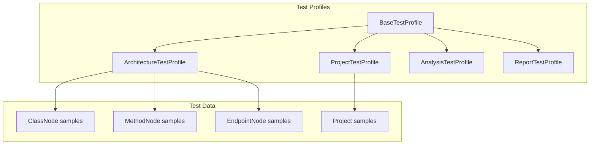

# B1.6 - Создать базовые тестовые профили

## Метаданные задачи

| Поле | Значение |
|------|----------|
| **Название** | Создать базовые тестовые профили |
| **Дата создания** | 2026-02-18 |
| **Статус** | Новая |
| **Приоритет** | Medium |
| **Спринт** | Sprint 1 |
| **Категория** | Backend |

---

## Описание

Создать систему тестовых профилей для заполнения тестовых данных. Тестовые профили представляют собой специальные классы, которые заполняют модели и DTO данными для использования в различных тестах.

### Принципы тестовых профилей

1. Профили - это классы с методами, возвращающими преднастроенные объекты
2. Каждый модуль имеет свой профиль с данными для этого модуля
3. Профили могут использоваться повторно в разных тестах
4. Профили заполняют как доменные модели, так и DTO

### Профили для создания

- `ArchitectureTestProfile` - Данные для модуля architecture
- `ProjectTestProfile` - Данные для модуля project
- `AnalysisTestProfile` - Данные для модуля analysis
- `ReportTestProfile` - Данные для модуля report

---

## Mermaid диаграмма



---

## DTO определения

### TestProfileResponse (мета-информация)

```java
public class TestProfileResponse {
    private String profileName;      // Имя профиля
    private String moduleName;       // Имя модуля
    private int entitiesCount;       // Количество сущностей
    private LocalDateTime createdAt; // Время создания
}
```

---

## Тестовые сценарии

### Unit тесты

| ID | Описание | Ожидаемый результат |
|----|----------|---------------------|
| UT-B1.6-01 | ArchitectureTestProfile.createClassNode | Возвращает корректный ClassNode |
| UT-B1.6-02 | ArchitectureTestProfile.createMethodNode | Возвращает корректный MethodNode |
| UT-B1.6-03 | ArchitectureTestProfile.createEndpointNode | Возвращает корректный EndpointNode |
| UT-B1.6-04 | ArchitectureTestProfile.createClassNodeRequest | Возвращает корректный DTO |
| UT-B1.6-05 | ProjectTestProfile.createProject | Возвращает корректный Project |
| UT-B1.6-06 | Проверка уникальности ID в профилях | ID уникальны для каждого вызова |

### Интеграционные тесты

| ID | Описание | Шаги | Ожидаемый результат |
|----|----------|------|---------------------|
| IT-B1.6-01 | Использование профиля в тесте | 1. Получить данные из профиля<br>2. Использовать в тесте | Данные корректны |
| IT-B1.6-02 | Заполнение БД из профиля | 1. Получить данные<br>2. Сохранить в БД | Данные сохранены |
| IT-B1.6-03 | Множественные вызовы профиля | 1. Вызвать профиль N раз<br>2. Проверить данные | Каждый вызов возвращает новые объекты |

### E2E тесты

| ID | Описание | Шаги | Ожидаемый результат |
|----|----------|------|---------------------|
| E2E-B1.6-01 | Компиляция с профилями | 1. Выполнить `gradlew.bat build` | BUILD SUCCESSFUL |
| E2E-B1.6-02 | Тесты используют профили | 1. Запустить тесты | Все тесты проходят |

---

## Критерии приемки

- [ ] Создан BaseTestProfile с общими методами
- [ ] Создан ArchitectureTestProfile в src/test/java/twin/spring/architecture
- [ ] Создан ProjectTestProfile в src/test/java/twin/spring/project
- [ ] Создан AnalysisTestProfile в src/test/java/twin/spring/analysis
- [ ] Создан ReportTestProfile в src/test/java/twin/spring/report
- [ ] Каждый профиль содержит методы для создания моделей
- [ ] Каждый профиль содержит методы для создания DTO
- [ ] Профили используют Builder паттерн для создания объектов
- [ ] Все профили имеют JavaDoc документацию
- [ ] Unit тесты для каждого профиля проходят успешно
- [ ] Команда `gradlew.bat test` выполняется успешно

---

## Зависимости

- **B1.2** - Создать package структуру для всех модулей
- **B1.4** - Создать базовые domain модели для architecture модуля
- **B1.5** - Настроить Lombok конфигурацию

---

## Примечания

- Профили должны создаваться в src/test/java в соответствующих package
- Использовать случайные UUID для ID при создании объектов
- Имена методов должны быть семантически значимыми: createControllerClassNode, createServiceClassNode, etc.
- Профили должны быть stateless - не хранить состояние между вызовами