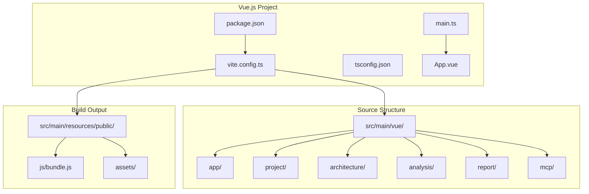

# F1.1 - Настроить Vue.js проект в src/main/vue

## Метаданные задачи

| Поле | Значение |
|------|----------|
| **Название** | Настроить Vue.js проект в src/main/vue |
| **Дата создания** | 2026-02-18 |
| **Статус** | Новая |
| **Приоритет** | High |
| **Спринт** | Sprint 1 |
| **Категория** | Frontend |

---

## Описание

Настроить Vue.js проект в нестандартной директории src/main/vue для интеграции со Spring Boot. Проект должен:

1. Использовать Vue.js 3.x с Composition API
2. Использовать TypeScript для типизации
3. Компилироваться в обычный JavaScript
4. Интегрироваться со Spring Boot для хостинга статических ресурсов
5. Поддерживать SPA архитектуру

### Технологии

- Vue.js 3.x
- TypeScript
- Vite (для разработки и сборки)
- npm 11+ / Node.js 24+

---

## Mermaid диаграмма

---

## DTO определения

Для данной задачи DTO не требуются, так как это инфраструктурная задача.

---

## Тестовые сценарии

### Unit тесты

| ID | Описание | Ожидаемый результат |
|----|----------|---------------------|
| UT-F1.1-01 | Проверка структуры package.json | Зависимости корректны |
| UT-F1.1-02 | Проверка vite.config.ts | Конфигурация валидна |
| UT-F1.1-03 | Проверка tsconfig.json | TypeScript настроен |

### Интеграционные тесты

| ID | Описание | Шаги | Ожидаемый результат |
|----|----------|------|---------------------|
| IT-F1.1-01 | Установка зависимостей | 1. Выполнить `npm install` | Зависимости установлены |
| IT-F1.1-02 | Сборка проекта | 1. Выполнить `npm run build` | Файлы в resources/public |
| IT-F1.1-03 | Режим разработки | 1. Выполнить `npm run dev` | Dev server запущен |

### E2E тесты

| ID | Описание | Шаги | Ожидаемый результат |
|----|----------|------|---------------------|
| E2E-F1.1-01 | Открытие приложения | 1. Запустить Spring Boot 2. Открыть localhost:8080 | Vue приложение загружается |
| E2E-F1.1-02 | Проверка SPA | 1. Открыть приложение 2. Перейти по маршруту | Страница загружается без перезагрузки |

---

## Критерии приемки

- [ ] Создан package.json в src/main/vue
- [ ] Создан vite.config.ts с настройкой output в resources/public
- [ ] Создан tsconfig.json для TypeScript
- [ ] Создан main.ts - точка входа приложения
- [ ] Создан App.vue - корневой компонент
- [ ] Создан index.html с точкой монтирования
- [ ] Vue.js 3.x установлен
- [ ] TypeScript настроен
- [ ] Vite настроен для сборки
- [ ] Команда `npm install` выполняется успешно
- [ ] Команда `npm run build` создает файлы в resources/public
- [ ] Приложение открывается в браузере через Spring Boot

---

## Зависимости

Нет зависимостей от других задач.

---

## Примечания

- Использовать Vite вместо Vue CLI для более быстрой сборки
- Output директория: src/main/resources/public
- Статические ресурсы должны быть доступны через Spring Boot
- Для разработки использовать proxy к Spring Boot backend
- TypeScript должен быть строгим режимом (strict: true)