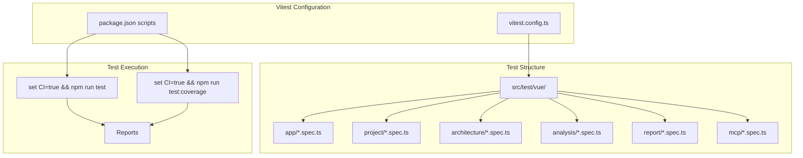

# F1.2 - Настроить Vitest для unit тестов

## Метаданные задачи

| Поле | Значение |
|------|----------|
| **Название** | Настроить Vitest для unit тестов |
| **Дата создания** | 2026-02-18 |
| **Статус** | Выполнена |
| **Приоритет** | High |
| **Спринт** | Sprint 1 |
| **Категория** | Frontend |

---

## Описание

Настроить Vitest для unit тестирования Vue.js компонентов и TypeScript кода. Vitest обеспечивает:

1. Быстрое выполнение тестов (нативная поддержка Vite)
2. HMR для тестов во время разработки
3. Совместимость с Jest API
4. Поддержку TypeScript из коробки
5. Покрытие кода через c8/istanbul

### Конфигурация

- Файл конфигурации: vitest.config.ts
- Расположение тестов: src/test/vue/**/*.spec.ts
- Формат отчетов: console + junit xml

---

## Mermaid диаграмма

---

## DTO определения

Для данной задачи DTO не требуются, так как это инфраструктурная задача.

---

## Тестовые сценарии

### Unit тесты

| ID | Описание | Ожидаемый результат |
|----|----------|---------------------|
| UT-F1.2-01 | Проверка конфигурации Vitest | Конфигурация валидна |
| UT-F1.2-02 | Простой тест проходит | Тест выполняется успешно |
| UT-F1.2-03 | Тест Vue компонента | Компонент рендерится корректно |

### Интеграционные тесты

| ID | Описание | Шаги | Ожидаемый результат |
|----|----------|------|---------------------|
| IT-F1.2-01 | Запуск всех тестов | 1. Выполнить `set CI=true && npm run test` | Все тесты проходят |
| IT-F1.2-02 | Генерация coverage | 1. Выполнить `set CI=true && npm run test:coverage` | Отчет создан |
| IT-F1.2-03 | Watch режим | 1. Выполнить `npm run test:watch` | Watch режим работает |

### E2E тесты

| ID | Описание | Шаги | Ожидаемый результат |
|----|----------|------|---------------------|
| E2E-F1.2-01 | Тесты в CI | 1. Запустить тесты в pipeline | Тесты проходят |

---

## Критерии приемки

- [x] Добавлена зависимость vitest в package.json
- [x] Добавлена зависимость @vue/test-utils
- [x] Создан vitest.config.ts в src/main/vue
- [x] Настроены скрипты в package.json: test, test:coverage, test:watch
- [x] Создан пример теста для Vue компонента
- [x] Создан пример теста для TypeScript функции
- [x] Настроена генерация coverage отчета
- [x] Настроен junit xml reporter для CI
- [x] Команда `set CI=true && npm run test` выполняется успешно
- [x] Команда `set CI=true && npm run test:coverage` генерирует отчет

---

## Зависимости

- **F1.1** - Настроить Vue.js проект в src/main/vue

---

## Примечания

- Использовать @vue/test-utils для тестирования Vue компонентов
- Настроить coverage threshold в vitest.config.ts
- Использовать describe/it/expect синтаксис (Jest-совместимый)
- Тесты должны находиться в src/test/vue с зеркальной структурой модулей