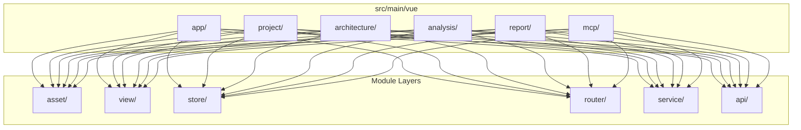

# F1.3 - Создать базовую структуру модулей Vue

## Метаданные задачи

| Поле | Значение |
|------|----------|
| **Название** | Создать базовую структуру модулей Vue |
| **Дата создания** | 2026-02-18 |
| **Статус** | Выполнена |
| **Приоритет** | High |
| **Спринт** | Sprint 1 |
| **Категория** | Frontend |

---

## Описание

Создать базовую структуру модулей Vue.js, соответствующую модулям backend. Модули должны иметь одинаковую структуру и названия с backend модулями.

### Модули для создания

**Доменные модули:**
- `project` - UI для управления анализируемым проектом
- `architecture` - UI для отображения архитектурного графа
- `analysis` - UI для запуска и мониторинга анализа
- `report` - UI для генерации и просмотра отчетов

**Инфраструктурные модули:**
- `mcp` - UI для MCP интеграции

**Корневой модуль:**
- `app` - Корневое приложение, навигация, общие компоненты

### Слои внутри каждого модуля

- `asset/` - Статические файлы: CSS, шрифты, картинки
- `view/` - Vue компоненты-страницы
- `store/` - Pinia store модуль
- `router/` - Маршрутизация модуля
- `service/` - Бизнес-логика
- `api/` - API клиенты для backend

---

## Mermaid диаграмма

---

## DTO определения

Для данной задачи DTO не требуются, так как это задача по созданию структуры каталогов.

---

## Тестовые сценарии

### Unit тесты

| ID | Описание | Ожидаемый результат |
|----|----------|---------------------|
| UT-F1.3-01 | Проверка структуры модуля app | Все слои существуют |
| UT-F1.3-02 | Проверка структуры модуля project | Все слои существуют |
| UT-F1.3-03 | Проверка структуры модуля architecture | Все слои существуют |
| UT-F1.3-04 | Проверка структуры модуля analysis | Все слои существуют |
| UT-F1.3-05 | Проверка структуры модуля report | Все слои существуют |
| UT-F1.3-06 | Проверка структуры модуля mcp | Все слои существуют |

### Интеграционные тесты

| ID | Описание | Шаги | Ожидаемый результат |
|----|----------|------|---------------------|
| IT-F1.3-01 | Импорт модулей в app | 1. Импортировать все модули в main.ts | Импорт работает |
| IT-F1.3-02 | Сборка проекта | 1. Выполнить `npm run build` | BUILD SUCCESSFUL |

### E2E тесты

| ID | Описание | Шаги | Ожидаемый результат |
|----|----------|------|---------------------|
| E2E-F1.3-01 | Запуск приложения | 1. Запустить Spring Boot 2. Открыть localhost:8080 | Приложение загружается |

---

## Критерии приемки

- [ ] Создан модуль app с слоями: asset, view, store, router, service, api
- [ ] Создан модуль project с слоями: asset, view, store, router, service, api
- [ ] Создан модуль architecture с слоями: asset, view, store, router, service, api
- [ ] Создан модуль analysis с слоями: asset, view, store, router, service, api
- [ ] Создан модуль report с слоями: asset, view, store, router, service, api
- [ ] Создан модуль mcp с слоями: asset, view, store, router, service, api
- [ ] Каждый модуль имеет index.ts для экспорта
- [ ] Созданы заглушки для Vue компонентов в каждом модуле
- [ ] Команда `npm run build` выполняется успешно
- [ ] Структура модулей соответствует backend модулям

---

## Зависимости

- **F1.1** - Настроить Vue.js проект в src/main/vue

---

## Примечания

- Модули должны зеркально отражать backend модули
- Каждый модуль должен быть самодостаточным
- Использовать уникальные имена для Pinia store
- Использовать lazy loading для маршрутов модулей