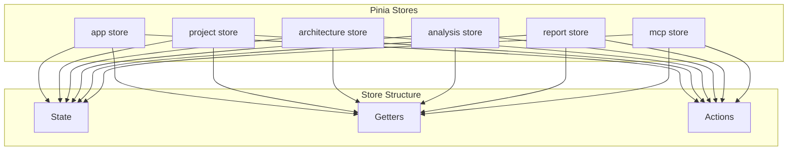

# F1.4 - Настроить Pinia store с модульной структурой

## Метаданные задачи

| Поле | Значение |
|------|----------|
| **Название** | Настроить Pinia store с модульной структурой |
| **Дата создания** | 2026-02-18 |
| **Статус** | Выполнена |
| **Приоритет** | Medium |
| **Спринт** | Sprint 1 |
| **Категория** | Frontend |

---

## Описание

Настроить Pinia store с модульной структурой, соответствующей модулям приложения. Каждый модуль имеет свое пространство имен и состояние.

### Принципы организации

1. Каждый модуль имеет свой Pinia store с уникальным именем
2. Глобальное состояние имеет префикс `app`
3. Модули изолированы друг от друга
4. Используется Pinia для управления состоянием

### Структура store

- `app` - Глобальное состояние приложения
- `project` - Состояние модуля project
- `architecture` - Состояние модуля architecture
- `analysis` - Состояние модуля analysis
- `report` - Состояние модуля report
- `mcp` - Состояние модуля mcp

---

## Mermaid диаграмма



---

## DTO определения

### AppState (глобальное состояние)

```typescript
interface AppState {
  isLoading: boolean;
  currentRoute: string;
  notifications: Notification[];
  theme: 'light' | 'dark';
}
```

### ProjectState

```typescript
interface ProjectState {
  projects: Project[];
  currentProject: Project | null;
  includePackages: string[];
  excludePackages: string[];
}
```

### ArchitectureState

```typescript
interface ArchitectureState {
  classNodes: ClassNode[];
  methodNodes: MethodNode[];
  endpointNodes: EndpointNode[];
  selectedNode: Node | null;
}
```

---

## Тестовые сценарии

### Unit тесты

| ID | Описание | Ожидаемый результат |
|----|----------|---------------------|
| UT-F1.4-01 | Проверка создания Pinia instance | Pinia instance создан корректно |
| UT-F1.4-02 | Проверка создания app store | Store создан и доступен |
| UT-F1.4-03 | Проверка создания project store | Store создан и доступен |
| UT-F1.4-04 | Проверка actions | Actions работают асинхронно |
| UT-F1.4-05 | Проверка getters | Getters возвращают правильные данные |
| UT-F1.4-06 | Проверка state изменений | State изменяется корректно |

### Интеграционные тесты

| ID | Описание | Шаги | Ожидаемый результат |
|----|----------|------|---------------------|
| IT-F1.4-01 | Доступ к state из компонента | 1. Получить state в компоненте | State доступен |
| IT-F1.4-02 | Вызов action | 1. Вызвать action<br>2. Проверить state | State обновлен |
| IT-F1.4-03 | Доступ к getter | 1. Получить данные через getter | Getter возвращает правильные данные |

### E2E тесты

| ID | Описание | Шаги | Ожидаемый результат |
|----|----------|------|---------------------|
| E2E-F1.4-01 | Store в приложении | 1. Открыть приложение<br>2. Проверить store в devtools | Store работает |

---

## Критерии приемки

- [x] Установлена зависимость pinia в package.json
- [x] Создан Pinia instance в src/main/vue/store.ts
- [x] Создан store для модуля app
- [x] Создан store для модуля project
- [x] Создан store для модуля architecture
- [x] Создан store для модуля analysis
- [x] Создан store для модуля report
- [x] Создан store для модуля mcp
- [x] Каждый store имеет state, getters, actions
- [x] Pinia подключен к Vue приложению
- [x] Unit тесты для store проходят успешно

---

## Зависимости

- **F1.1** - Настроить Vue.js проект в src/main/vue
- **F1.3** - Создать базовую структуру модулей Vue

---

## Примечания

- Использовать Pinia 3.x для Vue 3
- Каждый store должен быть определен с помощью defineStore
- Использовать TypeScript для типизации state
- Actions могут быть асинхронными
- State может быть напрямую изменен в actions

---

## Реализация

### Пример store

```typescript
import { defineStore } from 'pinia';

export interface AppState {
  isLoading: boolean;
  error: string | null;
}

export const useAppStore = defineStore('app', {
  state: (): AppState => ({
    isLoading: false,
    error: null
  }),
  
  actions: {
    showLoading(isLoading: boolean) {
      this.isLoading = isLoading;
    },
    
    showError(error: string | null) {
      this.error = error;
    }
  },
  
  getters: {
    isLoading: (state) => state.isLoading,
    error: (state) => state.error
  }
});

export default useAppStore;