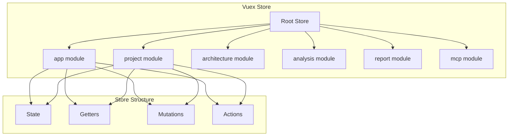

# F1.4 - Настроить Vuex store с модульной структурой

## Метаданные задачи

| Поле | Значение |
|------|----------|
| **Название** | Настроить Vuex store с модульной структурой |
| **Дата создания** | 2026-02-18 |
| **Статус** | Новая |
| **Приоритет** | Medium |
| **Спринт** | Sprint 1 |
| **Категория** | Frontend |

---

## Описание

Настроить Vuex store с модульной структурой, соответствующей модулям приложения. Каждый модуль имеет свое пространство имен и состояние.

### Принципы организации

1. Каждый модуль имеет свой Vuex модуль с namespace
2. Глобальное состояние имеет префикс `app`
3. Модули изолированы друг от друга
4. Используется строгий режим Vuex

### Структура store

- `app` - Глобальное состояние приложения
- `project` - Состояние модуля project
- `architecture` - Состояние модуля architecture
- `analysis` - Состояние модуля analysis
- `report` - Состояние модуля report
- `mcp` - Состояние модуля mcp

---

## Mermaid диаграмма



---

## DTO определения

### AppState (глобальное состояние)

```typescript
interface AppState {
  isLoading: boolean;
  currentRoute: string;
  notifications: Notification[];
  theme: 'light' | 'dark';
}
```

### ProjectState

```typescript
interface ProjectState {
  projects: Project[];
  currentProject: Project | null;
  includePackages: string[];
  excludePackages: string[];
}
```

### ArchitectureState

```typescript
interface ArchitectureState {
  classNodes: ClassNode[];
  methodNodes: MethodNode[];
  endpointNodes: EndpointNode[];
  selectedNode: Node | null;
}
```

---

## Тестовые сценарии

### Unit тесты

| ID | Описание | Ожидаемый результат |
|----|----------|---------------------|
| UT-F1.4-01 | Проверка создания root store | Store создан корректно |
| UT-F1.4-02 | Проверка namespace модуля app | Namespace = app |
| UT-F1.4-03 | Проверка namespace модуля project | Namespace = project |
| UT-F1.4-04 | Проверка mutations | State изменяется корректно |
| UT-F1.4-05 | Проверка actions | Actions работают асинхронно |
| UT-F1.4-06 | Проверка getters | Getters возвращают правильные данные |

### Интеграционные тесты

| ID | Описание | Шаги | Ожидаемый результат |
|----|----------|------|---------------------|
| IT-F1.4-01 | Доступ к state из компонента | 1. Получить state в компоненте | State доступен |
| IT-F1.4-02 | Dispatch action | 1. Вызвать action<br>2. Проверить state | State обновлен |
| IT-F1.4-03 | Commit mutation | 1. Вызвать mutation<br>2. Проверить state | State обновлен |

### E2E тесты

| ID | Описание | Шаги | Ожидаемый результат |
|----|----------|------|---------------------|
| E2E-F1.4-01 | Store в приложении | 1. Открыть приложение<br>2. Проверить store в devtools | Store работает |

---

## Критерии приемки

- [ ] Установлена зависимость vuex в package.json
- [ ] Создан root store в src/main/vue/app/store/index.ts
- [ ] Создан модуль app store с namespace
- [ ] Создан модуль project store с namespace
- [ ] Создан модуль architecture store с namespace
- [ ] Создан модуль analysis store с namespace
- [ ] Создан модуль report store с namespace
- [ ] Создан модуль mcp store с namespace
- [ ] Каждый модуль имеет state, getters, mutations, actions
- [ ] Включен strict режим в development
- [ ] Store подключен к Vue приложению
- [ ] Unit тесты для store проходят успешно

---

## Зависимости

- **F1.1** - Настроить Vue.js проект в src/main/vue
- **F1.3** - Создать базовую структуру модулей Vue

---

## Примечания

- Использовать Vuex 4.x для Vue 3
- Каждый модуль должен иметь namespaced: true
- Использовать TypeScript для типизации state
- Actions должны быть асинхронными
- Mutations должны быть синхронными