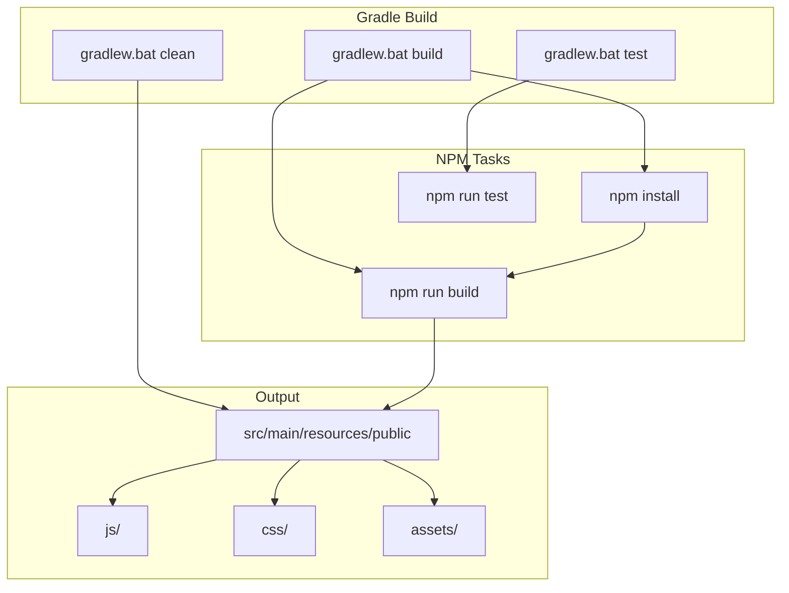

# F1.6 - Настроить сборку Vue через Gradle

## Метаданные задачи

| Поле | Значение |
|------|----------|
| **Название** | Настроить сборку Vue через Gradle |
| **Дата создания** | 2026-02-18 |
| **Статус** | Новая |
| **Приоритет** | Medium |
| **Спринт** | Sprint 1 |
| **Категория** | Frontend |

---

## Описание

Настроить интеграцию сборки Vue.js с Gradle для единого процесса сборки всего проекта. Это позволяет:

1. Выполнять сборку frontend и backend одной командой
2. Автоматически копировать собранные файлы в resources/public
3. Интегрировать npm задачи в Gradle lifecycle
4. Обеспечить кроссплатформенность сборки (Windows)

### Задачи Gradle

- `npmInstall` - Установка npm зависимостей
- `npmBuild` - Сборка Vue.js приложения
- `npmTest` - Запуск Vitest тестов
- `vueBuild` - Полная сборка Vue (install + build)
- `vueClean` - Очистка собранных файлов

---

## Mermaid диаграмма

---

## DTO определения

Для данной задачи DTO не требуются, так как это инфраструктурная задача.

---

## Тестовые сценарии

### Unit тесты

| ID | Описание | Ожидаемый результат |
|----|----------|---------------------|
| UT-F1.6-01 | Проверка npmInstall задачи | Задача определена в Gradle |
| UT-F1.6-02 | Проверка npmBuild задачи | Задача определена в Gradle |
| UT-F1.6-03 | Проверка vueBuild задачи | Задача определена в Gradle |

### Интеграционные тесты

| ID | Описание | Шаги | Ожидаемый результат |
|----|----------|------|---------------------|
| IT-F1.6-01 | Полная сборка через Gradle | 1. Выполнить `gradlew.bat build` | Файлы в resources/public |
| IT-F1.6-02 | Очистка и сборка | 1. Выполнить `gradlew.bat clean build` | Файлы пересобраны |
| IT-F1.6-03 | Запуск тестов через Gradle | 1. Выполнить `gradlew.bat test` | Тесты проходят |
| IT-F1.6-04 | Проверка выходных файлов | 1. Собрать проект 2. Проверить public | JS и CSS файлы существуют |

### E2E тесты

| ID | Описание | Шаги | Ожидаемый результат |
|----|----------|------|---------------------|
| E2E-F1.6-01 | Запуск приложения после сборки | 1. Выполнить `gradlew.bat build` 2. Запустить Spring Boot | Приложение работает |
| E2E-F1.6-02 | Открытие в браузере | 1. Открыть localhost:8080 | Vue приложение загружается |

---

## Критерии приемки

- [ ] Добавлен plugin com.github.node-gradle.node в build.gradle.kts
- [ ] Настроена задача npmInstall для установки зависимостей
- [ ] Настроена задача npmBuild для сборки Vue
- [ ] Настроена задача npmTest для запуска тестов
- [ ] Создана задача vueBuild агрегирующая npm install и build
- [ ] Создана задача vueClean для очистки
- [ ] Задача build зависит от vueBuild
- [ ] Задача test зависит от npmTest
- [ ] Output директория настроена в src/main/resources/public
- [ ] Команда `gradlew.bat build` выполняет полную сборку
- [ ] Команда `gradlew.bat test` выполняет все тесты
- [ ] Собранные файлы доступны через Spring Boot

---

## Зависимости

- **B1.1** - Настроить Gradle multi-module структуру
- **F1.1** - Настроить Vue.js проект в src/main/vue

---

## Примечания

- Использовать gradle-node-plugin для интеграции с npm
- Настроить работу на Windows (использовать .bat файлы)
- Node.js и npm должны быть установлены в системе
- Версия Node.js: 24+, npm: 11+
- Сборка должна работать без глобальной установки зависимостей