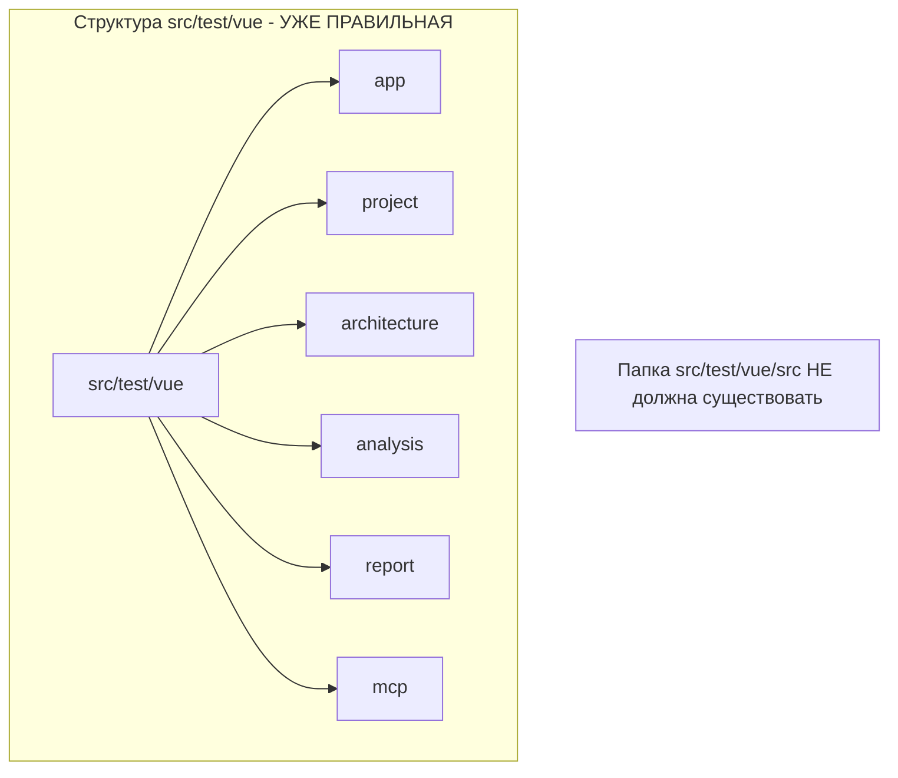

# Задача F1.7: Рефакторинг структуры Vue.js проекта

**Дата создания:** 2026-02-19
**Статус:** Выполнена
**Приоритет:** Высокий

---

## Описание

Устранение противоречия между документацией и фактической структурой проекта. Согласно AGENTS.md, модули должны находиться напрямую в `src/main/vue/<module>/` и `src/test/vue/<module>/` без промежуточных папок `src/`.

В данный момент:
- Папка `src/main/vue/src/` существует и содержит основные файлы приложения
- Папка `src/test/vue/src/` не существует (тесты уже организованы правильно)

Обе папки `src/` должны быть удалены, если они существуют.

## Проблема

```mermaid
graph TD
    subgraph Текущая структура src/main/vue - НЕВЕРНАЯ
        A1[src/main/vue] --> B1[src]
        B1 --> C1[App.vue]
        B1 --> C2[main.ts]
        B1 --> C3[app]
        B1 --> C4[vite-env.d.ts]
        A1 --> D1[analysis]
        A1 --> D2[architecture]
        A1 --> D3[project]
    end
    
    subgraph Целевая структура src/main/vue - ПРАВИЛЬНАЯ
        A2[src/main/vue] --> B2[App.vue]
        A2 --> B3[main.ts]
        A2 --> B4[vite-env.d.ts]
        A2 --> C5[app]
        A2 --> D5[analysis]
        A2 --> D6[architecture]
        A2 --> D7[project]
    end
    
    Текущая структура src/main/vue - НЕВЕРНАЯ --> |Рефакторинг| Целевая структура src/main/vue - ПРАВИЛЬНАЯ
```



## Изменяемые файлы

### 1. Перемещение файлов

| Откуда | Куда |
|--------|------|
| `src/main/vue/src/App.vue` | `src/main/vue/App.vue` |
| `src/main/vue/src/main.ts` | `src/main/vue/main.ts` |
| `src/main/vue/src/vite-env.d.ts` | `src/main/vue/vite-env.d.ts` |
| `src/main/vue/src/app/service/app.service.ts` | `src/main/vue/app/service/app.service.ts` |

**Примечание:** Папка `src/main/vue/app/` уже существует и содержит только `AGENTS.md`. Файл `app.service.ts` нужно переместить в существующую структуру.

### 2. Обновление конфигурации

#### 2.1 vite.config.ts

```typescript
// БЫЛО:
resolve: {
  alias: {
    '@': resolve(__dirname, 'src'),
    '@app': resolve(__dirname, 'src/app'),
    // ...
  },
},

// СТАНЕТ:
resolve: {
  alias: {
    '@': resolve(__dirname, '.'),
    '@app': resolve(__dirname, 'app'),
    '@project': resolve(__dirname, 'project'),
    '@architecture': resolve(__dirname, 'architecture'),
    '@analysis': resolve(__dirname, 'analysis'),
    '@report': resolve(__dirname, 'report'),
    '@mcp': resolve(__dirname, 'mcp'),
  },
},
```

#### 2.2 vitest.config.ts

```typescript
// БЫЛО:
root: './',
resolve: {
  alias: {
    '@': './src',
    '@app': './src/app',
    // ...
  },
},

// СТАНЕТ:
root: './',
resolve: {
  alias: {
    '@': '.',
    '@app': './app',
    '@project': './project',
    '@architecture': './architecture',
    '@analysis': './analysis',
    '@report': './report',
    '@mcp': './mcp',
  },
},
```

#### 2.3 tsconfig.json

```json
// БЫЛО:
"paths": {
  "@/*": ["src/*"],
  "@app/*": ["src/app/*"],
  // ...
}

// СТАНЕТ:
"paths": {
  "@/*": ["./*"],
  "@app/*": ["app/*"],
  "@project/*": ["project/*"],
  "@architecture/*": ["architecture/*"],
  "@analysis/*": ["analysis/*"],
  "@report/*": ["report/*"],
  "@mcp/*": ["mcp/*"]
}

// ИЗМЕНИТЬ include:
"include": ["**/*.ts", "**/*.d.ts", "**/*.tsx", "**/*.vue"]
```

#### 2.4 index.html

```html
// БЫЛО:
<script type="module" src="/src/main.ts"></script>

// СТАНЕТ:
<script type="module" src="/main.ts"></script>
```

### 3. Обновление импортов

#### 3.1 main.ts

```typescript
// БЫЛО:
import App from './App.vue';

// ОСТАЕТСЯ БЕЗ ИЗМЕНЕНИЙ (файл перемещается в ту же директорию)
import App from './App.vue';
```

### 4. Обновление тестов

Тесты используют алиасы `@/App.vue` и `@/app/service/app.service`, которые будут автоматически разрешаться после обновления конфигурации.

## Критерии приемки

1. ✅ Папка `src/main/vue/src/` удалена
2. ✅ Папка `src/test/vue/src/` не существует (или удалена, если была)
3. ✅ Файлы `App.vue`, `main.ts`, `vite-env.d.ts` находятся в `src/main/vue/`
4. ✅ Алиасы в конфигурациях обновлены
5. ✅ `npm run build` выполняется успешно из `src/main/vue`
6. ✅ `set CI=true && npm run test` выполняется успешно из `src/main/vue`
7. ✅ Документация AGENTS.md соответствует фактической структуре

## План выполнения

1. Проверить содержимое `src/main/vue/src/app/` на дублирование с `src/main/vue/app/`
2. Проверить, что папка `src/test/vue/src/` не существует
3. Обновить `vite.config.ts`
4. Обновить `vitest.config.ts`
5. Обновить `tsconfig.json`
6. Обновить `index.html`
7. Переместить файлы из `src/main/vue/src/` в `src/main/vue/`
8. Удалить папку `src/main/vue/src/`
9. Удалить папку `src/test/vue/src/` (если существует)
10. Запустить тесты

## Тестовые сценарии

### Сценарий 1: Сборка проекта

```bash
cd src\main\vue
npm run build
```

**Ожидаемый результат:** Сборка завершается успешно, файлы появляются в `build/resources/main/public/`

### Сценарий 2: Запуск тестов

```bash
cd src\main\vue
npm run test
```

**Ожидаемый результат:** Все тесты проходят успешно

### Сценарий 3: Проверка алиасов

```bash
npm run build
```

**Ожидаемый результат:** Импорты с `@/` разрешаются корректно