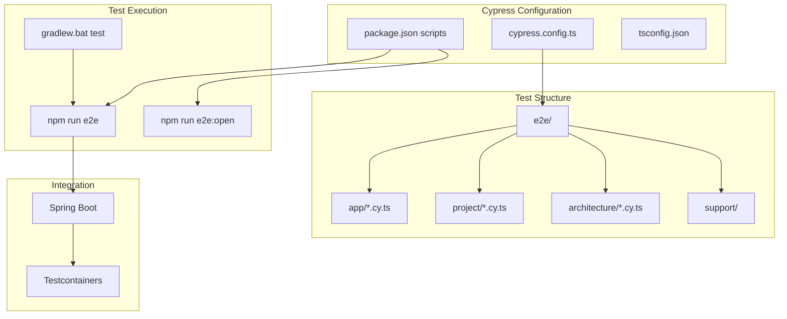

# I1.1 - Настроить Cypress для e2e тестов

## Метаданные задачи

| Поле | Значение |
|------|----------|
| **Название** | Настроить Cypress для e2e тестов |
| **Дата создания** | 2026-02-18 |
| **Статус** | Новая |
| **Приоритет** | High |
| **Спринт** | Sprint 1 |
| **Категория** | Infrastructure |

---

## Описание

Настроить Cypress для end-to-end тестирования приложения. Cypress обеспечивает:

1. Тестирование UI в реальном браузере
2. Автоматическое ожидание элементов
3. Time travel debugging
4. Скриншоты и видео записи
5. Интеграцию с Spring Boot через testcontainers

### Структура тестов

- `e2e/app/` - Тесты для модуля app
- `e2e/project/` - Тесты для модуля project
- `e2e/architecture/` - Тесты для модуля architecture
- `e2e/analysis/` - Тесты для модуля analysis
- `e2e/report/` - Тесты для модуля report
- `e2e/mcp/` - Тесты для модуля mcp

---

## Mermaid диаграмма

---

## DTO определения

Для данной задачи DTO не требуются, так как это инфраструктурная задача.

---

## Тестовые сценарии

### Unit тесты

| ID | Описание | Ожидаемый результат |
|----|----------|---------------------|
| UT-I1.1-01 | Проверка конфигурации Cypress | Конфигурация валидна |
| UT-I1.1-02 | Проверка support commands | Команды определены |

### Интеграционные тесты

| ID | Описание | Шаги | Ожидаемый результат |
|----|----------|------|---------------------|
| IT-I1.1-01 | Запуск Cypress в headless режиме | 1. Выполнить `npm run e2e` | Тесты проходят |
| IT-I1.1-02 | Запуск Cypress в interactive режиме | 1. Выполнить `npm run e2e:open` | UI открывается |
| IT-I1.1-03 | Интеграция с Gradle | 1. Выполнить `gradlew.bat test` | E2E тесты запускаются |

### E2E тесты

| ID | Описание | Шаги | Ожидаемый результат |
|----|----------|------|---------------------|
| E2E-I1.1-01 | Базовый тест приложения | 1. Открыть localhost:8080 2. Проверить заголовок | Заголовок корректен |
| E2E-I1.1-02 | Тест навигации | 1. Открыть приложение 2. Кликнуть на пункт меню | Навигация работает |

---

## Критерии приемки

- [ ] Добавлена зависимость cypress в package.json (devDependencies)
- [ ] Создан cypress.config.ts с базовой конфигурацией
- [ ] Создана директория cypress/e2e для тестов
- [ ] Создана директория cypress/support для поддержки
- [ ] Создан файл cypress/support/e2e.ts
- [ ] Настроены скрипты в package.json: e2e, e2e:open
- [ ] Создан пример теста для главной страницы
- [ ] Настроена интеграция с Spring Boot через testcontainers
- [ ] Настроен baseUrl для тестов
- [ ] Настроены семантические селекторы (data-testid, name, role)
- [ ] Команда `npm run e2e` выполняется успешно
- [ ] Cypress тесты интегрированы в `gradlew.bat test`

---

## Зависимости

- **F1.1** - Настроить Vue.js проект в src/main/vue
- **F1.5** - Создать базовый layout и навигацию
- **I1.2** - Создать testcontainers конфигурацию

---

## Примечания

- Использовать Cypress 13.x+
- Настроить video recording для CI
- Использовать data-testid атрибуты для селекторов
- Использовать семантические селекторы: name, role
- Базовый URL: http://localhost:8080
- Интегрировать с Spring Boot через @SpringBootTest и testcontainers