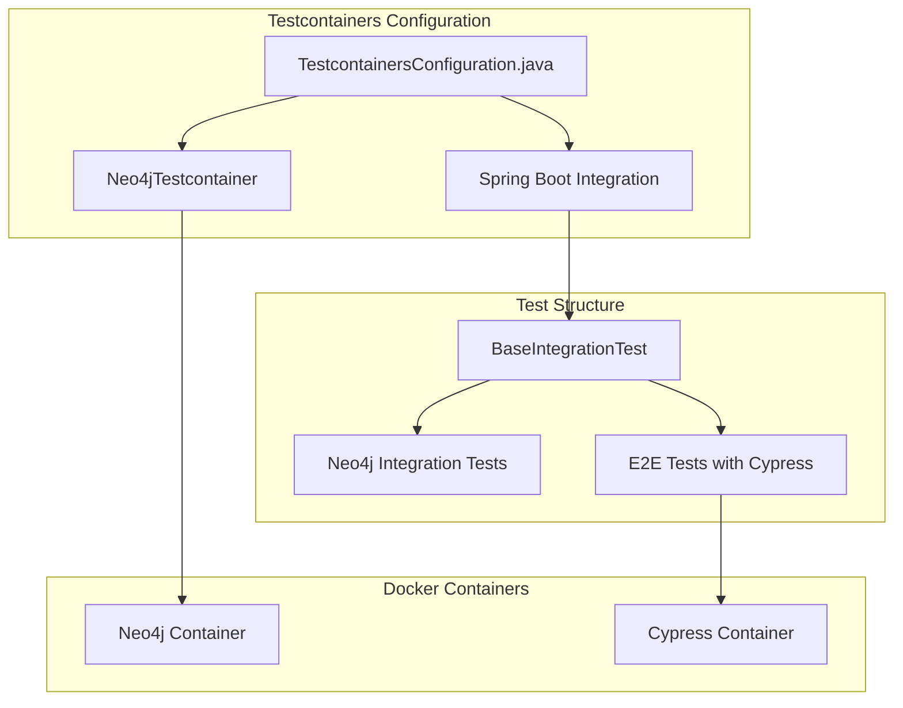

# I1.2 - Создать testcontainers конфигурацию

## Метаданные задачи

| Поле | Значение |
|------|----------|
| **Название** | Создать testcontainers конфигурацию |
| **Дата создания** | 2026-02-18 |
| **Статус** | Новая |
| **Приоритет** | High |
| **Спринт** | Sprint 1 |
| **Категория** | Infrastructure |

---

## Описание

Настроить Testcontainers для интеграционного тестирования с Neo4j и Cypress. Testcontainers обеспечивает:

1. Изолированную среду для тестов
2. Автоматическое управление контейнерами Neo4j
3. Интеграцию с Spring Boot тестами
4. Воспроизводимость тестов

### Контейнеры для настройки

- **Neo4j Testcontainer** - Для тестов с базой данных
- **Generic Container** - Для Cypress e2e тестов

---

## Mermaid диаграмма

---

## DTO определения

Для данной задачи DTO не требуются, так как это инфраструктурная задача.

---

## Тестовые сценария

### Unit тесты

| ID | Описание | Ожидаемый результат |
|----|----------|---------------------|
| UT-I1.2-01 | Проверка конфигурации Testcontainers | Конфигурация валидна |
| UT-I1.2-02 | Проверка Neo4j контейнера | Контейнер определен |

### Интеграционные тесты

| ID | Описание | Шаги | Ожидаемый результат |
|----|----------|------|---------------------|
| IT-I1.2-01 | Запуск Neo4j контейнера | 1. Запустить тест с контейнером | Контейнер запускается |
| IT-I1.2-02 | Подключение к Neo4j | 1. Запустить контейнер 2. Подключиться | Подключение успешно |
| IT-I1.2-03 | Остановка контейнера | 1. Завершить тест | Контейнер останавливается |

### E2E тесты

| ID | Описание | Шаги | Ожидаемый результат |
|----|----------|------|---------------------|
| E2E-I1.2-01 | Интеграционный тест с БД | 1. Запустить тест 2. Проверить данные | Тест проходит |
| E2E-I1.2-02 | E2E тест с контейнерами | 1. Запустить Spring Boot 2. Запустить Cypress | Тесты проходят |

---

## Критерии приемки

- [ ] Добавлена зависимость testcontainers в build.gradle.kts
- [ ] Добавлена зависимость neo4j-testcontainer в build.gradle.kts
- [ ] Добавлена зависимость junit-testcontainers в build.gradle.kts
- [ ] Создан TestcontainersConfiguration.java
- [ ] Создан TestSpringTwinApplication.java для тестов
- [ ] Настроен Neo4j testcontainer с автоматическим запуском
- [ ] Настроена интеграция с @SpringBootTest
- [ ] Создан BaseIntegrationTest абстрактный класс
- [ ] Контейнеры автоматически запускаются при запуске тестов
- [ ] Контейнеры автоматически останавливаются после тестов
- [ ] Команда `gradlew.bat test` выполняется успешно
- [ ] Интеграционные тесты проходят с контейнерами

---

## Зависимости

- **B1.1** - Настроить Gradle multi-module структуру

---

## Примечания

- Использовать Testcontainers 1.19.x+
- Neo4j контейнер должен использовать in-memory режим для скорости
- Настроить reuse контейнеров для ускорения локальных тестов
- Использовать @Testcontainers аннотацию для JUnit 5
- Использовать @Container аннотацию для объявления контейнера
- Docker должен быть установлен в системе