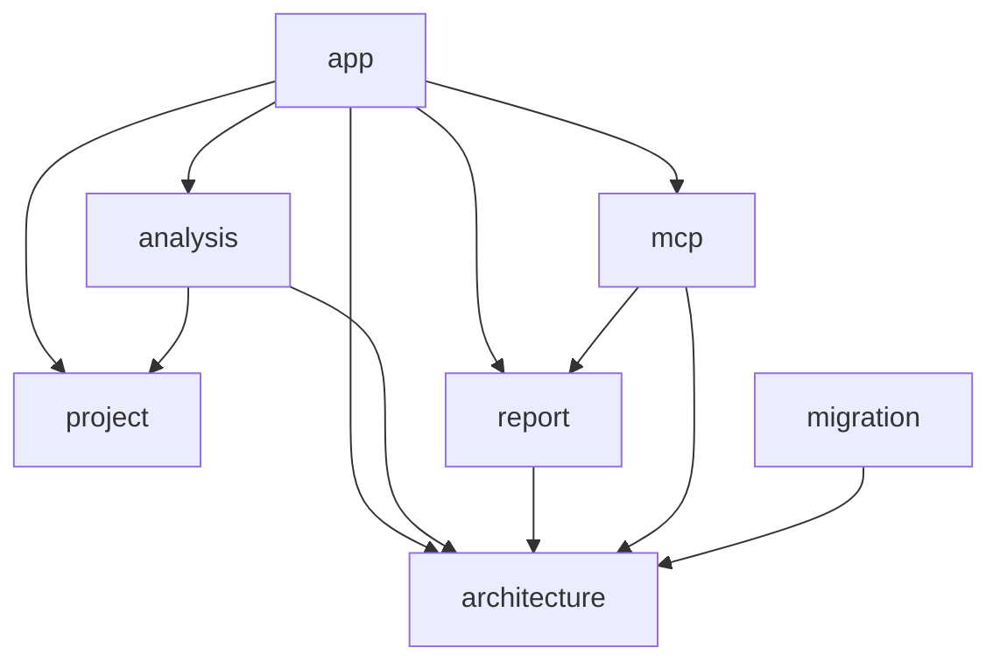

# AGENTS.md: Правила разработки Backend (Java/Spring Boot)

Данный документ содержит специфические правила и стандарты для разработки backend-части проекта SpringTwin.

---

## Технологический стек

- **Язык**: Java 21+ (не Kotlin)
- **Фреймворк**: Spring Boot 3.x
- **Архитектура**: WebFlux (реактивный стек)
- **База данных**: Neo4j (embedded in-memory для MVP)
- **Модульность**: Spring Modulith

---

## Структура модуля

Каждый модуль backend организован по слоям:

```
src/main/java/twin/spring/<module>/
├── api/                    # REST контроллеры и DTO
│   ├── <Entity>Controller.java
│   ├── <Entity>Request.java
│   └── <Entity>Response.java
├── domain/                 # Доменные модели и сущности
│   └── <Entity>.java
├── service/                # Бизнес-логика
│   ├── <Entity>Service.java
│   ├── <Entity>DomainService.java
│   ├── <Entity>AggregateService.java
│   └── <Entity>Mapper.java
└── repository/             # Доступ к данным
    └── <Entity>Repository.java
```

### Описание слоев

| Слой | Пакет | Ответственность |
|------|-------|-----------------|
| **api** | .api | REST контроллеры, DTO для запросов/ответов |
| **domain** | .domain | Доменные модели, сущности Neo4j |
| **service** | .service | Бизнес-логика, мапперы, координация |
| **repository** | .repository | Доступ к данным через Spring Data Neo4j |

---

## Стандарты кода

### Принципы SOLID

- **S** - Single Responsibility: каждый класс имеет одну ответственность
- **O** - Open/Closed: открыты для расширения, закрыты для модификации
- **L** - Liskov Substitution: подклассы могут заменять базовые классы
- **I** - Interface Segregation: много специализированных интерфейсов
- **D** - Dependency Inversion: зависимость от абстракций, не от реализаций

### Lombok аннотации

```java
// Для моделей и DTO
@Getter
@Setter
@Builder
@NoArgsConstructor
@AllArgsConstructor

// Для сервисов и контроллеров (DI)
@RequiredArgsConstructor
@Slf4j
```

### Именование классов

Используйте суффиксы для обозначения роли класса:

| Суффикс | Описание | Пример |
|---------|----------|--------|
| **Controller** | REST контроллер | `ProjectController` |
| **Request** | DTO для запроса | `CreateProjectRequest` |
| **Response** | DTO для ответа | `ProjectResponse` |
| **Service** | Общий сервис | `ProjectService` |
| **DomainService** | Бизнес-логика домена | `ProjectDomainService` |
| **AggregateService** | Агрегация данных | `ProjectAggregateService` |
| **ApplicationService** | Координация use cases | `ProjectApplicationService` |
| **Repository** | Репозиторий данных | `ProjectRepository` |
| **Mapper** | Преобразование DTO | `ProjectMapper` |

---

## Реактивное программирование

### Возврат типов

Все методы должны возвращать реактивные типы:

```java
// Для одиночных результатов
public Mono<Project> findById(String id) { ... }

// Для множественных результатов
public Flux<Project> findAll() { ... }

// Для операций без возвращаемого значения
public Mono<Void> delete(String id) { ... }
```

### Работа с Neo4j

Используйте `ReactiveNeo4jRepository`:

```java
public interface ProjectRepository extends ReactiveNeo4jRepository<Project, String> {
    Flux<Project> findByPackageName(String packageName);
    Mono<Project> findByFullName(String fullName);
}
```

---

## DTO и Mapper

### Правила DTO

1. Раздельные классы для Request и Response
2. Одинаковые названия полей для унификации
3. Использование Builder для создания

```java
// Request
@Builder
@NoArgsConstructor
@AllArgsConstructor
@Getter
@Setter
public class CreateProjectRequest {
    private String name;
    private String path;
    private List<String> includePackages;
    private List<String> excludePackages;
}

// Response
@Builder
@NoArgsConstructor
@AllArgsConstructor
@Getter
@Setter
public class ProjectResponse {
    private String id;
    private String name;
    private String path;
    private List<String> includePackages;
    private List<String> excludePackages;
}
```

### Mapper

Преобразование между моделями и DTO в сервисах:

```java
@Component
@RequiredArgsConstructor
public class ProjectMapper {
    
    public Project toEntity(CreateProjectRequest request) {
        return Project.builder()
            .name(request.getName())
            .path(request.getPath())
            .includePackages(request.getIncludePackages())
            .excludePackages(request.getExcludePackages())
            .build();
    }
    
    public ProjectResponse toResponse(Project project) {
        return ProjectResponse.builder()
            .id(project.getId())
            .name(project.getName())
            .path(project.getPath())
            .includePackages(project.getIncludePackages())
            .excludePackages(project.getExcludePackages())
            .build();
    }
}
```

---

## REST API

### Контроллеры

```java
@RestController
@RequestMapping("/api/v1/projects")
@RequiredArgsConstructor
@Slf4j
public class ProjectController {
    
    private final ProjectService projectService;
    
    @PostMapping
    public Mono<ProjectResponse> create(@RequestBody CreateProjectRequest request) {
        log.info("Creating project: {}", request.getName());
        return projectService.create(request);
    }
    
    @GetMapping("/{id}")
    public Mono<ProjectResponse> getById(@PathVariable String id) {
        return projectService.findById(id);
    }
    
    @GetMapping
    public Flux<ProjectResponse> getAll() {
        return projectService.findAll();
    }
}
```

### URL паттерны

- Базовый путь: `/api/v1/<module>`
- Использовать множественное число для ресурсов: `/projects`, `/classes`, `/methods`
- Версионирование API через путь

---

## Документация

### JavaDoc

Обязательно для всех публичных классов и методов:

```java
/**
 * Сервис для управления анализируемыми проектами.
 * 
 * <p>Обеспечивает операции CRUD над проектами и управление
 * конфигурацией include/exclude пакетов.</p>
 */
@Service
public class ProjectService {
    
    /**
     * Создает новый проект для анализа.
     *
     * @param request данные для создания проекта
     * @return созданный проект
     * @throws IllegalArgumentException если путь к проекту не существует
     */
    public Mono<ProjectResponse> create(CreateProjectRequest request) { ... }
}
```

---

## Обработка ошибок

### Исключения

```java
// Доменные исключения
public class ProjectNotFoundException extends RuntimeException {
    public ProjectNotFoundException(String id) {
        super("Project not found with id: " + id);
    }
}

// Глобальный обработчик
@ControllerAdvice
public class GlobalExceptionHandler {
    
    @ExceptionHandler(ProjectNotFoundException.class)
    public Mono<ResponseEntity<ErrorResponse>> handle(ProjectNotFoundException e) {
        return Mono.just(ResponseEntity
            .status(HttpStatus.NOT_FOUND)
            .body(ErrorResponse.builder()
                .message(e.getMessage())
                .build()));
    }
}
```

---

## Логирование

Используйте Slf4j через Lombok:

```java
@Service
@Slf4j
public class ProjectService {
    
    public Mono<ProjectResponse> create(CreateProjectRequest request) {
        log.info("Creating project: {}", request.getName());
        // ...
        log.debug("Project created with id: {}", project.getId());
        return ...;
    }
}
```

---

## Конфигурация

### application.yaml

```yaml
spring:
  twin:
    include-packages:
      - com.example.myapp
    exclude-packages:
      - com.example.myapp.config
```

### Configuration Properties

```java
@ConfigurationProperties(prefix = "spring.twin")
@Data
public class TwinProperties {
    private List<String> includePackages = new ArrayList<>();
    private List<String> excludePackages = new ArrayList<>();
}
```

---

## Зависимости модулей



### Правила зависимостей

1. Доменные модули не зависят от инфраструктурных
2. Модули зависят только от `architecture` для доступа к моделям графа
3. `app` агрегирует все модули
4. `migration` работает только с Neo4j через `architecture`