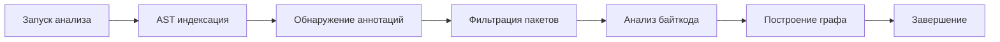
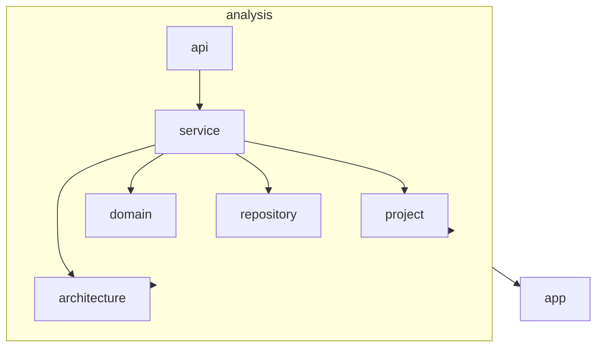

# AGENTS.md: Модуль Analysis (Backend)

Модуль процессов анализа. Отвечает за AST индексацию Java исходников и анализ байткода .class файлов.

---

## Ответственность

- AST анализ Java исходного кода
- Анализ байткода .class файлов
- Обнаружение Spring аннотаций
- Построение связей в графе
- Фильтрация по include/exclude пакетам

---

## Структура модуля

```
src/main/java/twin/spring/analysis/
├── api/
│   ├── AnalysisController.java         # REST контроллер
│   ├── StartAnalysisRequest.java       # DTO запроса на анализ
│   ├── AnalysisStatusResponse.java     # DTO статуса анализа
│   └── AnalysisResultResponse.java     # DTO результата анализа
├── domain/
│   ├── AnalysisTask.java               # Задача анализа
│   ├── AnalysisResult.java             # Результат анализа
│   └── AnalysisStatus.java             # Статус анализа (enum)
├── service/
│   ├── AnalysisService.java            # Координация анализа
│   ├── AstIndexerService.java          # AST индексация
│   ├── BytecodeAnalyzerService.java    # Анализ байткода
│   ├── SpringAnnotationDetector.java   # Обнаружение аннотаций
│   └── PackageFilterService.java       # Фильтрация пакетов
└── repository/
    └── AnalysisTaskRepository.java     # Репозиторий задач
```

---

## Процесс анализа



---

## Доменные модели

### AnalysisTask

```java
/**
 * Задача анализа проекта.
 */
@Node("AnalysisTask")
@Getter
@Setter
@Builder
@NoArgsConstructor
@AllArgsConstructor
public class AnalysisTask {
    
    @Id
    @GeneratedValue
    private String id;
    
    /** ID анализируемого проекта */
    private String projectId;
    
    /** Статус задачи */
    private AnalysisStatus status;
    
    /** Время начала */
    private LocalDateTime startedAt;
    
    /** Время завершения */
    private LocalDateTime completedAt;
    
    /** Количество найденных классов */
    private Integer classesFound;
    
    /** Количество найденных методов */
    private Integer methodsFound;
    
    /** Количество найденных endpoints */
    private Integer endpointsFound;
    
    /** Сообщение об ошибке */
    private String errorMessage;
}
```

### AnalysisStatus

```java
/**
 * Статус задачи анализа.
 */
public enum AnalysisStatus {
    PENDING,
    RUNNING,
    COMPLETED,
    FAILED
}
```

---

## AST индексация

### AstIndexerService

```java
/**
 * Сервис AST индексации Java исходников.
 * 
 * <p>Использует JavaParser для анализа исходного кода.</p>
 */
@Service
@Slf4j
@RequiredArgsConstructor
public class AstIndexerService {
    
    private final ClassNodeRepository classNodeRepository;
    private final MethodNodeRepository methodNodeRepository;
    private final SpringAnnotationDetector annotationDetector;
    private final PackageFilterService packageFilter;
    
    /**
     * Индексирует Java файлы в директории проекта.
     */
    public Mono<IndexingResult> indexProject(String projectPath, List<String> includePackages, List<String> excludePackages) {
        log.info("Starting AST indexing for project: {}", projectPath);
        
        return Mono.fromCallable(() -> {
            // Поиск всех .java файлов
            List<Path> javaFiles = findJavaFiles(projectPath);
            
            // Парсинг и индексация
            List<ClassNode> classes = new ArrayList<>();
            List<MethodNode> methods = new ArrayList<>();
            
            for (Path javaFile : javaFiles) {
                CompilationUnit cu = parseJavaFile(javaFile);
                
                // Фильтрация по пакетам
                String packageName = cu.getPackageDeclaration()
                    .map(pd -> pd.getNameAsString())
                    .orElse("");
                
                if (!packageFilter.isIncluded(packageName, includePackages, excludePackages)) {
                    continue;
                }
                
                // Извлечение классов и методов
                classes.addAll(extractClasses(cu, javaFile));
                methods.addAll(extractMethods(cu));
            }
            
            return new IndexingResult(classes, methods);
        });
    }
    
    /**
     * Извлекает классы из CompilationUnit.
     */
    private List<ClassNode> extractClasses(CompilationUnit cu, Path filePath) {
        return cu.findAll(ClassOrInterfaceDeclaration.class).stream()
            .map(classDecl -> {
                List<String> annotations = annotationDetector.detectAnnotations(classDecl);
                List<String> labels = annotationDetector.resolveLabels(annotations);
                
                return ClassNode.builder()
                    .name(classDecl.getNameAsString())
                    .fullName(getFullName(cu, classDecl))
                    .packageName(cu.getPackageDeclaration()
                        .map(pd -> pd.getNameAsString())
                        .orElse(""))
                    .labels(labels)
                    .modifiers(getModifiers(classDecl))
                    .build();
            })
            .collect(Collectors.toList());
    }
    
    /**
     * Извлекает методы из CompilationUnit.
     */
    private List<MethodNode> extractMethods(CompilationUnit cu) {
        return cu.findAll(MethodDeclaration.class).stream()
            .map(methodDecl -> MethodNode.builder()
                .name(methodDecl.getNameAsString())
                .signature(methodDecl.getSignature().asString())
                .returnType(methodDecl.getType().asString())
                .modifiers(getModifiers(methodDecl))
                .build())
            .collect(Collectors.toList());
    }
}
```

---

## Обнаружение Spring аннотаций

### SpringAnnotationDetector

```java
/**
 * Детектор Spring аннотаций.
 */
@Service
public class SpringAnnotationDetector {
    
    private static final Set<String> SPRING_ANNOTATIONS = Set.of(
        "Controller", "RestController", "Service", "Repository",
        "Component", "Configuration", "Bean", "Autowired",
        "RequestMapping", "GetMapping", "PostMapping", "PutMapping", "DeleteMapping"
    );
    
    /**
     * Обнаруживает Spring аннотации на классе.
     */
    public List<String> detectAnnotations(ClassOrInterfaceDeclaration classDecl) {
        return classDecl.getAnnotations().stream()
            .map(a -> a.getNameAsString())
            .filter(a -> SPRING_ANNOTATIONS.contains(a) || 
                        a.startsWith("org.springframework"))
            .collect(Collectors.toList());
    }
    
    /**
     * Преобразует аннотации в метки Neo4j.
     */
    public List<String> resolveLabels(List<String> annotations) {
        Map<String, String> annotationToLabel = Map.of(
            "Controller", "Controller",
            "RestController", "RestController",
            "Service", "Service",
            "Repository", "Repository",
            "Component", "Component",
            "Configuration", "Configuration"
        );
        
        return annotations.stream()
            .map(annotationToLabel::get)
            .filter(Objects::nonNull)
            .collect(Collectors.toList());
    }
    
    /**
     * Извлекает информацию о REST endpoint из метода.
     */
    public Optional<EndpointInfo> extractEndpointInfo(MethodDeclaration methodDecl) {
        for (AnnotationExpr annotation : methodDecl.getAnnotations()) {
            if (annotation.getNameAsString().endsWith("Mapping")) {
                return Optional.of(parseMappingAnnotation(annotation));
            }
        }
        return Optional.empty();
    }
}
```

---

## Анализ байткода

### BytecodeAnalyzerService

```java
/**
 * Сервис анализа байткода .class файлов.
 * 
 * <p>Использует ASM для анализа скомпилированных классов.</p>
 */
@Service
@Slf4j
@RequiredArgsConstructor
public class BytecodeAnalyzerService {
    
    private final ClassNodeRepository classNodeRepository;
    private final MethodNodeRepository methodNodeRepository;
    private final PackageFilterService packageFilter;
    
    /**
     * Анализирует .class файлы в директории build/classes.
     */
    public Mono<BytecodeResult> analyzeBytecode(String projectPath, 
                                                  List<String> includePackages, 
                                                  List<String> excludePackages) {
        log.info("Starting bytecode analysis for project: {}", projectPath);
        
        return Mono.fromCallable(() -> {
            List<MethodCall> methodCalls = new ArrayList<>();
            List<FieldAccess> fieldAccesses = new ArrayList<>();
            List<ObjectInstantiation> instantiations = new ArrayList<>();
            
            Path classesDir = Paths.get(projectPath, "build", "classes");
            if (!classesDir.toFile().exists()) {
                classesDir = Paths.get(projectPath, "target", "classes");
            }
            
            List<Path> classFiles = findClassFiles(classesDir);
            
            for (Path classFile : classFiles) {
                ClassReader reader = new ClassReader(Files.readAllBytes(classFile));
                ClassVisitor visitor = new AnalysisClassVisitor(
                    packageFilter, includePackages, excludePackages,
                    methodCalls, fieldAccesses, instantiations
                );
                reader.accept(visitor, 0);
            }
            
            return new BytecodeResult(methodCalls, fieldAccesses, instantiations);
        });
    }
}

/**
 * ASM visitor для анализа класса.
 */
class AnalysisClassVisitor extends ClassVisitor {
    
    private final PackageFilterService packageFilter;
    private final List<String> includePackages;
    private final List<String> excludePackages;
    private final List<MethodCall> methodCalls;
    private final List<FieldAccess> fieldAccesses;
    private final List<ObjectInstantiation> instantiations;
    
    private String currentClassName;
    
    @Override
    public void visit(int version, int access, String name, String signature, 
                      String superName, String[] interfaces) {
        this.currentClassName = name.replace('/', '.');
    }
    
    @Override
    public MethodVisitor visitMethod(int access, String name, String descriptor,
                                      String signature, String[] exceptions) {
        return new AnalysisMethodVisitor(
            currentClassName, name,
            packageFilter, includePackages, excludePackages,
            methodCalls, fieldAccesses, instantiations
        );
    }
}
```

---

## Фильтрация пакетов

### PackageFilterService

```java
/**
 * Сервис фильтрации пакетов по include/exclude маскам.
 */
@Service
public class PackageFilterService {
    
    /**
     * Проверяет, включен ли пакет в область анализа.
     */
    public boolean isIncluded(String packageName, 
                               List<String> includePackages, 
                               List<String> excludePackages) {
        // Проверка exclude
        for (String exclude : excludePackages) {
            if (packageName.startsWith(exclude)) {
                return false;
            }
        }
        
        // Проверка include
        for (String include : includePackages) {
            if (packageName.startsWith(include)) {
                return true;
            }
        }
        
        return false;
    }
}
```

---

## API

### REST Endpoints

| Метод | Путь | Описание |
|-------|------|----------|
| POST | `/api/v1/analysis/start` | Запустить анализ проекта |
| GET | `/api/v1/analysis/{taskId}/status` | Получить статус анализа |
| GET | `/api/v1/analysis/{taskId}/result` | Получить результат анализа |
| DELETE | `/api/v1/analysis/{taskId}` | Отменить анализ |

### DTO

#### StartAnalysisRequest

```java
@Builder
@NoArgsConstructor
@AllArgsConstructor
@Getter
@Setter
public class StartAnalysisRequest {
    
    @NotBlank
    private String projectId;
}
```

#### AnalysisStatusResponse

```java
@Builder
@NoArgsConstructor
@AllArgsConstructor
@Getter
@Setter
public class AnalysisStatusResponse {
    
    private String taskId;
    private String projectId;
    private String status;
    private Integer progress;
    private String message;
}
```

---

## Зависимости



### Зависит от

- **project** - получение конфигурации проекта
- **architecture** - сохранение результатов в граф

---

## Тестирование

### Тестовые профили

```java
public class AnalysisTestProfile {
    
    public static AnalysisTask createDefaultTask() {
        return AnalysisTask.builder()
            .id("test-task-id")
            .projectId("test-project-id")
            .status(AnalysisStatus.PENDING)
            .startedAt(LocalDateTime.now())
            .build();
    }
    
    public static StartAnalysisRequest createDefaultRequest() {
        return StartAnalysisRequest.builder()
            .projectId("test-project-id")
            .build();
    }
}
```

---

## Интеграция с ASM

### Зависимости build.gradle.kts

```kotlin
dependencies {
    implementation("org.ow2.asm:asm:9.6")
    implementation("com.github.javaparser:javaparser-symbol-solver-core:3.25.5")
}