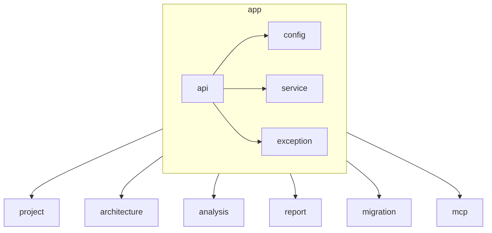

# AGENTS.md: Модуль App (Backend)

Корневой модуль приложения. Агрегирует все остальные модули, предоставляет общие компоненты UI, главную страницу и навигацию.

---

## Ответственность

- Агрегация всех модулей приложения
- Общая конфигурация Spring Boot
- Глобальная обработка ошибок
- Health checks и метрики
- Статические ресурсы frontend

---

## Структура модуля

```
src/main/java/twin/spring/app/
├── api/
│   ├── AppController.java              # Главный контроллер
│   ├── HealthController.java           # Health check endpoint
│   └── GlobalExceptionHandler.java     # Глобальная обработка ошибок
├── config/
│   ├── AppConfig.java                  # Общая конфигурация
│   ├── Neo4jConfig.java                # Конфигурация Neo4j
│   ├── WebFluxConfig.java              # Конфигурация WebFlux
│   └── CorsConfig.java                 # CORS конфигурация
├── domain/
│   ├── AppInfo.java                    # Информация о приложении
│   └── HealthStatus.java               # Статус здоровья
├── service/
│   └── AppInfoService.java             # Сервис информации о приложении
└── exception/
    ├── ResourceNotFoundException.java   # Ресурс не найден
    ├── ValidationException.java         # Ошибка валидации
    └── ErrorResponse.java               # Ответ с ошибкой
```

---

## Конфигурация

### AppConfig

```java
/**
 * Общая конфигурация приложения.
 */
@Configuration
@ConfigurationProperties(prefix = "spring.twin")
@Getter
@Setter
public class AppConfig {
    
    /** Версия приложения */
    private String version = "1.0.0";
    
    /** Название приложения */
    private String name = "Spring Twin";
    
    /** Режим Neo4j: embedded или standalone */
    private Neo4jMode neo4jMode = Neo4jMode.EMBEDDED;
    
    /** Конфигурация миграций */
    private MigrationConfig migration = new MigrationConfig();
    
    @Data
    public static class MigrationConfig {
        private boolean enabled = true;
    }
    
    public enum Neo4jMode {
        EMBEDDED,
        STANDALONE
    }
}
```

### Neo4jConfig

```java
/**
 * Конфигурация Neo4j.
 */
@Configuration
@Slf4j
public class Neo4jConfig {
    
    @Bean
    @ConfigurationProperties(prefix = "spring.neo4j")
    public Neo4jConnectionDetails neo4jConnectionDetails() {
        return new Neo4jConnectionDetails() {
            @Override
            public URI getUri() {
                return URI.create("bolt://localhost:7687");
            }
            
            @Override
            public String getUsername() {
                return "neo4j";
            }
            
            @Override
            public String getPassword() {
                return "";
            }
        };
    }
}
```

### WebFluxConfig

```java
/**
 * Конфигурация WebFlux.
 */
@Configuration
public class WebFluxConfig implements WebFluxConfigurer {
    
    @Override
    public void addResourceHandlers(ResourceHandlerRegistry registry) {
        // Статические ресурсы frontend
        registry.addResourceHandler("/**")
            .addResourceLocations("classpath:/public/")
            .setCacheControl(CacheControl.maxAge(1, TimeUnit.DAYS));
        
        // SPA fallback
        registry.addResourceHandler("/")
            .addResourceLocations("classpath:/public/index.html");
    }
    
    @Override
    public void configurePathMatching(PathMatchConfigurer configurer) {
        // API endpoints не используют SPA fallback
        configurer.addPathPrefix("/api", 
            c -> c.getAnnotation(RestController.class) != null);
    }
}
```

### CorsConfig

```java
/**
 * CORS конфигурация.
 */
@Configuration
public class CorsConfig {
    
    @Bean
    public CorsWebFilter corsWebFilter() {
        CorsConfiguration config = new CorsConfiguration();
        config.setAllowedOrigins(List.of("http://localhost:8080"));
        config.setAllowedMethods(List.of("GET", "POST", "PUT", "DELETE", "OPTIONS"));
        config.setAllowedHeaders(List.of("*"));
        config.setAllowCredentials(true);
        
        UrlBasedCorsConfigurationSource source = new UrlBasedCorsConfigurationSource();
        source.registerCorsConfiguration("/api/**", config);
        
        return new CorsWebFilter(source);
    }
}
```

---

## API

### AppController

```java
/**
 * Главный контроллер приложения.
 */
@RestController
@RequestMapping("/api/v1")
@Slf4j
@RequiredArgsConstructor
public class AppController {
    
    private final AppInfoService appInfoService;
    
    /**
     * Возвращает информацию о приложении.
     */
    @GetMapping("/info")
    public Mono<AppInfo> getAppInfo() {
        return appInfoService.getAppInfo();
    }
    
    /**
     * SPA fallback - возвращает index.html для всех не-API маршрутов.
     */
    @GetMapping(value = {"/", "/projects/**", "/architecture/**", "/analysis/**", "/report/**"})
    public String spaFallback() {
        return "forward:/index.html";
    }
}
```

### HealthController

```java
/**
 * Health check контроллер.
 */
@RestController
@RequestMapping("/api/v1/health")
@Slf4j
public class HealthController {
    
    @Autowired
    private ReactiveNeo4jClient neo4jClient;
    
    /**
     * Проверка здоровья приложения.
     */
    @GetMapping
    public Mono<HealthStatus> health() {
        return Mono.zip(
            checkApplicationHealth(),
            checkNeo4jHealth()
        ).map(tuple -> HealthStatus.builder()
            .status(tuple.getT1() && tuple.getT2() ? "UP" : "DOWN")
            .components(Map.of(
                "application", tuple.getT1() ? "UP" : "DOWN",
                "neo4j", tuple.getT2() ? "UP" : "DOWN"
            ))
            .timestamp(LocalDateTime.now())
            .build());
    }
    
    private Mono<Boolean> checkApplicationHealth() {
        return Mono.just(true);
    }
    
    private Mono<Boolean> checkNeo4jHealth() {
        return neo4jClient.query("RETURN 1")
            .fetch()
            .one()
            .map(r -> true)
            .onErrorReturn(false);
    }
}
```

---

## Обработка ошибок

### GlobalExceptionHandler

```java
/**
 * Глобальный обработчик ошибок.
 */
@RestControllerAdvice
@Slf4j
public class GlobalExceptionHandler {
    
    /**
     * Обработка ResourceNotFoundException.
     */
    @ExceptionHandler(ResourceNotFoundException.class)
    @ResponseStatus(HttpStatus.NOT_FOUND)
    public ErrorResponse handleResourceNotFound(ResourceNotFoundException ex) {
        log.warn("Resource not found: {}", ex.getMessage());
        return ErrorResponse.builder()
            .status(HttpStatus.NOT_FOUND.value())
            .error("Not Found")
            .message(ex.getMessage())
            .timestamp(LocalDateTime.now())
            .build();
    }
    
    /**
     * Обработка ValidationException.
     */
    @ExceptionHandler(ValidationException.class)
    @ResponseStatus(HttpStatus.BAD_REQUEST)
    public ErrorResponse handleValidation(ValidationException ex) {
        log.warn("Validation error: {}", ex.getMessage());
        return ErrorResponse.builder()
            .status(HttpStatus.BAD_REQUEST.value())
            .error("Bad Request")
            .message(ex.getMessage())
            .timestamp(LocalDateTime.now())
            .build();
    }
    
    /**
     * Обработка общих исключений.
     */
    @ExceptionHandler(Exception.class)
    @ResponseStatus(HttpStatus.INTERNAL_SERVER_ERROR)
    public ErrorResponse handleGeneric(Exception ex) {
        log.error("Unexpected error", ex);
        return ErrorResponse.builder()
            .status(HttpStatus.INTERNAL_SERVER_ERROR.value())
            .error("Internal Server Error")
            .message("An unexpected error occurred")
            .timestamp(LocalDateTime.now())
            .build();
    }
}
```

### ErrorResponse

```java
/**
 * Ответ с ошибкой.
 */
@Getter
@Setter
@Builder
@NoArgsConstructor
@AllArgsConstructor
public class ErrorResponse {
    
    private int status;
    private String error;
    private String message;
    private LocalDateTime timestamp;
    private List<FieldError> fieldErrors;
    
    @Data
    @Builder
    @NoArgsConstructor
    @AllArgsConstructor
    public static class FieldError {
        private String field;
        private String message;
    }
}
```

---

## Доменные модели

### AppInfo

```java
/**
 * Информация о приложении.
 */
@Getter
@Setter
@Builder
@NoArgsConstructor
@AllArgsConstructor
public class AppInfo {
    
    private String name;
    private String version;
    private String description;
    private String neo4jMode;
    private LocalDateTime startedAt;
}
```

### HealthStatus

```java
/**
 * Статус здоровья приложения.
 */
@Getter
@Setter
@Builder
@NoArgsConstructor
@AllArgsConstructor
public class HealthStatus {
    
    private String status;
    private Map<String, String> components;
    private LocalDateTime timestamp;
}
```

---

## Сервисы

### AppInfoService

```java
/**
 * Сервис информации о приложении.
 */
@Service
@Slf4j
@RequiredArgsConstructor
public class AppInfoService {
    
    private final AppConfig appConfig;
    
    private final LocalDateTime startedAt = LocalDateTime.now();
    
    /**
     * Возвращает информацию о приложении.
     */
    public Mono<AppInfo> getAppInfo() {
        return Mono.just(AppInfo.builder()
            .name(appConfig.getName())
            .version(appConfig.getVersion())
            .description("MCP-агент для анализа Spring Boot проектов")
            .neo4jMode(appConfig.getNeo4jMode().name())
            .startedAt(startedAt)
            .build());
    }
}
```

---

## Зависимости



### Агрегирует

- **project** - управление проектами
- **architecture** - модели графа
- **analysis** - процессы анализа
- **report** - генерация отчетов
- **migration** - миграции БД
- **mcp** - MCP интеграция

---

## application.yaml

```yaml
spring:
  application:
    name: spring-twin
  
  twin:
    name: Spring Twin
    version: 1.0.0
    neo4j-mode: embedded
    migration:
      enabled: true
  
  neo4j:
    uri: bolt://localhost:7687
    authentication:
      username: neo4j
      password: ""
  
  web:
    resources:
      static-locations: classpath:/public/
  
server:
  port: 8080

logging:
  level:
    twin.spring: DEBUG
    org.springframework.data.neo4j: DEBUG
```

---

## Тестирование

### Интеграционные тесты

```java
@SpringBootTest
class AppIntegrationTest {
    
    @Autowired
    private WebTestClient webTestClient;
    
    @Test
    void getAppInfo_returnsAppInfo() {
        webTestClient.get()
            .uri("/api/v1/info")
            .exchange()
            .expectStatus().isOk()
            .expectBody(AppInfo.class)
            .value(info -> {
                assertThat(info.getName()).isEqualTo("Spring Twin");
                assertThat(info.getVersion()).isNotNull();
            });
    }
    
    @Test
    void health_returnsHealthStatus() {
        webTestClient.get()
            .uri("/api/v1/health")
            .exchange()
            .expectStatus().isOk()
            .expectBody(HealthStatus.class)
            .value(status -> {
                assertThat(status.getStatus()).isEqualTo("UP");
            });
    }
}