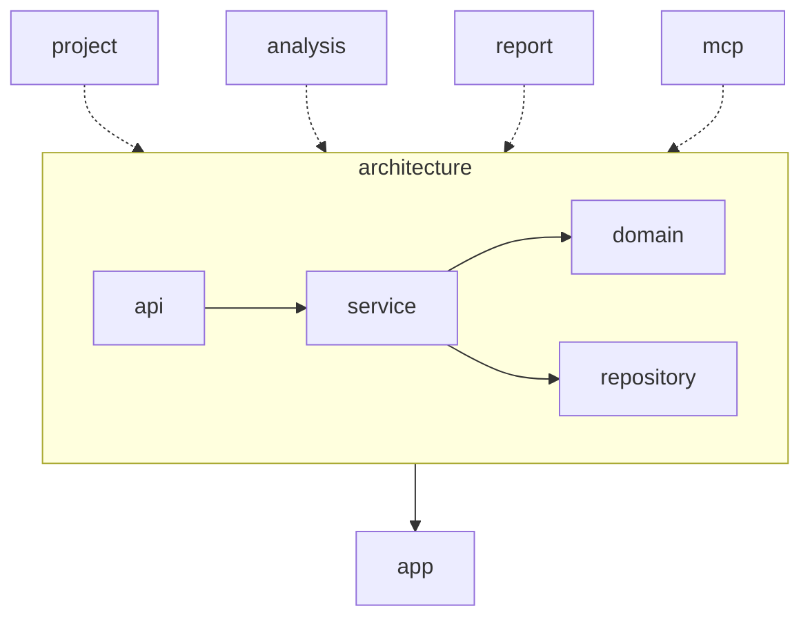

# AGENTS.md: Модуль Architecture (Backend)

Центральный модуль, содержащий модели графа архитектуры проекта. Определяет узлы (Class, Method, Endpoint) и связи между ними.

---

## Ответственность

- Определение доменных моделей графа
- Репозитории для работы с Neo4j
- Связи между архитектурными сущностями
- Метки (Labels) для классификации узлов

---

## Структура модуля

```
src/main/java/twin/spring/architecture/
├── api/
│   ├── ClassController.java            # REST контроллер для классов
│   ├── MethodController.java           # REST контроллер для методов
│   ├── EndpointController.java         # REST контроллер для endpoints
│   ├── ClassResponse.java              # DTO ответа для класса
│   ├── MethodResponse.java             # DTO ответа для метода
│   └── EndpointResponse.java           # DTO ответа для endpoint
├── domain/
│   ├── Class.java                      # Узел: Java класс
│   ├── Method.java                     # Узел: Метод класса
│   ├── Endpoint.java                   # Узел: REST endpoint
│   ├── Field.java                      # Узел: Поле класса
│   └── relation/
│       ├── DependsOn.java              # Связь: DI зависимость
│       ├── Calls.java                  # Связь: Вызов метода
│       ├── Instantiates.java           # Связь: Создание экземпляра
│       ├── AccessesField.java          # Связь: Доступ к полю
│       └── ExposesEndpoint.java        # Связь: REST endpoint
├── service/
│   ├── ClassService.java               # Сервис для работы с классами
│   ├── MethodService.java              # Сервис для работы с методами
│   ├── EndpointService.java            # Сервис для работы с endpoints
│   ├── GraphQueryService.java          # Сервис для сложных запросов
│   └── mapper/
│       ├── ClassMapper.java            # Маппер для Class
│       ├── MethodMapper.java           # Маппер для Method
│       └── EndpointMapper.java         # Маппер для Endpoint
└── repository/
    ├── ClassRepository.java            # Репозиторий для классов
    ├── MethodRepository.java           # Репозиторий для методов
    └── EndpointRepository.java         # Репозиторий для endpoints
```

---

## Доменные модели

### Class - Java класс

```java
/**
 * Java класс в анализируемом проекте.
 * 
 * <p>Узел Neo4j с динамическими метками на основе Spring аннотаций.</p>
 */
@Node
@Getter
@Setter
@Builder
@NoArgsConstructor
@AllArgsConstructor
public class Class {
    
    @Id
    @GeneratedValue
    private String id;
    
    /** Простое имя класса */
    private String name;
    
    /** Полное имя класса с пакетом */
    private String fullName;
    
    /** Имя пакета */
    private String packageName;
    
    /** Модификаторы доступа */
    private List<String> modifiers;
    
    /** Метки Neo4j (Controller, Service, Repository и т.д.) */
    private List<String> labels;
    
    /** Связи с другими классами */
    @Relationship(type = "DEPENDS_ON")
    private List<DependsOn> dependencies;
    
    /** Методы класса */
    @Relationship(type = "HAS_METHOD", direction = Relationship.Direction.OUTGOING)
    private List<Method> methods;
}
```

### Method - Метод класса

```java
/**
 * Метод Java класса.
 */
@Node
@Getter
@Setter
@Builder
@NoArgsConstructor
@AllArgsConstructor
public class Method {
    
    @Id
    @GeneratedValue
    private String id;
    
    /** Имя метода */
    private String name;
    
    /** Сигнатура метода */
    private String signature;
    
    /** Возвращаемый тип */
    private String returnType;
    
    /** Модификаторы */
    private List<String> modifiers;
    
    /** Параметры метода */
    private List<MethodParameter> parameters;
    
    /** Родительский класс */
    @Relationship(type = "HAS_METHOD", direction = Relationship.Direction.INCOMING)
    private Class parentClass;
}
```

### Endpoint - REST endpoint

```java
/**
 * REST endpoint, экспонируемый методом контроллера.
 */
@Node
@Getter
@Setter
@Builder
@NoArgsConstructor
@AllArgsConstructor
public class Endpoint {
    
    @Id
    @GeneratedValue
    private String id;
    
    /** HTTP путь */
    private String path;
    
    /** HTTP метод (GET, POST, PUT, DELETE) */
    private String httpMethod;
    
    /** Content-Type для ответа */
    private String produces;
    
    /** Content-Type для запроса */
    private String consumes;
    
    /** Метод, экспонирующий endpoint */
    @Relationship(type = "EXPOSES_ENDPOINT", direction = Relationship.Direction.INCOMING)
    private Method exposingMethod;
}
```

---

## Связи (Relationships)

### DependsOn - DI зависимость

```java
/**
 * Связь зависимости между классами через DI.
 */
@RelationshipProperties
@Getter
@Setter
@Builder
@NoArgsConstructor
@AllArgsConstructor
public class DependsOn {
    
    @Id
    @GeneratedValue
    private Long id;
    
    @TargetNode
    private Class targetClass;
    
    /** Имя поля для инъекции */
    private String fieldName;
    
    /** Тип инъекции (constructor, setter, field) */
    private String injectionType;
}
```

### Calls - Вызов метода

```java
/**
 * Связь вызова одного метода другим.
 */
@RelationshipProperties
@Getter
@Setter
@Builder
@NoArgsConstructor
@AllArgsConstructor
public class Calls {
    
    @Id
    @GeneratedValue
    private Long id;
    
    @TargetNode
    private Method targetMethod;
    
    /** Позиция в исходном коде */
    private Integer lineNumber;
}
```

### ExposesEndpoint - REST endpoint

```java
/**
 * Связь метода с экспонируемым REST endpoint.
 */
@RelationshipProperties
@Getter
@Setter
@Builder
@NoArgsConstructor
@AllArgsConstructor
public class ExposesEndpoint {
    
    @Id
    @GeneratedValue
    private Long id;
    
    @TargetNode
    private Endpoint endpoint;
}
```

---

## Метки (Labels)

### Формирование меток

Метки формируются на основе Spring аннотаций:

| Аннотация | Метка Neo4j |
|-----------|-------------|
| @Controller | Controller |
| @RestController | RestController |
| @Service | Service |
| @Repository | Repository |
| @Component | Component |
| @Configuration | Configuration |
| @Bean | Bean |

### Использование меток

```java
/**
 * Сервис для работы с метками классов.
 */
@Service
public class ClassLabelService {
    
    private static final Map<String, String> ANNOTATION_TO_LABEL = Map.of(
        "Controller", "Controller",
        "RestController", "RestController",
        "Service", "Service",
        "Repository", "Repository",
        "Component", "Component",
        "Configuration", "Configuration"
    );
    
    public List<String> resolveLabels(List<String> annotations) {
        return annotations.stream()
            .map(ANNOTATION_TO_LABEL::get)
            .filter(Objects::nonNull)
            .collect(Collectors.toList());
    }
}
```

---

## Репозитории

### ClassRepository

```java
/**
 * Репозиторий для работы с классами в Neo4j.
 */
@Repository
public interface ClassRepository extends ReactiveNeo4jRepository<Class, String> {
    
    /**
     * Найти класс по полному имени.
     */
    Mono<Class> findByFullName(String fullName);
    
    /**
     * Найти все классы в пакете.
     */
    Flux<Class> findByPackageNameStartingWith(String packageName);
    
    /**
     * Найти классы по метке.
     */
    Flux<Class> findByLabelsContaining(String label);
    
    /**
     * Найти все контроллеры.
     */
    @Query("MATCH (c:Class:Controller) RETURN c")
    Flux<Class> findAllControllers();
    
    /**
     * Найти все сервисы.
     */
    @Query("MATCH (c:Class:Service) RETURN c")
    Flux<Class> findAllServices();
    
    /**
     * Найти зависимости класса.
     */
    @Query("MATCH (c:Class {id: $id})-[:DEPENDS_ON]->(dep:Class) RETURN dep")
    Flux<Class> findDependencies(String id);
    
    /**
     * Найти классы, зависящие от данного.
     */
    @Query("MATCH (c:Class)-[:DEPENDS_ON]->(target:Class {id: $id}) RETURN c")
    Flux<Class> findDependents(String id);
}
```

### MethodRepository

```java
/**
 * Репозиторий для работы с методами.
 */
@Repository
public interface MethodRepository extends ReactiveNeo4jRepository<Method, String> {
    
    /**
     * Найти методы класса.
     */
    Flux<Method> findByParentClassId(String classId);
    
    /**
     * Найти метод по имени и классу.
     */
    @Query("MATCH (c:Class {id: $classId})-[:HAS_METHOD]->(m:Method {name: $name}) RETURN m")
    Mono<Method> findByClassIdAndName(String classId, String name);
    
    /**
     * Найти вызовы метода.
     */
    @Query("MATCH (m:Method {id: $id})-[:CALLS]->(called:Method) RETURN called")
    Flux<Method> findCalledMethods(String id);
    
    /**
     * Найти вызывающие методы.
     */
    @Query("MATCH (caller:Method)-[:CALLS]->(m:Method {id: $id}) RETURN caller")
    Flux<Method> findCallingMethods(String id);
}
```

### EndpointRepository

```java
/**
 * Репозиторий для работы с endpoints.
 */
@Repository
public interface EndpointRepository extends ReactiveNeo4jRepository<Endpoint, String> {
    
    /**
     * Найти endpoint по пути и методу.
     */
    Mono<Endpoint> findByPathAndHttpMethod(String path, String httpMethod);
    
    /**
     * Найти все endpoints с HTTP методом.
     */
    Flux<Endpoint> findByHttpMethod(String httpMethod);
    
    /**
     * Найти endpoint по экспонирующему методу.
     */
    @Query("MATCH (m:Method {id: $methodId})-[:EXPOSES_ENDPOINT]->(e:Endpoint) RETURN e")
    Mono<Endpoint> findByExposingMethodId(String methodId);
}
```

---

## API

### REST Endpoints

| Метод | Путь | Описание |
|-------|------|----------|
| GET | `/api/v1/classes` | Получить все классы |
| GET | `/api/v1/classes/{id}` | Получить класс по ID |
| GET | `/api/v1/classes/{id}/dependencies` | Получить зависимости класса |
| GET | `/api/v1/classes/{id}/methods` | Получить методы класса |
| GET | `/api/v1/methods/{id}` | Получить метод по ID |
| GET | `/api/v1/methods/{id}/calls` | Получить вызовы метода |
| GET | `/api/v1/endpoints` | Получить все endpoints |
| GET | `/api/v1/endpoints/{id}` | Получить endpoint по ID |

---

## Зависимости



### Используется

- **project** - для связей проекта с классами
- **analysis** - для сохранения результатов анализа
- **report** - для формирования explain-отчетов
- **mcp** - для предоставления контекста через MCP
- **migration** - для создания индексов и ограничений

---

## Тестирование

### Тестовые профили

```java
public class ArchitectureTestProfile {
    
    public static Class createDefaultClass() {
        return Class.builder()
            .id("test-class-id")
            .name("TestService")
            .fullName("com.example.TestService")
            .packageName("com.example")
            .labels(List.of("Service"))
            .modifiers(List.of("public"))
            .build();
    }
    
    public static Method createDefaultMethod() {
        return Method.builder()
            .id("test-method-id")
            .name("doSomething")
            .signature("public void doSomething()")
            .returnType("void")
            .modifiers(List.of("public"))
            .build();
    }
    
    public static Endpoint createDefaultEndpoint() {
        return Endpoint.builder()
            .id("test-endpoint-id")
            .path("/api/test")
            .httpMethod("GET")
            .produces("application/json")
            .build();
    }
}