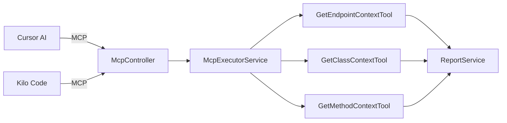
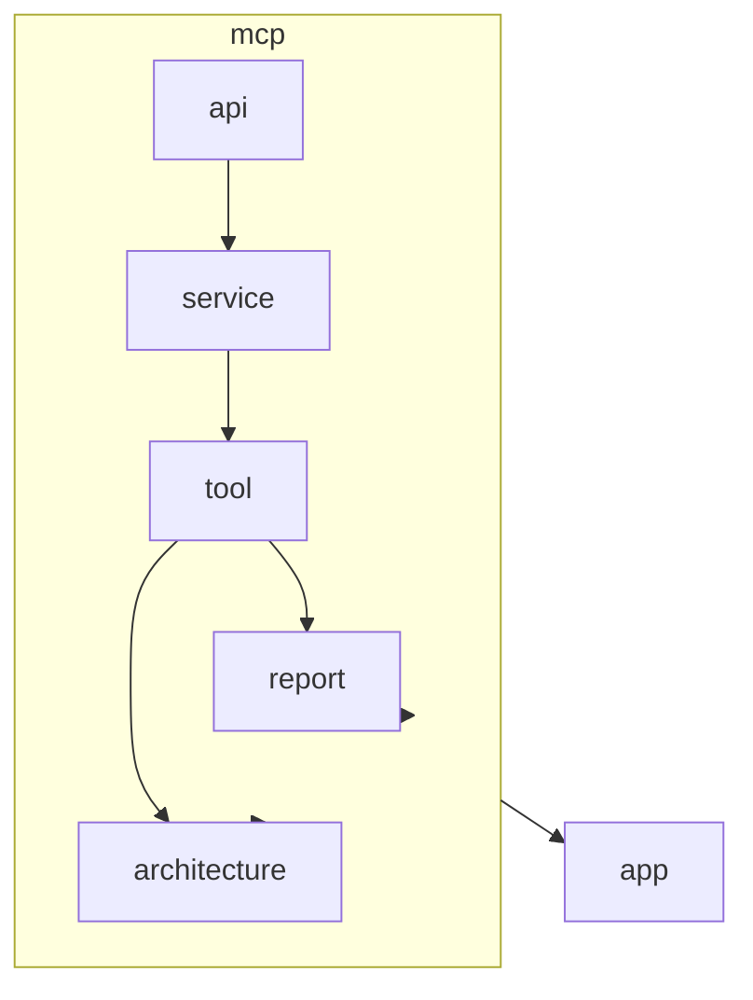

# AGENTS.md: Модуль MCP (Backend)

Инфраструктурный модуль для MCP-интеграции с Cursor AI и Kilo Code. Предоставляет MCP tools для получения архитектурного контекста.

---

## Ответственность

- Предоставление MCP tools для внешних инструментов
- Получение контекста endpoint, класса, метода
- Экспорт структурированного контекста для LLM
- Интеграция с Cursor AI и Kilo Code

---

## Структура модуля

```
src/main/java/twin/spring/mcp/
├── api/
│   ├── McpController.java              # REST контроллер для MCP
│   ├── McpToolRequest.java             # Запрос к MCP tool
│   └── McpToolResponse.java            # Ответ от MCP tool
├── domain/
│   ├── McpTool.java                    # Описание MCP tool
│   ├── McpToolParameter.java           # Параметр MCP tool
│   └── McpContext.java                 # Контекст для MCP
├── service/
│   ├── McpRegistryService.java         # Реестр MCP tools
│   ├── McpExecutorService.java         # Исполнитель MCP tools
│   ├── EndpointContextService.java     # Контекст endpoint
│   ├── ClassContextService.java        # Контекст класса
│   └── MethodContextService.java       # Контекст метода
└── tool/
    ├── GetEndpointContextTool.java     # Tool: контекст endpoint
    ├── GetClassContextTool.java        # Tool: контекст класса
    ├── GetMethodContextTool.java       # Tool: контекст метода
    └── SearchArchitectureTool.java     # Tool: поиск по архитектуре
```

---

## MCP Tools

### Диаграмма взаимодействия



---

## Доменные модели

### McpTool

```java
/**
 * Описание MCP tool.
 */
@Getter
@Setter
@Builder
@NoArgsConstructor
@AllArgsConstructor
public class McpTool {
    
    /** Имя tool */
    private String name;
    
    /** Описание tool */
    private String description;
    
    /** Параметры tool */
    private List<McpToolParameter> parameters;
    
    /** Возвращаемый тип */
    private String returnType;
}
```

### McpToolParameter

```java
/**
 * Параметр MCP tool.
 */
@Getter
@Setter
@Builder
@NoArgsConstructor
@AllArgsConstructor
public class McpToolParameter {
    
    /** Имя параметра */
    private String name;
    
    /** Тип параметра */
    private String type;
    
    /** Описание параметра */
    private String description;
    
    /** Обязательный параметр */
    private boolean required;
    
    /** Значение по умолчанию */
    private Object defaultValue;
}
```

### McpContext

```java
/**
 * Контекст, возвращаемый MCP tool.
 */
@Getter
@Setter
@Builder
@NoArgsConstructor
@AllArgsConstructor
public class McpContext {
    
    /** Тип контекста */
    private String contextType;
    
    /** ID элемента */
    private String elementId;
    
    /** Имя элемента */
    private String elementName;
    
    /** Краткое описание */
    private String summary;
    
    /** Структурированные данные */
    private Object data;
    
    /** Связанные элементы */
    private List<RelatedElement> relatedElements;
    
    /** Метаданные для LLM */
    private Map<String, Object> metadata;
}
```

---

## MCP Tools

### GetEndpointContextTool

```java
/**
 * MCP tool для получения контекста endpoint.
 * 
 * <p>Возвращает полную информацию о REST endpoint включая:
 * <ul>
 *   <li>Информацию об endpoint (путь, метод, параметры)</li>
 *   <li>Метод контроллера, экспонирующий endpoint</li>
 *   <li>Цепочку вызовов</li>
 *   <li>Зависимости контроллера</li>
 * </ul>
 */
@Component
@Slf4j
@RequiredArgsConstructor
public class GetEndpointContextTool implements McpToolExecutor {
    
    private final EndpointExplainService endpointExplainService;
    
    @Override
    public String getName() {
        return "get_endpoint_context";
    }
    
    @Override
    public String getDescription() {
        return "Get architectural context for a REST endpoint by path and HTTP method";
    }
    
    @Override
    public List<McpToolParameter> getParameters() {
        return List.of(
            McpToolParameter.builder()
                .name("path")
                .type("string")
                .description("Endpoint path (e.g., /api/users)")
                .required(true)
                .build(),
            McpToolParameter.builder()
                .name("method")
                .type("string")
                .description("HTTP method (GET, POST, PUT, DELETE)")
                .required(true)
                .defaultValue("GET")
                .build()
        );
    }
    
    @Override
    public Mono<McpContext> execute(Map<String, Object> parameters) {
        String path = (String) parameters.get("path");
        String httpMethod = (String) parameters.get("method");
        
        log.info("Getting endpoint context: {} {}", httpMethod, path);
        
        return endpointExplainService.generateReportByPath(path, httpMethod)
            .map(this::convertToMcpContext);
    }
    
    private McpContext convertToMcpContext(EndpointReport report) {
        return McpContext.builder()
            .contextType("ENDPOINT")
            .elementId(report.getElementId())
            .elementName(report.getEndpoint().getPath())
            .summary(report.getSummary())
            .data(report)
            .relatedElements(extractRelatedElements(report))
            .build();
    }
}
```

### GetClassContextTool

```java
/**
 * MCP tool для получения контекста класса.
 * 
 * <p>Возвращает полную информацию о Java классе включая:
 * <ul>
 *   <li>Методы класса</li>
 *   <li>DI зависимости</li>
 *   <li>Зависящие классы</li>
 *   <li>Экспонируемые endpoints (для контроллеров)</li>
 * </ul>
 */
@Component
@Slf4j
@RequiredArgsConstructor
public class GetClassContextTool implements McpToolExecutor {
    
    private final ClassExplainService classExplainService;
    
    @Override
    public String getName() {
        return "get_class_context";
    }
    
    @Override
    public String getDescription() {
        return "Get architectural context for a Java class by full name";
    }
    
    @Override
    public List<McpToolParameter> getParameters() {
        return List.of(
            McpToolParameter.builder()
                .name("fullName")
                .type("string")
                .description("Full class name with package (e.g., com.example.UserService)")
                .required(true)
                .build()
        );
    }
    
    @Override
    public Mono<McpContext> execute(Map<String, Object> parameters) {
        String fullName = (String) parameters.get("fullName");
        
        log.info("Getting class context: {}", fullName);
        
        return classExplainService.generateReportByFullName(fullName)
            .map(this::convertToMcpContext);
    }
    
    private McpContext convertToMcpContext(ClassReport report) {
        return McpContext.builder()
            .contextType("CLASS")
            .elementId(report.getElementId())
            .elementName(report.getClassInfo().getFullName())
            .summary(report.getSummary())
            .data(report)
            .relatedElements(extractRelatedElements(report))
            .build();
    }
}
```

### GetMethodContextTool

```java
/**
 * MCP tool для получения контекста метода.
 * 
 * <p>Возвращает полную информацию о методе включая:
 * <ul>
 *   <li>Сигнатуру и параметры</li>
 *   <li>Вызываемые методы</li>
 *   <li>Вызывающие методы</li>
 *   <li>Доступ к полям</li>
 * </ul>
 */
@Component
@Slf4j
@RequiredArgsConstructor
public class GetMethodContextTool implements McpToolExecutor {
    
    private final MethodExplainService methodExplainService;
    
    @Override
    public String getName() {
        return "get_method_context";
    }
    
    @Override
    public String getDescription() {
        return "Get architectural context for a method by class name and method name";
    }
    
    @Override
    public List<McpToolParameter> getParameters() {
        return List.of(
            McpToolParameter.builder()
                .name("className")
                .type("string")
                .description("Full class name containing the method")
                .required(true)
                .build(),
            McpToolParameter.builder()
                .name("methodName")
                .type("string")
                .description("Method name")
                .required(true)
                .build()
        );
    }
    
    @Override
    public Mono<McpContext> execute(Map<String, Object> parameters) {
        String className = (String) parameters.get("className");
        String methodName = (String) parameters.get("methodName");
        
        log.info("Getting method context: {}.{}", className, methodName);
        
        return methodExplainService.generateReportByName(className, methodName)
            .map(this::convertToMcpContext);
    }
    
    private McpContext convertToMcpContext(MethodReport report) {
        return McpContext.builder()
            .contextType("METHOD")
            .elementId(report.getElementId())
            .elementName(report.getMethodInfo().getName())
            .summary(report.getSummary())
            .data(report)
            .relatedElements(extractRelatedElements(report))
            .build();
    }
}
```

### SearchArchitectureTool

```java
/**
 * MCP tool для поиска по архитектуре.
 */
@Component
@Slf4j
@RequiredArgsConstructor
public class SearchArchitectureTool implements McpToolExecutor {
    
    private final ClassRepository classRepository;
    
    @Override
    public String getName() {
        return "search_architecture";
    }
    
    @Override
    public String getDescription() {
        return "Search for classes, methods, or endpoints by name or pattern";
    }
    
    @Override
    public List<McpToolParameter> getParameters() {
        return List.of(
            McpToolParameter.builder()
                .name("query")
                .type("string")
                .description("Search query (class name, method name, or pattern)")
                .required(true)
                .build(),
            McpToolParameter.builder()
                .name("type")
                .type("string")
                .description("Type of element to search: CLASS, METHOD, ENDPOINT, ALL")
                .required(false)
                .defaultValue("ALL")
                .build(),
            McpToolParameter.builder()
                .name("limit")
                .type("integer")
                .description("Maximum number of results")
                .required(false)
                .defaultValue(10)
                .build()
        );
    }
    
    @Override
    public Mono<McpContext> execute(Map<String, Object> parameters) {
        String query = (String) parameters.get("query");
        String type = (String) parameters.get("type");
        Integer limit = (Integer) parameters.get("limit");
        
        log.info("Searching architecture: {} (type: {}, limit: {})", query, type, limit);
        
        return classRepository.searchByName(query, limit)
            .collectList()
            .map(results -> McpContext.builder()
                .contextType("SEARCH_RESULTS")
                .elementName(query)
                .summary(String.format("Found %d results for query: %s", results.size(), query))
                .data(results)
                .build());
    }
}
```

---

## Сервисы

### McpRegistryService

```java
/**
 * Реестр MCP tools.
 */
@Service
@Slf4j
public class McpRegistryService {
    
    private final Map<String, McpToolExecutor> tools = new ConcurrentHashMap<>();
    
    /**
     * Регистрирует MCP tool.
     */
    public void register(McpToolExecutor tool) {
        log.info("Registering MCP tool: {}", tool.getName());
        tools.put(tool.getName(), tool);
    }
    
    /**
     * Возвращает все зарегистрированные tools.
     */
    public List<McpTool> getAllTools() {
        return tools.values().stream()
            .map(this::convertToMcpTool)
            .collect(Collectors.toList());
    }
    
    /**
     * Возвращает tool по имени.
     */
    public Optional<McpToolExecutor> getTool(String name) {
        return Optional.ofNullable(tools.get(name));
    }
    
    private McpTool convertToMcpTool(McpToolExecutor executor) {
        return McpTool.builder()
            .name(executor.getName())
            .description(executor.getDescription())
            .parameters(executor.getParameters())
            .build();
    }
}
```

### McpExecutorService

```java
/**
 * Исполнитель MCP tools.
 */
@Service
@Slf4j
@RequiredArgsConstructor
public class McpExecutorService {
    
    private final McpRegistryService registry;
    
    /**
     * Выполняет MCP tool.
     */
    public Mono<McpToolResponse> execute(McpToolRequest request) {
        log.info("Executing MCP tool: {}", request.getToolName());
        
        return registry.getTool(request.getToolName())
            .map(tool -> validateAndExecute(tool, request))
            .orElse(Mono.error(new McpToolNotFoundException(request.getToolName())));
    }
    
    private Mono<McpToolResponse> validateAndExecute(McpToolExecutor tool, McpToolRequest request) {
        // Валидация параметров
        List<String> errors = validateParameters(tool, request.getParameters());
        if (!errors.isEmpty()) {
            return Mono.just(McpToolResponse.builder()
                .success(false)
                .errors(errors)
                .build());
        }
        
        // Выполнение
        return tool.execute(request.getParameters())
            .map(context -> McpToolResponse.builder()
                .success(true)
                .context(context)
                .build())
            .onErrorResume(error -> Mono.just(McpToolResponse.builder()
                .success(false)
                .errors(List.of(error.getMessage()))
                .build()));
    }
    
    private List<String> validateParameters(McpToolExecutor tool, Map<String, Object> params) {
        List<String> errors = new ArrayList<>();
        
        for (McpToolParameter param : tool.getParameters()) {
            if (param.isRequired() && !params.containsKey(param.getName())) {
                errors.add(String.format("Required parameter '%s' is missing", param.getName()));
            }
        }
        
        return errors;
    }
}
```

---

## API

### REST Endpoints

| Метод | Путь | Описание |
|-------|------|----------|
| GET | `/api/v1/mcp/tools` | Список доступных MCP tools |
| POST | `/api/v1/mcp/execute` | Выполнить MCP tool |

### DTO

#### McpToolRequest

```java
@Builder
@NoArgsConstructor
@AllArgsConstructor
@Getter
@Setter
public class McpToolRequest {
    
    @NotBlank
    private String toolName;
    
    private Map<String, Object> parameters;
}
```

#### McpToolResponse

```java
@Builder
@NoArgsConstructor
@AllArgsConstructor
@Getter
@Setter
public class McpToolResponse {
    
    private boolean success;
    private McpContext context;
    private List<String> errors;
}
```

---

## Зависимости



### Зависит от

- **report** - использование сервисов генерации отчетов
- **architecture** - прямые запросы к графу

---

## Интеграция с Cursor AI

### Конфигурация MCP

```json
{
  "mcpServers": {
    "spring-twin": {
      "command": "java",
      "args": ["-jar", "spring-twin.jar"],
      "env": {}
    }
  }
}
```

### Пример использования

```json
// Запрос
{
  "toolName": "get_endpoint_context",
  "parameters": {
    "path": "/api/users",
    "method": "GET"
  }
}

// Ответ
{
  "success": true,
  "context": {
    "contextType": "ENDPOINT",
    "elementId": "ep-123",
    "elementName": "/api/users",
    "summary": "GET endpoint for retrieving user list",
    "data": { ... }
  }
}
```

---

## Тестирование

### Тестовые профили

```java
public class McpTestProfile {
    
    public static McpToolRequest createEndpointContextRequest() {
        return McpToolRequest.builder()
            .toolName("get_endpoint_context")
            .parameters(Map.of(
                "path", "/api/users",
                "method", "GET"
            ))
            .build();
    }
    
    public static McpToolRequest createClassContextRequest() {
        return McpToolRequest.builder()
            .toolName("get_class_context")
            .parameters(Map.of(
                "fullName", "com.example.UserService"
            ))
            .build();
    }
}