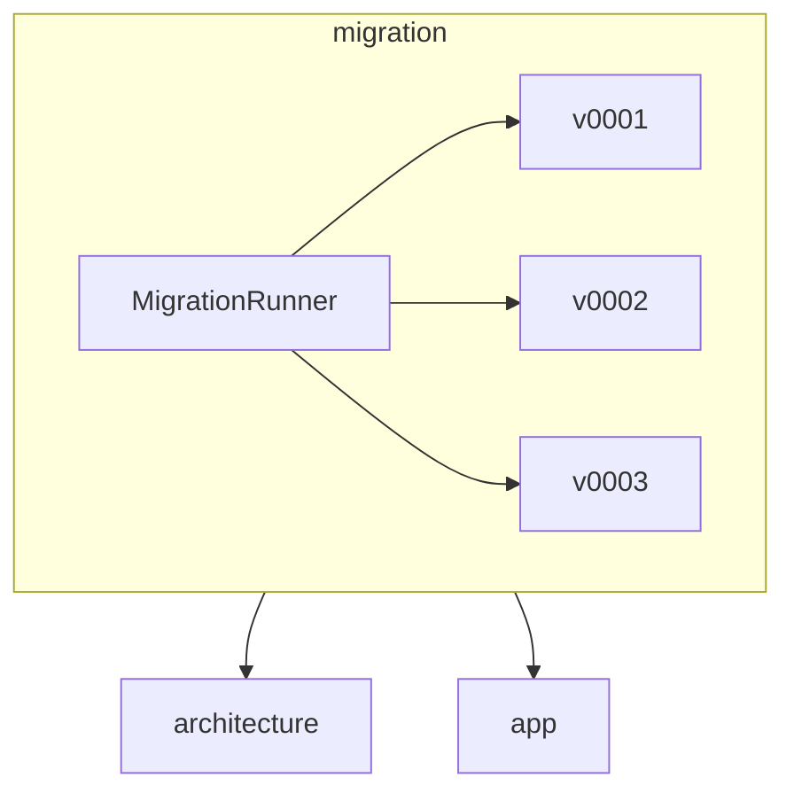

# AGENTS.md: Модуль Migration (Backend)

Инфраструктурный модуль для миграций Neo4j. Создает индексы, ограничения и начальные данные при запуске приложения.

---

## Ответственность

- Создание индексов Neo4j для оптимизации запросов
- Создание ограничений (constraints) для целостности данных
- Начальное заполнение данными при необходимости
- Версионирование миграций

---

## Структура модуля

```
src/main/java/twin/spring/migration/
├── MigrationAutoConfiguration.java      # Автоконфигурация миграций
├── MigrationRunner.java                 # Запуск миграций
├── MigrationVersion.java                # Версия миграции
├── v0001/                               # Версия 1: базовые сущности
│   ├── ClassNodeMigration.java          # Миграция для ClassNode узлов
│   ├── MethodNodeMigration.java         # Миграция для MethodNode узлов
│   └── EndpointNodeMigration.java       # Миграция для EndpointNode узлов
├── v0002/                               # Версия 2: связи
│   ├── DependsOnMigration.java          # Миграция для DEPENDS_ON
│   ├── CallsMigration.java              # Миграция для CALLS
│   └── ExposesEndpointMigration.java    # Миграция для EXPOSES_ENDPOINT
└── v0003/                               # Версия 3: индексы
    └── IndexMigration.java              # Дополнительные индексы
```

---

## Принципы миграций

### Версионирование

- Каждая миграция имеет версию в формате `vNNNN`
- Миграции выполняются последовательно по номеру версии
- Каждая миграция идемпотентна (можно выполнять многократно)

### Порядок выполнения


---

## Миграции

### MigrationRunner

```java
/**
 * Запускает миграции при старте приложения.
 */
@Component
@Slf4j
@RequiredArgsConstructor
public class MigrationRunner implements CommandLineRunner {
    
    private final ReactiveNeo4jClient neo4jClient;
    private final List<Migration> migrations;
    
    @Override
    public void run(String... args) {
        log.info("Starting Neo4j migrations...");
        
        Flux.fromIterable(migrations)
            .concatMap(this::executeMigration)
            .then()
            .subscribe(
                v -> {},
                error -> log.error("Migration failed", error),
                () -> log.info("All migrations completed successfully")
            );
    }
    
    private Mono<Void> executeMigration(Migration migration) {
        log.info("Executing migration: {}", migration.getVersion());
        
        return migration.execute(neo4jClient)
            .then(Mono.fromRunnable(() -> 
                log.info("Migration {} completed", migration.getVersion())
            ));
    }
}
```

### Интерфейс Migration

```java
/**
 * Интерфейс миграции Neo4j.
 */
public interface Migration {
    
    /**
     * Возвращает версию миграции.
     */
    String getVersion();
    
    /**
     * Возвращает описание миграции.
     */
    String getDescription();
    
    /**
     * Выполняет миграцию.
     */
    Mono<Void> execute(ReactiveNeo4jClient client);
}
```

---

## v0001: Базовые узлы

### ClassNodeMigration

```java
/**
 * Миграция для создания ограничений для узлов ClassNode.
 */
@Component
@Slf4j
public class ClassNodeMigration implements Migration {
    
    @Override
    public String getVersion() {
        return "v0001";
    }
    
    @Override
    public String getDescription() {
        return "Create constraints and indexes for ClassNode nodes";
    }
    
    @Override
    public Mono<Void> execute(ReactiveNeo4jClient client) {
        log.info("Creating ClassNode constraints...");
        
        return Flux.concat(
            // Уникальность по fullName
            createConstraint(client,
                "CREATE CONSTRAINT class_fullname_unique IF NOT EXISTS " +
                "FOR (c:ClassNode) REQUIRE c.fullName IS UNIQUE"),
            
            // Индекс по name
            createIndex(client,
                "CREATE INDEX class_name_index IF NOT EXISTS " +
                "FOR (c:ClassNode) ON (c.name)"),
            
            // Индекс по packageName
            createIndex(client,
                "CREATE INDEX class_package_index IF NOT EXISTS " +
                "FOR (c:ClassNode) ON (c.packageName)")
        ).then();
    }
    
    private Mono<Void> createConstraint(ReactiveNeo4jClient client, String cypher) {
        return client.query(cypher).run().then();
    }
    
    private Mono<Void> createIndex(ReactiveNeo4jClient client, String cypher) {
        return client.query(cypher).run().then();
    }
}
```

### MethodNodeMigration

```java
/**
 * Миграция для создания ограничений для узлов MethodNode.
 */
@Component
public class MethodNodeMigration implements Migration {
    
    @Override
    public String getVersion() {
        return "v0001";
    }
    
    @Override
    public String getDescription() {
        return "Create constraints and indexes for MethodNode nodes";
    }
    
    @Override
    public Mono<Void> execute(ReactiveNeo4jClient client) {
        return Flux.concat(
            // Индекс по name
            createIndex(client,
                "CREATE INDEX method_name_index IF NOT EXISTS " +
                "FOR (m:MethodNode) ON (m.name)"),
            
            // Индекс по signature
            createIndex(client,
                "CREATE INDEX method_signature_index IF NOT EXISTS " +
                "FOR (m:MethodNode) ON (m.signature)")
        ).then();
    }
}
```

### EndpointNodeMigration

```java
/**
 * Миграция для создания ограничений для узлов EndpointNode.
 */
@Component
public class EndpointNodeMigration implements Migration {
    
    @Override
    public String getVersion() {
        return "v0001";
    }
    
    @Override
    public String getDescription() {
        return "Create constraints and indexes for EndpointNode nodes";
    }
    
    @Override
    public Mono<Void> execute(ReactiveNeo4jClient client) {
        return Flux.concat(
            // Уникальность по path + httpMethod
            createConstraint(client,
                "CREATE CONSTRAINT endpoint_unique IF NOT EXISTS " +
                "FOR (e:EndpointNode) REQUIRE (e.path, e.httpMethod) IS UNIQUE"),
            
            // Индекс по httpMethod
            createIndex(client,
                "CREATE INDEX endpoint_method_index IF NOT EXISTS " +
                "FOR (e:EndpointNode) ON (e.httpMethod)")
        ).then();
    }
}
```

---

## v0002: Связи

### DependsOnMigration

```java
/**
 * Миграция для создания индексов для связей DEPENDS_ON.
 */
@Component
public class DependsOnMigration implements Migration {
    
    @Override
    public String getVersion() {
        return "v0002";
    }
    
    @Override
    public String getDescription() {
        return "Create indexes for DEPENDS_ON relationships";
    }
    
    @Override
    public Mono<Void> execute(ReactiveNeo4jClient client) {
        return Flux.concat(
            // Индекс для быстрого поиска зависимостей
            createIndex(client,
                "CREATE INDEX depends_on_source_index IF NOT EXISTS " +
                "FOR ()-[r:DEPENDS_ON]-() ON r.fieldName")
        ).then();
    }
}
```

---

## v0003: Дополнительные индексы

### IndexMigration

```java
/**
 * Миграция для создания дополнительных индексов.
 */
@Component
public class IndexMigration implements Migration {
    
    @Override
    public String getVersion() {
        return "v0003";
    }
    
    @Override
    public String getDescription() {
        return "Create additional indexes for performance optimization";
    }
    
    @Override
    public Mono<Void> execute(ReactiveNeo4jClient client) {
        return Flux.concat(
            // Полнотекстовый индекс для поиска классов
            createFulltextIndex(client,
                "CREATE FULLTEXT INDEX class_fulltext_index IF NOT EXISTS " +
                "FOR (c:ClassNode) ON EACH [c.name, c.fullName, c.packageName]"),
            
            // Полнотекстовый индекс для поиска методов
            createFulltextIndex(client,
                "CREATE FULLTEXT INDEX method_fulltext_index IF NOT EXISTS " +
                "FOR (m:MethodNode) ON EACH [m.name, m.signature]")
        ).then();
    }
}
```

---

## Автоконфигурация

### MigrationAutoConfiguration

```java
/**
 * Автоконфигурация миграций Neo4j.
 */
@Configuration
@ConditionalOnProperty(name = "spring.twin.migration.enabled", havingValue = "true", matchIfMissing = true)
public class MigrationAutoConfiguration {
    
    @Bean
    public MigrationRunner migrationRunner(ReactiveNeo4jClient neo4jClient,
                                            List<Migration> migrations) {
        return new MigrationRunner(neo4jClient, migrations);
    }
    
    @Bean
    @Order(1)
    public ClassNodeMigration classNodeMigration() {
        return new ClassNodeMigration();
    }
    
    @Bean
    @Order(2)
    public MethodNodeMigration methodNodeMigration() {
        return new MethodNodeMigration();
    }
    
    @Bean
    @Order(3)
    public EndpointNodeMigration endpointNodeMigration() {
        return new EndpointNodeMigration();
    }
    
    @Bean
    @Order(4)
    public DependsOnMigration dependsOnMigration() {
        return new DependsOnMigration();
    }
    
    @Bean
    @Order(5)
    public IndexMigration indexMigration() {
        return new IndexMigration();
    }
}
```

---

## Конфигурация

### application.yaml

```yaml
spring:
  twin:
    migration:
      enabled: true  # Автозапуск миграций при старте
```

---

## Зависимости



### Зависит от

- **architecture** - использует модели для определения структуры данных

---

## Тестирование

### Интеграционные тесты

```java
/**
 * Интеграционный тест миграций Neo4j.
 * Использует Neo4j embedded (in-memory) для тестирования.
 */
@SpringBootTest
class MigrationIntegrationTest {
    
    @Autowired
    private ReactiveNeo4jClient neo4jClient;
    
    @Test
    void migrations_shouldCreateConstraints() {
        // Проверка создания constraints
        String result = neo4jClient.query(
            "SHOW CONSTRAINTS YIELD name WHERE name = 'class_fullname_unique' RETURN name"
        ).fetch().one().block();
        
        assertThat(result).isNotNull();
    }
}