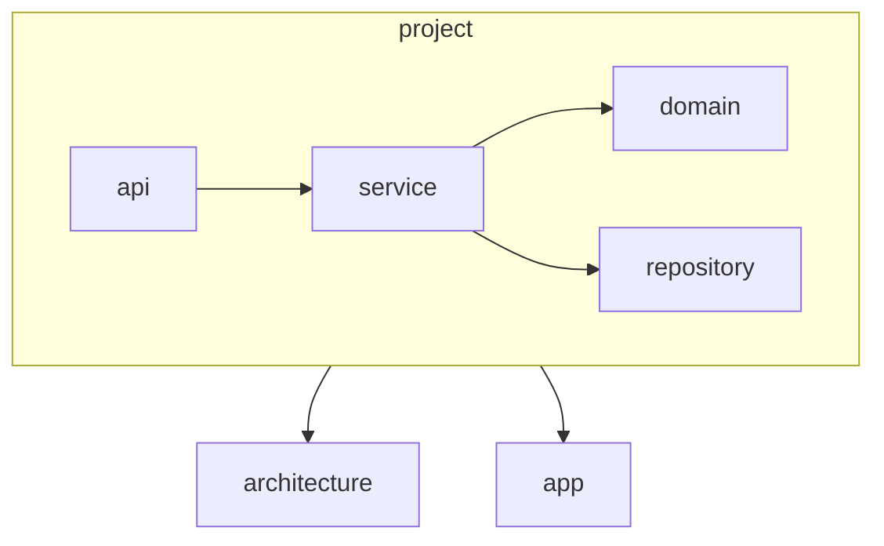

# AGENTS.md: Модуль Project (Backend)

Модуль управления анализируемым проектом. Отвечает за конфигурацию include/exclude пакетов и метаданные проекта.

---

## Ответственность

- Хранение метаданных анализируемого проекта
- Управление конфигурацией include/exclude пакетов
- CRUD операции над проектами
- Валидация путей и конфигурации

---

## Структура модуля

```
src/main/java/twin/spring/project/
├── api/
│   ├── ProjectController.java          # REST контроллер
│   ├── CreateProjectRequest.java       # DTO запроса на создание
│   ├── UpdateProjectRequest.java       # DTO запроса на обновление
│   └── ProjectResponse.java            # DTO ответа
├── domain/
│   └── Project.java                    # Доменная модель
├── service/
│   ├── ProjectService.java             # Интерфейс сервиса
│   ├── ProjectDomainService.java       # Бизнес-логика
│   ├── ProjectAggregateService.java    # Агрегация данных
│   └── ProjectMapper.java              # Преобразование DTO
└── repository/
    └── ProjectRepository.java          # Репозиторий Neo4j
```

---

## Доменная модель

### Project

```java
/**
 * Анализируемый Spring Boot проект.
 * 
 * <p>Содержит метаданные проекта и конфигурацию области анализа.</p>
 */
@Node("Project")
@Getter
@Setter
@Builder
@NoArgsConstructor
@AllArgsConstructor
public class Project {
    
    @Id
    @GeneratedValue
    private String id;
    
    /** Название проекта */
    private String name;
    
    /** Путь к корневой директории проекта */
    private String path;
    
    /** Список пакетов для индексации */
    private List<String> includePackages;
    
    /** Список пакетов для исключения из индексации */
    private List<String> excludePackages;
    
    /** Дата создания записи */
    private LocalDateTime createdAt;
    
    /** Дата последнего обновления */
    private LocalDateTime updatedAt;
}
```

---

## API

### REST Endpoints

| Метод | Путь | Описание |
|-------|------|----------|
| GET | `/api/v1/projects` | Получить все проекты |
| GET | `/api/v1/projects/{id}` | Получить проект по ID |
| POST | `/api/v1/projects` | Создать новый проект |
| PUT | `/api/v1/projects/{id}` | Обновить проект |
| DELETE | `/api/v1/projects/{id}` | Удалить проект |
| POST | `/api/v1/projects/{id}/analyze` | Запустить анализ проекта |

### DTO

#### CreateProjectRequest

```java
@Builder
@NoArgsConstructor
@AllArgsConstructor
@Getter
@Setter
public class CreateProjectRequest {
    
    @NotBlank(message = "Name is required")
    private String name;
    
    @NotBlank(message = "Path is required")
    private String path;
    
    @NotEmpty(message = "At least one include package is required")
    private List<String> includePackages;
    
    private List<String> excludePackages;
}
```

#### ProjectResponse

```java
@Builder
@NoArgsConstructor
@AllArgsConstructor
@Getter
@Setter
public class ProjectResponse {
    
    private String id;
    private String name;
    private String path;
    private List<String> includePackages;
    private List<String> excludePackages;
    private LocalDateTime createdAt;
    private LocalDateTime updatedAt;
}
```

---

## Бизнес-логика

### ProjectDomainService

```java
/**
 * Сервис бизнес-логики для управления проектами.
 */
@Service
@Slf4j
@RequiredArgsConstructor
public class ProjectDomainService {
    
    private final ProjectRepository projectRepository;
    
    /**
     * Создает новый проект с валидацией пути.
     */
    public Mono<Project> create(Project project) {
        log.info("Creating project: {}", project.getName());
        
        return validatePath(project.getPath())
            .then(Mono.defer(() -> {
                project.setCreatedAt(LocalDateTime.now());
                project.setUpdatedAt(LocalDateTime.now());
                return projectRepository.save(project);
            }));
    }
    
    /**
     * Обновляет существующий проект.
     */
    public Mono<Project> update(String id, Project updates) {
        return projectRepository.findById(id)
            .switchIfEmpty(Mono.error(new ProjectNotFoundException(id)))
            .map(existing -> {
                existing.setName(updates.getName());
                existing.setPath(updates.getPath());
                existing.setIncludePackages(updates.getIncludePackages());
                existing.setExcludePackages(updates.getExcludePackages());
                existing.setUpdatedAt(LocalDateTime.now());
                return existing;
            })
            .flatMap(projectRepository::save);
    }
    
    /**
     * Валидирует существование пути к проекту.
     */
    private Mono<Void> validatePath(String path) {
        // Проверка существования директории
        return Mono.fromRunnable(() -> {
            if (!Paths.get(path).toFile().exists()) {
                throw new IllegalArgumentException("Project path does not exist: " + path);
            }
        });
    }
}
```

---

## Зависимости



### Зависит от

- **architecture** - использует модели для связей с классами проекта

### Используется

- **analysis** - для получения проекта для анализа
- **app** - для агрегации в корневом модуле

---

## Тестирование

### Unit тесты

- `ProjectDomainServiceTest` - тестирование бизнес-логики
- `ProjectMapperTest` - тестирование маппинга DTO

### Интеграционные тесты

- `ProjectRepositoryIntegrationTest` - тестирование репозитория
- `ProjectControllerIntegrationTest` - тестирование REST API

### Тестовые профили

```java
public class ProjectTestProfile {
    
    public static Project createDefaultProject() {
        return Project.builder()
            .id("test-project-id")
            .name("Test Project")
            .path("/path/to/project")
            .includePackages(List.of("com.example"))
            .excludePackages(List.of("com.example.config"))
            .build();
    }
    
    public static CreateProjectRequest createDefaultRequest() {
        return CreateProjectRequest.builder()
            .name("New Project")
            .path("/path/to/new/project")
            .includePackages(List.of("com.newproject"))
            .excludePackages(List.of())
            .build();
    }
}
```

---

## Конфигурация

### application.yaml

```yaml
spring:
  twin:
    default-include-packages:
      - com.example
    default-exclude-packages:
      - com.example.config