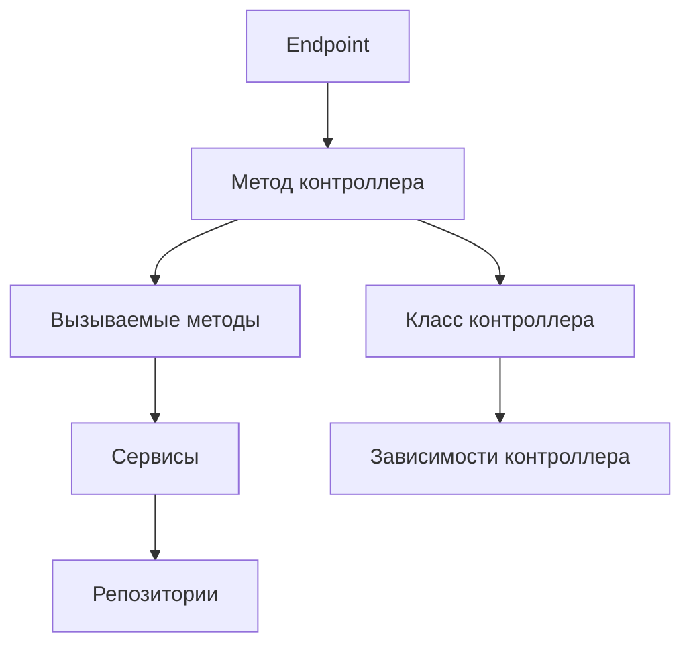
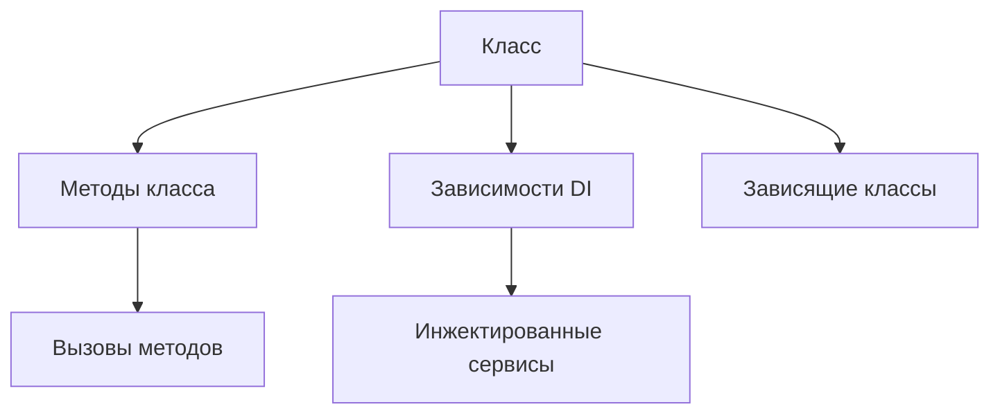
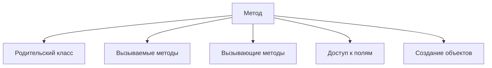
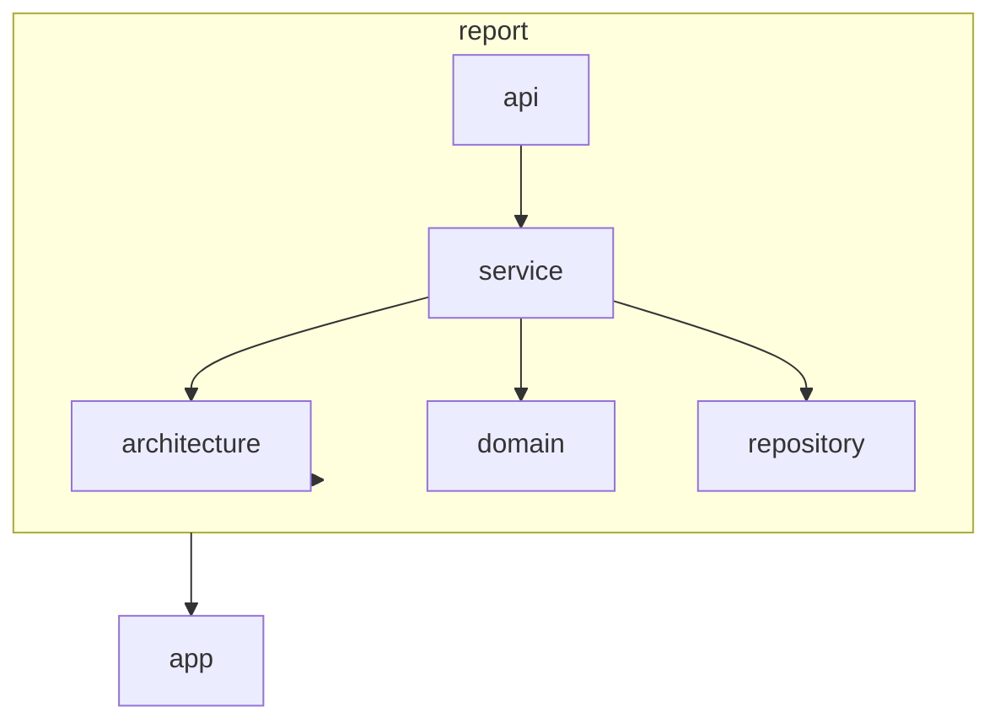

# AGENTS.md: Модуль Report (Backend)

Модуль генерации explain-отчетов. Формирует структурированные отчеты по endpoint, классу и методу для использования в веб-интерфейсе и экспорта в LLM.

---

## Ответственность

- Генерация explain-отчетов по endpoint
- Генерация explain-отчетов по классу
- Генерация explain-отчетов по методу
- Экспорт контекста в JSON формате для LLM
- Формирование архитектурных срезов

---

## Структура модуля

```
src/main/java/twin/spring/report/
├── api/
│   ├── ReportController.java           # REST контроллер
│   ├── ExplainEndpointRequest.java     # Запрос отчета по endpoint
│   ├── ExplainClassRequest.java        # Запрос отчета по классу
│   ├── ExplainMethodRequest.java       # Запрос отчета по методу
│   ├── ExplainEndpointResponse.java    # Ответ с отчетом по endpoint
│   ├── ExplainClassResponse.java       # Ответ с отчетом по классу
│   ├── ExplainMethodResponse.java      # Ответ с отчетом по методу
│   └── LlmContextExport.java           # Экспорт контекста для LLM
├── domain/
│   ├── ExplainReport.java              # Базовая модель отчета
│   ├── EndpointReport.java             # Отчет по endpoint
│   ├── ClassReport.java                # Отчет по классу
│   ├── MethodReport.java               # Отчет по методу
│   └── ReportSection.java              # Секция отчета
├── service/
│   ├── ExplainService.java             # Координация генерации отчетов
│   ├── EndpointExplainService.java     # Генерация отчетов по endpoint
│   ├── ClassExplainService.java        # Генерация отчетов по классу
│   ├── MethodExplainService.java       # Генерация отчетов по методу
│   ├── LlmContextService.java          # Экспорт контекста для LLM
│   └── mapper/
│       └── ReportMapper.java           # Маппер отчетов
└── repository/
    └── ReportRepository.java           # Кастомные запросы к графу
```

---

## Типы отчетов

### Explain Endpoint



### Explain Class



### Explain Method



---

## Доменные модели

### ExplainReport (базовый)

```java
/**
 * Базовая модель explain-отчета.
 */
@Getter
@Setter
@Builder
@NoArgsConstructor
@AllArgsConstructor
public abstract class ExplainReport {
    
    /** ID элемента */
    protected String elementId;
    
    /** Тип отчета */
    protected String reportType;
    
    /** Краткое описание роли элемента */
    protected String summary;
    
    /** Секции отчета */
    protected List<ReportSection> sections;
    
    /** Время генерации */
    protected LocalDateTime generatedAt;
}
```

### EndpointReport

```java
/**
 * Отчет по REST endpoint.
 */
@Getter
@Setter
@Builder
@NoArgsConstructor
@AllArgsConstructor
public class EndpointReport extends ExplainReport {
    
    /** Информация об endpoint */
    private EndpointInfo endpoint;
    
    /** Метод, экспонирующий endpoint */
    private MethodInfo exposingMethod;
    
    /** Класс контроллера */
    private ClassInfo controllerClass;
    
    /** Цепочка вызовов */
    private List<CallChainItem> callChain;
    
    /** Зависимости контроллера */
    private List<DependencyInfo> dependencies;
    
    /** Связанные конфигурации */
    private List<ConfigurationInfo> configurations;
    
    @Data
    @Builder
    @NoArgsConstructor
    @AllArgsConstructor
    public static class CallChainItem {
        private String methodName;
        private String className;
        private String serviceName;
        private Integer depth;
    }
}
```

### ClassReport

```java
/**
 * Отчет по Java классу.
 */
@Getter
@Setter
@Builder
@NoArgsConstructor
@AllArgsConstructor
public class ClassReport extends ExplainReport {
    
    /** Информация о классе */
    private ClassInfo classInfo;
    
    /** Методы класса */
    private List<MethodInfo> methods;
    
    /** DI зависимости */
    private List<DependencyInfo> dependencies;
    
    /** Классы, зависящие от данного */
    private List<DependencyInfo> dependents;
    
    /** Экспонируемые endpoints */
    private List<EndpointInfo> exposedEndpoints;
    
    /** Аннотации */
    private List<String> annotations;
}
```

### MethodReport

```java
/**
 * Отчет по методу.
 */
@Getter
@Setter
@Builder
@NoArgsConstructor
@AllArgsConstructor
public class MethodReport extends ExplainReport {
    
    /** Информация о методе */
    private MethodInfo methodInfo;
    
    /** Родительский класс */
    private ClassInfo parentClass;
    
    /** Вызываемые методы */
    private List<MethodCallInfo> calledMethods;
    
    /** Вызывающие методы */
    private List<MethodCallInfo> callingMethods;
    
    /** Доступ к полям */
    private List<FieldAccessInfo> fieldAccesses;
    
    /** Создаваемые объекты */
    private List<InstantiationInfo> instantiations;
}
```

---

## Сервисы генерации отчетов

### EndpointExplainService

```java
/**
 * Сервис генерации explain-отчетов по endpoint.
 */
@Service
@Slf4j
@RequiredArgsConstructor
public class EndpointExplainService {
    
    private final EndpointRepository endpointRepository;
    private final ClassRepository classRepository;
    private final MethodRepository methodRepository;
    private final ReportRepository reportRepository;
    
    /**
     * Генерирует отчет по endpoint.
     */
    public Mono<EndpointReport> generateReport(String endpointId) {
        log.info("Generating endpoint report for: {}", endpointId);
        
        return endpointRepository.findById(endpointId)
            .switchIfEmpty(Mono.error(new EndpointNotFoundException(endpointId)))
            .flatMap(endpoint -> {
                EndpointReport report = EndpointReport.builder()
                    .elementId(endpointId)
                    .reportType("ENDPOINT")
                    .endpoint(mapEndpoint(endpoint))
                    .generatedAt(LocalDateTime.now())
                    .build();
                
                return findExposingMethod(endpoint)
                    .flatMap(method -> {
                        report.setExposingMethod(mapMethod(method));
                        report.setControllerClass(mapClass(method.getParentClass()));
                        return buildCallChain(method);
                    })
                    .map(callChain -> {
                        report.setCallChain(callChain);
                        return report;
                    });
            });
    }
    
    /**
     * Строит цепочку вызовов метода.
     */
    private Mono<List<CallChainItem>> buildCallChain(Method method) {
        return reportRepository.findCallChain(method.getId())
            .collectList()
            .map(calls -> calls.stream()
                .map(this::mapCallChainItem)
                .collect(Collectors.toList()));
    }
}
```

### ClassExplainService

```java
/**
 * Сервис генерации explain-отчетов по классу.
 */
@Service
@Slf4j
@RequiredArgsConstructor
public class ClassExplainService {
    
    private final ClassRepository classRepository;
    private final MethodRepository methodRepository;
    private final ReportRepository reportRepository;
    
    /**
     * Генерирует отчет по классу.
     */
    public Mono<ClassReport> generateReport(String classId) {
        log.info("Generating class report for: {}", classId);
        
        return classRepository.findById(classId)
            .switchIfEmpty(Mono.error(new ClassNotFoundException(classId)))
            .flatMap(clazz -> {
                ClassReport report = ClassReport.builder()
                    .elementId(classId)
                    .reportType("CLASS")
                    .classInfo(mapClass(clazz))
                    .annotations(clazz.getLabels())
                    .generatedAt(LocalDateTime.now())
                    .build();
                
                return Mono.zip(
                    findMethods(clazz),
                    findDependencies(clazz),
                    findDependents(clazz),
                    findExposedEndpoints(clazz)
                ).map(tuple -> {
                    report.setMethods(tuple.getT1());
                    report.setDependencies(tuple.getT2());
                    report.setDependents(tuple.getT3());
                    report.setExposedEndpoints(tuple.getT4());
                    return report;
                });
            });
    }
}
```

### MethodExplainService

```java
/**
 * Сервис генерации explain-отчетов по методу.
 */
@Service
@Slf4j
@RequiredArgsConstructor
public class MethodExplainService {
    
    private final MethodRepository methodRepository;
    private final ReportRepository reportRepository;
    
    /**
     * Генерирует отчет по методу.
     */
    public Mono<MethodReport> generateReport(String methodId) {
        log.info("Generating method report for: {}", methodId);
        
        return methodRepository.findById(methodId)
            .switchIfEmpty(Mono.error(new MethodNotFoundException(methodId)))
            .flatMap(method -> {
                MethodReport report = MethodReport.builder()
                    .elementId(methodId)
                    .reportType("METHOD")
                    .methodInfo(mapMethod(method))
                    .parentClass(mapClass(method.getParentClass()))
                    .generatedAt(LocalDateTime.now())
                    .build();
                
                return Mono.zip(
                    findCalledMethods(method),
                    findCallingMethods(method),
                    findFieldAccesses(method),
                    findInstantiations(method)
                ).map(tuple -> {
                    report.setCalledMethods(tuple.getT1());
                    report.setCallingMethods(tuple.getT2());
                    report.setFieldAccesses(tuple.getT3());
                    report.setInstantiations(tuple.getT4());
                    return report;
                });
            });
    }
}
```

---

## Экспорт для LLM

### LlmContextService

```java
/**
 * Сервис экспорта контекста для LLM.
 */
@Service
@Slf4j
@RequiredArgsConstructor
public class LlmContextService {
    
    private final EndpointExplainService endpointExplainService;
    private final ClassExplainService classExplainService;
    private final MethodExplainService methodExplainService;
    
    /**
     * Экспортирует контекст endpoint в JSON формате.
     */
    public Mono<LlmContextExport> exportEndpointContext(String endpointId) {
        return endpointExplainService.generateReport(endpointId)
            .map(this::convertToLlmContext);
    }
    
    /**
     * Экспортирует контекст класса в JSON формате.
     */
    public Mono<LlmContextExport> exportClassContext(String classId) {
        return classExplainService.generateReport(classId)
            .map(this::convertToLlmContext);
    }
    
    /**
     * Экспортирует контекст метода в JSON формате.
     */
    public Mono<LlmContextExport> exportMethodContext(String methodId) {
        return methodExplainService.generateReport(methodId)
            .map(this::convertToLlmContext);
    }
    
    /**
     * Преобразует отчет в формат для LLM.
     */
    private LlmContextExport convertToLlmContext(ExplainReport report) {
        return LlmContextExport.builder()
            .contextType(report.getReportType())
            .elementId(report.getElementId())
            .summary(report.getSummary())
            .structuredData(report)
            .promptTemplate(generatePromptTemplate(report))
            .build();
    }
    
    /**
     * Генерирует шаблон промпта для LLM.
     */
    private String generatePromptTemplate(ExplainReport report) {
        return String.format("""
            Analyze the following %s in a Spring Boot application:
            
            %s
            
            Provide:
            1. Architectural role and responsibility
            2. Potential issues or improvements
            3. Related components and their relationships
            """,
            report.getReportType().toLowerCase(),
            formatReportForPrompt(report)
        );
    }
}
```

---

## API

### REST Endpoints

| Метод | Путь | Описание |
|-------|------|----------|
| GET | `/api/v1/explain/endpoint/{id}` | Explain отчет по endpoint |
| GET | `/api/v1/explain/class/{id}` | Explain отчет по классу |
| GET | `/api/v1/explain/method/{id}` | Explain отчет по методу |
| GET | `/api/v1/export/endpoint/{id}/llm` | Экспорт контекста endpoint для LLM |
| GET | `/api/v1/export/class/{id}/llm` | Экспорт контекста класса для LLM |
| GET | `/api/v1/export/method/{id}/llm` | Экспорт контекста метода для LLM |

### DTO

#### LlmContextExport

```java
@Builder
@NoArgsConstructor
@AllArgsConstructor
@Getter
@Setter
public class LlmContextExport {
    
    private String contextType;
    private String elementId;
    private String summary;
    private Object structuredData;
    private String promptTemplate;
}
```

---

## Кастомные запросы к графу

### ReportRepository

```java
/**
 * Репозиторий для сложных запросов к графу.
 */
@Repository
public class ReportRepository {
    
    private final ReactiveNeo4jClient neo4jClient;
    
    /**
     * Находит цепочку вызовов метода.
     */
    @Query("""
        MATCH path = (m:Method {id: $methodId})-[:CALLS*1..5]->(called:Method)
        RETURN called, length(path) as depth
        ORDER BY depth
        """)
    public Flux<CallChainRecord> findCallChain(String methodId);
    
    /**
     * Находит все зависимости класса.
     */
    @Query("""
        MATCH (c:Class {id: $classId})-[:DEPENDS_ON]->(dep:Class)
        RETURN dep
        """)
    public Flux<Class> findDependencies(String classId);
    
    /**
     * Находит все классы, зависящие от данного.
     */
    @Query("""
        MATCH (c:Class)-[:DEPENDS_ON]->(target:Class {id: $classId})
        RETURN c
        """)
    public Flux<Class> findDependents(String classId);
}
```

---

## Зависимости



### Зависит от

- **architecture** - получение данных из графа

### Используется

- **mcp** - для предоставления отчетов через MCP API

---

## Тестирование

### Тестовые профили

```java
public class ReportTestProfile {
    
    public static EndpointReport createDefaultEndpointReport() {
        return EndpointReport.builder()
            .elementId("test-endpoint-id")
            .reportType("ENDPOINT")
            .summary("Test endpoint for user operations")
            .endpoint(EndpointInfo.builder()
                .path("/api/users")
                .httpMethod("GET")
                .build())
            .build();
    }
    
    public static ClassReport createDefaultClassReport() {
        return ClassReport.builder()
            .elementId("test-class-id")
            .reportType("CLASS")
            .summary("Service class for user management")
            .classInfo(ClassInfo.builder()
                .name("UserService")
                .fullName("com.example.UserService")
                .build())
            .build();
    }
}