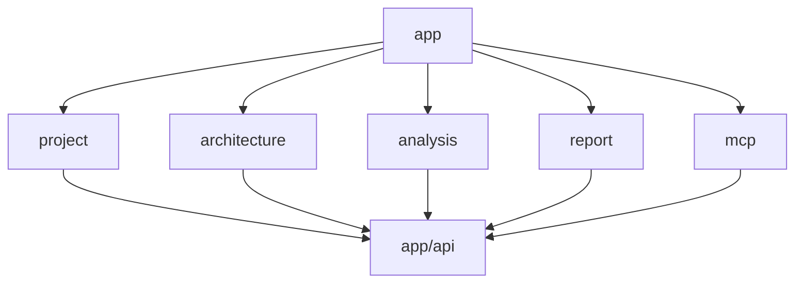

# AGENTS.md: Правила разработки Frontend (Vue.js/TypeScript)

Данный документ содержит специфические правила и стандарты для разработки frontend-части проекта SpringTwin.

---

## Технологический стек

- **Язык**: TypeScript
- **Фреймворк**: Vue.js 3.x
- **Состояние**: Vuex
- **Сборка**: Gradle (Kotlin DSL)
- **Тестирование**: Vitest (unit), Cypress (e2e)

---

## Структура модуля

Каждый модуль frontend организован по слоям:

```
src/main/vue/<module>/
├── asset/                  # Статические ресурсы
│   ├── css/
│   ├── fonts/
│   └── images/
├── view/                   # Vue компоненты и шаблоны
│   ├── <Entity>View.vue
│   └── <Entity>Form.vue
├── store/                  # Vuex store модуль
│   ├── index.ts
│   ├── state.ts
│   ├── mutations.ts
│   ├── actions.ts
│   └── getters.ts
├── router/                 # Маршрутизация
│   └── index.ts
├── service/                # Бизнес-логика UI
│   └── <Entity>Service.ts
└── api/                    # API клиенты
    └── <Entity>Api.ts
```

### Описание слоев

| Слой | Папка | Ответственность |
|------|-------|-----------------|
| **asset** | .asset | Статические файлы: CSS, шрифты, изображения |
| **view** | .view | Vue компоненты, шаблоны отображения |
| **store** | .store | Vuex модуль состояния |
| **router** | .router | Конфигурация маршрутов модуля |
| **service** | .service | Бизнес-логика UI, трансформация данных |
| **api** | .api | HTTP клиенты для backend API |

---

## Стандарты кода

### Принципы SOLID

- **S** - Single Responsibility: каждый компонент имеет одну ответственность
- **O** - Open/Closed: расширяемость через композицию
- **L** - Liskov Substitution: корректное использование наследования
- **I** - Interface Segregation: небольшие специализированные интерфейсы
- **D** - Dependency Inversion: зависимость от абстракций

### Именование

#### Компоненты Vue

- PascalCase для имен файлов и компонентов
- Семантические имена, описывающие роль

```
ProjectListView.vue      # Список проектов
ProjectDetailView.vue    # Детали проекта
ProjectConfigForm.vue    # Форма конфигурации
```

#### Переменные и методы

- camelCase для переменных и методов
- Семантические имена с контекстом

```typescript
// Хорошо
const projectList = ref<Project[]>([]);
const isLoadingProjects = ref(false);
const fetchProjectById = async (id: string) => { ... };

// Плохо
const list = ref([]);
const loading = ref(false);
const fetch = async (id: string) => { ... };
```

---

## Vuex Store

### Структура модуля

```typescript
// store/index.ts
import { Module } from 'vuex';
import { ProjectState } from './state';
import mutations from './mutations';
import actions from './actions';
import getters from './getters';

const projectModule: Module<ProjectState, RootState> = {
  namespaced: true,
  state: (): ProjectState => ({
    projects: [],
    currentProject: null,
    isLoading: false,
    error: null,
  }),
  mutations,
  actions,
  getters,
};

export default projectModule;
```

### State

```typescript
// store/state.ts
export interface ProjectState {
  projects: Project[];
  currentProject: Project | null;
  isLoading: boolean;
  error: string | null;
}

export const state: ProjectState = {
  projects: [],
  currentProject: null,
  isLoading: false,
  error: null,
};
```

### Actions (асинхронные)

```typescript
// store/actions.ts
import { ActionTree } from 'vuex';
import { ProjectState } from './state';
import { RootState } from '@/app/store';
import projectApi from '../api/projectApi';

const actions: ActionTree<ProjectState, RootState> = {
  async fetchProjects({ commit }) {
    commit('setLoading', true);
    try {
      const projects = await projectApi.getAll();
      commit('setProjects', projects);
    } catch (error) {
      commit('setError', error.message);
    } finally {
      commit('setLoading', false);
    }
  },
  
  async fetchProjectById({ commit }, id: string) {
    commit('setLoading', true);
    try {
      const project = await projectApi.getById(id);
      commit('setCurrentProject', project);
    } catch (error) {
      commit('setError', error.message);
    } finally {
      commit('setLoading', false);
    }
  },
};

export default actions;
```

### Mutations (синхронные)

```typescript
// store/mutations.ts
import { MutationTree } from 'vuex';
import { ProjectState } from './state';
import { Project } from '../domain/Project';

const mutations: MutationTree<ProjectState> = {
  setProjects(state, projects: Project[]) {
    state.projects = projects;
  },
  
  setCurrentProject(state, project: Project) {
    state.currentProject = project;
  },
  
  setLoading(state, isLoading: boolean) {
    state.isLoading = isLoading;
  },
  
  setError(state, error: string | null) {
    state.error = error;
  },
};

export default mutations;
```

### Getters

```typescript
// store/getters.ts
import { GetterTree } from 'vuex';
import { ProjectState } from './state';
import { RootState } from '@/app/store';

const getters: GetterTree<ProjectState, RootState> = {
  projectCount: (state) => state.projects.length,
  
  projectById: (state) => (id: string) => {
    return state.projects.find(p => p.id === id);
  },
  
  isLoading: (state) => state.isLoading,
  
  hasError: (state) => state.error !== null,
};

export default getters;
```

---

## API клиенты

### Структура

```typescript
// api/projectApi.ts
import { apiClient } from '@/app/api/client';
import { Project, CreateProjectRequest } from '../domain/Project';

export default {
  async getAll(): Promise<Project[]> {
    const response = await apiClient.get<Project[]>('/api/v1/projects');
    return response.data;
  },
  
  async getById(id: string): Promise<Project> {
    const response = await apiClient.get<Project>(`/api/v1/projects/${id}`);
    return response.data;
  },
  
  async create(request: CreateProjectRequest): Promise<Project> {
    const response = await apiClient.post<Project>('/api/v1/projects', request);
    return response.data;
  },
  
  async update(id: string, request: UpdateProjectRequest): Promise<Project> {
    const response = await apiClient.put<Project>(`/api/v1/projects/${id}`, request);
    return response.data;
  },
  
  async delete(id: string): Promise<void> {
    await apiClient.delete(`/api/v1/projects/${id}`);
  },
};
```

---

## Vue компоненты

### Composition API

Используйте Composition API с `<script setup>`:

```vue
<script setup lang="ts">
import { ref, onMounted, computed } from 'vue';
import { useStore } from 'vuex';
import { useRouter } from 'vue-router';

// Props
const props = defineProps<{
  projectId: string;
}>();

// Emits
const emit = defineEmits<{
  (e: 'projectLoaded', project: Project): void;
  (e: 'error', message: string): void;
}>();

// Store
const store = useStore();
const router = useRouter();

// Reactive state
const isLoading = computed(() => store.state.project.isLoading);
const project = computed(() => store.state.project.currentProject);

// Methods
const loadProject = async () => {
  await store.dispatch('project/fetchProjectById', props.projectId);
  if (project.value) {
    emit('projectLoaded', project.value);
  }
};

// Lifecycle
onMounted(() => {
  loadProject();
});
</script>

<template>
  <div class="project-view" role="main">
    <div v-if="isLoading" class="loading-indicator" role="status">
      Loading...
    </div>
    <div v-else-if="project" class="project-content">
      <h1>{{ project.name }}</h1>
      <p>{{ project.path }}</p>
    </div>
  </div>
</template>
```

### Семантическая разметка

Используйте атрибуты `name` и `role` для значимых элементов:

```vue
<template>
  <main role="main">
    <nav role="navigation" name="project-navigation">
      <ul>
        <li><button name="btn-new-project" @click="createNew">New Project</button></li>
        <li><button name="btn-refresh" @click="refresh">Refresh</button></li>
      </ul>
    </nav>
    
    <section role="region" name="project-list">
      <article v-for="project in projects" :key="project.id" role="article">
        <h2>{{ project.name }}</h2>
        <button name="btn-view-project" :data-id="project.id" @click="viewProject">
          View Details
        </button>
      </article>
    </section>
  </main>
</template>
```

---

## Роутинг

### Конфигурация модуля

```typescript
// router/index.ts
import { RouteRecordRaw } from 'vue-router';

const projectRoutes: RouteRecordRaw[] = [
  {
    path: '/projects',
    name: 'project-list',
    component: () => import('../view/ProjectListView.vue'),
    meta: {
      title: 'Projects',
    },
  },
  {
    path: '/projects/:id',
    name: 'project-detail',
    component: () => import('../view/ProjectDetailView.vue'),
    meta: {
      title: 'Project Details',
    },
  },
];

export default projectRoutes;
```

### Интеграция с главным роутером

```typescript
// app/router/index.ts
import { createRouter, createWebHistory } from 'vue-router';
import projectRoutes from '@/project/router';
import architectureRoutes from '@/architecture/router';
// ... другие модули

const routes = [
  ...projectRoutes,
  ...architectureRoutes,
  // ... другие маршруты
];

const router = createRouter({
  history: createWebHistory(),
  routes,
});

export default router;
```

---

## Пространства имен Vuex

### Глобальное пространство (app)

```typescript
// app/store/index.ts
import { createStore } from 'vuex';
import appModule from './module';

const store = createStore({
  modules: {
    app: appModule,  // Глобальное пространство с префиксом app
    project: projectModule,
    architecture: architectureModule,
    // ... другие модули
  },
});
```

### Доступ к состоянию

```typescript
// В компоненте
const store = useStore();

// Глобальное состояние
const appLoading = computed(() => store.state.app.isLoading);

// Состояние модуля
const projects = computed(() => store.state.project.projects);

// Dispatch action
await store.dispatch('project/fetchProjects');

// Commit mutation
store.commit('project/setLoading', true);
```

---

## Асинхронная обработка

Все взаимодействия с backend асинхронны:

```typescript
// В actions
async fetchProjects({ commit }) {
  commit('setLoading', true);
  try {
    const projects = await projectApi.getAll();
    commit('setProjects', projects);
  } finally {
    commit('setLoading', false);
  }
}

// В компонентах
const handleRefresh = async () => {
  await store.dispatch('project/fetchProjects');
};
```

---

## Тестирование

### Vitest для unit тестов

```typescript
// __tests__/ProjectListView.spec.ts
import { describe, it, expect, vi } from 'vitest';
import { mount } from '@vue/test-utils';
import ProjectListView from '../view/ProjectListView.vue';

describe('ProjectListView', () => {
  it('renders project list', async () => {
    const wrapper = mount(ProjectListView, {
      global: {
        mocks: {
          $store: {
            state: {
              project: {
                projects: [
                  { id: '1', name: 'Test Project' },
                ],
                isLoading: false,
              },
            },
          },
        },
      },
    });
    
    expect(wrapper.find('[name="project-list"]').exists()).toBe(true);
  });
});
```

---

## Сборка

### Выходные файлы

- Скомпилированные JS: `resources/public/js/`
- Статические ресурсы: `resources/public/<module>/asset/`

### Gradle интеграция

Сборка frontend выполняется через Gradle:

```bash
gradlew.bat build
```

---

## Зависимости модулей



### Правила зависимостей

1. Все модули используют общие компоненты из `app`
2. API клиент находится в `app/api` и используется всеми модулями
3. Модули не имеют прямых зависимостей друг от друга
4. Состояние каждого модуля изолировано в Vuex