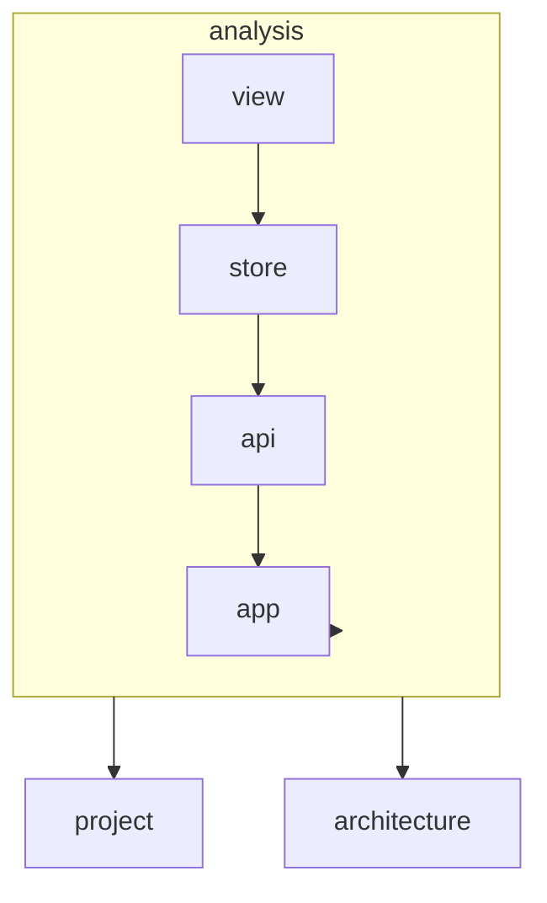

# AGENTS.md: Модуль Analysis (Frontend)

Модуль управления процессами анализа. Отвечает за запуск анализа, отображение прогресса и результатов.

---

## Ответственность

- Запуск анализа проекта
- Отображение прогресса анализа
- Просмотр результатов анализа
- История анализов

---

## Структура модуля

```
src/main/vue/analysis/
├── asset/
│   └── analysis.css                   # Стили модуля
├── view/
│   ├── AnalysisView.vue               # Главная страница анализа
│   ├── AnalysisProgressView.vue       # Прогресс анализа
│   ├── AnalysisResultView.vue         # Результаты анализа
│   └── components/
│       ├── AnalysisStarter.vue        # Форма запуска анализа
│       ├── ProgressBar.vue            # Индикатор прогресса
│       ├── AnalysisStats.vue          # Статистика анализа
│       └── AnalysisHistory.vue        # История анализов
├── store/
│   ├── index.ts
│   ├── state.ts
│   ├── mutations.ts
│   ├── actions.ts
│   └── getters.ts
├── router/
│   └── index.ts
├── service/
│   └── AnalysisService.ts
└── api/
    └── AnalysisApi.ts
```

---

## Компоненты

### AnalysisView.vue

```vue
<template>
  <div class="analysis-view" name="analysis-view">
    <header class="analysis-view__header">
      <h1>Project Analysis</h1>
    </header>
    
    <div class="analysis-view__content">
      <AnalysisStarter 
        v-if="!currentTask"
        :project-id="projectId"
        @start="startAnalysis"
      />
      
      <AnalysisProgress 
        v-else-if="currentTask.status === 'RUNNING'"
        :task="currentTask"
        @cancel="cancelAnalysis"
      />
      
      <AnalysisResult 
        v-else-if="currentTask.status === 'COMPLETED'"
        :task="currentTask"
        :result="analysisResult"
        @view-graph="viewGraph"
        @new-analysis="resetAnalysis"
      />
      
      <AnalysisError 
        v-else-if="currentTask.status === 'FAILED'"
        :task="currentTask"
        @retry="startAnalysis"
      />
    </div>
    
    <aside class="analysis-view__history">
      <AnalysisHistory 
        :history="analysisHistory"
        @select="selectHistoryItem"
      />
    </aside>
  </div>
</template>

<script setup lang="ts">
import { computed, onMounted, onUnmounted, ref } from 'vue';
import { useStore } from 'vuex';
import { useRouter, useRoute } from 'vue-router';
import AnalysisStarter from './components/AnalysisStarter.vue';
import AnalysisProgress from './components/AnalysisProgress.vue';
import AnalysisResult from './components/AnalysisResult.vue';
import AnalysisError from './components/AnalysisError.vue';
import AnalysisHistory from './components/AnalysisHistory.vue';

const store = useStore();
const router = useRouter();
const route = useRoute();

const projectId = computed(() => route.params.projectId as string);
const currentTask = computed(() => store.state.analysis.currentTask);
const analysisResult = computed(() => store.state.analysis.analysisResult);
const analysisHistory = computed(() => store.state.analysis.history);

let pollInterval: number | null = null;

onMounted(() => {
  store.dispatch('analysis/fetchHistory', projectId.value);
});

onUnmounted(() => {
  stopPolling();
});

async function startAnalysis() {
  await store.dispatch('analysis/startAnalysis', projectId.value);
  startPolling();
}

function startPolling() {
  pollInterval = window.setInterval(() => {
    store.dispatch('analysis/pollStatus');
  }, 2000);
}

function stopPolling() {
  if (pollInterval) {
    clearInterval(pollInterval);
    pollInterval = null;
  }
}

function cancelAnalysis() {
  stopPolling();
  store.dispatch('analysis/cancelAnalysis');
}

function viewGraph() {
  router.push(`/architecture?project=${projectId.value}`);
}

function resetAnalysis() {
  store.commit('analysis/clearCurrentTask');
}

function selectHistoryItem(taskId: string) {
  store.dispatch('analysis/fetchResult', taskId);
}
</script>
```

### AnalysisStarter.vue

```vue
<template>
  <div class="analysis-starter" name="analysis-starter">
    <h2>Start Project Analysis</h2>
    
    <div class="analysis-starter__info">
      <p>The analysis will:</p>
      <ul>
        <li>Parse Java source files (AST analysis)</li>
        <li>Detect Spring annotations</li>
        <li>Analyze compiled bytecode</li>
        <li>Build dependency graph</li>
      </ul>
    </div>
    
    <div class="analysis-starter__options">
      <label class="option">
        <input 
          type="checkbox" 
          name="option-bytecode"
          v-model="options.analyzeBytecode"
        />
        Analyze bytecode (requires compiled classes)
      </label>
      
      <label class="option">
        <input 
          type="checkbox" 
          name="option-endpoints"
          v-model="options.detectEndpoints"
        />
        Detect REST endpoints
      </label>
    </div>
    
    <button 
      name="btn-start-analysis"
      role="button"
      class="btn-primary"
      :disabled="isStarting"
      @click="$emit('start', options)"
    >
      {{ isStarting ? 'Starting...' : 'Start Analysis' }}
    </button>
  </div>
</template>

<script setup lang="ts">
import { ref } from 'vue';

interface Props {
  projectId: string;
}

defineProps<Props>();
defineEmits(['start']);

const isStarting = ref(false);
const options = ref({
  analyzeBytecode: true,
  detectEndpoints: true,
});
</script>
```

### ProgressBar.vue

```vue
<template>
  <div class="progress-bar" name="progress-bar">
    <div class="progress-bar__header">
      <span name="progress-stage">{{ stage }}</span>
      <span name="progress-percent">{{ percent }}%</span>
    </div>
    
    <div class="progress-bar__track">
      <div 
        class="progress-bar__fill"
        :style="{ width: `${percent}%` }"
        role="progressbar"
        :aria-valuenow="percent"
        aria-valuemin="0"
        aria-valuemax="100"
      />
    </div>
    
    <div class="progress-bar__details">
      <span name="progress-message">{{ message }}</span>
    </div>
  </div>
</template>

<script setup lang="ts">
interface Props {
  stage: string;
  percent: number;
  message: string;
}

defineProps<Props>();
</script>
```

### AnalysisStats.vue

```vue
<template>
  <div class="analysis-stats" name="analysis-stats">
    <h3>Analysis Results</h3>
    
    <div class="stats-grid">
      <div class="stat-item">
        <span class="stat-value" name="stat-classes">{{ stats.classesFound }}</span>
        <span class="stat-label">Classes Found</span>
      </div>
      
      <div class="stat-item">
        <span class="stat-value" name="stat-methods">{{ stats.methodsFound }}</span>
        <span class="stat-label">Methods Found</span>
      </div>
      
      <div class="stat-item">
        <span class="stat-value" name="stat-endpoints">{{ stats.endpointsFound }}</span>
        <span class="stat-label">Endpoints Found</span>
      </div>
      
      <div class="stat-item">
        <span class="stat-value" name="stat-dependencies">{{ stats.dependenciesFound }}</span>
        <span class="stat-label">Dependencies</span>
      </div>
    </div>
    
    <div class="stats-breakdown">
      <h4>By Label</h4>
      <ul name="label-breakdown">
        <li v-for="(count, label) in stats.byLabel" :key="label">
          <span :class="`label label--${label.toLowerCase()}`">{{ label }}</span>
          <span class="count">{{ count }}</span>
        </li>
      </ul>
    </div>
  </div>
</template>

<script setup lang="ts">
interface Props {
  stats: AnalysisStats;
}

defineProps<Props>();
</script>
```

### AnalysisHistory.vue

```vue
<template>
  <div class="analysis-history" name="analysis-history">
    <h3>Analysis History</h3>
    
    <div v-if="history.length === 0" class="history-empty">
      No previous analyses
    </div>
    
    <ul v-else class="history-list">
      <li 
        v-for="item in history" 
        :key="item.id"
        class="history-item"
        :name="`history-item-${item.id}`"
        @click="$emit('select', item.id)"
      >
        <div class="history-item__date">
          {{ formatDate(item.startedAt) }}
        </div>
        <div class="history-item__status">
          <span :class="`status status--${item.status.toLowerCase()}`">
            {{ item.status }}
          </span>
        </div>
        <div class="history-item__stats">
          {{ item.classesFound }} classes
        </div>
      </li>
    </ul>
  </div>
</template>

<script setup lang="ts">
interface Props {
  history: AnalysisTask[];
}

defineProps<Props>();
defineEmits(['select']);

function formatDate(date: string): string {
  return new Date(date).toLocaleDateString('en-US', {
    month: 'short',
    day: 'numeric',
    hour: '2-digit',
    minute: '2-digit'
  });
}
</script>
```

---

## Vuex Store

### state.ts

```typescript
/**
 * Состояние модуля analysis.
 */
export interface AnalysisState {
  currentTask: AnalysisTask | null;
  analysisResult: AnalysisResult | null;
  history: AnalysisTask[];
  isLoading: boolean;
  error: string | null;
}

export const state: AnalysisState = {
  currentTask: null,
  analysisResult: null,
  history: [],
  isLoading: false,
  error: null,
};
```

### actions.ts

```typescript
import { ActionTree } from 'vuex';
import { AnalysisState } from './state';
import { RootState } from '@/app/store';
import { AnalysisApi } from '../api/AnalysisApi';

export const actions: ActionTree<AnalysisState, RootState> = {
  
  async startAnalysis({ commit }, projectId: string) {
    commit('setLoading', true);
    commit('setError', null);
    
    try {
      const task = await AnalysisApi.start(projectId);
      commit('setCurrentTask', task);
      return task;
    } catch (error) {
      commit('setError', error.message);
      throw error;
    } finally {
      commit('setLoading', false);
    }
  },
  
  async pollStatus({ commit, state }) {
    if (!state.currentTask) return;
    
    try {
      const task = await AnalysisApi.getStatus(state.currentTask.id);
      commit('setCurrentTask', task);
      
      if (task.status === 'COMPLETED' || task.status === 'FAILED') {
        if (task.status === 'COMPLETED') {
          const result = await AnalysisApi.getResult(task.id);
          commit('setAnalysisResult', result);
        }
      }
    } catch (error) {
      commit('setError', error.message);
    }
  },
  
  async fetchResult({ commit }, taskId: string) {
    commit('setLoading', true);
    
    try {
      const result = await AnalysisApi.getResult(taskId);
      commit('setAnalysisResult', result);
    } catch (error) {
      commit('setError', error.message);
    } finally {
      commit('setLoading', false);
    }
  },
  
  async fetchHistory({ commit }, projectId: string) {
    try {
      const history = await AnalysisApi.getHistory(projectId);
      commit('setHistory', history);
    } catch (error) {
      commit('setError', error.message);
    }
  },
  
  async cancelAnalysis({ commit, state }) {
    if (!state.currentTask) return;
    
    try {
      await AnalysisApi.cancel(state.currentTask.id);
      commit('clearCurrentTask');
    } catch (error) {
      commit('setError', error.message);
    }
  },
};
```

---

## API

### AnalysisApi.ts

```typescript
import { apiClient } from '@/app/api/client';
import { AnalysisTask, AnalysisResult } from '../domain/Analysis';

export const AnalysisApi = {
  
  async start(projectId: string): Promise<AnalysisTask> {
    const response = await apiClient.post('/api/v1/analysis/start', {
      projectId
    });
    return response.data;
  },
  
  async getStatus(taskId: string): Promise<AnalysisTask> {
    const response = await apiClient.get(`/api/v1/analysis/${taskId}/status`);
    return response.data;
  },
  
  async getResult(taskId: string): Promise<AnalysisResult> {
    const response = await apiClient.get(`/api/v1/analysis/${taskId}/result`);
    return response.data;
  },
  
  async getHistory(projectId: string): Promise<AnalysisTask[]> {
    const response = await apiClient.get('/api/v1/analysis/history', {
      params: { projectId }
    });
    return response.data;
  },
  
  async cancel(taskId: string): Promise<void> {
    await apiClient.delete(`/api/v1/analysis/${taskId}`);
  },
};
```

---

## Доменные модели

### domain/Analysis.ts

```typescript
export interface AnalysisTask {
  id: string;
  projectId: string;
  status: AnalysisStatus;
  startedAt: string;
  completedAt: string | null;
  classesFound: number;
  methodsFound: number;
  endpointsFound: number;
  errorMessage: string | null;
}

export type AnalysisStatus = 'PENDING' | 'RUNNING' | 'COMPLETED' | 'FAILED';

export interface AnalysisResult {
  taskId: string;
  projectId: string;
  stats: AnalysisStats;
  classes: ClassSummary[];
  endpoints: EndpointSummary[];
}

export interface AnalysisStats {
  classesFound: number;
  methodsFound: number;
  endpointsFound: number;
  dependenciesFound: number;
  byLabel: Record<string, number>;
}

export interface ClassSummary {
  id: string;
  name: string;
  fullName: string;
  labels: string[];
}

export interface EndpointSummary {
  id: string;
  path: string;
  httpMethod: string;
}
```

---

## Роутинг

```typescript
import { RouteRecordRaw } from 'vue-router';
import AnalysisView from '../view/AnalysisView.vue';
import AnalysisProgressView from '../view/AnalysisProgressView.vue';
import AnalysisResultView from '../view/AnalysisResultView.vue';

export const analysisRoutes: RouteRecordRaw[] = [
  {
    path: '/projects/:projectId/analysis',
    name: 'analysis',
    component: AnalysisView,
    meta: { title: 'Project Analysis' },
  },
  {
    path: '/projects/:projectId/analysis/:taskId',
    name: 'analysis-progress',
    component: AnalysisProgressView,
    meta: { title: 'Analysis Progress' },
  },
  {
    path: '/projects/:projectId/analysis/:taskId/result',
    name: 'analysis-result',
    component: AnalysisResultView,
    meta: { title: 'Analysis Results' },
  },
];
```

---

## Зависимости



---

## Тестирование

### E2E тесты

```typescript
// analysis-workflow.cy.ts
describe('Analysis Workflow', () => {
  
  beforeEach(() => {
    cy.resetDatabase();
    cy.createTestProject({
      name: 'Test Project',
      path: '/test/path',
      includePackages: ['com.example']
    });
  });
  
  it('should start and complete analysis', () => {
    cy.visit('/projects/test-project-id/analysis');
    
    cy.get('[name="btn-start-analysis"]').click();
    
    // Wait for analysis to start
    cy.get('[name="progress-bar"]').should('be.visible');
    
    // Wait for completion (with timeout)
    cy.get('[name="analysis-stats"]', { timeout: 60000 }).should('be.visible');
    
    cy.get('[name="stat-classes"]').should('not.contain', '0');
  });
  
  it('should show analysis history', () => {
    cy.visit('/projects/test-project-id/analysis');
    
    cy.get('[name="analysis-history"]').should('be.visible');
    cy.get('[name^="history-item-"]').should('have.length.gt', 0);
  });
});