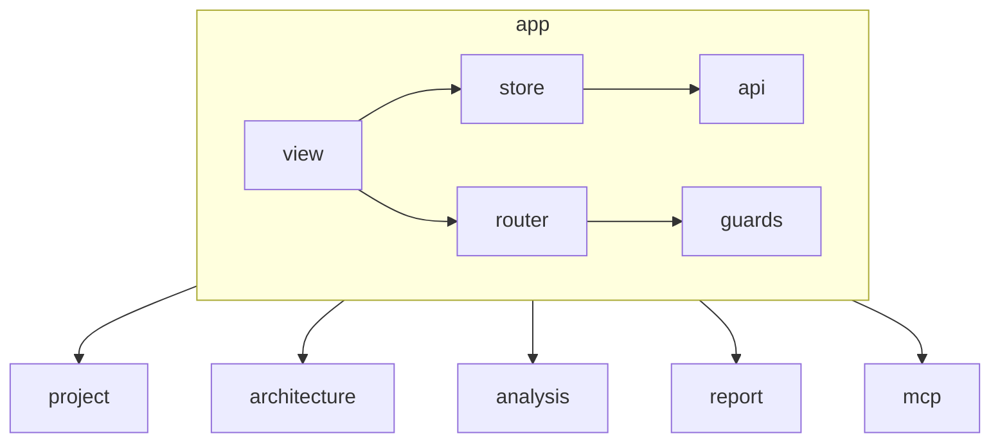

# AGENTS.md: Модуль App (Frontend)

Корневой модуль frontend приложения. Содержит общие компоненты, глобальное состояние, роутер и API клиент.

---

## Ответственность

- Глобальная навигация и layout
- Глобальное состояние приложения
- API клиент и перехватчики
- Общие компоненты (Header, Sidebar, Footer)
- Обработка ошибок на уровне приложения

---

## Структура модуля

```
src/main/vue/app/
├── asset/
│   ├── app.css                        # Глобальные стили
│   ├── variables.css                  # CSS переменные
│   └── themes/
│       └── default.css                # Тема по умолчанию
├── view/
│   ├── AppLayout.vue                  # Основной layout
│   ├── HomeView.vue                   # Главная страница
│   ├── NotFoundView.vue               # Страница 404
│   └── components/
│       ├── AppHeader.vue              # Шапка приложения
│       ├── AppSidebar.vue             # Боковая панель
│       ├── AppFooter.vue              # Подвал
│       ├── NavItem.vue                # Элемент навигации
│       ├── AppBreadcrumb.vue          # Хлебные крошки
│       ├── LoadingIndicator.vue       # Индикатор загрузки
│       ├── ErrorBoundary.vue          # Граница ошибок
│       └── NotificationToast.vue      # Уведомления
├── store/
│   ├── app.store.ts                   # Pinia store приложения
│   └── index.ts                       # Экспорт store
├── router/
│   ├── index.ts                       # Корневой роутер
│   └── guards.ts                      # Навигационные guards
├── service/
│   └── app.service.ts                 # Сервис приложения
└── api/
    ├── index.ts                       # API клиент
    ├── navigation.ts                  # Навигационные данные
    └── interceptors.ts                # Перехватчики
```

---

## Компоненты

### AppLayout.vue

```vue
<template>
  <div class="app-layout" name="app-layout">
    <AppHeader />
    
    <div class="app-layout__body">
      <AppSidebar />
      
      <main class="app-layout__content" name="main-content" role="main">
        <div class="app-layout__content-container">
          <router-view />
        </div>
      </main>
    </div>
    
    <AppFooter />
  </div>
</template>

<script setup lang="ts">
import AppHeader from './AppHeader.vue';
import AppSidebar from './AppSidebar.vue';
import AppFooter from './AppFooter.vue';
</script>
```

### AppHeader.vue

```vue
<template>
  <header class="app-header" name="app-header" role="banner">
    <div class="app-header__container">
      <div class="app-header__logo">
        <router-link to="/" class="app-header__logo-link" name="logo-link">
          <span class="app-header__logo-icon" name="logo-icon">🏗️</span>
          <span class="app-header__logo-text" name="logo-text">Spring Twin</span>
        </router-link>
      </div>

      <nav class="app-header__nav" role="navigation" aria-label="Primary navigation">
        <ul class="app-header__nav-list" name="nav-list">
          <li class="app-header__nav-item" name="nav-item">
            <router-link 
              to="/" 
              class="app-header__nav-link"
              :class="{ 'app-header__nav-link--active': isActive('/') }"
              name="nav-link-home"
            >
              Главная
            </router-link>
          </li>
          <li class="app-header__nav-item" name="nav-item">
            <router-link 
              to="/project" 
              class="app-header__nav-link"
              :class="{ 'app-header__nav-link--active': isActive('/project') }"
              name="nav-link-project"
            >
              Проект
            </router-link>
          </li>
          <li class="app-header__nav-item" name="nav-item">
            <router-link 
              to="/architecture" 
              class="app-header__nav-link"
              :class="{ 'app-header__nav-link--active': isActive('/architecture') }"
              name="nav-link-architecture"
            >
              Архитектура
            </router-link>
          </li>
          <li class="app-header__nav-item" name="nav-item">
            <router-link 
              to="/analysis" 
              class="app-header__nav-link"
              :class="{ 'app-header__nav-link--active': isActive('/analysis') }"
              name="nav-link-analysis"
            >
              Анализ
            </router-link>
          </li>
          <li class="app-header__nav-item" name="nav-item">
            <router-link 
              to="/report" 
              class="app-header__nav-link"
              :class="{ 'app-header__nav-link--active': isActive('/report') }"
              name="nav-link-report"
            >
              Отчеты
            </router-link>
          </li>
          <li class="app-header__nav-item" name="nav-item">
            <router-link 
              to="/mcp" 
              class="app-header__nav-link"
              :class="{ 'app-header__nav-link--active': isActive('/mcp') }"
              name="nav-link-mcp"
            >
              MCP
            </router-link>
          </li>
        </ul>
      </nav>

      <div class="app-header__actions" name="header-actions">
        <button class="app-header__action-btn" name="action-btn" @click="toggleSidebar">
          <span class="app-header__action-icon" name="action-icon">☰</span>
          <span class="app-header__action-text" name="action-text">Меню</span>
        </button>
      </div>
    </div>
  </header>
</template>

<script setup lang="ts">
import { useRoute } from 'vue-router';

const route = useRoute();

/**
 * Checks if the current route matches the given path.
 */
const isActive = (path: string) => {
  if (path === '/') {
    return route.path === '/';
  }
  return route.path.startsWith(path);
};

/**
 * Toggles sidebar visibility (for mobile).
 */
const toggleSidebar = () => {
  const sidebar = document.querySelector('.app-sidebar');
  if (sidebar) {
    sidebar.classList.toggle('app-sidebar--open');
  }
};
</script>
```

### AppSidebar.vue

```vue
<template>
  <aside class="app-sidebar" name="app-sidebar" role="complementary" aria-label="Sidebar navigation">
    <div class="app-sidebar__content">
      <nav class="app-sidebar__nav" role="navigation" aria-label="Module navigation">
        <ul class="app-sidebar__nav-list" name="sidebar-nav-list">
          <NavItem 
            v-for="item in navigationItems" 
            :key="item.id" 
            :item="item"
          />
        </ul>
      </nav>

      <div class="app-sidebar__info" name="sidebar-info">
        <div class="app-sidebar__info-section">
          <h3 class="app-sidebar__info-title" name="info-title">О приложении</h3>
          <p class="app-sidebar__info-text" name="info-text">
            Spring Twin — MCP-агент для анализа Spring Boot проектов.
          </p>
        </div>
        <div class="app-sidebar__info-section">
          <h3 class="app-sidebar__info-title" name="info-title">Версия</h3>
          <p class="app-sidebar__info-text" name="info-text">1.0.0</p>
        </div>
      </div>
    </div>

    <button 
      class="app-sidebar__close" 
      name="sidebar-close"
      @click="closeSidebar"
      aria-label="Закрыть меню"
    >
      <span class="app-sidebar__close-icon" name="close-icon">×</span>
    </button>
  </aside>
</template>

<script setup lang="ts">
import NavItem from './NavItem.vue';
import { defaultNavigationItems } from '../api/navigation';

/**
 * Default navigation items for the sidebar.
 */
const navigationItems = defaultNavigationItems;

/**
 * Closes the sidebar (for mobile).
 */
const closeSidebar = () => {
  const sidebar = document.querySelector('.app-sidebar');
  if (sidebar) {
    sidebar.classList.remove('app-sidebar--open');
  }
};
</script>
```

### ErrorBoundary.vue

```vue
<template>
  <div class="error-boundary">
    <slot v-if="!hasError" />
    
    <div v-else class="error-boundary__fallback" name="error-fallback">
      <h2>Something went wrong</h2>
      <p name="error-message">{{ error?.message }}</p>
      <button 
        name="btn-retry"
        @click="resetError"
      >
        Try Again
      </button>
    </div>
  </div>
</template>

<script setup lang="ts">
import { ref, onErrorCaptured } from 'vue';

const hasError = ref(false);
const error = ref<Error | null>(null);

onErrorCaptured((err) => {
  hasError.value = true;
  error.value = err;
  return false; // Prevent error from propagating
});

function resetError() {
  hasError.value = false;
  error.value = null;
}
</script>
```

### NotificationToast.vue

```vue
<template>
  <div class="notification-toast" name="notification-toast">
    <TransitionGroup name="notification">
      <div 
        v-for="notification in notifications" 
        :key="notification.id"
        :class="['notification', `notification--${notification.type}`]"
        :name="`notification-${notification.id}`"
        role="alert"
      >
        <span class="notification__message">{{ notification.message }}</span>
        <button 
          class="notification__close"
          @click="removeNotification(notification.id)"
        >
          ×
        </button>
      </div>
    </TransitionGroup>
  </div>
</template>

<script setup lang="ts">
import { computed } from 'vue';
import { useAppStore } from '../store/app.store';

const store = useAppStore();

const notifications = computed(() => store.notifications);

function removeNotification(id: string) {
  store.removeNotification(id);
}
</script>
```

---

## Pinia Store

### app.store.ts

```typescript
import { defineStore } from 'pinia';

export interface Notification {
  id: string;
  type: 'success' | 'error' | 'warning' | 'info';
  message: string;
  timestamp: number;
}

export interface AppState {
  isLoading: boolean;
  currentRoute: string;
  notifications: Notification[];
  theme: 'light' | 'dark';
  error: string | null;
}

export const useAppStore = defineStore('app', {
  state: (): AppState => ({
    isLoading: false,
    currentRoute: '',
    notifications: [],
    theme: 'light',
    error: null
  }),
  
  actions: {
    showLoading(isLoading: boolean) {
      this.isLoading = isLoading;
    },
    
    showError(error: string | null) {
      this.error = error;
    },
    
    setCurrentRoute(route: string) {
      this.currentRoute = route;
    },
    
    addNotification(notification: Omit<Notification, 'id' | 'timestamp'>) {
      const newNotification: Notification = {
        ...notification,
        id: Date.now().toString(),
        timestamp: Date.now()
      };
      this.notifications.push(newNotification);
    },
    
    removeNotification(id: string) {
      this.notifications = this.notifications.filter(n => n.id !== id);
    },
    
    toggleTheme() {
      this.theme = this.theme === 'light' ? 'dark' : 'light';
    }
  },
  
  getters: {
    isLoading: (state) => state.isLoading,
    hasError: (state) => state.error !== null,
    notificationCount: (state) => state.notifications.length
  }
});

export default useAppStore;
```

---

## API Client

### index.ts

```typescript
// Dummy export to make TypeScript recognize the module
export const dummy_app_api = 0;
```

### navigation.ts

```typescript
export interface NavigationItem {
  id: string;
  label: string;
  path: string;
  icon?: string;
  description?: string;
}

export const defaultNavigationItems: NavigationItem[] = [
  {
    id: 'home',
    label: 'Главная',
    path: '/',
    icon: '🏠',
    description: 'Главная страница приложения'
  },
  {
    id: 'project',
    label: 'Проект',
    path: '/project',
    icon: '📁',
    description: 'Конфигурация проекта и управление анализами'
  },
  {
    id: 'architecture',
    label: 'Архитектура',
    path: '/architecture',
    icon: '🏗️',
    description: 'Архитектурный график и модели данных'
  },
  {
    id: 'analysis',
    label: 'Анализ',
    path: '/analysis',
    icon: '🔍',
    description: 'Процессы анализа и индексации проекта'
  },
  {
    id: 'report',
    label: 'Отчеты',
    path: '/report',
    icon: '📊',
    description: 'Генерация и просмотр отчетов'
  },
  {
    id: 'mcp',
    label: 'MCP',
    path: '/mcp',
    icon: '🔌',
    description: 'MCP-интеграция с внешними инструментами'
  }
];
```

---

## Router

### index.ts

```typescript
import { createRouter, createWebHistory } from 'vue-router';

/**
 * Vue Router configuration for Spring Twin application.
 * 
 * Routes are configured with lazy loading for better performance.
 */
const routes = [
  {
    path: '/',
    name: 'home',
    component: () => import('../view/HomeView.vue'),
    meta: {
      title: 'Главная',
      description: 'Spring Twin - MCP-агент для анализа Spring Boot проектов'
    }
  },
  {
    path: '/project',
    name: 'project',
    component: () => import('../../project/view/ProjectView.vue'),
    meta: {
      title: 'Проект',
      description: 'Конфигурация проекта и управление анализами'
    }
  },
  {
    path: '/architecture',
    name: 'architecture',
    component: () => import('../../architecture/view/ArchitectureView.vue'),
    meta: {
      title: 'Архитектура',
      description: 'Архитектурный график и модели данных'
    }
  },
  {
    path: '/analysis',
    name: 'analysis',
    component: () => import('../../analysis/view/AnalysisView.vue'),
    meta: {
      title: 'Анализ',
      description: 'Процессы анализа и индексации проекта'
    }
  },
  {
    path: '/report',
    name: 'report',
    component: () => import('../../report/view/ReportView.vue'),
    meta: {
      title: 'Отчеты',
      description: 'Генерация и просмотр отчетов'
    }
  },
  {
    path: '/mcp',
    name: 'mcp',
    component: () => import('../../mcp/view/McpView.vue'),
    meta: {
      title: 'MCP',
      description: 'MCP-интеграция с внешними инструментами'
    }
  },
  {
    path: '/:pathMatch(.*)*',
    name: 'not-found',
    component: () => import('../view/NotFoundView.vue'),
    meta: {
      title: 'Страница не найдена',
      description: 'Запрошенная страница не существует'
    }
  }
];

const router = createRouter({
  history: createWebHistory(),
  routes
});

/**
 * Sets document title based on route meta.
 */
router.afterEach((to) => {
  if (to.meta.title) {
    document.title = `${to.meta.title} | Spring Twin`;
  } else {
    document.title = 'Spring Twin';
  }
});

export default router;
```

### guards.ts

```typescript
import { Router, NavigationGuardNext } from 'vue-router';
import { useAppStore } from '../store/app.store';

/**
 * Настраивает навигационные guards.
 */
export function setupGuards(router: Router): void {
  
  router.beforeEach((to, from, next: NavigationGuardNext) => {
    // Update page title
    const title = to.meta.title as string;
    document.title = title ? `${title} | Spring Twin` : 'Spring Twin';
    
    // Check authentication if required
    const store = useAppStore();
    if (to.meta.requiresAuth && !store.isAuthenticated) {
      next({ name: 'login', query: { redirect: to.fullPath } });
      return;
    }
    
    next();
  });
  
  router.afterEach(() => {
    // Scroll to top on navigation
    window.scrollTo(0, 0);
  });
}
```

---

## Сервисы

### app.service.ts

```typescript
/**
 * Application service utility functions.
 * Provides helper functions for the app module.
 */

/**
 * Formats the application title with version.
 * @param appName - The name of the application
 * @param version - The version string
 * @returns Formatted title with version
 */
export function formatAppTitle(appName: string, version: string): string {
  return `${appName} v${version}`;
}

/**
 * Determines if the application is in production mode.
 * @returns True if in production mode
 */
export function isProductionMode(): boolean {
  return import.meta.env.PROD === true;
}

/**
 * Determines if the application is in development mode.
 * @returns True if in development mode
 */
export function isDevelopmentMode(): boolean {
  return import.meta.env.DEV === true;
}

/**
 * Determines if the application is running in test mode.
 * @returns True if in test mode
 */
export function isTestMode(): boolean {
  return import.meta.env.MODE === 'test';
}
```

---

## Зависимости



---

## Тестирование

### Unit тесты

```typescript
// app/store/app.store.spec.ts
import { useAppStore } from './app.store';

describe('App Store', () => {
  
  it('should add notification', () => {
    const store = useAppStore();
    
    store.addNotification({
      type: 'success',
      message: 'Test notification'
    });
    
    expect(store.notifications.length).toBeGreaterThan(0);
  });
  
  it('should remove notification', () => {
    const store = useAppStore();
    const initialCount = store.notifications.length;
    
    store.addNotification({
      type: 'success',
      message: 'Test notification'
    });
    
    const notificationId = store.notifications[store.notifications.length - 1].id;
    store.removeNotification(notificationId);
    
    expect(store.notifications.length).toBe(initialCount);
  });
});
```

### E2E тесты

```typescript
// app-navigation.cy.ts
describe('App Navigation', () => {
  
  it('should display home page', () => {
    cy.visit('/');
    
    cy.get('[name="app-title"]').should('contain', 'Spring Twin');
  });
  
  it('should navigate to projects', () => {
    cy.visit('/');
    
    cy.get('[name="menu-projects"]').click();
    
    cy.url().should('include', '/projects');
  });
  
  it('should show 404 for unknown routes', () => {
    cy.visit('/unknown-route');
    
    cy.get('[name="not-found"]').should('be.visible');
  });
  
  it('should show loading indicator during API calls', () => {
    cy.intercept('GET', '/api/v1/projects', { delay: 500 });
    
    cy.visit('/projects');
    
    cy.get('[name="loading-indicator"]').should('be.visible');
  });
});