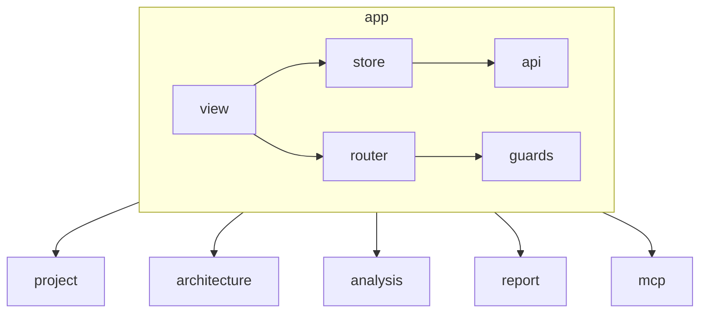

# AGENTS.md: Модуль App (Frontend)

Корневой модуль frontend приложения. Содержит общие компоненты, глобальное состояние, роутер и API клиент.

---

## Ответственность

- Глобальная навигация и layout
- Глобальное состояние приложения
- API клиент и перехватчики
- Общие компоненты (Header, Sidebar, Footer)
- Обработка ошибок на уровне приложения

---

## Структура модуля

```
src/main/vue/app/
├── asset/
│   ├── app.css                        # Глобальные стили
│   ├── variables.css                  # CSS переменные
│   └── themes/
│       └── default.css                # Тема по умолчанию
├── view/
│   ├── AppLayout.vue                  # Основной layout
│   ├── HomeView.vue                   # Главная страница
│   ├── NotFoundView.vue               # Страница 404
│   └── components/
│       ├── AppHeader.vue              # Шапка приложения
│       ├── AppSidebar.vue             # Боковая панель
│       ├── AppFooter.vue              # Подвал
│       ├── AppBreadcrumb.vue          # Хлебные крошки
│       ├── LoadingIndicator.vue       # Индикатор загрузки
│       ├── ErrorBoundary.vue          # Граница ошибок
│       └── NotificationToast.vue      # Уведомления
├── store/
│   ├── index.ts                       # Корневой store
│   ├── state.ts                       # Глобальное состояние
│   ├── mutations.ts
│   ├── actions.ts
│   └── getters.ts
├── router/
│   ├── index.ts                       # Корневой роутер
│   └── guards.ts                      # Навигационные guards
├── service/
│   └── NotificationService.ts         # Сервис уведомлений
└── api/
    ├── client.ts                      # Axios клиент
    └── interceptors.ts                # Перехватчики
```

---

## Компоненты

### AppLayout.vue

```vue
<template>
  <div class="app-layout" name="app-layout">
    <AppHeader 
      :title="appTitle"
      :user="currentUser"
      @toggle-sidebar="toggleSidebar"
    />
    
    <div class="app-layout__body">
      <AppSidebar 
        :collapsed="sidebarCollapsed"
        :menu-items="menuItems"
      />
      
      <main class="app-layout__content" name="main-content">
        <AppBreadcrumb :items="breadcrumbs" />
        
        <ErrorBoundary>
          <router-view v-slot="{ Component }">
            <transition name="fade" mode="out-in">
              <component :is="Component" />
            </transition>
          </router-view>
        </ErrorBoundary>
      </main>
    </div>
    
    <AppFooter :version="appVersion" />
    
    <NotificationToast />
    <LoadingIndicator v-if="isLoading" />
  </div>
</template>

<script setup lang="ts">
import { computed, ref } from 'vue';
import { useStore } from 'vuex';
import { useRoute } from 'vue-router';
import AppHeader from './components/AppHeader.vue';
import AppSidebar from './components/AppSidebar.vue';
import AppFooter from './components/AppFooter.vue';
import AppBreadcrumb from './components/AppBreadcrumb.vue';
import ErrorBoundary from './components/ErrorBoundary.vue';
import NotificationToast from './components/NotificationToast.vue';
import LoadingIndicator from './components/LoadingIndicator.vue';

const store = useStore();
const route = useRoute();

const sidebarCollapsed = ref(false);

const appTitle = computed(() => store.state.app.title);
const appVersion = computed(() => store.state.app.version);
const currentUser = computed(() => store.state.app.user);
const isLoading = computed(() => store.getters['app/isLoading']);
const breadcrumbs = computed(() => route.meta.breadcrumbs || []);

const menuItems = [
  { path: '/', label: 'Home', icon: 'home' },
  { path: '/projects', label: 'Projects', icon: 'folder' },
  { path: '/architecture', label: 'Architecture', icon: 'graph' },
  { path: '/report', label: 'Reports', icon: 'report' },
  { path: '/mcp/tools', label: 'MCP Tools', icon: 'api' },
];

function toggleSidebar() {
  sidebarCollapsed.value = !sidebarCollapsed.value;
}
</script>
```

### AppHeader.vue

```vue
<template>
  <header class="app-header" name="app-header">
    <div class="app-header__left">
      <button 
        name="btn-toggle-sidebar"
        @click="$emit('toggle-sidebar')"
      >
        <span class="icon">☰</span>
      </button>
      
      <h1 class="app-header__title" name="app-title">
        {{ title }}
      </h1>
    </div>
    
    <div class="app-header__right">
      <div class="search-box">
        <input 
          type="search"
          name="global-search"
          placeholder="Search..."
          @keyup.enter="search"
        />
      </div>
      
      <div class="user-menu" v-if="user">
        <span name="user-name">{{ user.name }}</span>
        <button name="btn-logout" @click="logout">Logout</button>
      </div>
    </div>
  </header>
</template>

<script setup lang="ts">
interface Props {
  title: string;
  user: { name: string } | null;
}

defineProps<Props>();
defineEmits(['toggle-sidebar']);

function search(event: Event) {
  const query = (event.target as HTMLInputElement).value;
  // Global search implementation
}

function logout() {
  // Logout implementation
}
</script>
```

### AppSidebar.vue

```vue
<template>
  <aside 
    class="app-sidebar" 
    :class="{ 'app-sidebar--collapsed': collapsed }"
    name="app-sidebar"
  >
    <nav class="sidebar-nav">
      <ul class="menu-list">
        <li 
          v-for="item in menuItems" 
          :key="item.path"
          class="menu-item"
        >
          <router-link 
            :to="item.path"
            :name="`menu-${item.label.toLowerCase()}`"
            :class="{ 'router-link-active': isActive(item.path) }"
          >
            <span :class="['icon', `icon--${item.icon}`]"></span>
            <span v-if="!collapsed" class="label">{{ item.label }}</span>
          </router-link>
        </li>
      </ul>
    </nav>
  </aside>
</template>

<script setup lang="ts">
import { useRoute } from 'vue-router';

interface MenuItem {
  path: string;
  label: string;
  icon: string;
}

interface Props {
  collapsed: boolean;
  menuItems: MenuItem[];
}

defineProps<Props>();
const route = useRoute();

function isActive(path: string): boolean {
  if (path === '/') {
    return route.path === '/';
  }
  return route.path.startsWith(path);
}
</script>
```

### ErrorBoundary.vue

```vue
<template>
  <div class="error-boundary">
    <slot v-if="!hasError" />
    
    <div v-else class="error-boundary__fallback" name="error-fallback">
      <h2>Something went wrong</h2>
      <p name="error-message">{{ error?.message }}</p>
      <button 
        name="btn-retry"
        @click="resetError"
      >
        Try Again
      </button>
    </div>
  </div>
</template>

<script setup lang="ts">
import { ref, onErrorCaptured } from 'vue';

const hasError = ref(false);
const error = ref<Error | null>(null);

onErrorCaptured((err) => {
  hasError.value = true;
  error.value = err;
  return false; // Prevent error from propagating
});

function resetError() {
  hasError.value = false;
  error.value = null;
}
</script>
```

### NotificationToast.vue

```vue
<template>
  <div class="notification-toast" name="notification-toast">
    <TransitionGroup name="notification">
      <div 
        v-for="notification in notifications" 
        :key="notification.id"
        :class="['notification', `notification--${notification.type}`]"
        :name="`notification-${notification.id}`"
        role="alert"
      >
        <span class="notification__message">{{ notification.message }}</span>
        <button 
          class="notification__close"
          @click="removeNotification(notification.id)"
        >
          ×
        </button>
      </div>
    </TransitionGroup>
  </div>
</template>

<script setup lang="ts">
import { computed } from 'vue';
import { useStore } from 'vuex';

const store = useStore();

const notifications = computed(() => store.state.app.notifications);

function removeNotification(id: string) {
  store.commit('app/removeNotification', id);
}
</script>
```

---

## Vuex Store

### state.ts

```typescript
/**
 * Глобальное состояние приложения.
 */
export interface AppState {
  title: string;
  version: string;
  user: User | null;
  notifications: Notification[];
  loading: number;
  error: AppError | null;
  sidebarCollapsed: boolean;
}

export const state: AppState = {
  title: 'Spring Twin',
  version: '1.0.0',
  user: null,
  notifications: [],
  loading: 0,
  error: null,
  sidebarCollapsed: false,
};

export interface User {
  id: string;
  name: string;
  email: string;
}

export interface Notification {
  id: string;
  type: 'success' | 'error' | 'warning' | 'info';
  message: string;
  timeout?: number;
}

export interface AppError {
  code: string;
  message: string;
  details?: any;
}
```

### mutations.ts

```typescript
import { MutationTree } from 'vuex';
import { AppState, Notification, AppError } from './state';

export const mutations: MutationTree<AppState> = {
  
  setTitle(state, title: string) {
    state.title = title;
  },
  
  setUser(state, user: User | null) {
    state.user = user;
  },
  
  addNotification(state, notification: Notification) {
    state.notifications.push(notification);
  },
  
  removeNotification(state, id: string) {
    state.notifications = state.notifications.filter(n => n.id !== id);
  },
  
  clearNotifications(state) {
    state.notifications = [];
  },
  
  setLoading(state, isLoading: boolean) {
    if (isLoading) {
      state.loading++;
    } else {
      state.loading = Math.max(0, state.loading - 1);
    }
  },
  
  setError(state, error: AppError | null) {
    state.error = error;
  },
  
  toggleSidebar(state) {
    state.sidebarCollapsed = !state.sidebarCollapsed;
  },
};
```

### actions.ts

```typescript
import { ActionTree } from 'vuex';
import { AppState } from './state';
import { RootState } from './index';

export const actions: ActionTree<AppState, RootState> = {
  
  notify({ commit }, { type, message, timeout = 5000 }: { type: string; message: string; timeout?: number }) {
    const id = Date.now().toString();
    
    commit('addNotification', { id, type, message, timeout });
    
    if (timeout > 0) {
      setTimeout(() => {
        commit('removeNotification', id);
      }, timeout);
    }
  },
  
  async initialize({ dispatch }) {
    // Initialize application
    await dispatch('fetchAppInfo');
  },
  
  async fetchAppInfo({ commit }) {
    // Fetch app info from API
  },
};
```

### getters.ts

```typescript
import { GetterTree } from 'vuex';
import { AppState } from './state';
import { RootState } from './index';

export const getters: GetterTree<AppState, RootState> = {
  
  isLoading: (state) => state.loading > 0,
  
  hasError: (state) => state.error !== null,
  
  isAuthenticated: (state) => state.user !== null,
  
  notificationCount: (state) => state.notifications.length,
};
```

---

## API Client

### client.ts

```typescript
import axios, { AxiosInstance, AxiosRequestConfig } from 'axios';
import { setupInterceptors } from './interceptors';

/**
 * API клиент для взаимодействия с backend.
 */
const createApiClient = (): AxiosInstance => {
  const client = axios.create({
    baseURL: '/api/v1',
    timeout: 30000,
    headers: {
      'Content-Type': 'application/json',
    },
  });
  
  setupInterceptors(client);
  
  return client;
};

export const apiClient = createApiClient();
```

### interceptors.ts

```typescript
import { AxiosInstance, AxiosError } from 'axios';
import { store } from '@/app/store';

/**
 * Настраивает перехватчики для API клиента.
 */
export function setupInterceptors(client: AxiosInstance): void {
  
  // Request interceptor
  client.interceptors.request.use(
    (config) => {
      store.commit('app/setLoading', true);
      
      // Add auth token if available
      const token = localStorage.getItem('auth_token');
      if (token) {
        config.headers.Authorization = `Bearer ${token}`;
      }
      
      return config;
    },
    (error) => {
      store.commit('app/setLoading', false);
      return Promise.reject(error);
    }
  );
  
  // Response interceptor
  client.interceptors.response.use(
    (response) => {
      store.commit('app/setLoading', false);
      return response;
    },
    (error: AxiosError) => {
      store.commit('app/setLoading', false);
      
      if (error.response) {
        const status = error.response.status;
        
        if (status === 401) {
          // Unauthorized - redirect to login
          store.dispatch('app/notify', {
            type: 'error',
            message: 'Session expired. Please login again.'
          });
        } else if (status === 403) {
          // Forbidden
          store.dispatch('app/notify', {
            type: 'error',
            message: 'You do not have permission to perform this action.'
          });
        } else if (status === 500) {
          // Server error
          store.dispatch('app/notify', {
            type: 'error',
            message: 'Server error. Please try again later.'
          });
        }
      } else if (error.request) {
        // Network error
        store.dispatch('app/notify', {
          type: 'error',
          message: 'Network error. Please check your connection.'
        });
      }
      
      return Promise.reject(error);
    }
  );
}
```

---

## Router

### index.ts

```typescript
import { createRouter, createWebHistory, RouteRecordRaw } from 'vue-router';
import { setupGuards } from './guards';

// Import module routes
import { projectRoutes } from '@/project/router';
import { architectureRoutes } from '@/architecture/router';
import { analysisRoutes } from '@/analysis/router';
import { reportRoutes } from '@/report/router';
import { mcpRoutes } from '@/mcp/router';

// Base routes
const baseRoutes: RouteRecordRaw[] = [
  {
    path: '/',
    name: 'home',
    component: () => import('../view/HomeView.vue'),
    meta: { title: 'Home' },
  },
  {
    path: '/:pathMatch(.*)*',
    name: 'not-found',
    component: () => import('../view/NotFoundView.vue'),
    meta: { title: 'Not Found' },
  },
];

// Combine all routes
const routes: RouteRecordRaw[] = [
  ...baseRoutes,
  ...projectRoutes,
  ...architectureRoutes,
  ...analysisRoutes,
  ...reportRoutes,
  ...mcpRoutes,
];

// Create router
export const router = createRouter({
  history: createWebHistory(),
  routes,
});

// Setup navigation guards
setupGuards(router);

export default router;
```

### guards.ts

```typescript
import { Router, NavigationGuardNext } from 'vue-router';
import { store } from '../store';

/**
 * Настраивает навигационные guards.
 */
export function setupGuards(router: Router): void {
  
  router.beforeEach((to, from, next: NavigationGuardNext) => {
    // Update page title
    const title = to.meta.title as string;
    document.title = title ? `${title} | Spring Twin` : 'Spring Twin';
    
    // Check authentication if required
    if (to.meta.requiresAuth && !store.getters['app/isAuthenticated']) {
      next({ name: 'login', query: { redirect: to.fullPath } });
      return;
    }
    
    next();
  });
  
  router.afterEach(() => {
    // Scroll to top on navigation
    window.scrollTo(0, 0);
  });
}
```

---

## Root Store

### index.ts

```typescript
import { createStore, Module } from 'vuex';
import { app, AppState } from './index';

// Import module stores
import project from '@/project/store';
import architecture from '@/architecture/store';
import analysis from '@/analysis/store';
import report from '@/report/store';
import mcp from '@/mcp/store';

export interface RootState {
  app: AppState;
  project: ProjectState;
  architecture: ArchitectureState;
  analysis: AnalysisState;
  report: ReportState;
  mcp: McpState;
}

export const store = createStore<RootState>({
  modules: {
    app,
    project,
    architecture,
    analysis,
    report,
    mcp,
  },
});

export default store;
```

---

## Зависимости



---

## Тестирование

### Unit тесты

```typescript
// app/store/actions.spec.ts
import { actions } from './actions';

describe('App Store Actions', () => {
  
  it('notify adds notification and removes after timeout', async () => {
    const commit = vi.fn();
    
    await actions.notify({ commit }, {
      type: 'success',
      message: 'Test notification',
      timeout: 100
    });
    
    expect(commit).toHaveBeenCalledWith('addNotification', expect.objectContaining({
      type: 'success',
      message: 'Test notification'
    }));
  });
});
```

### E2E тесты

```typescript
// app-navigation.cy.ts
describe('App Navigation', () => {
  
  it('should display home page', () => {
    cy.visit('/');
    
    cy.get('[name="app-title"]').should('contain', 'Spring Twin');
  });
  
  it('should navigate to projects', () => {
    cy.visit('/');
    
    cy.get('[name="menu-projects"]').click();
    
    cy.url().should('include', '/projects');
  });
  
  it('should show 404 for unknown routes', () => {
    cy.visit('/unknown-route');
    
    cy.get('[name="not-found"]').should('be.visible');
  });
  
  it('should show loading indicator during API calls', () => {
    cy.intercept('GET', '/api/v1/projects', { delay: 500 });
    
    cy.visit('/projects');
    
    cy.get('[name="loading-indicator"]').should('be.visible');
  });
});