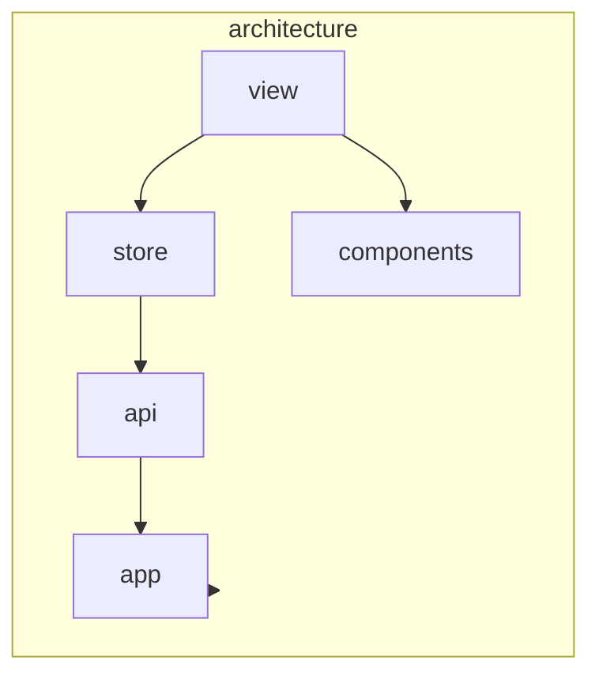

# AGENTS.md: Модуль Architecture (Frontend)

Модуль визуализации архитектуры проекта. Отвечает за отображение графа зависимостей, просмотр классов, методов и endpoints.

---

## Ответственность

- Визуализация графа зависимостей
- Просмотр и фильтрация классов по меткам
- Отображение деталей класса, метода, endpoint
- Навигация по архитектурным связям

---

## Структура модуля

```
src/main/vue/architecture/
├── asset/
│   ├── architecture.css               # Стили модуля
│   └── graph.css                      # Стили для графа
├── view/
│   ├── ArchitectureView.vue           # Главная страница архитектуры
│   ├── ClassDetailView.vue            # Детали класса
│   ├── MethodDetailView.vue           # Детали метода
│   ├── EndpointDetailView.vue         # Детали endpoint
│   └── components/
│       ├── DependencyGraph.vue        # Компонент графа
│       ├── ClassList.vue              # Список классов
│       ├── ClassCard.vue              # Карточка класса
│       ├── MethodList.vue             # Список методов
│       ├── EndpointList.vue           # Список endpoints
│       ├── LabelFilter.vue            # Фильтр по меткам
│       └── DependencyTree.vue         # Дерево зависимостей
├── store/
│   ├── index.ts
│   ├── state.ts
│   ├── mutations.ts
│   ├── actions.ts
│   └── getters.ts
├── router/
│   └── index.ts
├── service/
│   └── ArchitectureService.ts
└── api/
    ├── ClassApi.ts
    ├── MethodApi.ts
    └── EndpointApi.ts
```

---

## Компоненты

### ArchitectureView.vue

```vue
<template>
  <div class="architecture-view" name="architecture-view">
    <aside class="architecture-view__sidebar">
      <LabelFilter 
        :labels="availableLabels"
        :selected="selectedLabels"
        @change="onLabelFilterChange"
      />
      
      <ClassList 
        :classes="filteredClasses"
        :loading="isLoading"
        @select="selectClass"
      />
    </aside>
    
    <main class="architecture-view__main">
      <DependencyGraph 
        :nodes="graphNodes"
        :edges="graphEdges"
        :selected-node-id="selectedClassId"
        @node-click="onNodeClick"
      />
    </main>
    
    <aside class="architecture-view__details">
      <ClassCard 
        v-if="selectedClass"
        :class-data="selectedClass"
        @view-methods="viewMethods"
        @view-dependencies="viewDependencies"
      />
    </aside>
  </div>
</template>

<script setup lang="ts">
import { computed, onMounted, ref } from 'vue';
import { useStore } from 'vuex';
import { useRouter } from 'vue-router';
import LabelFilter from './components/LabelFilter.vue';
import ClassList from './components/ClassList.vue';
import DependencyGraph from './components/DependencyGraph.vue';
import ClassCard from './components/ClassCard.vue';

const store = useStore();
const router = useRouter();

const selectedLabels = ref<string[]>([]);
const selectedClassId = ref<string | null>(null);

const availableLabels = computed(() => store.getters['architecture/availableLabels']);
const filteredClasses = computed(() => 
  store.getters['architecture/classesByLabels'](selectedLabels.value)
);
const graphNodes = computed(() => store.getters['architecture/graphNodes']);
const graphEdges = computed(() => store.getters['architecture/graphEdges']);
const selectedClass = computed(() => store.state.architecture.currentClass);
const isLoading = computed(() => store.state.architecture.isLoading);

onMounted(() => {
  store.dispatch('architecture/fetchClasses');
});

function onLabelFilterChange(labels: string[]) {
  selectedLabels.value = labels;
}

function selectClass(id: string) {
  selectedClassId.value = id;
  store.dispatch('architecture/fetchClass', id);
}

function onNodeClick(nodeId: string) {
  selectClass(nodeId);
}

function viewMethods() {
  if (selectedClassId.value) {
    router.push(`/architecture/classes/${selectedClassId.value}/methods`);
  }
}

function viewDependencies() {
  if (selectedClassId.value) {
    router.push(`/architecture/classes/${selectedClassId.value}/dependencies`);
  }
}
</script>
```

### DependencyGraph.vue

```vue
<template>
  <div class="dependency-graph" name="dependency-graph" ref="graphContainer">
    <div v-if="loading" class="dependency-graph__loading" role="status">
      Loading graph...
    </div>
    
    <svg 
      v-else
      class="dependency-graph__canvas"
      :width="width"
      :height="height"
    >
      <!-- Edges -->
      <g class="edges">
        <line
          v-for="edge in edges"
          :key="edge.id"
          :x1="edge.source.x"
          :y1="edge.source.y"
          :x2="edge.target.x"
          :y2="edge.target.y"
          :class="['edge', { 'edge--highlighted': edge.highlighted }]"
        />
      </g>
      
      <!-- Nodes -->
      <g class="nodes">
        <g
          v-for="node in nodes"
          :key="node.id"
          :transform="`translate(${node.x}, ${node.y})`"
          :class="['node', `node--${node.type}`, { 'node--selected': node.id === selectedNodeId }]"
          @click="$emit('node-click', node.id)"
        >
          <circle r="20" />
          <text dy="30" text-anchor="middle">{{ node.label }}</text>
        </g>
      </g>
    </svg>
    
    <div class="dependency-graph__controls">
      <button name="btn-zoom-in" @click="zoomIn">+</button>
      <button name="btn-zoom-out" @click="zoomOut">-</button>
      <button name="btn-reset" @click="resetView">Reset</button>
    </div>
  </div>
</template>

<script setup lang="ts">
import { ref, onMounted, watch } from 'vue';
import * as d3 from 'd3';

interface Props {
  nodes: GraphNode[];
  edges: GraphEdge[];
  selectedNodeId?: string | null;
}

const props = defineProps<Props>();
const emit = defineEmits(['node-click']);

const graphContainer = ref<HTMLElement | null>(null);
const width = ref(800);
const height = ref(600);
const loading = ref(true);

onMounted(() => {
  if (graphContainer.value) {
    width.value = graphContainer.value.clientWidth;
    height.value = graphContainer.value.clientHeight;
  }
  loading.value = false;
});

function zoomIn() {
  // D3 zoom implementation
}

function zoomOut() {
  // D3 zoom implementation
}

function resetView() {
  // Reset zoom and pan
}
</script>
```

### ClassCard.vue

```vue
<template>
  <article 
    class="class-card" 
    :name="`class-card-${classData.id}`"
    role="article"
  >
    <header class="class-card__header">
      <h2 name="class-name">{{ classData.name }}</h2>
      <div class="class-card__labels">
        <span 
          v-for="label in classData.labels" 
          :key="label"
          :class="['label', `label--${label.toLowerCase()}`]"
          :name="`label-${label}`"
        >
          {{ label }}
        </span>
      </div>
    </header>
    
    <div class="class-card__body">
      <dl class="class-card__info">
        <dt>Package</dt>
        <dd name="class-package">{{ classData.packageName }}</dd>
        
        <dt>Full Name</dt>
        <dd name="class-fullname">{{ classData.fullName }}</dd>
        
        <dt>Methods</dt>
        <dd name="class-methods-count">{{ classData.methods?.length || 0 }}</dd>
        
        <dt>Dependencies</dt>
        <dd name="class-dependencies-count">{{ classData.dependencies?.length || 0 }}</dd>
      </dl>
    </div>
    
    <footer class="class-card__footer">
      <button 
        name="btn-view-methods" 
        role="button"
        @click="$emit('view-methods')"
      >
        View Methods
      </button>
      <button 
        name="btn-view-dependencies" 
        role="button"
        @click="$emit('view-dependencies')"
      >
        View Dependencies
      </button>
      <button 
        name="btn-explain" 
        role="button"
        @click="generateExplain"
      >
        Explain
      </button>
    </footer>
  </article>
</template>

<script setup lang="ts">
import { useRouter } from 'vue-router';
import { Class } from '../domain/Class';

interface Props {
  classData: Class;
}

const props = defineProps<Props>();
const emit = defineEmits(['view-methods', 'view-dependencies']);
const router = useRouter();

function generateExplain() {
  router.push(`/report/class/${props.classData.id}`);
}
</script>
```

### LabelFilter.vue

```vue
<template>
  <div class="label-filter" name="label-filter">
    <h3>Filter by Labels</h3>
    
    <div class="label-filter__list">
      <label
        v-for="label in labels"
        :key="label"
        class="label-filter__item"
      >
        <input
          type="checkbox"
          :name="`filter-label-${label}`"
          :checked="selected.includes(label)"
          @change="toggleLabel(label)"
        />
        <span :class="['label', `label--${label.toLowerCase()}`]">
          {{ label }}
        </span>
      </label>
    </div>
    
    <button 
      v-if="selected.length > 0"
      name="btn-clear-filter"
      @click="clearFilter"
    >
      Clear Filter
    </button>
  </div>
</template>

<script setup lang="ts">
interface Props {
  labels: string[];
  selected: string[];
}

const props = defineProps<Props>();
const emit = defineEmits(['change']);

function toggleLabel(label: string) {
  const newSelected = props.selected.includes(label)
    ? props.selected.filter(l => l !== label)
    : [...props.selected, label];
  emit('change', newSelected);
}

function clearFilter() {
  emit('change', []);
}
</script>
```

---

## Vuex Store

### state.ts

```typescript
/**
 * Состояние модуля architecture.
 */
export interface ArchitectureState {
  classes: Class[];
  methods: Method[];
  endpoints: Endpoint[];
  currentClass: Class | null;
  currentMethod: Method | null;
  currentEndpoint: Endpoint | null;
  graphData: GraphData | null;
  isLoading: boolean;
  error: string | null;
}

export const state: ArchitectureState = {
  classes: [],
  methods: [],
  endpoints: [],
  currentClass: null,
  currentMethod: null,
  currentEndpoint: null,
  graphData: null,
  isLoading: false,
  error: null,
};
```

### actions.ts

```typescript
import { ActionTree } from 'vuex';
import { ArchitectureState } from './state';
import { RootState } from '@/app/store';
import { ClassApi } from '../api/ClassApi';
import { MethodApi } from '../api/MethodApi';
import { EndpointApi } from '../api/EndpointApi';

export const actions: ActionTree<ArchitectureState, RootState> = {
  
  async fetchClasses({ commit }) {
    commit('setLoading', true);
    
    try {
      const classes = await ClassApi.getAll();
      commit('setClasses', classes);
    } catch (error) {
      commit('setError', error.message);
    } finally {
      commit('setLoading', false);
    }
  },
  
  async fetchClass({ commit }, id: string) {
    commit('setLoading', true);
    
    try {
      const clazz = await ClassApi.getById(id);
      commit('setCurrentClass', clazz);
    } catch (error) {
      commit('setError', error.message);
    } finally {
      commit('setLoading', false);
    }
  },
  
  async fetchClassDependencies({ commit }, id: string) {
    try {
      const dependencies = await ClassApi.getDependencies(id);
      commit('setGraphData', dependencies);
    } catch (error) {
      commit('setError', error.message);
    }
  },
  
  async fetchMethods({ commit }, classId: string) {
    try {
      const methods = await MethodApi.getByClassId(classId);
      commit('setMethods', methods);
    } catch (error) {
      commit('setError', error.message);
    }
  },
  
  async fetchEndpoints({ commit }) {
    try {
      const endpoints = await EndpointApi.getAll();
      commit('setEndpoints', endpoints);
    } catch (error) {
      commit('setError', error.message);
    }
  },
};
```

### getters.ts

```typescript
import { GetterTree } from 'vuex';
import { ArchitectureState } from './state';
import { RootState } from '@/app/store';

export const getters: GetterTree<ArchitectureState, RootState> = {
  
  availableLabels: (state) => {
    const labels = new Set<string>();
    state.classes.forEach(c => {
      c.labels?.forEach(l => labels.add(l));
    });
    return Array.from(labels);
  },
  
  classesByLabels: (state) => (labels: string[]) => {
    if (labels.length === 0) return state.classes;
    return state.classes.filter(c => 
      c.labels?.some(l => labels.includes(l))
    );
  },
  
  graphNodes: (state) => {
    if (!state.graphData) return [];
    return state.graphData.nodes;
  },
  
  graphEdges: (state) => {
    if (!state.graphData) return [];
    return state.graphData.edges;
  },
  
  classById: (state) => (id: string) => {
    return state.classes.find(c => c.id === id);
  },
  
  methodsByClassId: (state) => (classId: string) => {
    return state.methods.filter(m => m.parentClassId === classId);
  },
};
```

---

## API

### ClassApi.ts

```typescript
import { apiClient } from '@/app/api/client';
import { Class, GraphData } from '../domain/Class';

export const ClassApi = {
  
  async getAll(): Promise<Class[]> {
    const response = await apiClient.get('/api/v1/classes');
    return response.data;
  },
  
  async getById(id: string): Promise<Class> {
    const response = await apiClient.get(`/api/v1/classes/${id}`);
    return response.data;
  },
  
  async getDependencies(id: string): Promise<GraphData> {
    const response = await apiClient.get(`/api/v1/classes/${id}/dependencies`);
    return response.data;
  },
  
  async getMethods(id: string): Promise<Method[]> {
    const response = await apiClient.get(`/api/v1/classes/${id}/methods`);
    return response.data;
  },
  
  async search(query: string): Promise<Class[]> {
    const response = await apiClient.get('/api/v1/classes/search', {
      params: { q: query }
    });
    return response.data;
  },
};
```

### MethodApi.ts

```typescript
import { apiClient } from '@/app/api/client';
import { Method } from '../domain/Method';

export const MethodApi = {
  
  async getById(id: string): Promise<Method> {
    const response = await apiClient.get(`/api/v1/methods/${id}`);
    return response.data;
  },
  
  async getByClassId(classId: string): Promise<Method[]> {
    const response = await apiClient.get(`/api/v1/classes/${classId}/methods`);
    return response.data;
  },
  
  async getCalls(id: string): Promise<Method[]> {
    const response = await apiClient.get(`/api/v1/methods/${id}/calls`);
    return response.data;
  },
};
```

### EndpointApi.ts

```typescript
import { apiClient } from '@/app/api/client';
import { Endpoint } from '../domain/Endpoint';

export const EndpointApi = {
  
  async getAll(): Promise<Endpoint[]> {
    const response = await apiClient.get('/api/v1/endpoints');
    return response.data;
  },
  
  async getById(id: string): Promise<Endpoint> {
    const response = await apiClient.get(`/api/v1/endpoints/${id}`);
    return response.data;
  },
  
  async getByPath(path: string, method: string): Promise<Endpoint> {
    const response = await apiClient.get('/api/v1/endpoints/search', {
      params: { path, method }
    });
    return response.data;
  },
};
```

---

## Доменные модели

### domain/Class.ts

```typescript
export interface Class {
  id: string;
  name: string;
  fullName: string;
  packageName: string;
  labels: string[];
  modifiers: string[];
  methods?: Method[];
  dependencies?: Dependency[];
}

export interface Dependency {
  id: string;
  targetClass: Class;
  fieldName: string;
  injectionType: string;
}

export interface GraphData {
  nodes: GraphNode[];
  edges: GraphEdge[];
}

export interface GraphNode {
  id: string;
  label: string;
  type: string;
  x: number;
  y: number;
}

export interface GraphEdge {
  id: string;
  source: { x: number; y: number };
  target: { x: number; y: number };
  type: string;
  highlighted?: boolean;
}
```

### domain/Method.ts

```typescript
export interface Method {
  id: string;
  name: string;
  signature: string;
  returnType: string;
  modifiers: string[];
  parameters: MethodParameter[];
  parentClassId: string;
}

export interface MethodParameter {
  name: string;
  type: string;
}
```

### domain/Endpoint.ts

```typescript
export interface Endpoint {
  id: string;
  path: string;
  httpMethod: string;
  produces: string;
  consumes: string;
  exposingMethodId: string;
}
```

---

## Роутинг

```typescript
import { RouteRecordRaw } from 'vue-router';
import ArchitectureView from '../view/ArchitectureView.vue';
import ClassDetailView from '../view/ClassDetailView.vue';
import MethodDetailView from '../view/MethodDetailView.vue';
import EndpointDetailView from '../view/EndpointDetailView.vue';

export const architectureRoutes: RouteRecordRaw[] = [
  {
    path: '/architecture',
    name: 'architecture',
    component: ArchitectureView,
    meta: { title: 'Architecture' },
  },
  {
    path: '/architecture/classes/:id',
    name: 'class-detail',
    component: ClassDetailView,
    meta: { title: 'Class Details' },
  },
  {
    path: '/architecture/methods/:id',
    name: 'method-detail',
    component: MethodDetailView,
    meta: { title: 'Method Details' },
  },
  {
    path: '/architecture/endpoints/:id',
    name: 'endpoint-detail',
    component: EndpointDetailView,
    meta: { title: 'Endpoint Details' },
  },
];
```

---

## Зависимости



---

## Тестирование

### E2E тесты

```typescript
// architecture-navigation.cy.ts
describe('Architecture Navigation', () => {
  
  beforeEach(() => {
    cy.resetDatabase();
    cy.createTestClass({
      name: 'UserService',
      labels: ['Service'],
      packageName: 'com.example'
    });
  });
  
  it('should display classes filtered by label', () => {
    cy.visit('/architecture');
    
    cy.get('[name="filter-label-Service"]').check();
    
    cy.get('[name^="class-card-"]').should('have.length.gt', 0);
    cy.get('[name="label-Service"]').should('exist');
  });
  
  it('should show class details on click', () => {
    cy.visit('/architecture');
    
    cy.get('[name^="class-card-"]').first().click();
    
    cy.get('[name="class-name"]').should('be.visible');
    cy.get('[name="class-package"]').should('be.visible');
  });
});