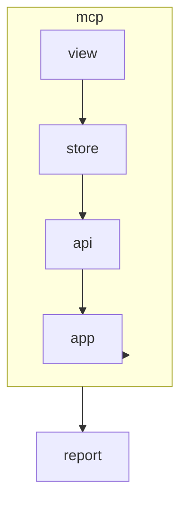

# AGENTS.md: Модуль MCP (Frontend)

Модуль для работы с MCP-интеграцией. Отображает доступные MCP tools и позволяет тестировать их использование.

---

## Ответственность

- Отображение списка MCP tools
- Тестирование MCP tools
- Просмотр результатов выполнения
- Конфигурация MCP интеграции

---

## Структура модуля

```
src/main/vue/mcp/
├── asset/
│   └── mcp.css                        # Стили модуля
├── view/
│   ├── McpToolsView.vue               # Список MCP tools
│   ├── McpToolRunnerView.vue          # Запуск MCP tool
│   └── components/
│       ├── ToolCard.vue               # Карточка MCP tool
│       ├── ToolParameterForm.vue      # Форма параметров
│       ├── ToolResultView.vue         # Результат выполнения
│       └── McpConfigPanel.vue         # Панель конфигурации
├── store/
│   ├── index.ts
│   ├── state.ts
│   ├── mutations.ts
│   ├── actions.ts
│   └── getters.ts
├── router/
│   └── index.ts
├── service/
│   └── McpService.ts
└── api/
    └── McpApi.ts
```

---

## Компоненты

### McpToolsView.vue

```vue
<template>
  <div class="mcp-tools-view" name="mcp-tools-view">
    <header class="mcp-tools-view__header">
      <h1>MCP Tools</h1>
      <p>Model Context Protocol tools for integration with Cursor AI and Kilo Code</p>
    </header>
    
    <div class="mcp-tools-view__content">
      <div v-if="isLoading" class="loading" role="status">
        Loading tools...
      </div>
      
      <div v-else class="tools-grid">
        <ToolCard
          v-for="tool in tools"
          :key="tool.name"
          :tool="tool"
          @run="runTool"
        />
      </div>
    </div>
    
    <aside class="mcp-tools-view__config">
      <McpConfigPanel 
        :config="mcpConfig"
        @update="updateConfig"
      />
    </aside>
  </div>
</template>

<script setup lang="ts">
import { computed, onMounted } from 'vue';
import { useStore } from 'vuex';
import { useRouter } from 'vue-router';
import ToolCard from './components/ToolCard.vue';
import McpConfigPanel from './components/McpConfigPanel.vue';

const store = useStore();
const router = useRouter();

const tools = computed(() => store.state.mcp.tools);
const mcpConfig = computed(() => store.state.mcp.config);
const isLoading = computed(() => store.state.mcp.isLoading);

onMounted(() => {
  store.dispatch('mcp/fetchTools');
});

function runTool(toolName: string) {
  router.push(`/mcp/tools/${toolName}/run`);
}

function updateConfig(config: McpConfig) {
  store.dispatch('mcp/updateConfig', config);
}
</script>
```

### ToolCard.vue

```vue
<template>
  <article 
    class="tool-card" 
    :name="`tool-card-${tool.name}`"
    role="article"
  >
    <header class="tool-card__header">
      <h3 name="tool-name">{{ tool.name }}</h3>
      <span class="tool-type" name="tool-return-type">{{ tool.returnType }}</span>
    </header>
    
    <div class="tool-card__body">
      <p name="tool-description">{{ tool.description }}</p>
      
      <div class="tool-parameters">
        <h4>Parameters</h4>
        <ul name="tool-parameters-list">
          <li 
            v-for="param in tool.parameters" 
            :key="param.name"
            :name="`param-${param.name}`"
          >
            <span class="param-name">{{ param.name }}</span>
            <span class="param-type">{{ param.type }}</span>
            <span v-if="param.required" class="param-required">required</span>
          </li>
        </ul>
      </div>
    </div>
    
    <footer class="tool-card__footer">
      <button 
        name="btn-run-tool"
        role="button"
        @click="$emit('run', tool.name)"
      >
        Run Tool
      </button>
    </footer>
  </article>
</template>

<script setup lang="ts">
import { McpTool } from '../domain/McpTool';

interface Props {
  tool: McpTool;
}

defineProps<Props>();
defineEmits(['run']);
</script>
```

### ToolParameterForm.vue

```vue
<template>
  <div class="tool-parameter-form" name="tool-parameter-form">
    <h2>Run: {{ toolName }}</h2>
    
    <form @submit.prevent="submitForm">
      <div 
        v-for="param in parameters" 
        :key="param.name"
        class="form-group"
      >
        <label :for="`input-${param.name}`">
          {{ param.name }}
          <span v-if="param.required" class="required">*</span>
        </label>
        
        <p class="param-description">{{ param.description }}</p>
        
        <input
          v-if="param.type === 'string'"
          type="text"
          :id="`input-${param.name}`"
          :name="`input-${param.name}`"
          :required="param.required"
          v-model="values[param.name]"
        />
        
        <input
          v-else-if="param.type === 'integer'"
          type="number"
          :id="`input-${param.name}`"
          :name="`input-${param.name}`"
          :required="param.required"
          v-model.number="values[param.name]"
        />
        
        <select
          v-else-if="param.type === 'boolean'"
          :id="`input-${param.name}`"
          :name="`input-${param.name}`"
          v-model="values[param.name]"
        >
          <option :value="true">true</option>
          <option :value="false">false</option>
        </select>
        
        <p v-if="param.defaultValue" class="default-value">
          Default: {{ param.defaultValue }}
        </p>
      </div>
      
      <div class="form-actions">
        <button 
          type="submit" 
          name="btn-submit"
          :disabled="isSubmitting"
        >
          {{ isSubmitting ? 'Running...' : 'Run Tool' }}
        </button>
        
        <button 
          type="button" 
          name="btn-cancel"
          @click="$emit('cancel')"
        >
          Cancel
        </button>
      </div>
    </form>
  </div>
</template>

<script setup lang="ts">
import { ref, computed } from 'vue';
import { McpToolParameter } from '../domain/McpTool';

interface Props {
  toolName: string;
  parameters: McpToolParameter[];
}

const props = defineProps<Props>();
const emit = defineEmits(['submit', 'cancel']);

const values = ref<Record<string, any>>({});
const isSubmitting = ref(false);

// Initialize with default values
props.parameters.forEach(param => {
  if (param.defaultValue !== undefined) {
    values.value[param.name] = param.defaultValue;
  }
});

async function submitForm() {
  isSubmitting.value = true;
  try {
    emit('submit', { ...values.value });
  } finally {
    isSubmitting.value = false;
  }
}
</script>
```

### ToolResultView.vue

```vue
<template>
  <div class="tool-result-view" name="tool-result-view">
    <header class="tool-result-view__header">
      <h2>Result</h2>
      <span 
        :class="['status', success ? 'status--success' : 'status--error']"
        name="result-status"
      >
        {{ success ? 'Success' : 'Error' }}
      </span>
    </header>
    
    <div v-if="!success && errors.length" class="result-errors">
      <h3>Errors</h3>
      <ul name="result-errors-list">
        <li v-for="(error, index) in errors" :key="index">
          {{ error }}
        </li>
      </ul>
    </div>
    
    <div v-if="context" class="result-context">
      <h3>Context</h3>
      
      <div class="context-summary">
        <dl>
          <dt>Type</dt>
          <dd name="context-type">{{ context.contextType }}</dd>
          
          <dt>Element</dt>
          <dd name="context-element">{{ context.elementName }}</dd>
          
          <dt>Summary</dt>
          <dd name="context-summary">{{ context.summary }}</dd>
        </dl>
      </div>
      
      <div class="context-data">
        <h4>Structured Data</h4>
        <pre name="context-data-json">{{ JSON.stringify(context.data, null, 2) }}</pre>
      </div>
      
      <div v-if="context.relatedElements?.length" class="context-related">
        <h4>Related Elements</h4>
        <ul name="context-related-list">
          <li 
            v-for="element in context.relatedElements" 
            :key="element.id"
            @click="navigateToElement(element)"
          >
            <span class="element-type">{{ element.type }}</span>
            <span class="element-name">{{ element.name }}</span>
          </li>
        </ul>
      </div>
    </div>
    
    <div class="result-actions">
      <button 
        name="btn-copy-result"
        @click="copyToClipboard"
      >
        Copy JSON
      </button>
      
      <button 
        name="btn-new-run"
        @click="$emit('new-run')"
      >
        Run Another
      </button>
    </div>
  </div>
</template>

<script setup lang="ts">
import { computed } from 'vue';
import { useRouter } from 'vue-router';
import { McpContext } from '../domain/McpContext';

interface Props {
  success: boolean;
  errors: string[];
  context: McpContext | null;
}

const props = defineProps<Props>();
const emit = defineEmits(['new-run']);
const router = useRouter();

async function copyToClipboard() {
  if (props.context) {
    await navigator.clipboard.writeText(
      JSON.stringify(props.context, null, 2)
    );
  }
}

function navigateToElement(element: { type: string; id: string }) {
  const routeMap: Record<string, string> = {
    'CLASS': '/report/class',
    'METHOD': '/report/method',
    'ENDPOINT': '/report/endpoint',
  };
  
  const basePath = routeMap[element.type];
  if (basePath) {
    router.push(`${basePath}/${element.id}`);
  }
}
</script>
```

### McpConfigPanel.vue

```vue
<template>
  <div class="mcp-config-panel" name="mcp-config-panel">
    <h3>MCP Configuration</h3>
    
    <div class="config-section">
      <h4>Connection</h4>
      
      <div class="form-group">
        <label for="config-endpoint">API Endpoint</label>
        <input
          type="text"
          id="config-endpoint"
          name="config-endpoint"
          v-model="localConfig.endpoint"
        />
      </div>
      
      <div class="form-group">
        <label for="config-timeout">Timeout (ms)</label>
        <input
          type="number"
          id="config-timeout"
          name="config-timeout"
          v-model.number="localConfig.timeout"
        />
      </div>
    </div>
    
    <div class="config-section">
      <h4>Integrations</h4>
      
      <div class="integration-status">
        <div class="integration-item">
          <span name="integration-cursor">Cursor AI</span>
          <span :class="['status', cursorConnected ? 'status--connected' : 'status--disconnected']">
            {{ cursorConnected ? 'Connected' : 'Not Connected' }}
          </span>
        </div>
        
        <div class="integration-item">
          <span name="integration-kilo">Kilo Code</span>
          <span :class="['status', kiloConnected ? 'status--connected' : 'status--disconnected']">
            {{ kiloConnected ? 'Connected' : 'Not Connected' }}
          </span>
        </div>
      </div>
    </div>
    
    <div class="config-actions">
      <button 
        name="btn-save-config"
        @click="saveConfig"
      >
        Save Configuration
      </button>
      
      <button 
        name="btn-test-connection"
        @click="testConnection"
      >
        Test Connection
      </button>
    </div>
    
    <div class="config-example">
      <h4>MCP Configuration for IDE</h4>
      <p>Add this to your MCP settings:</p>
      <pre name="config-example-json">{{ configExample }}</pre>
      <button 
        name="btn-copy-config"
        @click="copyConfig"
      >
        Copy
      </button>
    </div>
  </div>
</template>

<script setup lang="ts">
import { ref, computed, watch } from 'vue';
import { McpConfig } from '../domain/McpConfig';

interface Props {
  config: McpConfig;
}

const props = defineProps<Props>();
const emit = defineEmits(['update']);

const localConfig = ref({ ...props.config });
const cursorConnected = ref(false);
const kiloConnected = ref(false);

watch(() => props.config, (newConfig) => {
  localConfig.value = { ...newConfig };
});

const configExample = computed(() => JSON.stringify({
  mcpServers: {
    'spring-twin': {
      command: 'java',
      args: ['-jar', 'spring-twin.jar'],
      env: {}
    }
  }
}, null, 2));

function saveConfig() {
  emit('update', { ...localConfig.value });
}

async function testConnection() {
  // Test MCP connection
}

async function copyConfig() {
  await navigator.clipboard.writeText(configExample.value);
}
</script>
```

---

## Pinia Store

### state.ts

```typescript
/**
 * Состояние модуля MCP.
 */
export interface McpState {
  tools: McpTool[];
  config: McpConfig;
  currentResult: McpToolResponse | null;
  isLoading: boolean;
  error: string | null;
}

export const state: McpState = {
  tools: [],
  config: {
    endpoint: '/api/v1/mcp',
    timeout: 30000,
  },
  currentResult: null,
  isLoading: false,
  error: null,
};
```

### actions.ts

```typescript
import { ActionTree } from 'vuex';
import { McpState } from './state';
import { RootState } from '@/app/store';
import { McpApi } from '../api/McpApi';

export const actions: ActionTree<McpState, RootState> = {
  
  async fetchTools({ commit }) {
    commit('setLoading', true);
    
    try {
      const tools = await McpApi.getTools();
      commit('setTools', tools);
    } catch (error) {
      commit('setError', error.message);
    } finally {
      commit('setLoading', false);
    }
  },
  
  async executeTool({ commit }, { toolName, parameters }: { toolName: string; parameters: Record<string, any> }) {
    commit('setLoading', true);
    commit('setError', null);
    
    try {
      const result = await McpApi.execute(toolName, parameters);
      commit('setCurrentResult', result);
      return result;
    } catch (error) {
      commit('setError', error.message);
      throw error;
    } finally {
      commit('setLoading', false);
    }
  },
  
  async updateConfig({ commit }, config: McpConfig) {
    commit('setConfig', config);
    // Persist config
  },
};
```

---

## API

### McpApi.ts

```typescript
import { apiClient } from '@/app/api/client';
import { McpTool, McpToolResponse } from '../domain/McpTool';

export const McpApi = {
  
  async getTools(): Promise<McpTool[]> {
    const response = await apiClient.get('/api/v1/mcp/tools');
    return response.data;
  },
  
  async execute(toolName: string, parameters: Record<string, any>): Promise<McpToolResponse> {
    const response = await apiClient.post('/api/v1/mcp/execute', {
      toolName,
      parameters
    });
    return response.data;
  },
};
```

---

## Доменные модели

### domain/McpTool.ts

```typescript
export interface McpTool {
  name: string;
  description: string;
  parameters: McpToolParameter[];
  returnType: string;
}

export interface McpToolParameter {
  name: string;
  type: string;
  description: string;
  required: boolean;
  defaultValue?: any;
}

export interface McpToolResponse {
  success: boolean;
  context?: McpContext;
  errors?: string[];
}

export interface McpContext {
  contextType: string;
  elementId: string;
  elementName: string;
  summary: string;
  data: any;
  relatedElements?: RelatedElement[];
  metadata?: Record<string, any>;
}

export interface RelatedElement {
  id: string;
  type: string;
  name: string;
}
```

### domain/McpConfig.ts

```typescript
export interface McpConfig {
  endpoint: string;
  timeout: number;
}
```

---

## Роутинг

```typescript
import { RouteRecordRaw } from 'vue-router';
import McpToolsView from '../view/McpToolsView.vue';
import McpToolRunnerView from '../view/McpToolRunnerView.vue';

export const mcpRoutes: RouteRecordRaw[] = [
  {
    path: '/mcp/tools',
    name: 'mcp-tools',
    component: McpToolsView,
    meta: { title: 'MCP Tools' },
  },
  {
    path: '/mcp/tools/:toolName/run',
    name: 'mcp-tool-run',
    component: McpToolRunnerView,
    meta: { title: 'Run MCP Tool' },
  },
];
```

---

## Зависимости



---

## Тестирование

### E2E тесты

```typescript
// mcp-tools.cy.ts
describe('MCP Tools', () => {
  
  beforeEach(() => {
    cy.resetDatabase();
  });
  
  it('should display available MCP tools', () => {
    cy.visit('/mcp/tools');
    
    cy.get('[name^="tool-card-"]').should('have.length.gt', 0);
    cy.get('[name="tool-name"]').should('contain', 'get_endpoint_context');
  });
  
  it('should run get_class_context tool', () => {
    cy.visit('/mcp/tools/get_class_context/run');
    
    cy.get('[name="input-fullName"]').type('com.example.UserService');
    cy.get('[name="btn-submit"]').click();
    
    cy.get('[name="result-status"]').should('contain', 'Success');
    cy.get('[name="context-type"]').should('contain', 'CLASS');
  });
  
  it('should show error for missing required parameter', () => {
    cy.visit('/mcp/tools/get_class_context/run');
    
    cy.get('[name="btn-submit"]').click();
    
    cy.get('[name="result-status"]').should('contain', 'Error');
    cy.get('[name="result-errors-list"]').should('be.visible');
  });
});