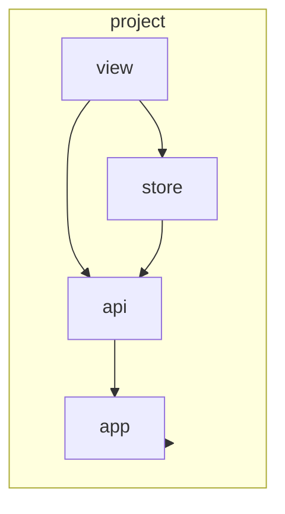

# AGENTS.md: Модуль Project (Frontend)

Модуль управления анализируемым проектом в UI. Отвечает за конфигурацию include/exclude пакетов и отображение метаданных проекта.

---

## Ответственность

- Отображение списка проектов
- Создание и редактирование проектов
- Управление конфигурацией include/exclude пакетов
- Запуск анализа проекта

---

## Структура модуля

```
src/main/vue/project/
├── asset/
│   └── project.css                    # Стили модуля
├── view/
│   ├── ProjectListView.vue            # Список проектов
│   ├── ProjectDetailView.vue          # Детали проекта
│   ├── ProjectFormView.vue            # Форма создания/редактирования
│   └── components/
│       ├── ProjectCard.vue            # Карточка проекта
│       ├── PackageConfigEditor.vue    # Редактор include/exclude
│       └── ProjectActions.vue         # Действия над проектом
├── store/
│   ├── index.ts                       # Экспорт модуля store
│   ├── state.ts                       # Состояние модуля
│   ├── mutations.ts                   # Мутации
│   ├── actions.ts                     # Действия
│   └── getters.ts                     # Геттеры
├── router/
│   └── index.ts                       # Маршруты модуля
├── service/
│   └── ProjectService.ts              # Сервис для работы с данными
└── api/
    └── ProjectApi.ts                  # API клиент
```

---

## Компоненты

### ProjectListView.vue

```vue
<template>
  <div class="project-list" name="project-list">
    <header class="project-list__header">
      <h1>Projects</h1>
      <button 
        name="btn-new-project" 
        role="button"
        @click="createProject"
      >
        New Project
      </button>
    </header>
    
    <div v-if="isLoading" role="status" name="loading-indicator">
      Loading...
    </div>
    
    <div v-else-if="projects.length === 0" name="empty-state">
      No projects found. Create your first project.
    </div>
    
    <div v-else class="project-list__grid">
      <ProjectCard
        v-for="project in projects"
        :key="project.id"
        :project="project"
        @click="selectProject(project.id)"
      />
    </div>
  </div>
</template>

<script setup lang="ts">
import { computed, onMounted } from 'vue';
import { useStore } from 'vuex';
import { useRouter } from 'vue-router';
import ProjectCard from './components/ProjectCard.vue';

const store = useStore();
const router = useRouter();

const projects = computed(() => store.state.project.projects);
const isLoading = computed(() => store.state.project.isLoading);

onMounted(() => {
  store.dispatch('project/fetchProjects');
});

function createProject() {
  router.push('/projects/new');
}

function selectProject(id: string) {
  router.push(`/projects/${id}`);
}
</script>
```

### ProjectCard.vue

```vue
<template>
  <article 
    class="project-card" 
    :name="`project-card-${project.id}`"
    role="article"
  >
    <header class="project-card__header">
      <h2 name="project-name">{{ project.name }}</h2>
      <span name="project-status" :class="statusClass">{{ status }}</span>
    </header>
    
    <div class="project-card__body">
      <p name="project-path">{{ project.path }}</p>
      <div name="project-packages">
        <span v-for="pkg in project.includePackages" :key="pkg">
          {{ pkg }}
        </span>
      </div>
    </div>
    
    <footer class="project-card__footer">
      <button 
        name="btn-analyze" 
        role="button"
        @click.stop="analyzeProject"
      >
        Analyze
      </button>
      <button 
        name="btn-edit" 
        role="button"
        @click.stop="editProject"
      >
        Edit
      </button>
    </footer>
  </article>
</template>

<script setup lang="ts">
import { computed } from 'vue';
import { useRouter } from 'vue-router';

interface Props {
  project: Project;
}

const props = defineProps<Props>();
const emit = defineEmits(['click']);
const router = useRouter();

const status = computed(() => props.project.status || 'Ready');
const statusClass = computed(() => `status--${status.value.toLowerCase()}`);

function analyzeProject() {
  router.push(`/projects/${props.project.id}/analyze`);
}

function editProject() {
  router.push(`/projects/${props.project.id}/edit`);
}
</script>
```

### PackageConfigEditor.vue

```vue
<template>
  <div class="package-config-editor" name="package-config-editor">
    <div class="config-section">
      <label name="label-include">Include Packages</label>
      <div class="package-list">
        <div 
          v-for="(pkg, index) in includePackages" 
          :key="`include-${index}`"
          class="package-item"
        >
          <input 
            type="text" 
            :value="pkg"
            :name="`include-package-${index}`"
            @input="updateInclude(index, $event)"
          />
          <button 
            :name="`btn-remove-include-${index}`"
            @click="removeInclude(index)"
          >
            Remove
          </button>
        </div>
      </div>
      <button name="btn-add-include" @click="addInclude">
        Add Package
      </button>
    </div>
    
    <div class="config-section">
      <label name="label-exclude">Exclude Packages</label>
      <div class="package-list">
        <div 
          v-for="(pkg, index) in excludePackages" 
          :key="`exclude-${index}`"
          class="package-item"
        >
          <input 
            type="text" 
            :value="pkg"
            :name="`exclude-package-${index}`"
            @input="updateExclude(index, $event)"
          />
          <button 
            :name="`btn-remove-exclude-${index}`"
            @click="removeExclude(index)"
          >
            Remove
          </button>
        </div>
      </div>
      <button name="btn-add-exclude" @click="addExclude">
        Add Package
      </button>
    </div>
  </div>
</template>

<script setup lang="ts">
import { ref, watch } from 'vue';

interface Props {
  modelValue: {
    includePackages: string[];
    excludePackages: string[];
  };
}

const props = defineProps<Props>();
const emit = defineEmits(['update:modelValue']);

const includePackages = ref<string[]>([...props.modelValue.includePackages]);
const excludePackages = ref<string[]>([...props.modelValue.excludePackages]);

watch([includePackages, excludePackages], () => {
  emit('update:modelValue', {
    includePackages: includePackages.value,
    excludePackages: excludePackages.value,
  });
}, { deep: true });

function addInclude() {
  includePackages.value.push('');
}

function removeInclude(index: number) {
  includePackages.value.splice(index, 1);
}

function updateInclude(index: number, event: Event) {
  const target = event.target as HTMLInputElement;
  includePackages.value[index] = target.value;
}

function addExclude() {
  excludePackages.value.push('');
}

function removeExclude(index: number) {
  excludePackages.value.splice(index, 1);
}

function updateExclude(index: number, event: Event) {
  const target = event.target as HTMLInputElement;
  excludePackages.value[index] = target.value;
}
</script>
```

---

## Vuex Store

### state.ts

```typescript
/**
 * Состояние модуля project.
 */
export interface ProjectState {
  projects: Project[];
  currentProject: Project | null;
  isLoading: boolean;
  error: string | null;
}

export const state: ProjectState = {
  projects: [],
  currentProject: null,
  isLoading: false,
  error: null,
};
```

### mutations.ts

```typescript
import { MutationTree } from 'vuex';
import { ProjectState } from './state';
import { Project } from '@/project/domain/Project';

export const mutations: MutationTree<ProjectState> = {
  
  setProjects(state, projects: Project[]) {
    state.projects = projects;
  },
  
  setCurrentProject(state, project: Project) {
    state.currentProject = project;
  },
  
  addProject(state, project: Project) {
    state.projects.push(project);
  },
  
  updateProject(state, project: Project) {
    const index = state.projects.findIndex(p => p.id === project.id);
    if (index !== -1) {
      state.projects.splice(index, 1, project);
    }
  },
  
  removeProject(state, id: string) {
    state.projects = state.projects.filter(p => p.id !== id);
  },
  
  setLoading(state, isLoading: boolean) {
    state.isLoading = isLoading;
  },
  
  setError(state, error: string | null) {
    state.error = error;
  },
};
```

### actions.ts

```typescript
import { ActionTree } from 'vuex';
import { ProjectState } from './state';
import { RootState } from '@/app/store';
import { ProjectApi } from '../api/ProjectApi';
import { CreateProjectRequest, UpdateProjectRequest } from '../domain/Project';

export const actions: ActionTree<ProjectState, RootState> = {
  
  async fetchProjects({ commit }) {
    commit('setLoading', true);
    commit('setError', null);
    
    try {
      const projects = await ProjectApi.getAll();
      commit('setProjects', projects);
    } catch (error) {
      commit('setError', error.message);
    } finally {
      commit('setLoading', false);
    }
  },
  
  async fetchProject({ commit }, id: string) {
    commit('setLoading', true);
    commit('setError', null);
    
    try {
      const project = await ProjectApi.getById(id);
      commit('setCurrentProject', project);
      return project;
    } catch (error) {
      commit('setError', error.message);
      throw error;
    } finally {
      commit('setLoading', false);
    }
  },
  
  async createProject({ commit }, request: CreateProjectRequest) {
    commit('setLoading', true);
    commit('setError', null);
    
    try {
      const project = await ProjectApi.create(request);
      commit('addProject', project);
      return project;
    } catch (error) {
      commit('setError', error.message);
      throw error;
    } finally {
      commit('setLoading', false);
    }
  },
  
  async updateProject({ commit }, { id, request }: { id: string; request: UpdateProjectRequest }) {
    commit('setLoading', true);
    commit('setError', null);
    
    try {
      const project = await ProjectApi.update(id, request);
      commit('updateProject', project);
      return project;
    } catch (error) {
      commit('setError', error.message);
      throw error;
    } finally {
      commit('setLoading', false);
    }
  },
  
  async deleteProject({ commit }, id: string) {
    commit('setLoading', true);
    commit('setError', null);
    
    try {
      await ProjectApi.delete(id);
      commit('removeProject', id);
    } catch (error) {
      commit('setError', error.message);
      throw error;
    } finally {
      commit('setLoading', false);
    }
  },
};
```

### getters.ts

```typescript
import { GetterTree } from 'vuex';
import { ProjectState } from './state';
import { RootState } from '@/app/store';

export const getters: GetterTree<ProjectState, RootState> = {
  
  projectById: (state) => (id: string) => {
    return state.projects.find(p => p.id === id);
  },
  
  projectCount: (state) => {
    return state.projects.length;
  },
  
  hasProjects: (state) => {
    return state.projects.length > 0;
  },
  
  isLoading: (state) => {
    return state.isLoading;
  },
  
  hasError: (state) => {
    return state.error !== null;
  },
};
```

---

## API

### ProjectApi.ts

```typescript
import { apiClient } from '@/app/api/client';
import { Project, CreateProjectRequest, UpdateProjectRequest } from '../domain/Project';

/**
 * API клиент для работы с проектами.
 */
export const ProjectApi = {
  
  /**
   * Получить все проекты.
   */
  async getAll(): Promise<Project[]> {
    const response = await apiClient.get('/api/v1/projects');
    return response.data;
  },
  
  /**
   * Получить проект по ID.
   */
  async getById(id: string): Promise<Project> {
    const response = await apiClient.get(`/api/v1/projects/${id}`);
    return response.data;
  },
  
  /**
   * Создать новый проект.
   */
  async create(request: CreateProjectRequest): Promise<Project> {
    const response = await apiClient.post('/api/v1/projects', request);
    return response.data;
  },
  
  /**
   * Обновить проект.
   */
  async update(id: string, request: UpdateProjectRequest): Promise<Project> {
    const response = await apiClient.put(`/api/v1/projects/${id}`, request);
    return response.data;
  },
  
  /**
   * Удалить проект.
   */
  async delete(id: string): Promise<void> {
    await apiClient.delete(`/api/v1/projects/${id}`);
  },
  
  /**
   * Запустить анализ проекта.
   */
  async startAnalysis(id: string): Promise<{ taskId: string }> {
    const response = await apiClient.post(`/api/v1/projects/${id}/analyze`);
    return response.data;
  },
};
```

---

## Роутинг

### router/index.ts

```typescript
import { RouteRecordRaw } from 'vue-router';
import ProjectListView from '../view/ProjectListView.vue';
import ProjectDetailView from '../view/ProjectDetailView.vue';
import ProjectFormView from '../view/ProjectFormView.vue';

export const projectRoutes: RouteRecordRaw[] = [
  {
    path: '/projects',
    name: 'project-list',
    component: ProjectListView,
    meta: {
      title: 'Projects',
    },
  },
  {
    path: '/projects/new',
    name: 'project-new',
    component: ProjectFormView,
    meta: {
      title: 'New Project',
    },
  },
  {
    path: '/projects/:id',
    name: 'project-detail',
    component: ProjectDetailView,
    meta: {
      title: 'Project Details',
    },
  },
  {
    path: '/projects/:id/edit',
    name: 'project-edit',
    component: ProjectFormView,
    meta: {
      title: 'Edit Project',
    },
  },
];
```

---

## Доменные модели

### domain/Project.ts

```typescript
/**
 * Модель проекта.
 */
export interface Project {
  id: string;
  name: string;
  path: string;
  includePackages: string[];
  excludePackages: string[];
  createdAt: string;
  updatedAt: string;
}

/**
 * Запрос на создание проекта.
 */
export interface CreateProjectRequest {
  name: string;
  path: string;
  includePackages: string[];
  excludePackages: string[];
}

/**
 * Запрос на обновление проекта.
 */
export interface UpdateProjectRequest {
  name?: string;
  path?: string;
  includePackages?: string[];
  excludePackages?: string[];
}
```

---

## Зависимости



### Зависит от

- **app** - глобальные компоненты, API клиент, роутер

---

## Тестирование

### Unit тесты

```typescript
// project/store/actions.spec.ts
import { actions } from './actions';
import { ProjectApi } from '../api/ProjectApi';

vi.mock('../api/ProjectApi');

describe('Project Store Actions', () => {
  
  it('fetchProjects commits setProjects on success', async () => {
    const projects = [{ id: '1', name: 'Test' }];
    ProjectApi.getAll.mockResolvedValue(projects);
    
    const commit = vi.fn();
    
    await actions.fetchProjects({ commit });
    
    expect(commit).toHaveBeenCalledWith('setLoading', true);
    expect(commit).toHaveBeenCalledWith('setProjects', projects);
    expect(commit).toHaveBeenCalledWith('setLoading', false);
  });
});
```

### E2E тесты

```typescript
// project-workflow.cy.ts
describe('Project Workflow', () => {
  
  beforeEach(() => {
    cy.resetDatabase();
  });
  
  it('should create a new project', () => {
    cy.visit('/projects');
    
    cy.get('[name="btn-new-project"]').click();
    
    cy.get('[name="input-project-name"]').type('My Project');
    cy.get('[name="input-project-path"]').type('/path/to/project');
    cy.get('[name="btn-add-include"]').click();
    cy.get('[name="include-package-0"]').type('com.example');
    
    cy.get('[name="btn-save-project"]').click();
    
    cy.get('[role="alert"]').should('contain', 'Project created');
  });
});