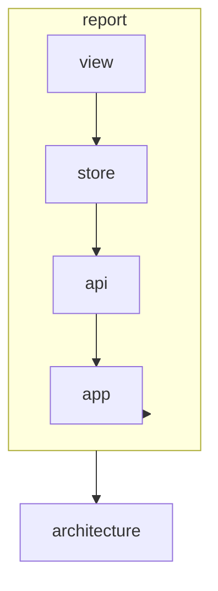

# AGENTS.md: Модуль Report (Frontend)

Модуль генерации и отображения explain-отчетов. Позволяет просматривать структурированные отчеты по endpoint, классу и методу.

---

## Ответственность

- Генерация explain-отчетов по endpoint
- Генерация explain-отчетов по классу
- Генерация explain-отчетов по методу
- Экспорт контекста для LLM
- Отображение структурированных отчетов

---

## Структура модуля

```
src/main/vue/report/
├── asset/
│   └── report.css                     # Стили модуля
├── view/
│   ├── ReportView.vue                 # Главная страница отчетов
│   ├── EndpointReportView.vue         # Отчет по endpoint
│   ├── ClassReportView.vue            # Отчет по классу
│   ├── MethodReportView.vue           # Отчет по методу
│   └── components/
│       ├── ReportHeader.vue           # Заголовок отчета
│       ├── ReportSection.vue          # Секция отчета
│       ├── DependencyList.vue         # Список зависимостей
│       ├── CallChainGraph.vue         # Граф вызовов
│       ├── MethodList.vue             # Список методов
│       └── LlmExportPanel.vue         # Панель экспорта для LLM
├── store/
│   ├── index.ts
│   ├── state.ts
│   ├── mutations.ts
│   ├── actions.ts
│   └── getters.ts
├── router/
│   └── index.ts
├── service/
│   └── ReportService.ts
└── api/
    └── ReportApi.ts
```

---

## Компоненты

### ClassReportView.vue

```vue
<template>
  <div class="class-report-view" name="class-report-view">
    <ReportHeader 
      :title="report?.classInfo?.name || 'Loading...'"
      :type="'CLASS'"
      :summary="report?.summary"
    />
    
    <div v-if="isLoading" class="report-loading" role="status">
      Generating report...
    </div>
    
    <div v-else-if="report" class="report-content">
      <section class="report-section" name="section-info">
        <h2>Class Information</h2>
        <dl class="info-list">
          <dt>Full Name</dt>
          <dd name="info-fullname">{{ report.classInfo.fullName }}</dd>
          
          <dt>Package</dt>
          <dd name="info-package">{{ report.classInfo.packageName }}</dd>
          
          <dt>Labels</dt>
          <dd name="info-labels">
            <span 
              v-for="label in report.classInfo.labels" 
              :key="label"
              :class="['label', `label--${label.toLowerCase()}`]"
            >
              {{ label }}
            </span>
          </dd>
        </dl>
      </section>
      
      <section class="report-section" name="section-methods">
        <h2>Methods ({{ report.methods?.length || 0 }})</h2>
        <MethodList 
          :methods="report.methods"
          @select="navigateToMethod"
        />
      </section>
      
      <section class="report-section" name="section-dependencies">
        <h2>Dependencies ({{ report.dependencies?.length || 0 }})</h2>
        <DependencyList 
          :dependencies="report.dependencies"
          @select="navigateToClass"
        />
      </section>
      
      <section class="report-section" name="section-dependents">
        <h2>Used By ({{ report.dependents?.length || 0 }})</h2>
        <DependencyList 
          :dependencies="report.dependents"
          @select="navigateToClass"
        />
      </section>
      
      <section 
        v-if="report.exposedEndpoints?.length" 
        class="report-section"
        name="section-endpoints"
      >
        <h2>Exposed Endpoints</h2>
        <ul class="endpoint-list">
          <li 
            v-for="endpoint in report.exposedEndpoints" 
            :key="endpoint.id"
            :name="`endpoint-${endpoint.httpMethod}-${endpoint.path}`"
            @click="navigateToEndpoint(endpoint.id)"
          >
            <span class="http-method" :class="`method--${endpoint.httpMethod.toLowerCase()}`">
              {{ endpoint.httpMethod }}
            </span>
            <span class="endpoint-path">{{ endpoint.path }}</span>
          </li>
        </ul>
      </section>
      
      <LlmExportPanel 
        :element-id="report.elementId"
        :type="'CLASS'"
        @export="exportToLlm"
      />
    </div>
  </div>
</template>

<script setup lang="ts">
import { computed, onMounted } from 'vue';
import { useStore } from 'vuex';
import { useRouter, useRoute } from 'vue-router';
import ReportHeader from './components/ReportHeader.vue';
import MethodList from './components/MethodList.vue';
import DependencyList from './components/DependencyList.vue';
import LlmExportPanel from './components/LlmExportPanel.vue';

const store = useStore();
const router = useRouter();
const route = useRoute();

const classId = computed(() => route.params.id as string);
const report = computed(() => store.state.report.currentReport);
const isLoading = computed(() => store.state.report.isLoading);

onMounted(() => {
  store.dispatch('report/fetchClassReport', classId.value);
});

function navigateToMethod(methodId: string) {
  router.push(`/report/method/${methodId}`);
}

function navigateToClass(classId: string) {
  router.push(`/report/class/${classId}`);
}

function navigateToEndpoint(endpointId: string) {
  router.push(`/report/endpoint/${endpointId}`);
}

async function exportToLlm() {
  const result = await store.dispatch('report/exportToLlm', {
    type: 'CLASS',
    id: classId.value
  });
  // Show export dialog or copy to clipboard
}
</script>
```

### EndpointReportView.vue

```vue
<template>
  <div class="endpoint-report-view" name="endpoint-report-view">
    <ReportHeader 
      :title="`${report?.endpoint?.httpMethod} ${report?.endpoint?.path || 'Loading...'}`"
      :type="'ENDPOINT'"
      :summary="report?.summary"
    />
    
    <div v-if="isLoading" class="report-loading" role="status">
      Generating report...
    </div>
    
    <div v-else-if="report" class="report-content">
      <section class="report-section" name="section-endpoint-info">
        <h2>Endpoint Information</h2>
        <dl class="info-list">
          <dt>Path</dt>
          <dd name="info-path">{{ report.endpoint.path }}</dd>
          
          <dt>HTTP Method</dt>
          <dd name="info-method">
            <span :class="['http-method', `method--${report.endpoint.httpMethod.toLowerCase()}`]">
              {{ report.endpoint.httpMethod }}
            </span>
          </dd>
          
          <dt>Produces</dt>
          <dd name="info-produces">{{ report.endpoint.produces || 'Not specified' }}</dd>
          
          <dt>Consumes</dt>
          <dd name="info-consumes">{{ report.endpoint.consumes || 'Not specified' }}</dd>
        </dl>
      </section>
      
      <section class="report-section" name="section-controller">
        <h2>Controller</h2>
        <div 
          class="class-link"
          :name="`controller-${report.controllerClass.id}`"
          @click="navigateToClass(report.controllerClass.id)"
        >
          <span class="class-name">{{ report.controllerClass.name }}</span>
          <span class="class-package">{{ report.controllerClass.packageName }}</span>
        </div>
      </section>
      
      <section class="report-section" name="section-exposing-method">
        <h2>Exposing Method</h2>
        <div 
          class="method-link"
          :name="`method-${report.exposingMethod.id}`"
          @click="navigateToMethod(report.exposingMethod.id)"
        >
          <code>{{ report.exposingMethod.signature }}</code>
        </div>
      </section>
      
      <section class="report-section" name="section-call-chain">
        <h2>Call Chain</h2>
        <CallChainGraph 
          :items="report.callChain"
          @select-method="navigateToMethod"
          @select-class="navigateToClass"
        />
      </section>
      
      <section class="report-section" name="section-dependencies">
        <h2>Controller Dependencies</h2>
        <DependencyList 
          :dependencies="report.dependencies"
          @select="navigateToClass"
        />
      </section>
      
      <LlmExportPanel 
        :element-id="report.elementId"
        :type="'ENDPOINT'"
        @export="exportToLlm"
      />
    </div>
  </div>
</template>

<script setup lang="ts">
import { computed, onMounted } from 'vue';
import { useStore } from 'vuex';
import { useRouter, useRoute } from 'vue-router';
import ReportHeader from './components/ReportHeader.vue';
import CallChainGraph from './components/CallChainGraph.vue';
import DependencyList from './components/DependencyList.vue';
import LlmExportPanel from './components/LlmExportPanel.vue';

const store = useStore();
const router = useRouter();
const route = useRoute();

const endpointId = computed(() => route.params.id as string);
const report = computed(() => store.state.report.currentReport);
const isLoading = computed(() => store.state.report.isLoading);

onMounted(() => {
  store.dispatch('report/fetchEndpointReport', endpointId.value);
});

function navigateToClass(classId: string) {
  router.push(`/report/class/${classId}`);
}

function navigateToMethod(methodId: string) {
  router.push(`/report/method/${methodId}`);
}

async function exportToLlm() {
  await store.dispatch('report/exportToLlm', {
    type: 'ENDPOINT',
    id: endpointId.value
  });
}
</script>
```

### CallChainGraph.vue

```vue
<template>
  <div class="call-chain-graph" name="call-chain-graph">
    <div v-if="items.length === 0" class="empty-state">
      No call chain data available
    </div>
    
    <div v-else class="call-chain-tree">
      <div 
        v-for="item in items" 
        :key="`${item.className}-${item.methodName}-${item.depth}`"
        class="call-chain-item"
        :style="{ paddingLeft: `${item.depth * 20}px` }"
        :name="`call-item-${item.depth}-${item.methodName}`"
      >
        <span class="depth-indicator">{{ '─'.repeat(item.depth) }}</span>
        
        <span 
          class="method-name"
          @click="$emit('select-method', item.methodId)"
        >
          {{ item.methodName }}
        </span>
        
        <span class="in">in</span>
        
        <span 
          class="class-name"
          @click="$emit('select-class', item.classId)"
        >
          {{ item.serviceName || item.className }}
        </span>
      </div>
    </div>
  </div>
</template>

<script setup lang="ts">
interface Props {
  items: CallChainItem[];
}

defineProps<Props>();
defineEmits(['select-method', 'select-class']);
</script>
```

### LlmExportPanel.vue

```vue
<template>
  <div class="llm-export-panel" name="llm-export-panel">
    <h3>Export for LLM</h3>
    
    <div class="export-options">
      <label>
        <input 
          type="radio" 
          name="export-format"
          value="json"
          v-model="format"
        />
        JSON
      </label>
      
      <label>
        <input 
          type="radio" 
          name="export-format"
          value="markdown"
          v-model="format"
        />
        Markdown
      </label>
      
      <label>
        <input 
          type="radio" 
          name="export-format"
          value="prompt"
          v-model="format"
        />
        Prompt Template
      </label>
    </div>
    
    <div class="export-actions">
      <button 
        name="btn-copy-export"
        @click="copyToClipboard"
      >
        Copy to Clipboard
      </button>
      
      <button 
        name="btn-download-export"
        @click="downloadExport"
      >
        Download
      </button>
    </div>
    
    <div v-if="exportedContent" class="export-preview">
      <h4>Preview</h4>
      <pre name="export-preview-content">{{ exportedContent }}</pre>
    </div>
  </div>
</template>

<script setup lang="ts">
import { ref } from 'vue';
import { useStore } from 'vuex';

interface Props {
  elementId: string;
  type: 'CLASS' | 'METHOD' | 'ENDPOINT';
}

const props = defineProps<Props>();
const emit = defineEmits(['export']);

const store = useStore();
const format = ref<'json' | 'markdown' | 'prompt'>('json');
const exportedContent = ref<string | null>(null);

async function copyToClipboard() {
  const content = await getExportContent();
  await navigator.clipboard.writeText(content);
}

async function downloadExport() {
  const content = await getExportContent();
  const blob = new Blob([content], { type: 'application/json' });
  const url = URL.createObjectURL(blob);
  const a = document.createElement('a');
  a.href = url;
  a.download = `export-${props.type.toLowerCase()}-${props.elementId}.json`;
  a.click();
  URL.revokeObjectURL(url);
}

async function getExportContent(): Promise<string> {
  const result = await store.dispatch('report/exportToLlm', {
    type: props.type,
    id: props.elementId,
    format: format.value
  });
  
  exportedContent.value = JSON.stringify(result, null, 2);
  return exportedContent.value;
}
</script>
```

---

## Vuex Store

### state.ts

```typescript
/**
 * Состояние модуля report.
 */
export interface ReportState {
  currentReport: ExplainReport | null;
  llmExport: LlmContextExport | null;
  isLoading: boolean;
  error: string | null;
}

export const state: ReportState = {
  currentReport: null,
  llmExport: null,
  isLoading: false,
  error: null,
};
```

### actions.ts

```typescript
import { ActionTree } from 'vuex';
import { ReportState } from './state';
import { RootState } from '@/app/store';
import { ReportApi } from '../api/ReportApi';

export const actions: ActionTree<ReportState, RootState> = {
  
  async fetchEndpointReport({ commit }, id: string) {
    commit('setLoading', true);
    commit('setError', null);
    
    try {
      const report = await ReportApi.getEndpointReport(id);
      commit('setCurrentReport', report);
    } catch (error) {
      commit('setError', error.message);
    } finally {
      commit('setLoading', false);
    }
  },
  
  async fetchClassReport({ commit }, id: string) {
    commit('setLoading', true);
    commit('setError', null);
    
    try {
      const report = await ReportApi.getClassReport(id);
      commit('setCurrentReport', report);
    } catch (error) {
      commit('setError', error.message);
    } finally {
      commit('setLoading', false);
    }
  },
  
  async fetchMethodReport({ commit }, id: string) {
    commit('setLoading', true);
    commit('setError', null);
    
    try {
      const report = await ReportApi.getMethodReport(id);
      commit('setCurrentReport', report);
    } catch (error) {
      commit('setError', error.message);
    } finally {
      commit('setLoading', false);
    }
  },
  
  async exportToLlm({ commit }, { type, id, format }: { type: string; id: string; format?: string }) {
    try {
      const exportData = await ReportApi.exportToLlm(type, id, format);
      commit('setLlmExport', exportData);
      return exportData;
    } catch (error) {
      commit('setError', error.message);
      throw error;
    }
  },
};
```

---

## API

### ReportApi.ts

```typescript
import { apiClient } from '@/app/api/client';
import { 
  EndpointReport, 
  ClassReport, 
  MethodReport,
  LlmContextExport 
} from '../domain/Report';

export const ReportApi = {
  
  async getEndpointReport(id: string): Promise<EndpointReport> {
    const response = await apiClient.get(`/api/v1/explain/endpoint/${id}`);
    return response.data;
  },
  
  async getClassReport(id: string): Promise<ClassReport> {
    const response = await apiClient.get(`/api/v1/explain/class/${id}`);
    return response.data;
  },
  
  async getMethodReport(id: string): Promise<MethodReport> {
    const response = await apiClient.get(`/api/v1/explain/method/${id}`);
    return response.data;
  },
  
  async exportToLlm(type: string, id: string, format?: string): Promise<LlmContextExport> {
    const response = await apiClient.get(`/api/v1/export/${type.toLowerCase()}/${id}/llm`, {
      params: { format }
    });
    return response.data;
  },
};
```

---

## Доменные модели

### domain/Report.ts

```typescript
export interface ExplainReport {
  elementId: string;
  reportType: 'ENDPOINT' | 'CLASS' | 'METHOD';
  summary: string;
  sections: ReportSection[];
  generatedAt: string;
}

export interface EndpointReport extends ExplainReport {
  reportType: 'ENDPOINT';
  endpoint: EndpointInfo;
  exposingMethod: MethodInfo;
  controllerClass: ClassInfo;
  callChain: CallChainItem[];
  dependencies: DependencyInfo[];
}

export interface ClassReport extends ExplainReport {
  reportType: 'CLASS';
  classInfo: ClassInfo;
  methods: MethodInfo[];
  dependencies: DependencyInfo[];
  dependents: DependencyInfo[];
  exposedEndpoints: EndpointInfo[];
}

export interface MethodReport extends ExplainReport {
  reportType: 'METHOD';
  methodInfo: MethodInfo;
  parentClass: ClassInfo;
  calledMethods: MethodCallInfo[];
  callingMethods: MethodCallInfo[];
  fieldAccesses: FieldAccessInfo[];
}

export interface CallChainItem {
  methodId: string;
  methodName: string;
  classId: string;
  className: string;
  serviceName: string;
  depth: number;
}

export interface LlmContextExport {
  contextType: string;
  elementId: string;
  summary: string;
  structuredData: object;
  promptTemplate?: string;
}
```

---

## Роутинг

```typescript
import { RouteRecordRaw } from 'vue-router';
import EndpointReportView from '../view/EndpointReportView.vue';
import ClassReportView from '../view/ClassReportView.vue';
import MethodReportView from '../view/MethodReportView.vue';

export const reportRoutes: RouteRecordRaw[] = [
  {
    path: '/report/endpoint/:id',
    name: 'endpoint-report',
    component: EndpointReportView,
    meta: { title: 'Endpoint Report' },
  },
  {
    path: '/report/class/:id',
    name: 'class-report',
    component: ClassReportView,
    meta: { title: 'Class Report' },
  },
  {
    path: '/report/method/:id',
    name: 'method-report',
    component: MethodReportView,
    meta: { title: 'Method Report' },
  },
];
```

---

## Зависимости



---

## Тестирование

### E2E тесты

```typescript
// report-generation.cy.ts
describe('Report Generation', () => {
  
  beforeEach(() => {
    cy.resetDatabase();
    cy.createTestClassWithMethods({
      name: 'UserController',
      labels: ['RestController'],
      methods: [
        { name: 'getUsers', signature: 'public List<User> getUsers()' }
      ]
    });
  });
  
  it('should generate class report', () => {
    cy.visit('/report/class/test-class-id');
    
    cy.get('[name="class-report-view"]').should('be.visible');
    cy.get('[name="info-fullname"]').should('contain', 'UserController');
    cy.get('[name="info-labels"]').should('contain', 'RestController');
  });
  
  it('should navigate to method report from class report', () => {
    cy.visit('/report/class/test-class-id');
    
    cy.get('[name^="method-item-"]').first().click();
    
    cy.url().should('include', '/report/method/');
  });
  
  it('should export report for LLM', () => {
    cy.visit('/report/class/test-class-id');
    
    cy.get('[name="btn-copy-export"]').click();
    
    cy.get('[name="export-preview-content"]').should('be.visible');
  });
});