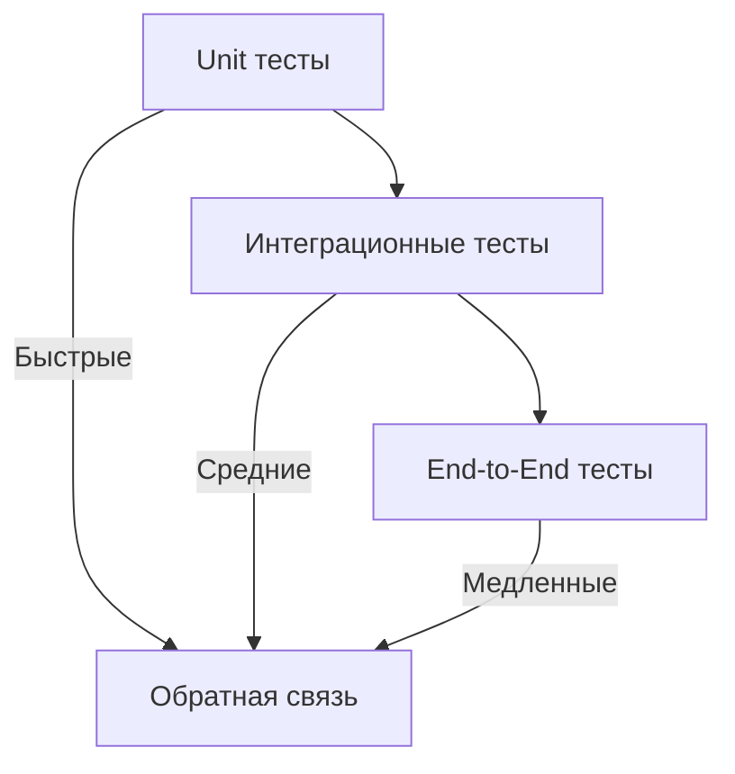

# AGENTS.md: Правила тестирования Backend (JUnit)

Данный документ содержит специфические правила и стандарты для тестирования backend-части проекта SpringTwin.

---

## Технологический стек

- **Фреймворк**: JUnit 5
- **Моки**: Mockito
- **Интеграция**: Spring Boot Test
- **Контейнеры**: Testcontainers (Neo4j)
- **Профили**: Тестовые профили для данных

---

## Принципы тестирования

### TDD (Test-Driven Development)

1. Пишите тесты до реализации логики
2. Красный тест → Зеленый тест → Рефакторинг
3. Минимальный код для прохождения теста

### Уровни тестирования



---

## Структура тестов

### Организация по модулям

```
src/test/java/twin/spring/
├── app/
│   ├── api/
│   ├── service/
│   └── integration/
├── project/
│   ├── api/
│   ├── service/
│   └── repository/
├── architecture/
│   ├── api/
│   ├── service/
│   └── repository/
├── analysis/
│   ├── api/
│   ├── service/
│   └── repository/
├── report/
│   ├── api/
│   ├── service/
│   └── repository/
├── migration/
│   └── integration/
└── mcp/
    ├── api/
    └── service/
```

### Именование тестов

```java
// Класс теста
<Project><Layer>Test.java

// Примеры
ProjectServiceTest.java
ProjectRepositoryTest.java
ProjectControllerTest.java
```

### Именование методов теста

```java
// Формат: methodName_scenario_expectedResult
@Test
void findById_existingId_returnsProject() { }

@Test
void findById_nonExistingId_throwsException() { }

@Test
void create_validRequest_returnsCreatedProject() { }
```

---

## Тестовые профили

### Концепция

Тестовые профили - это специальные классы, заполняющие модели и DTO для повторного использования в различных тестах.

### Структура профиля

```java
/**
 * Тестовый профиль для проектов.
 */
@Component
@Profile("test")
public class ProjectTestProfile {
    
    /**
     * Создает тестовый проект с базовыми данными.
     */
    public static Project createDefaultProject() {
        return Project.builder()
            .id("test-project-id")
            .name("Test Project")
            .path("/path/to/project")
            .includePackages(List.of("com.example"))
            .excludePackages(List.of("com.example.config"))
            .build();
    }
    
    /**
     * Создает тестовый проект с кастомными данными.
     */
    public static Project createProject(String name, String path) {
        return Project.builder()
            .id(UUID.randomUUID().toString())
            .name(name)
            .path(path)
            .includePackages(List.of("com.example"))
            .excludePackages(List.of())
            .build();
    }
    
    /**
     * Создает список тестовых проектов.
     */
    public static List<Project> createProjectList(int count) {
        return IntStream.range(0, count)
            .mapToObj(i -> createProject("Project " + i, "/path/" + i))
            .collect(Collectors.toList());
    }
    
    /**
     * Создает тестовый запрос на создание проекта.
     */
    public static CreateProjectRequest createDefaultRequest() {
        return CreateProjectRequest.builder()
            .name("New Project")
            .path("/path/to/new/project")
            .includePackages(List.of("com.newproject"))
            .excludePackages(List.of())
            .build();
    }
}
```

### Использование профилей

```java
@Test
void findById_existingId_returnsProject() {
    // Arrange
    Project expectedProject = ProjectTestProfile.createDefaultProject();
    when(projectRepository.findById("test-project-id"))
        .thenReturn(Mono.just(expectedProject));
    
    // Act
    StepVerifier.create(projectService.findById("test-project-id"))
        // Assert
        .expectNextMatches(response -> 
            response.getName().equals("Test Project") &&
            response.getPath().equals("/path/to/project")
        )
        .verifyComplete();
}
```

---

## Unit тесты

### Структура теста (AAA Pattern)

```java
@Test
void methodName_scenario_expectedResult() {
    // Arrange (Подготовка)
    
    // Act (Действие)
    
    // Assert (Проверка)
}
```

### Тестирование сервисов

```java
@ExtendWith(MockitoExtension.class)
class ProjectServiceTest {
    
    @Mock
    private ProjectRepository projectRepository;
    
    @Mock
    private ProjectMapper projectMapper;
    
    @InjectMocks
    private ProjectService projectService;
    
    @Test
    void findById_existingId_returnsProject() {
        // Arrange
        Project project = ProjectTestProfile.createDefaultProject();
        ProjectResponse response = ProjectTestProfile.createDefaultResponse();
        
        when(projectRepository.findById("test-project-id"))
            .thenReturn(Mono.just(project));
        when(projectMapper.toResponse(project))
            .thenReturn(response);
        
        // Act & Assert
        StepVerifier.create(projectService.findById("test-project-id"))
            .expectNext(response)
            .verifyComplete();
    }
    
    @Test
    void findById_nonExistingId_throwsException() {
        // Arrange
        when(projectRepository.findById("non-existing-id"))
            .thenReturn(Mono.empty());
        
        // Act & Assert
        StepVerifier.create(projectService.findById("non-existing-id"))
            .expectError(ProjectNotFoundException.class)
            .verify();
    }
}
```

### Тестирование реактивных методов

```java
@Test
void findAll_returnsAllProjects() {
    // Arrange
    List<Project> projects = ProjectTestProfile.createProjectList(3);
    
    when(projectRepository.findAll())
        .thenReturn(Flux.fromIterable(projects));
    
    // Act & Assert
    StepVerifier.create(projectService.findAll())
        .expectNextCount(3)
        .verifyComplete();
}

@Test
void create_validRequest_savesProject() {
    // Arrange
    CreateProjectRequest request = ProjectTestProfile.createDefaultRequest();
    Project project = ProjectTestProfile.createDefaultProject();
    
    when(projectMapper.toEntity(request)).thenReturn(project);
    when(projectRepository.save(project)).thenReturn(Mono.just(project));
    
    // Act & Assert
    StepVerifier.create(projectService.create(request))
        .expectNextCount(1)
        .verifyComplete();
    
    verify(projectRepository).save(project);
}
```

---

## Интеграционные тесты

### Testcontainers для Neo4j

```java
@SpringBootTest
@Testcontainers
class ProjectRepositoryIntegrationTest {
    
    @Container
    static Neo4jContainer<?> neo4jContainer = new Neo4jContainer<>("neo4j:5.15")
        .withoutAuthentication();
    
    @DynamicPropertySource
    static void neo4jProperties(DynamicPropertyRegistry registry) {
        registry.add("spring.neo4j.uri", neo4jContainer::getBoltUrl);
        registry.add("spring.neo4j.authentication.username", () -> "neo4j");
        registry.add("spring.neo4j.authentication.password", () -> "");
    }
    
    @Autowired
    private ProjectRepository projectRepository;
    
    @Test
    void save_andFindById_returnsProject() {
        // Arrange
        Project project = ProjectTestProfile.createDefaultProject();
        
        // Act
        Project saved = projectRepository.save(project).block();
        Project found = projectRepository.findById(saved.getId()).block();
        
        // Assert
        assertThat(found).isNotNull();
        assertThat(found.getName()).isEqualTo("Test Project");
    }
}
```

---

## E2E тесты (WebTestClient)

### Тестирование контроллеров

```java
@SpringBootTest(webEnvironment = SpringBootTest.WebEnvironment.RANDOM_PORT)
class ProjectControllerE2ETest {
    
    @Autowired
    private WebTestClient webTestClient;
    
    @MockBean
    private ProjectService projectService;
    
    @Test
    void getById_existingId_returnsProject() {
        // Arrange
        ProjectResponse response = ProjectTestProfile.createDefaultResponse();
        when(projectService.findById("test-project-id"))
            .thenReturn(Mono.just(response));
        
        // Act & Assert
        webTestClient.get()
            .uri("/api/v1/projects/test-project-id")
            .exchange()
            .expectStatus().isOk()
            .expectBody(ProjectResponse.class)
            .isEqualTo(response);
    }
    
    @Test
    void create_validRequest_returnsCreatedProject() {
        // Arrange
        CreateProjectRequest request = ProjectTestProfile.createDefaultRequest();
        ProjectResponse response = ProjectTestProfile.createDefaultResponse();
        
        when(projectService.create(request))
            .thenReturn(Mono.just(response));
        
        // Act & Assert
        webTestClient.post()
            .uri("/api/v1/projects")
            .contentType(MediaType.APPLICATION_JSON)
            .bodyValue(request)
            .exchange()
            .expectStatus().isCreated()
            .expectBody(ProjectResponse.class)
            .isEqualTo(response);
    }
}
```

---

## Моки (Mockito)

### Основные паттерны

```java
// Возврат значения
when(repository.findById("id")).thenReturn(Mono.just(entity));

// Возврат пустого результата
when(repository.findById("id")).thenReturn(Mono.empty());

// Выброс исключения
when(repository.findById("id")).thenReturn(Mono.error(new NotFoundException()));

// Проверка вызова
verify(repository).save(any(Project.class));
verify(repository, times(1)).findById("id");
verify(repository, never()).delete(any());
```

---

## Покрытие тестами

### Требования

- Все публичные методы сервисов должны покрываться unit тестами
- Все методы контроллеров должны покрываться E2E тестами
- Критические сценарии должны покрываться интеграционными тестами

### Запуск тестов

```bash
# Все тесты
gradlew.bat test

# Тесты конкретного модуля
gradlew.bat :project:test

# Тесты с отчетом о покрытии
gradlew.bat test jacocoTestReport
```

---

## Best Practices

### 1. Изоляция тестов

```java
// Каждый тест должен быть независимым
@BeforeEach
void setUp() {
    // Сброс состояния перед каждым тестом
    Mockito.reset(dependency);
}
```

### 2. Читаемость

```java
// Используйте осмысленные имена переменных
Project existingProject = ProjectTestProfile.createDefaultProject();
ProjectResponse expectedResponse = projectMapper.toResponse(existingProject);

// Не используйте магические значения
String existingId = "test-project-id";
String nonExistingId = "non-existing-id";
```

### 3. Тестирование граничных случаев

```java
@Test
void create_emptyName_throwsValidationException() {
    CreateProjectRequest request = CreateProjectRequest.builder()
        .name("")  // Пустое имя
        .path("/path")
        .build();
    
    StepVerifier.create(projectService.create(request))
        .expectError(ValidationException.class)
        .verify();
}

@Test
void create_nullPath_throwsValidationException() {
    CreateProjectRequest request = CreateProjectRequest.builder()
        .name("Project")
        .path(null)  // Null путь
        .build();
    
    StepVerifier.create(projectService.create(request))
        .expectError(ValidationException.class)
        .verify();
}
```

### 4. Тестирование ошибок

При исправлении ошибок добавляйте автотесты на найденные ошибочные сценарии:

```java
@Test
void findById_concurrentAccess_handlesGracefully() {
    // Тест для бага #123: ConcurrentModificationException при одновременном доступе
    
    // Arrange
    Project project = ProjectTestProfile.createDefaultProject();
    when(projectRepository.findById("test-id"))
        .thenReturn(Mono.just(project));
    
    // Act - одновременный доступ
    Flux<ProjectResponse> results = Flux.merge(
        projectService.findById("test-id"),
        projectService.findById("test-id")
    );
    
    // Assert - оба запроса должны успешно выполниться
    StepVerifier.create(results)
        .expectNextCount(2)
        .verifyComplete();
}
```

---

## Запуск после завершения задачи

Всегда запускайте выполнение тестов после выполнения задачи:

```bash
gradlew.bat clean build
```

Задача не считается выполненной, пока все тесты не пройдут успешно.