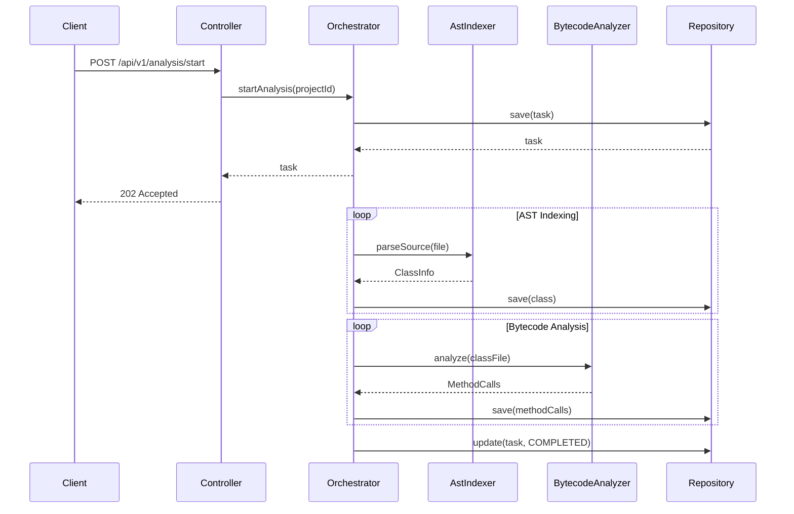
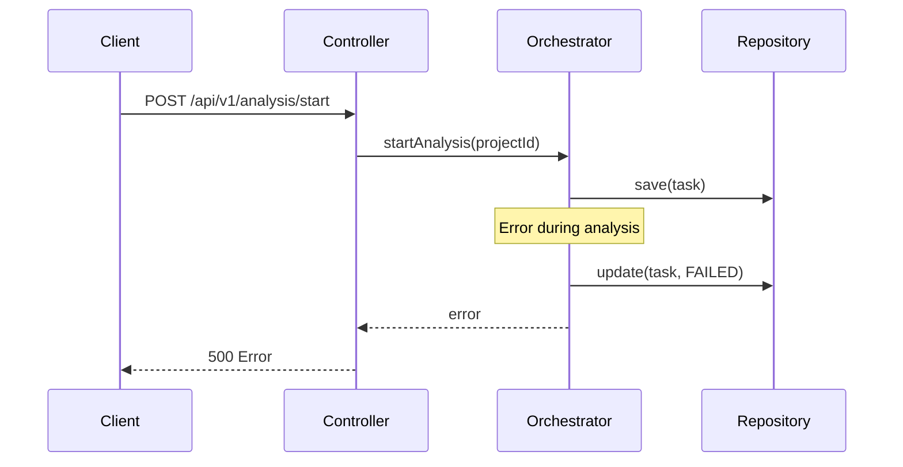

# AGENTS.md: Тестирование модуля Analysis (Backend)

Правила и структура тестирования для модуля analysis. Содержит тестовые профили для процессов индексации и анализа байткода.

---

## Структура тестов

```
src/test/java/twin/spring/analysis/
├── api/
│   ├── AnalysisControllerTest.java
│   └── AnalysisControllerIntegrationTest.java
├── service/
│   ├── AstIndexerServiceTest.java
│   ├── BytecodeAnalyzerServiceTest.java
│   ├── AnalysisOrchestratorServiceTest.java
│   └── SpringAnnotationDetectorTest.java
├── repository/
│   └── AnalysisTaskRepositoryTest.java
├── profile/
│   ├── AnalysisTestProfile.java
│   ├── AstTestData.java
│   └── BytecodeTestData.java
└── util/
    ├── TestJavaFileBuilder.java
    └── TestClassFileBuilder.java
```

---

## Тестовые профили

### AnalysisTestProfile.java

```java
/**
 * Тестовый профиль для модуля Analysis.
 */
@Component
public class AnalysisTestProfile {
    
    /**
     * Создает тестовую задачу анализа.
     */
    public static AnalysisTask createAnalysisTask() {
        return AnalysisTask.builder()
            .id(UUID.randomUUID().toString())
            .projectId("test-project-id")
            .status(AnalysisStatus.PENDING)
            .startedAt(LocalDateTime.now())
            .completedAt(null)
            .classesFound(0)
            .methodsFound(0)
            .endpointsFound(0)
            .errorMessage(null)
            .build();
    }
    
    /**
     * Создает выполненную задачу анализа.
     */
    public static AnalysisTask createCompletedTask() {
        return AnalysisTask.builder()
            .id(UUID.randomUUID().toString())
            .projectId("test-project-id")
            .status(AnalysisStatus.COMPLETED)
            .startedAt(LocalDateTime.now().minusMinutes(5))
            .completedAt(LocalDateTime.now())
            .classesFound(10)
            .methodsFound(50)
            .endpointsFound(5)
            .errorMessage(null)
            .build();
    }
    
    /**
     * Создает задачу анализа с ошибкой.
     */
    public static AnalysisTask createFailedTask() {
        return AnalysisTask.builder()
            .id(UUID.randomUUID().toString())
            .projectId("test-project-id")
            .status(AnalysisStatus.FAILED)
            .startedAt(LocalDateTime.now().minusMinutes(1))
            .completedAt(LocalDateTime.now())
            .classesFound(0)
            .methodsFound(0)
            .endpointsFound(0)
            .errorMessage("Project path not found")
            .build();
    }
    
    /**
     * Создает результат анализа.
     */
    public static AnalysisResult createAnalysisResult() {
        return AnalysisResult.builder()
            .taskId("test-task-id")
            .projectId("test-project-id")
            .stats(AnalysisStats.builder()
                .classesFound(10)
                .methodsFound(50)
                .endpointsFound(5)
                .dependenciesFound(15)
                .byLabel(Map.of(
                    "Service", 3,
                    "RestController", 2,
                    "Repository", 5
                ))
                .build())
            .build();
    }
    
    /**
     * Создает тестовый Java файл для анализа.
     */
    public static String createTestJavaSource() {
        return """
            package com.example.service;
            
            import org.springframework.stereotype.Service;
            import com.example.repository.UserRepository;
            
            @Service
            public class UserService {
                
                private final UserRepository userRepository;
                
                public UserService(UserRepository userRepository) {
                    this.userRepository = userRepository;
                }
                
                public List<User> getAllUsers() {
                    return userRepository.findAll();
                }
            }
            """;
    }
    
    /**
     * Создает тестовый Controller для анализа.
     */
    public static String createTestControllerSource() {
        return """
            package com.example.controller;
            
            import org.springframework.web.bind.annotation.*;
            import com.example.service.UserService;
            
            @RestController
            @RequestMapping("/api/users")
            public class UserController {
                
                private final UserService userService;
                
                public UserController(UserService userService) {
                    this.userService = userService;
                }
                
                @GetMapping
                public List<User> getUsers() {
                    return userService.getAllUsers();
                }
                
                @GetMapping("/{id}")
                public User getUserById(@PathVariable Long id) {
                    return userService.findById(id);
                }
            }
            """;
    }
}
```

### AstTestData.java

```java
/**
 * Тестовые данные для AST анализа.
 */
public final class AstTestData {
    
    public static final String SERVICE_CLASS_NAME = "UserService";
    public static final String SERVICE_PACKAGE = "com.example.service";
    public static final String SERVICE_FULL_NAME = "com.example.service.UserService";
    
    public static final String CONTROLLER_CLASS_NAME = "UserController";
    public static final String CONTROLLER_PACKAGE = "com.example.controller";
    
    public static final List<String> EXPECTED_SERVICE_ANNOTATIONS = List.of("Service");
    public static final List<String> EXPECTED_CONTROLLER_ANNOTATIONS = List.of("RestController");
    
    private AstTestData() {}
}
```

---

## Unit тесты

### AstIndexerServiceTest.java

```java
/**
 * Unit тесты для AstIndexerService.
 */
@ExtendWith(MockitoExtension.class)
class AstIndexerServiceTest {
    
    @Mock
    private ClassRepository classRepository;
    
    @Mock
    private MethodRepository methodRepository;
    
    @Mock
    private ProjectConfigurationService configService;
    
    @InjectMocks
    private AstIndexerService astIndexerService;
    
    @Test
    @DisplayName("Should parse Java class file")
    void parseClass_shouldExtractClassInfo() {
        // Given
        String source = AnalysisTestProfile.createTestJavaSource();
        ProjectConfig config = ProjectConfig.builder()
            .includePackages(List.of("com.example"))
            .excludePackages(List.of())
            .build();
        
        when(configService.getConfig()).thenReturn(Mono.just(config));
        
        // When
        StepVerifier.create(astIndexerService.parseSource(source))
            .expectNextMatches(classInfo -> 
                classInfo.getName().equals("UserService") &&
                classInfo.getPackageName().equals("com.example.service") &&
                classInfo.getLabels().contains("Service")
            )
            .verifyComplete();
    }
    
    @Test
    @DisplayName("Should detect Spring annotations")
    void parseClass_shouldDetectAnnotations() {
        // Given
        String source = AnalysisTestProfile.createTestControllerSource();
        
        // When
        StepVerifier.create(astIndexerService.parseSource(source))
            .expectNextMatches(classInfo -> 
                classInfo.getLabels().contains("RestController")
            )
            .verifyComplete();
    }
    
    @Test
    @DisplayName("Should extract methods from class")
    void parseClass_shouldExtractMethods() {
        // Given
        String source = AnalysisTestProfile.createTestJavaSource();
        
        // When
        StepVerifier.create(astIndexerService.parseSource(source))
            .expectNextMatches(classInfo -> 
                classInfo.getMethods() != null &&
                classInfo.getMethods().stream()
                    .anyMatch(m -> m.getName().equals("getAllUsers"))
            )
            .verifyComplete();
    }
    
    @Test
    @DisplayName("Should extract constructor injection dependencies")
    void parseClass_shouldExtractDependencies() {
        // Given
        String source = AnalysisTestProfile.createTestJavaSource();
        
        // When
        StepVerifier.create(astIndexerService.parseSource(source))
            .expectNextMatches(classInfo -> 
                classInfo.getDependencies() != null &&
                classInfo.getDependencies().stream()
                    .anyMatch(d -> d.getTargetClassName().contains("UserRepository"))
            )
            .verifyComplete();
    }
    
    @Test
    @DisplayName("Should filter by include packages")
    void shouldFilterByIncludePackages() {
        // Given
        String source = AnalysisTestProfile.createTestJavaSource();
        ProjectConfig config = ProjectConfig.builder()
            .includePackages(List.of("com.other"))
            .excludePackages(List.of())
            .build();
        
        when(configService.getConfig()).thenReturn(Mono.just(config));
        
        // When & Then
        StepVerifier.create(astIndexerService.shouldProcess("com.example.service.UserService"))
            .expectNext(false)
            .verifyComplete();
    }
    
    @Test
    @DisplayName("Should filter by exclude packages")
    void shouldFilterByExcludePackages() {
        // Given
        ProjectConfig config = ProjectConfig.builder()
            .includePackages(List.of("com.example"))
            .excludePackages(List.of("com.example.config"))
            .build();
        
        when(configService.getConfig()).thenReturn(Mono.just(config));
        
        // When & Then
        StepVerifier.create(astIndexerService.shouldProcess("com.example.config.AppConfig"))
            .expectNext(false)
            .verifyComplete();
    }
}
```

### BytecodeAnalyzerServiceTest.java

```java
/**
 * Unit тесты для BytecodeAnalyzerService.
 */
@ExtendWith(MockitoExtension.class)
class BytecodeAnalyzerServiceTest {
    
    @Mock
    private ClassRepository classRepository;
    
    @InjectMocks
    private BytecodeAnalyzerService bytecodeAnalyzer;
    
    @Test
    @DisplayName("Should analyze method calls from bytecode")
    void analyzeMethodCalls_shouldDetectCalls() {
        // Given
        byte[] bytecode = createTestClassBytecode();
        
        // When
        List<MethodCall> calls = bytecodeAnalyzer.analyzeMethodCalls(bytecode);
        
        // Then
        assertThat(calls).isNotEmpty();
        assertThat(calls.stream()
            .anyMatch(c -> c.getMethodName().equals("findAll")))
            .isTrue();
    }
    
    @Test
    @DisplayName("Should detect field accesses")
    void analyzeFieldAccesses_shouldDetectAccesses() {
        // Given
        byte[] bytecode = createTestClassBytecode();
        
        // When
        List<FieldAccess> accesses = bytecodeAnalyzer.analyzeFieldAccesses(bytecode);
        
        // Then
        assertThat(accesses).isNotEmpty();
    }
    
    @Test
    @DisplayName("Should detect object instantiations")
    void analyzeInstantiations_shouldDetectNewObjects() {
        // Given
        byte[] bytecode = createTestClassBytecode();
        
        // When
        List<Instantiation> instantiations = bytecodeAnalyzer.analyzeInstantiations(bytecode);
        
        // Then
        assertThat(instantiations).isNotNull();
    }
    
    private byte[] createTestClassBytecode() {
        // Return compiled test class bytecode
        return new byte[0]; // Placeholder
    }
}
```

### AnalysisOrchestratorServiceTest.java

```java
/**
 * Unit тесты для AnalysisOrchestratorService.
 */
@ExtendWith(MockitoExtension.class)
class AnalysisOrchestratorServiceTest {
    
    @Mock
    private AstIndexerService astIndexer;
    
    @Mock
    private BytecodeAnalyzerService bytecodeAnalyzer;
    
    @Mock
    private AnalysisTaskRepository taskRepository;
    
    @Mock
    private ClassRepository classRepository;
    
    @InjectMocks
    private AnalysisOrchestratorService orchestrator;
    
    @Test
    @DisplayName("Should start analysis and create task")
    void startAnalysis_shouldCreateTask() {
        // Given
        String projectId = "test-project-id";
        AnalysisTask task = AnalysisTestProfile.createAnalysisTask();
        
        when(taskRepository.save(any(AnalysisTask.class)))
            .thenReturn(Mono.just(task));
        
        // When & Then
        StepVerifier.create(orchestrator.startAnalysis(projectId))
            .expectNextMatches(t -> 
                t.getProjectId().equals(projectId) &&
                t.getStatus() == AnalysisStatus.PENDING
            )
            .verifyComplete();
    }
    
    @Test
    @DisplayName("Should update task progress")
    void updateProgress_shouldUpdateTask() {
        // Given
        AnalysisTask task = AnalysisTestProfile.createAnalysisTask();
        AnalysisProgress progress = AnalysisProgress.builder()
            .taskId(task.getId())
            .stage("AST_INDEXING")
            .percent(50)
            .message("Processing classes...")
            .build();
        
        when(taskRepository.findById(task.getId()))
            .thenReturn(Mono.just(task));
        when(taskRepository.save(any(AnalysisTask.class)))
            .thenReturn(Mono.just(task));
        
        // When & Then
        StepVerifier.create(orchestrator.updateProgress(progress))
            .verifyComplete();
    }
    
    @Test
    @DisplayName("Should complete analysis successfully")
    void completeAnalysis_shouldMarkCompleted() {
        // Given
        AnalysisTask task = AnalysisTestProfile.createAnalysisTask();
        AnalysisResult result = AnalysisTestProfile.createAnalysisResult();
        
        when(taskRepository.findById(task.getId()))
            .thenReturn(Mono.just(task));
        when(taskRepository.save(any(AnalysisTask.class)))
            .thenReturn(Mono.just(AnalysisTestProfile.createCompletedTask()));
        
        // When & Then
        StepVerifier.create(orchestrator.completeAnalysis(task.getId(), result))
            .verifyComplete();
    }
    
    @Test
    @DisplayName("Should handle analysis failure")
    void failAnalysis_shouldMarkFailed() {
        // Given
        AnalysisTask task = AnalysisTestProfile.createAnalysisTask();
        String errorMessage = "Analysis failed";
        
        when(taskRepository.findById(task.getId()))
            .thenReturn(Mono.just(task));
        when(taskRepository.save(any(AnalysisTask.class)))
            .thenReturn(Mono.just(AnalysisTestProfile.createFailedTask()));
        
        // When & Then
        StepVerifier.create(orchestrator.failAnalysis(task.getId(), errorMessage))
            .verifyComplete();
    }
}
```

---

## Интеграционные тесты

### AnalysisControllerIntegrationTest.java

```java
/**
 * Интеграционные тесты для Analysis API.
 */
@SpringBootTest
@AutoConfigureWebTestClient
@Testcontainers
class AnalysisControllerIntegrationTest {
    
    @Container
    static Neo4jContainer<?> neo4jContainer = new Neo4jContainer<>("neo4j:5.13");
    
    @Autowired
    private WebTestClient webTestClient;
    
    @Autowired
    private AnalysisTaskRepository taskRepository;
    
    @Autowired
    private ProjectRepository projectRepository;
    
    @BeforeEach
    void setUp() {
        taskRepository.deleteAll().block();
        projectRepository.deleteAll().block();
    }
    
    @Test
    @DisplayName("POST /api/v1/analysis/start - should start analysis")
    void startAnalysis_shouldStartTask() {
        // Given
        Project project = ProjectTestProfile.createDefaultProject();
        Project savedProject = projectRepository.save(project).block();
        
        StartAnalysisRequest request = StartAnalysisRequest.builder()
            .projectId(savedProject.getId())
            .analyzeBytecode(true)
            .detectEndpoints(true)
            .build();
        
        // When & Then
        webTestClient.post()
            .uri("/api/v1/analysis/start")
            .contentType(MediaType.APPLICATION_JSON)
            .bodyValue(request)
            .exchange()
            .expectStatus().isAccepted()
            .expectBody()
            .jsonPath("$.taskId").exists()
            .jsonPath("$.status").isEqualTo("PENDING");
    }
    
    @Test
    @DisplayName("GET /api/v1/analysis/{taskId}/status - should return status")
    void getStatus_shouldReturnTaskStatus() {
        // Given
        AnalysisTask task = AnalysisTestProfile.createAnalysisTask();
        AnalysisTask savedTask = taskRepository.save(task).block();
        
        // When & Then
        webTestClient.get()
            .uri("/api/v1/analysis/{taskId}/status", savedTask.getId())
            .exchange()
            .expectStatus().isOk()
            .expectBody()
            .jsonPath("$.status").isEqualTo("PENDING")
            .jsonPath("$.classesFound").isEqualTo(0);
    }
    
    @Test
    @DisplayName("GET /api/v1/analysis/{taskId}/result - should return result")
    void getResult_shouldReturnAnalysisResult() {
        // Given
        AnalysisTask task = AnalysisTestProfile.createCompletedTask();
        AnalysisTask savedTask = taskRepository.save(task).block();
        
        // When & Then
        webTestClient.get()
            .uri("/api/v1/analysis/{taskId}/result", savedTask.getId())
            .exchange()
            .expectStatus().isOk()
            .expectBody()
            .jsonPath("$.taskId").isEqualTo(savedTask.getId())
            .jsonPath("$.stats.classesFound").isEqualTo(10)
            .jsonPath("$.stats.methodsFound").isEqualTo(50);
    }
    
    @Test
    @DisplayName("GET /api/v1/analysis/history - should return history")
    void getHistory_shouldReturnAnalysisHistory() {
        // Given
        Project project = ProjectTestProfile.createDefaultProject();
        Project savedProject = projectRepository.save(project).block();
        
        AnalysisTask task1 = AnalysisTestProfile.createCompletedTask();
        task1.setProjectId(savedProject.getId());
        taskRepository.save(task1).block();
        
        // When & Then
        webTestClient.get()
            .uri(uriBuilder -> uriBuilder
                .path("/api/v1/analysis/history")
                .queryParam("projectId", savedProject.getId())
                .build())
            .exchange()
            .expectStatus().isOk()
            .expectBody()
            .jsonPath("$").isArray()
            .jsonPath("$[0].projectId").isEqualTo(savedProject.getId());
    }
    
    @Test
    @DisplayName("DELETE /api/v1/analysis/{taskId} - should cancel analysis")
    void cancelAnalysis_shouldCancelTask() {
        // Given
        AnalysisTask task = AnalysisTestProfile.createAnalysisTask();
        AnalysisTask savedTask = taskRepository.save(task).block();
        
        // When & Then
        webTestClient.delete()
            .uri("/api/v1/analysis/{taskId}", savedTask.getId())
            .exchange()
            .expectStatus().isNoContent();
    }
}
```

---

## Тестовые сценарии

### Сценарий: Полный цикл анализа



### Сценарий: Обработка ошибки анализа



---

## Критерии приемки

| Критерий | Описание |
|----------|----------|
| Покрытие кода | Минимум 80% для service |
| Unit тесты | Все методы сервисов покрыты |
| Интеграционные тесты | Все REST endpoints покрыты |
| AST анализ | Проверены все типы Spring аннотаций |
| Байткод анализ | Проверены method calls, field accesses |
| Фильтрация | Проверены include/exclude пакеты |