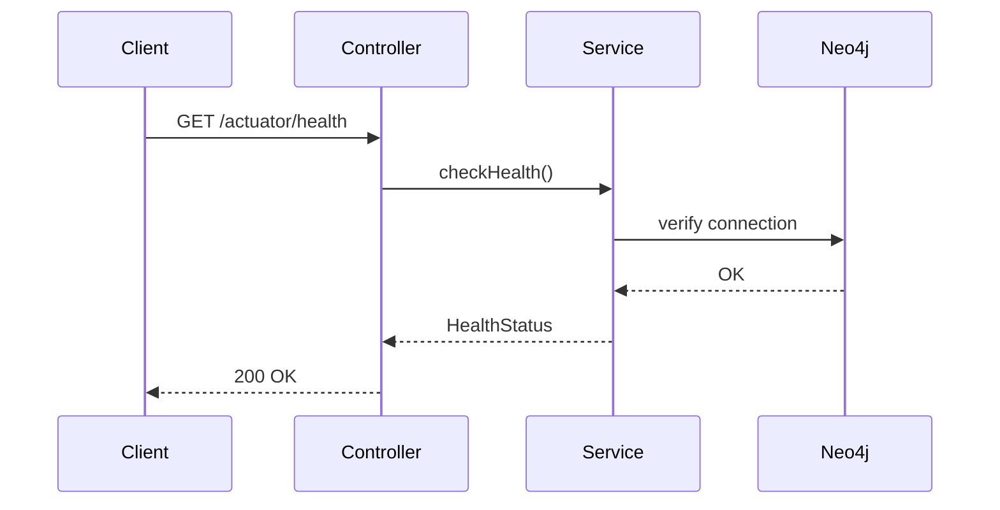
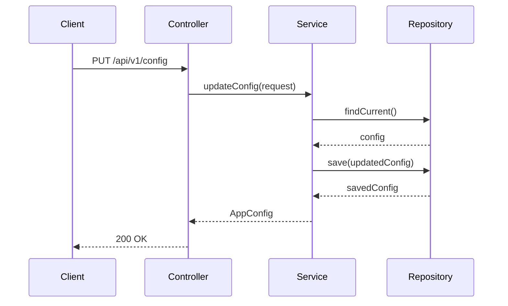

# AGENTS.md: Тестирование модуля App (Backend)

Правила и структура тестирования для корневого модуля app. Содержит тестовые профили для конфигурации и health checks.

---

## Структура тестов

```
src/test/java/twin/spring/app/
├── api/
│   ├── HealthControllerTest.java
│   ├── ConfigControllerTest.java
│   └── AppControllerIntegrationTest.java
├── service/
│   ├── AppConfigServiceTest.java
│   └── HealthCheckServiceTest.java
├── profile/
│   └── AppTestProfile.java
└── config/
    └── TestConfig.java
```

---

## Тестовые профили

### AppTestProfile.java

```java
/**
 * Тестовый профиль для модуля App.
 */
@Component
public class AppTestProfile {
    
    /**
     * Создает тестовую конфигурацию приложения.
     */
    public static AppConfig createAppConfig() {
        return AppConfig.builder()
            .appName("Spring Twin")
            .version("1.0.0")
            .neo4jMode("embedded")
            .includePackages(List.of("com.example"))
            .excludePackages(List.of("com.example.config"))
            .build();
    }
    
    /**
     * Создает тестовый health status.
     */
    public static HealthStatus createHealthyStatus() {
        return HealthStatus.builder()
            .status("UP")
            .timestamp(LocalDateTime.now())
            .components(Map.of(
                "neo4j", ComponentHealth.builder()
                    .status("UP")
                    .details(Map.of("mode", "embedded"))
                    .build(),
                "diskSpace", ComponentHealth.builder()
                    .status("UP")
                    .details(Map.of("free", "100GB"))
                    .build()
            ))
            .build();
    }
    
    /**
     * Создает тестовый health status с ошибкой.
     */
    public static HealthStatus createUnhealthyStatus() {
        return HealthStatus.builder()
            .status("DOWN")
            .timestamp(LocalDateTime.now())
            .components(Map.of(
                "neo4j", ComponentHealth.builder()
                    .status("DOWN")
                    .details(Map.of("error", "Connection refused"))
                    .build()
            ))
            .build();
    }
    
    /**
     * Создает тестовую конфигурацию Neo4j.
     */
    public static Neo4jConfig createNeo4jConfig() {
        return Neo4jConfig.builder()
            .mode("embedded")
            .uri("bolt://localhost:7687")
            .username("neo4j")
            .password("password")
            .build();
    }
    
    /**
     * Создает запрос на обновление конфигурации.
     */
    public static UpdateConfigRequest createUpdateConfigRequest() {
        return UpdateConfigRequest.builder()
            .includePackages(List.of("com.example", "org.example"))
            .excludePackages(List.of("com.example.dto"))
            .build();
    }
}
```

---

## Unit тесты

### HealthCheckServiceTest.java

```java
/**
 * Unit тесты для HealthCheckService.
 */
@ExtendWith(MockitoExtension.class)
class HealthCheckServiceTest {
    
    @Mock
    private Driver neo4jDriver;
    
    @Mock
    private Neo4jConfig neo4jConfig;
    
    @InjectMocks
    private HealthCheckService healthCheckService;
    
    @Test
    @DisplayName("Should return healthy status when all components are up")
    void checkHealth_shouldReturnHealthy() {
        // Given
        when(neo4jConfig.getMode()).thenReturn("embedded");
        
        // When
        HealthStatus status = healthCheckService.checkHealth().block();
        
        // Then
        assertThat(status).isNotNull();
        assertThat(status.getStatus()).isEqualTo("UP");
        assertThat(status.getComponents()).containsKey("neo4j");
    }
    
    @Test
    @DisplayName("Should return neo4j component status")
    void checkNeo4jHealth_shouldReturnComponentStatus() {
        // Given
        when(neo4jConfig.getMode()).thenReturn("embedded");
        
        // When
        ComponentHealth neo4jHealth = healthCheckService.checkNeo4jHealth().block();
        
        // Then
        assertThat(neo4jHealth).isNotNull();
        assertThat(neo4jHealth.getStatus()).isEqualTo("UP");
    }
    
    @Test
    @DisplayName("Should detect neo4j connection issues")
    void checkNeo4jHealth_shouldDetectConnectionIssues() {
        // Given
        when(neo4jConfig.getMode()).thenReturn("standalone");
        when(neo4jDriver.session()).thenThrow(new RuntimeException("Connection refused"));
        
        // When
        ComponentHealth neo4jHealth = healthCheckService.checkNeo4jHealth().block();
        
        // Then
        assertThat(neo4jHealth.getStatus()).isEqualTo("DOWN");
        assertThat(neo4jHealth.getDetails()).containsKey("error");
    }
}
```

### AppConfigServiceTest.java

```java
/**
 * Unit тесты для AppConfigService.
 */
@ExtendWith(MockitoExtension.class)
class AppConfigServiceTest {
    
    @Mock
    private AppConfigRepository configRepository;
    
    @Mock
    private AppConfigMapper configMapper;
    
    @InjectMocks
    private AppConfigService configService;
    
    @Test
    @DisplayName("Should return current configuration")
    void getConfig_shouldReturnConfig() {
        // Given
        AppConfig config = AppTestProfile.createAppConfig();
        when(configRepository.findCurrent()).thenReturn(Mono.just(config));
        
        // When & Then
        StepVerifier.create(configService.getConfig())
            .expectNextMatches(c -> c.getAppName().equals("Spring Twin"))
            .verifyComplete();
    }
    
    @Test
    @DisplayName("Should update include packages")
    void updateIncludePackages_shouldUpdate() {
        // Given
        AppConfig config = AppTestProfile.createAppConfig();
        UpdateConfigRequest request = AppTestProfile.createUpdateConfigRequest();
        
        when(configRepository.findCurrent()).thenReturn(Mono.just(config));
        when(configRepository.save(any())).thenReturn(Mono.just(config));
        
        // When & Then
        StepVerifier.create(configService.updateConfig(request))
            .expectNextMatches(c -> c.getIncludePackages().size() == 2)
            .verifyComplete();
    }
    
    @Test
    @DisplayName("Should update neo4j mode")
    void updateNeo4jMode_shouldUpdate() {
        // Given
        AppConfig config = AppTestProfile.createAppConfig();
        
        when(configRepository.findCurrent()).thenReturn(Mono.just(config));
        when(configRepository.save(any())).thenReturn(Mono.just(config));
        
        // When & Then
        StepVerifier.create(configService.updateNeo4jMode("standalone"))
            .expectNextMatches(c -> c.getNeo4jMode().equals("standalone"))
            .verifyComplete();
    }
}
```

---

## Интеграционные тесты

### AppControllerIntegrationTest.java

```java
/**
 * Интеграционные тесты для App API.
 */
@SpringBootTest
@AutoConfigureWebTestClient
@Testcontainers
class AppControllerIntegrationTest {
    
    @Container
    static Neo4jContainer<?> neo4jContainer = new Neo4jContainer<>("neo4j:5.13");
    
    @Autowired
    private WebTestClient webTestClient;
    
    @Test
    @DisplayName("GET /actuator/health - should return health status")
    void health_shouldReturnStatus() {
        webTestClient.get()
            .uri("/actuator/health")
            .exchange()
            .expectStatus().isOk()
            .expectBody()
            .jsonPath("$.status").isEqualTo("UP");
    }
    
    @Test
    @DisplayName("GET /api/v1/config - should return configuration")
    void getConfig_shouldReturnConfig() {
        webTestClient.get()
            .uri("/api/v1/config")
            .exchange()
            .expectStatus().isOk()
            .expectBody()
            .jsonPath("$.appName").isEqualTo("Spring Twin")
            .jsonPath("$.neo4jMode").exists();
    }
    
    @Test
    @DisplayName("PUT /api/v1/config - should update configuration")
    void updateConfig_shouldUpdate() {
        // Given
        UpdateConfigRequest request = AppTestProfile.createUpdateConfigRequest();
        
        // When & Then
        webTestClient.put()
            .uri("/api/v1/config")
            .contentType(MediaType.APPLICATION_JSON)
            .bodyValue(request)
            .exchange()
            .expectStatus().isOk()
            .expectBody()
            .jsonPath("$.includePackages").isArray()
            .jsonPath("$.includePackages.length()").isEqualTo(2);
    }
    
    @Test
    @DisplayName("GET /api/v1/info - should return app info")
    void getInfo_shouldReturnInfo() {
        webTestClient.get()
            .uri("/api/v1/info")
            .exchange()
            .expectStatus().isOk()
            .expectBody()
            .jsonPath("$.name").isEqualTo("Spring Twin")
            .jsonPath("$.version").exists();
    }
}
```

### HealthControllerTest.java

```java
/**
 * Тесты для HealthController.
 */
@WebFluxTest(HealthController.class)
class HealthControllerTest {
    
    @Autowired
    private WebTestClient webTestClient;
    
    @MockBean
    private HealthCheckService healthCheckService;
    
    @Test
    @DisplayName("Should return health status")
    void health_shouldReturnStatus() {
        // Given
        HealthStatus status = AppTestProfile.createHealthyStatus();
        when(healthCheckService.checkHealth()).thenReturn(Mono.just(status));
        
        // When & Then
        webTestClient.get()
            .uri("/actuator/health")
            .exchange()
            .expectStatus().isOk()
            .expectBody()
            .jsonPath("$.status").isEqualTo("UP");
    }
    
    @Test
    @DisplayName("Should return detailed health")
    void healthDetailed_shouldReturnDetails() {
        // Given
        HealthStatus status = AppTestProfile.createHealthyStatus();
        when(healthCheckService.checkHealth()).thenReturn(Mono.just(status));
        
        // When & Then
        webTestClient.get()
            .uri("/actuator/health?showDetails=always")
            .exchange()
            .expectStatus().isOk()
            .expectBody()
            .jsonPath("$.components.neo4j.status").isEqualTo("UP")
            .jsonPath("$.components.diskSpace.status").isEqualTo("UP");
    }
}
```

---

## Тестовые сценарии

### Сценарий: Health check



### Сценарий: Обновление конфигурации



---

## Критерии приемки

| Критерий | Описание |
|----------|----------|
| Health check | Возвращает статус всех компонентов |
| Конфигурация | Можно читать и обновлять |
| Neo4j modes | Поддержка embedded и standalone |
| Обработка ошибок | Ошибки корректно возвращаются |