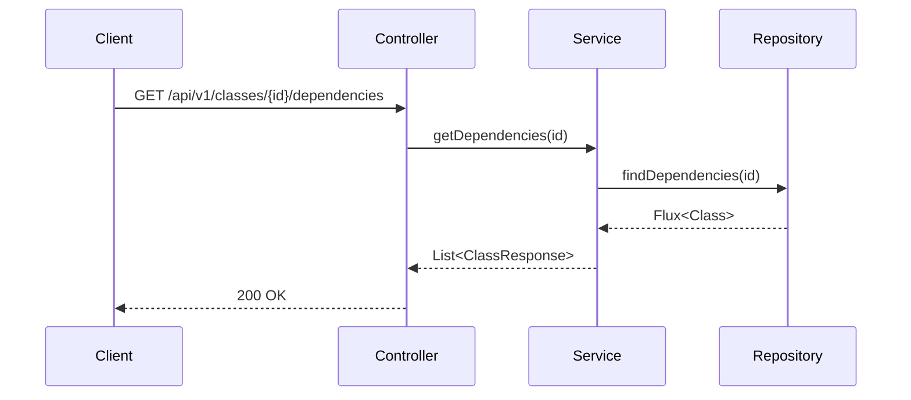
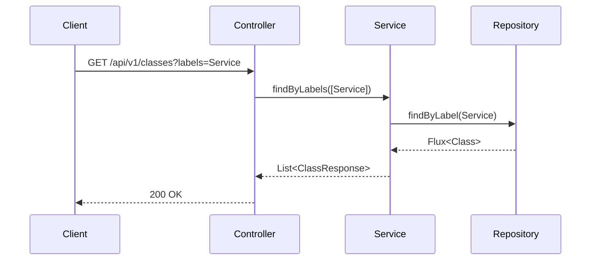

# AGENTS.md: Тестирование модуля Architecture (Backend)

Правила и структура тестирования для модуля architecture. Содержит тестовые профили для классов, методов, endpoints и связей между ними.

---

## Структура тестов

```
src/test/java/twin/spring/architecture/
├── api/
│   ├── ClassControllerTest.java
│   ├── MethodControllerTest.java
│   ├── EndpointControllerTest.java
│   └── ArchitectureControllerIntegrationTest.java
├── service/
│   ├── ClassServiceTest.java
│   ├── MethodServiceTest.java
│   ├── EndpointServiceTest.java
│   └── GraphServiceTest.java
├── repository/
│   ├── ClassRepositoryTest.java
│   ├── MethodRepositoryTest.java
│   └── EndpointRepositoryTest.java
├── profile/
│   ├── ArchitectureTestProfile.java
│   ├── ClassTestData.java
│   ├── MethodTestData.java
│   └── EndpointTestData.java
└── mapper/
    ├── ClassMapperTest.java
    ├── MethodMapperTest.java
    └── EndpointMapperTest.java
```

---

## Тестовые профили

### ArchitectureTestProfile.java

```java
/**
 * Тестовый профиль для модуля Architecture.
 */
@Component
public class ArchitectureTestProfile {
    
    /**
     * Создает тестовый класс Controller.
     */
    public static Class createControllerClass() {
        return Class.builder()
            .id(UUID.randomUUID().toString())
            .name("UserController")
            .fullName("com.example.controller.UserController")
            .packageName("com.example.controller")
            .labels(List.of("RestController", "Controller"))
            .modifiers(List.of("public"))
            .build();
    }
    
    /**
     * Создает тестовый класс Service.
     */
    public static Class createServiceClass() {
        return Class.builder()
            .id(UUID.randomUUID().toString())
            .name("UserService")
            .fullName("com.example.service.UserService")
            .packageName("com.example.service")
            .labels(List.of("Service"))
            .modifiers(List.of("public"))
            .build();
    }
    
    /**
     * Создает тестовый класс Repository.
     */
    public static Class createRepositoryClass() {
        return Class.builder()
            .id(UUID.randomUUID().toString())
            .name("UserRepository")
            .fullName("com.example.repository.UserRepository")
            .packageName("com.example.repository")
            .labels(List.of("Repository"))
            .modifiers(List.of("public", "interface"))
            .build();
    }
    
    /**
     * Создает тестовый метод.
     */
    public static Method createMethod(String classId) {
        return Method.builder()
            .id(UUID.randomUUID().toString())
            .name("getUsers")
            .signature("public List<User> getUsers()")
            .returnType("List<User>")
            .modifiers(List.of("public"))
            .parentClassId(classId)
            .parameters(List.of())
            .build();
    }
    
    /**
     * Создает тестовый endpoint.
     */
    public static Endpoint createEndpoint(String methodId) {
        return Endpoint.builder()
            .id(UUID.randomUUID().toString())
            .path("/api/users")
            .httpMethod("GET")
            .produces("application/json")
            .consumes(null)
            .exposingMethodId(methodId)
            .build();
    }
    
    /**
     * Создает тестовую связь DEPENDS_ON.
     */
    public static Dependency createDependency(String sourceId, String targetId) {
        return Dependency.builder()
            .id(UUID.randomUUID().toString())
            .sourceClassId(sourceId)
            .targetClassId(targetId)
            .fieldName("userService")
            .injectionType("constructor")
            .build();
    }
    
    /**
     * Создает полный граф классов для тестирования.
     */
    public static GraphData createFullGraph() {
        Class controller = createControllerClass();
        Class service = createServiceClass();
        Class repository = createRepositoryClass();
        
        Method controllerMethod = createMethod(controller.getId());
        Method serviceMethod = createMethod(service.getId());
        
        Endpoint endpoint = createEndpoint(controllerMethod.getId());
        
        return GraphData.builder()
            .classes(List.of(controller, service, repository))
            .methods(List.of(controllerMethod, serviceMethod))
            .endpoints(List.of(endpoint))
            .dependencies(List.of(
                createDependency(controller.getId(), service.getId()),
                createDependency(service.getId(), repository.getId())
            ))
            .build();
    }
}
```

### ClassTestData.java

```java
/**
 * Константы тестовых данных для классов.
 */
public final class ClassTestData {
    
    public static final String CLASS_ID = "test-class-id-123";
    public static final String CLASS_NAME = "TestService";
    public static final String CLASS_FULL_NAME = "com.example.service.TestService";
    public static final String PACKAGE_NAME = "com.example.service";
    
    public static final List<String> SERVICE_LABELS = List.of("Service");
    public static final List<String> CONTROLLER_LABELS = List.of("RestController", "Controller");
    public static final List<String> REPOSITORY_LABELS = List.of("Repository");
    
    private ClassTestData() {}
}
```

---

## Unit тесты

### ClassServiceTest.java

```java
/**
 * Unit тесты для ClassService.
 */
@ExtendWith(MockitoExtension.class)
class ClassServiceTest {
    
    @Mock
    private ClassRepository classRepository;
    
    @Mock
    private ClassMapper classMapper;
    
    @InjectMocks
    private ClassService classService;
    
    @Test
    @DisplayName("Should return all classes")
    void findAll_shouldReturnAllClasses() {
        // Given
        List<Class> classes = List.of(
            ArchitectureTestProfile.createControllerClass(),
            ArchitectureTestProfile.createServiceClass()
        );
        when(classRepository.findAll()).thenReturn(Flux.fromIterable(classes));
        
        // When & Then
        StepVerifier.create(classService.findAll())
            .expectNextCount(2)
            .verifyComplete();
    }
    
    @Test
    @DisplayName("Should return classes by labels")
    void findByLabels_shouldReturnFilteredClasses() {
        // Given
        Class controller = ArchitectureTestProfile.createControllerClass();
        when(classRepository.findByLabel("RestController"))
            .thenReturn(Flux.just(controller));
        
        // When & Then
        StepVerifier.create(classService.findByLabels(List.of("RestController")))
            .expectNextMatches(c -> c.getLabels().contains("RestController"))
            .verifyComplete();
    }
    
    @Test
    @DisplayName("Should return class with methods")
    void findByIdWithMethods_shouldReturnClassWithMethods() {
        // Given
        Class serviceClass = ArchitectureTestProfile.createServiceClass();
        Method method = ArchitectureTestProfile.createMethod(serviceClass.getId());
        
        when(classRepository.findByIdWithMethods(serviceClass.getId()))
            .thenReturn(Mono.just(serviceClass));
        
        // When & Then
        StepVerifier.create(classService.findByIdWithMethods(serviceClass.getId()))
            .expectNextMatches(c -> c.getId().equals(serviceClass.getId()))
            .verifyComplete();
    }
    
    @Test
    @DisplayName("Should return class dependencies")
    void getDependencies_shouldReturnDependencies() {
        // Given
        Class controller = ArchitectureTestProfile.createControllerClass();
        Class service = ArchitectureTestProfile.createServiceClass();
        
        when(classRepository.findDependencies(controller.getId()))
            .thenReturn(Flux.just(service));
        
        // When & Then
        StepVerifier.create(classService.getDependencies(controller.getId()))
            .expectNextCount(1)
            .verifyComplete();
    }
    
    @Test
    @DisplayName("Should search classes by name")
    void searchByName_shouldReturnMatchingClasses() {
        // Given
        String query = "User";
        Class controller = ArchitectureTestProfile.createControllerClass();
        
        when(classRepository.findByNameContainingIgnoreCase(query))
            .thenReturn(Flux.just(controller));
        
        // When & Then
        StepVerifier.create(classService.searchByName(query))
            .expectNextMatches(c -> c.getName().contains("User"))
            .verifyComplete();
    }
}
```

### GraphServiceTest.java

```java
/**
 * Unit тесты для GraphService.
 */
@ExtendWith(MockitoExtension.class)
class GraphServiceTest {
    
    @Mock
    private ClassRepository classRepository;
    
    @Mock
    private MethodRepository methodRepository;
    
    @Mock
    private EndpointRepository endpointRepository;
    
    @InjectMocks
    private GraphService graphService;
    
    @Test
    @DisplayName("Should return graph data for class")
    void getGraphForClass_shouldReturnGraphData() {
        // Given
        Class controller = ArchitectureTestProfile.createControllerClass();
        Class service = ArchitectureTestProfile.createServiceClass();
        
        when(classRepository.findById(controller.getId()))
            .thenReturn(Mono.just(controller));
        when(classRepository.findDependencies(controller.getId()))
            .thenReturn(Flux.just(service));
        when(classRepository.findDependents(controller.getId()))
            .thenReturn(Flux.empty());
        
        // When & Then
        StepVerifier.create(graphService.getGraphForClass(controller.getId()))
            .expectNextMatches(graph -> 
                graph.getNodes().size() >= 1 &&
                graph.getEdges().size() >= 1
            )
            .verifyComplete();
    }
    
    @Test
    @DisplayName("Should return available labels")
    void getAvailableLabels_shouldReturnLabels() {
        // Given
        when(classRepository.findAllLabels())
            .thenReturn(Flux.just("Service", "RestController", "Repository"));
        
        // When & Then
        StepVerifier.create(graphService.getAvailableLabels())
            .expectNext("Service")
            .expectNext("RestController")
            .expectNext("Repository")
            .verifyComplete();
    }
}
```

---

## Интеграционные тесты

### ArchitectureControllerIntegrationTest.java

```java
/**
 * Интеграционные тесты для Architecture API.
 */
@SpringBootTest
@AutoConfigureWebTestClient
@Testcontainers
class ArchitectureControllerIntegrationTest {
    
    @Container
    static Neo4jContainer<?> neo4jContainer = new Neo4jContainer<>("neo4j:5.13");
    
    @Autowired
    private WebTestClient webTestClient;
    
    @Autowired
    private ClassRepository classRepository;
    
    @Autowired
    private MethodRepository methodRepository;
    
    @Autowired
    private EndpointRepository endpointRepository;
    
    @BeforeEach
    void setUp() {
        classRepository.deleteAll().block();
        methodRepository.deleteAll().block();
        endpointRepository.deleteAll().block();
    }
    
    @Test
    @DisplayName("GET /api/v1/classes - should return classes")
    void getAllClasses_shouldReturnClasses() {
        // Given
        Class serviceClass = ArchitectureTestProfile.createServiceClass();
        classRepository.save(serviceClass).block();
        
        // When & Then
        webTestClient.get()
            .uri("/api/v1/classes")
            .exchange()
            .expectStatus().isOk()
            .expectBody()
            .jsonPath("$").isArray()
            .jsonPath("$[0].name").isEqualTo(serviceClass.getName());
    }
    
    @Test
    @DisplayName("GET /api/v1/classes?labels=Service - should filter by label")
    void getClassesByLabel_shouldFilter() {
        // Given
        Class service = ArchitectureTestProfile.createServiceClass();
        Class controller = ArchitectureTestProfile.createControllerClass();
        classRepository.saveAll(List.of(service, controller)).collectList().block();
        
        // When & Then
        webTestClient.get()
            .uri(uriBuilder -> uriBuilder
                .path("/api/v1/classes")
                .queryParam("labels", "Service")
                .build())
            .exchange()
            .expectStatus().isOk()
            .expectBody()
            .jsonPath("$").isArray()
            .jsonPath("$[0].labels").isArray()
            .jsonPath("$[0].labels[0]").isEqualTo("Service");
    }
    
    @Test
    @DisplayName("GET /api/v1/classes/{id} - should return class details")
    void getClassById_shouldReturnDetails() {
        // Given
        Class serviceClass = ArchitectureTestProfile.createServiceClass();
        Class saved = classRepository.save(serviceClass).block();
        
        // When & Then
        webTestClient.get()
            .uri("/api/v1/classes/{id}", saved.getId())
            .exchange()
            .expectStatus().isOk()
            .expectBody()
            .jsonPath("$.name").isEqualTo(serviceClass.getName())
            .jsonPath("$.fullName").isEqualTo(serviceClass.getFullName())
            .jsonPath("$.packageName").isEqualTo(serviceClass.getPackageName());
    }
    
    @Test
    @DisplayName("GET /api/v1/classes/{id}/dependencies - should return dependencies")
    void getClassDependencies_shouldReturnDependencies() {
        // Given
        Class controller = ArchitectureTestProfile.createControllerClass();
        Class service = ArchitectureTestProfile.createServiceClass();
        
        Class savedController = classRepository.save(controller).block();
        Class savedService = classRepository.save(service).block();
        
        // Create dependency relationship
        classRepository.createDependency(
            savedController.getId(), 
            savedService.getId(), 
            "userService"
        ).block();
        
        // When & Then
        webTestClient.get()
            .uri("/api/v1/classes/{id}/dependencies", savedController.getId())
            .exchange()
            .expectStatus().isOk()
            .expectBody()
            .jsonPath("$").isArray()
            .jsonPath("$[0].name").isEqualTo(service.getName());
    }
    
    @Test
    @DisplayName("GET /api/v1/endpoints - should return endpoints")
    void getAllEndpoints_shouldReturnEndpoints() {
        // Given
        Class controller = ArchitectureTestProfile.createControllerClass();
        Class savedController = classRepository.save(controller).block();
        
        Method method = ArchitectureTestProfile.createMethod(savedController.getId());
        Method savedMethod = methodRepository.save(method).block();
        
        Endpoint endpoint = ArchitectureTestProfile.createEndpoint(savedMethod.getId());
        endpointRepository.save(endpoint).block();
        
        // When & Then
        webTestClient.get()
            .uri("/api/v1/endpoints")
            .exchange()
            .expectStatus().isOk()
            .expectBody()
            .jsonPath("$").isArray()
            .jsonPath("$[0].path").isEqualTo(endpoint.getPath())
            .jsonPath("$[0].httpMethod").isEqualTo(endpoint.getHttpMethod());
    }
    
    @Test
    @DisplayName("GET /api/v1/classes/search?q=User - should search classes")
    void searchClasses_shouldReturnMatches() {
        // Given
        Class controller = ArchitectureTestProfile.createControllerClass();
        classRepository.save(controller).block();
        
        // When & Then
        webTestClient.get()
            .uri(uriBuilder -> uriBuilder
                .path("/api/v1/classes/search")
                .queryParam("q", "User")
                .build())
            .exchange()
            .expectStatus().isOk()
            .expectBody()
            .jsonPath("$").isArray()
            .jsonPath("$[0].name").value(name -> 
                assertThat(name.toString()).containsIgnoringCase("User")
            );
    }
}
```

---

## Тестовые сценарии

### Сценарий: Получение класса с зависимостями



### Сценарий: Поиск классов по меткам



---

## Критерии приемки

| Критерий | Описание |
|----------|----------|
| Покрытие кода | Минимум 80% для service и mapper |
| Unit тесты | Все методы сервисов покрыты |
| Интеграционные тесты | Все REST endpoints покрыты |
| Тестовые данные | Используются профили для всех тестов |
| Графовые запросы | Проверены все типы связей |