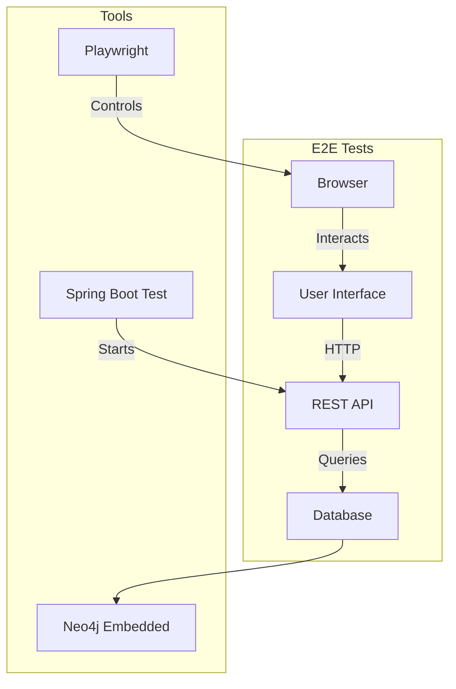

# AGENTS.md: E2E тесты Backend (Playwright)

Данный документ содержит специфические правила и стандарты для E2E тестирования backend-части проекта SpringTwin.

---

## Технологический стек

- **Фреймворк**: Playwright (запускается из Spring Boot тестов)
- **Браузер**: Chromium (headless по умолчанию)
- **База данных**: Neo4j Embedded (in-memory)
- **Сервер**: Реальный HTTP сервер (RANDOM_PORT)

---

## Назначение E2E тестов

### Обзор



### Характеристики

- Полные пользовательские сценарии
- Реальный браузер (Playwright)
- Реальный HTTP сервер
- Neo4j embedded (in-memory)
- Медленная скорость выполнения

### Что тестируется

| Компонент | Описание |
|-----------|----------|
| **Пользовательские сценарии** | Полный flow от входа до результата |
| **UI взаимодействие** | Кнопки, формы, навигация |
| **Валидация на UI** | Сообщения об ошибках |
| **Интеграция UI + API** | Корректность отображения данных |

---

## Структура тестов

### Организация по модулям

```
src/test/java/twin/spring/e2e/
├── app/
│   └── NavigationE2ETest.java
├── project/
│   ├── ProjectManagementE2ETest.java
│   └── ProjectConfigurationE2ETest.java
├── architecture/
│   ├── ClassNodeE2ETest.java
│   └── GraphVisualizationE2ETest.java
├── analysis/
│   └── AnalysisWorkflowE2ETest.java
├── report/
│   ├── ReportGenerationE2ETest.java
│   └── LlmExportE2ETest.java
└── mcp/
    └── McpExecutionE2ETest.java
```

**Примечание:** Модуль migration не требует E2E тестов, так как миграции выполняются автоматически при запуске приложения.

### Именование тестов

```java
// Класс теста
<Feature>E2ETest.java

// Примеры
ProjectManagementE2ETest.java
ReportGenerationE2ETest.java
McpExecutionE2ETest.java
```

### Именование методов теста

```java
// Формат: should<ExpectedBehavior>_when<Condition>
@Test
void shouldDisplayProjectList_whenPageLoads() { }

@Test
void shouldCreateProject_whenFormSubmitted() { }

@Test
void shouldShowError_whenValidationFails() { }

@Test
void shouldNavigateToDetails_whenProjectClicked() { }
```

---

## Конфигурация

### Playwright конфигурация

```java
package twin.spring.config;

/**
 * Конфигурация Playwright для E2E тестов.
 */
@TestConfiguration
public class PlaywrightConfiguration {
    
    @Bean
    @Scope("prototype")
    public Playwright playwright() {
        return Playwright.create();
    }
    
    @Bean
    @Scope("prototype")
    public Browser browser(Playwright playwright) {
        return playwright.chromium().launch(
            new BrowserType.LaunchOptions()
                .setHeadless(true)
        );
    }
}
```

### Базовая аннотация для E2E тестов

```java
/**
 * Базовые аннотации для E2E тестов.
 */
@SpringBootTest(webEnvironment = SpringBootTest.WebEnvironment.RANDOM_PORT)
@Import({TestNeo4jConfig.class, PlaywrightConfiguration.class})
```

---

## Семантические селекторы

### Обязательные атрибуты

Используй атрибуты `data-test`, `name` и `role` для селекторов:

```java
// Хорошо - семантические селекторы
page.click("[data-test='btn-save']");
page.fill("[data-test='input-project-name']", "Test");
page.locator("[role='navigation']");
page.locator("[name='project-form']");

// Плохо - CSS классы и ID
page.click(".btn-primary");
page.click("#save-button");
page.locator(".navigation");
```

### Именование data-test атрибутов

| Элемент | Пример |
|---------|--------|
| Кнопка | `data-test='btn-save'`, `data-test='btn-cancel'` |
| Поле ввода | `data-test='input-project-name'` |
| Список | `data-test='project-list'` |
| Карточка | `data-test='project-card'` |
| Детали | `data-test='project-detail'` |
| Уведомление | `data-test='notification'` |
| Ошибка | `data-test='validation-error'` |

---

## Шаблоны тестов

### Базовый E2E тест

```java
/**
 * E2E тесты для пользовательских сценариев.
 * Тестирует полные сценарии с использованием Playwright.
 */
@SpringBootTest(webEnvironment = SpringBootTest.WebEnvironment.RANDOM_PORT)
@Import(TestNeo4jConfig.class)
class ProjectManagementE2ETest {
    
    @LocalServerPort
    private int port;
    
    private Playwright playwright;
    private Browser browser;
    private Page page;
    
    @BeforeEach
    void setUp() {
        playwright = Playwright.create();
        browser = playwright.chromium().launch();
        page = browser.newPage();
    }
    
    @AfterEach
    void tearDown() {
        browser.close();
        playwright.close();
    }
    
    @Test
    void shouldDisplayProjectList_whenPageLoads() {
        // Act
        page.navigate("http://localhost:" + port + "/projects");
        
        // Assert
        assertThat(page.locator("[data-test='project-list']").isVisible()).isTrue();
        assertThat(page.locator("[data-test='project-card']").count()).isGreaterThanOrEqualTo(1);
    }
    
    @Test
    void shouldCreateNewProject_whenFormSubmitted() {
        // Arrange
        page.navigate("http://localhost:" + port + "/projects");
        
        // Act
        page.click("[data-test='btn-new-project']");
        page.fill("[data-test='input-project-name']", "My New Project");
        page.fill("[data-test='input-project-path']", "/path/to/project");
        page.click("[data-test='btn-save-project']");
        
        // Assert
        assertThat(page.locator("[data-test='notification']").textContent())
            .contains("Project created");
    }
    
    @Test
    void shouldShowError_whenValidationFails() {
        // Arrange
        page.navigate("http://localhost:" + port + "/projects");
        
        // Act
        page.click("[data-test='btn-new-project']");
        page.click("[data-test='btn-save-project']");
        
        // Assert
        assertThat(page.locator("[data-test='validation-error']").isVisible()).isTrue();
    }
}
```

---

## Playwright паттерны

### Навигация

```java
// Переход на страницу
page.navigate("http://localhost:" + port + "/projects");

// Ожидание загрузки
page.waitForLoadState(LoadState.NETWORKIDLE);

// Переход по ссылке
page.click("[data-test='nav-link']");
```

### Взаимодействие с элементами

```java
// Клик
page.click("[data-test='btn-save']");

// Заполнение поля
page.fill("[data-test='input-name']", "Test Value");

// Выбор из выпадающего списка
page.selectOption("[data-test='select-type']", "CLASS");

// Чекбокс
page.check("[data-test='checkbox-active']");

// Радио кнопка
page.click("[data-test='radio-option-1']");
```

### Проверки

```java
// Видимость элемента
assertThat(page.locator("[data-test='element']").isVisible()).isTrue();

// Текст элемента
assertThat(page.locator("[data-test='title']").textContent())
    .contains("Expected Text");

// Количество элементов
assertThat(page.locator("[data-test='item']").count()).isEqualTo(3);

// Значение поля
assertThat(page.locator("[data-test='input']").inputValue())
    .isEqualTo("Expected Value");

// Атрибут элемента
assertThat(page.locator("[data-test='link']").getAttribute("href"))
    .isEqualTo("/expected/path");
```

### Ожидания

```java
// Ожидание элемента
page.waitForSelector("[data-test='element']");

// Ожидание видимости
page.waitForSelector("[data-test='element']", new Page.WaitForSelectorOptions()
    .setState(WaitForSelectorState.VISIBLE));

// Ожидание исчезновения
page.waitForSelector("[data-test='loading']", new Page.WaitForSelectorOptions()
    .setState(WaitForSelectorState.HIDDEN));

// Ожидание текста
page.waitForFunction("() => document.querySelector('[data-test=\"title\"]').textContent.includes('Expected')");
```

### Работа с формами

```java
// Заполнение формы
page.fill("[data-test='input-name']", "Project Name");
page.fill("[data-test='input-path']", "/path/to/project");
page.selectOption("[data-test='select-type']", "Maven");
page.check("[data-test='checkbox-active']");

// Отправка формы
page.click("[data-test='btn-submit']");

// Ожидание ответа
page.waitForResponse(response -> 
    response.url().contains("/api/v1/projects") && 
    response.status() == 201
);
```

### Работа с диалогами

```java
// Подтверждение диалога
page.onDialog(dialog -> {
    assertThat(dialog.message()).contains("Are you sure?");
    dialog.accept();
});

page.click("[data-test='btn-delete']");
```

### Скачивание файлов

```java
// Ожидание скачивания
Download download = page.waitForDownload(() -> {
    page.click("[data-test='btn-download']");
});

assertThat(download.suggestedFilename()).endsWith(".json");
```

---

## Тестовые профили

### Использование профилей

```java
import twin.spring.profiles.project.ProjectTestProfile;

@SpringBootTest(webEnvironment = SpringBootTest.WebEnvironment.RANDOM_PORT)
@Import(TestNeo4jConfig.class)
class ProjectManagementE2ETest {
    
    @Autowired
    private ProjectTestProfile projectTestProfile;
    
    @BeforeEach
    void setUp() {
        projectTestProfile.seedTestData();
        // ... Playwright setup
    }
}
```

### Расположение профилей

Профили находятся в `src/test/java/twin/spring/profiles/<module>/`

---

## Покрытие тестами

### Требования

| Компонент | Покрытие |
|-----------|----------|
| **Критические сценарии** | CRUD операции |
| **Навигация** | Переходы между страницами |
| **Валидация** | Сообщения об ошибках |
| **Интеграция** | UI + API взаимодействие |

### Запуск тестов

```bash
# Все E2E тесты
gradlew.bat test --tests "twin.spring.e2e.*"

# E2E тесты конкретного модуля
gradlew.bat test --tests "twin.spring.e2e.project.*"

# С headed браузером (для отладки)
gradlew.bat test --tests "twin.spring.e2e.*" -Dplaywright.headless=false
```

---

## Best Practices

### 1. Использовать семантические селекторы

```java
// Хорошо
page.click("[data-test='btn-save']");
page.locator("[role='navigation']");

// Плохо
page.click(".btn-primary");
page.click("#save-button");
```

### 2. Ожидать завершения действий

```java
// Хорошо - ждем ответа сервера
page.click("[data-test='btn-save']");
page.waitForResponse(response -> 
    response.url().contains("/api/v1/projects") && 
    response.status() == 201
);

// Плохо - нет ожидания
page.click("[data-test='btn-save']");
```

### 3. Проверять состояние UI

```java
// Хорошо - проверяем результат действия
page.click("[data-test='btn-save']");
assertThat(page.locator("[data-test='notification']").isVisible()).isTrue();

// Плохо - нет проверки
page.click("[data-test='btn-save']");
```

### 4. Изолировать тесты

```java
@BeforeEach
void setUp() {
    // Очистка и подготовка данных перед каждым тестом
    projectTestProfile.seedTestData();
}
```

---

## Запуск после завершения задачи

Всегда запускайте выполнение тестов после выполнения задачи:

```bash
gradlew.bat test --tests "twin.spring.e2e.*"
```

Задача не считается выполненной, пока все тесты не пройдут успешно.