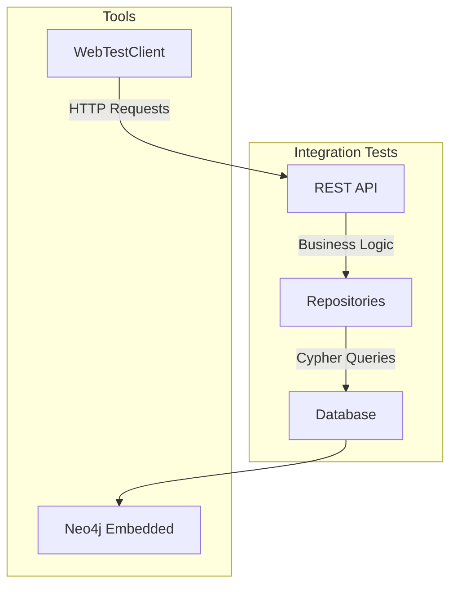

# AGENTS.md: Integration тесты Backend (JUnit 5 + Spring Boot Test)

Данный документ содержит специфические правила и стандарты для integration тестирования backend-части проекта SpringTwin.

---

## Технологический стек

- **Фреймворк**: JUnit 5 + Spring Boot Test
- **База данных**: Neo4j Embedded (in-memory)
- **API тестирование**: WebTestClient
- **Профили**: Тестовые профили для данных

---

## Назначение Integration тестов

### Обзор



### Характеристики

- Spring Boot Test контекст
- Neo4j embedded (in-memory)
- WebTestClient для API тестирования
- Реальные взаимодействия с БД
- Средняя скорость выполнения

### Что тестируется

| Компонент | Описание |
|-----------|----------|
| **REST контроллеры** | API слой, валидация, сериализация |
| **Репозитории** | Запросы к БД, маппинг результатов |
| **Интеграция с БД** | Создание индексов, ограничений |

---

## Структура тестов

### Организация по модулям

```
src/test/java/twin/spring/integration/
├── app/
│   └── api/
│       └── AppControllerIntegrationTest.java
├── project/
│   ├── api/
│   │   └── ProjectControllerIntegrationTest.java
│   └── repository/
│       └── ProjectRepositoryIntegrationTest.java
├── architecture/
│   ├── api/
│   │   ├── ClassNodeControllerIntegrationTest.java
│   │   └── MethodNodeControllerIntegrationTest.java
│   └── repository/
│       └── ClassNodeRepositoryIntegrationTest.java
├── analysis/
│   ├── api/
│   │   └── AnalysisControllerIntegrationTest.java
│   └── repository/
│       └── AnalysisRepositoryIntegrationTest.java
├── report/
│   ├── api/
│   │   └── ReportControllerIntegrationTest.java
│   └── repository/
│       └── ReportRepositoryIntegrationTest.java
├── migration/
│   └── MigrationIntegrationTest.java
└── mcp/
    ├── api/
    │   └── McpControllerIntegrationTest.java
    └── repository/
        └── McpRepositoryIntegrationTest.java
```

### Именование тестов

```java
// Класс теста
<Subject>IntegrationTest.java

// Примеры
ProjectControllerIntegrationTest.java
ProjectRepositoryIntegrationTest.java
ClassNodeControllerIntegrationTest.java
```

### Именование методов теста

```java
// Формат: methodName_scenario_expectedResult
@Test
void createProject_validRequest_returnsCreatedProject() { }

@Test
void getProject_existingId_returnsProject() { }

@Test
void getProject_nonExistingId_returnsNotFound() { }

@Test
void getAllProjects_returnsProjectList() { }
```

---

## Конфигурация

### Neo4j Embedded конфигурация

```java
package twin.spring.config;

/**
 * Конфигурация Neo4j Embedded для тестов.
 */
@TestConfiguration
public class TestNeo4jConfig {
    
    @Bean
    @Primary
    public Driver neo4jDriver() {
        // Neo4j embedded in-memory конфигурация
        return GraphDatabase.driver("bolt://localhost:7687");
    }
}
```

### Базовая аннотация для Integration тестов

```java
/**
 * Базовые аннотации для Integration тестов.
 */
@SpringBootTest
@AutoConfigureWebTestClient
@Import(TestNeo4jConfig.class)
```

---

## Шаблоны тестов

### Тестирование контроллера

```java
/**
 * Integration тесты для контроллера.
 * Тестирует REST API с использованием WebTestClient и Neo4j embedded.
 */
@SpringBootTest
@AutoConfigureWebTestClient
@Import(TestNeo4jConfig.class)
class ProjectControllerIntegrationTest {
    
    @Autowired
    private WebTestClient webTestClient;
    
    @Autowired
    private ProjectTestProfile projectTestProfile;
    
    @BeforeEach
    void setUp() {
        projectTestProfile.seedTestData();
    }
    
    @Test
    void createProject_validRequest_returnsCreatedProject() {
        // Arrange
        CreateProjectRequest request = ProjectTestProfile.createProjectRequest();
        
        // Act & Assert
        webTestClient.post()
            .uri("/api/v1/projects")
            .contentType(MediaType.APPLICATION_JSON)
            .bodyValue(request)
            .exchange()
            .expectStatus().isCreated()
            .expectBody()
            .jsonPath("$.name").isEqualTo(request.getName())
            .jsonPath("$.path").isEqualTo(request.getPath());
    }
    
    @Test
    void getProject_existingId_returnsProject() {
        // Arrange
        Project project = ProjectTestProfile.createProject();
        projectTestProfile.seedProject(project);
        
        // Act & Assert
        webTestClient.get()
            .uri("/api/v1/projects/{id}", project.getId())
            .exchange()
            .expectStatus().isOk()
            .expectBody()
            .jsonPath("$.name").isEqualTo(project.getName());
    }
    
    @Test
    void getProject_nonExistingId_returnsNotFound() {
        // Act & Assert
        webTestClient.get()
            .uri("/api/v1/projects/{id}", UUID.randomUUID().toString())
            .exchange()
            .expectStatus().isNotFound();
    }
    
    @Test
    void getAllProjects_returnsProjectList() {
        // Act & Assert
        webTestClient.get()
            .uri("/api/v1/projects")
            .exchange()
            .expectStatus().isOk()
            .expectBodyList(ProjectResponse.class)
            .hasSize(3);
    }
}
```

### Тестирование репозитория

```java
/**
 * Integration тесты для репозитория.
 * Тестирует запросы к Neo4j с использованием embedded базы.
 */
@SpringBootTest
@Import(TestNeo4jConfig.class)
class ProjectRepositoryIntegrationTest {
    
    @Autowired
    private ProjectRepository projectRepository;
    
    @BeforeEach
    void setUp() {
        projectRepository.deleteAll().block();
    }
    
    @Test
    void save_andFindById_returnsProject() {
        // Arrange
        Project project = ProjectTestProfile.createProject();
        
        // Act
        Project saved = projectRepository.save(project).block();
        Project found = projectRepository.findById(saved.getId()).block();
        
        // Assert
        assertThat(found).isNotNull();
        assertThat(found.getName()).isEqualTo(project.getName());
    }
    
    @Test
    void findByPackageName_returnsMatchingProjects() {
        // Arrange
        Project project = ProjectTestProfile.createProject();
        projectRepository.save(project).block();
        
        // Act & Assert
        StepVerifier.create(projectRepository.findByPackageName("com.example"))
            .expectNextCount(1)
            .verifyComplete();
    }
    
    @Test
    void delete_shouldRemoveProject() {
        // Arrange
        Project project = ProjectTestProfile.createProject();
        Project saved = projectRepository.save(project).block();
        
        // Act
        projectRepository.delete(saved).block();
        
        // Assert
        StepVerifier.create(projectRepository.findById(saved.getId()))
            .verifyComplete();
    }
}
```

---

## WebTestClient паттерны

### POST запросы

```java
webTestClient.post()
    .uri("/api/v1/projects")
    .contentType(MediaType.APPLICATION_JSON)
    .bodyValue(request)
    .exchange()
    .expectStatus().isCreated()
    .expectBody(ProjectResponse.class)
    .value(response -> {
        assertThat(response.getId()).isNotNull();
        assertThat(response.getName()).isEqualTo(request.getName());
    });
```

### GET запросы с параметрами

```java
webTestClient.get()
    .uri(uriBuilder -> uriBuilder
        .path("/api/v1/projects")
        .queryParam("name", "Test")
        .queryParam("page", 0)
        .queryParam("size", 10)
        .build())
    .exchange()
    .expectStatus().isOk()
    .expectBodyList(ProjectResponse.class)
    .hasSize(10);
```

### PUT запросы

```java
webTestClient.put()
    .uri("/api/v1/projects/{id}", projectId)
    .contentType(MediaType.APPLICATION_JSON)
    .bodyValue(updateRequest)
    .exchange()
    .expectStatus().isOk()
    .expectBody()
    .jsonPath("$.name").isEqualTo("Updated Name");
```

### DELETE запросы

```java
webTestClient.delete()
    .uri("/api/v1/projects/{id}", projectId)
    .exchange()
    .expectStatus().isNoContent();
```

### Проверка ошибок

```java
webTestClient.get()
    .uri("/api/v1/projects/{id}", nonExistingId)
    .exchange()
    .expectStatus().isNotFound()
    .expectBody()
    .jsonPath("$.message").isEqualTo("Project not found");
```

---

## Тестовые профили

### Использование профилей

```java
import twin.spring.profiles.project.ProjectTestProfile;

@BeforeEach
void setUp() {
    projectTestProfile.seedTestData();
}

@Test
void getProject_existingId_returnsProject() {
    // Arrange
    Project project = ProjectTestProfile.createProject();
    projectTestProfile.seedProject(project);
    
    // Act & Assert
    webTestClient.get()
        .uri("/api/v1/projects/{id}", project.getId())
        .exchange()
        .expectStatus().isOk();
}
```

### Расположение профилей

Профили находятся в `src/test/java/twin/spring/profiles/<module>/`

---

## Покрытие тестами

### Требования

| Компонент | Покрытие |
|-----------|----------|
| **Контроллеры** | Все методы REST API |
| **Репозитории** | Критические запросы |
| **Миграции** | Создание индексов и ограничений |

### Запуск тестов

```bash
# Все Integration тесты
gradlew.bat test --tests "twin.spring.integration.*"

# Integration тесты конкретного модуля
gradlew.bat test --tests "twin.spring.integration.project.*"

# Тесты с отчетом о покрытии
gradlew.bat test jacocoTestReport
```

---

## Best Practices

### 1. Изоляция тестов

```java
@BeforeEach
void setUp() {
    // Очистка базы перед каждым тестом
    projectRepository.deleteAll().block();
}
```

### 2. Использование тестовых профилей

```java
// Хорошо - используем профиль
Project project = ProjectTestProfile.createProject();

// Плохо - хардкод данных
Project project = new Project();
project.setId("test-id");
project.setName("Test");
```

### 3. Проверка статусов ответов

```java
// Проверка успешных ответов
.expectStatus().isOk()
.expectStatus().isCreated()
.expectStatus().isNoContent()

// Проверка ошибок
.expectStatus().isNotFound()
.expectStatus().isBadRequest()
.expectStatus().isInternalServerError()
```

### 4. Проверка тела ответа

```java
// Через jsonPath
.expectBody()
.jsonPath("$.name").isEqualTo("Test")
.jsonPath("$.id").isNotEmpty()

// Через класс ответа
.expectBody(ProjectResponse.class)
.value(response -> {
    assertThat(response.getName()).isEqualTo("Test");
    assertThat(response.getId()).isNotNull();
})

// Для списков
.expectBodyList(ProjectResponse.class)
.hasSize(3)
.contains(expectedResponse)
```

---

## Запуск после завершения задачи

Всегда запускайте выполнение тестов после выполнения задачи:

```bash
gradlew.bat test --tests "twin.spring.integration.*"
```

Задача не считается выполненной, пока все тесты не пройдут успешно.