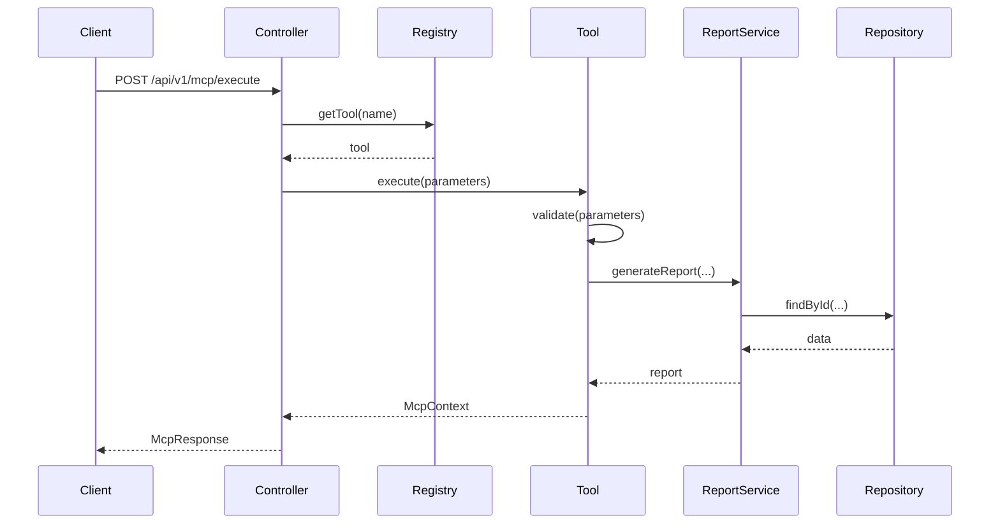
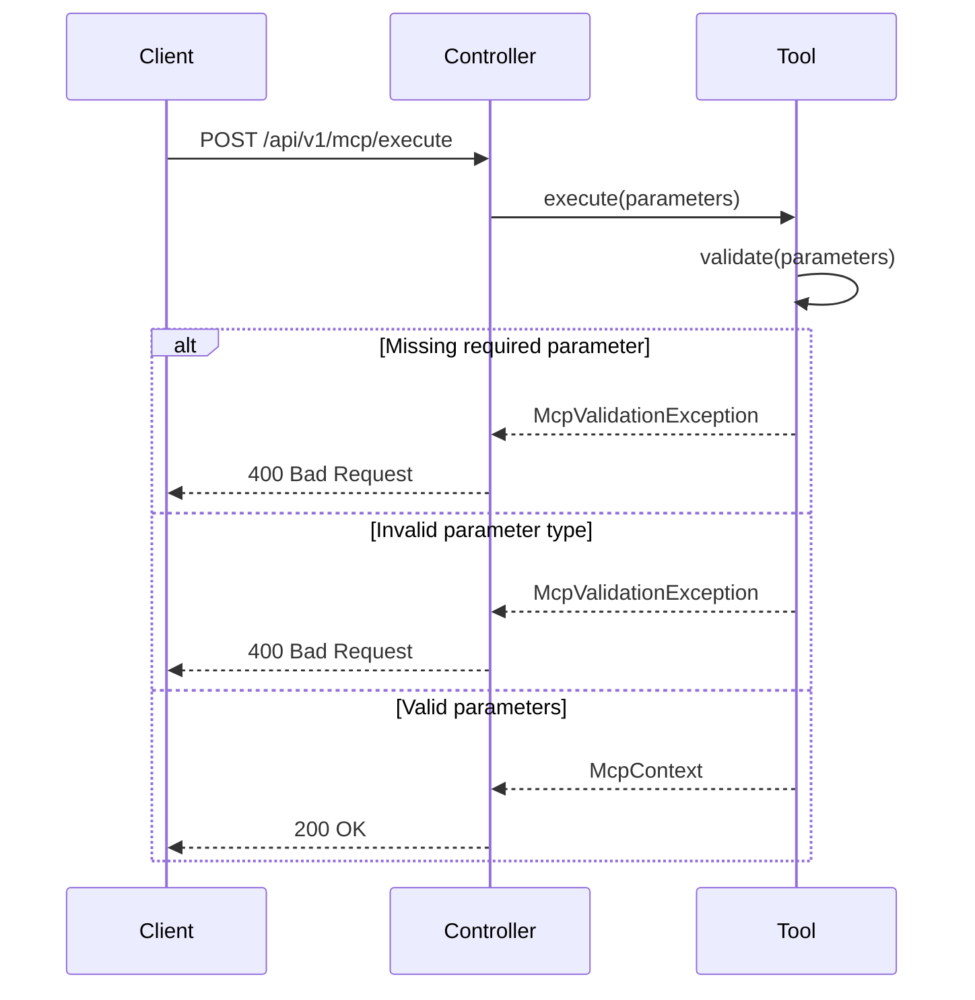

# AGENTS.md: Тестирование модуля MCP (Backend)

Правила и структура тестирования для модуля mcp. Содержит тестовые профили для MCP tools и интеграции.

---

## Структура тестов

```
src/test/java/twin/spring/mcp/
├── api/
│   ├── McpControllerTest.java
│   └── McpControllerIntegrationTest.java
├── service/
│   ├── McpToolRegistryServiceTest.java
│   ├── EndpointContextToolTest.java
│   ├── ClassContextToolTest.java
│   └── MethodContextToolTest.java
├── profile/
│   └── McpTestProfile.java
└── tool/
    └── McpToolExecutionTest.java
```

---

## Тестовые профили

### McpTestProfile.java

```java
/**
 * Тестовый профиль для модуля MCP.
 */
@Component
public class McpTestProfile {
    
    /**
     * Создает тестовый MCP tool для получения контекста класса.
     */
    public static McpTool createClassContextTool() {
        return McpTool.builder()
            .name("get_class_context")
            .description("Get architectural context for a Spring class")
            .parameters(List.of(
                McpToolParameter.builder()
                    .name("fullName")
                    .type("string")
                    .description("Fully qualified class name")
                    .required(true)
                    .build(),
                McpToolParameter.builder()
                    .name("includeMethods")
                    .type("boolean")
                    .description("Include methods in context")
                    .required(false)
                    .defaultValue(true)
                    .build()
            ))
            .returnType("McpContext")
            .build();
    }
    
    /**
     * Создает тестовый MCP tool для получения контекста метода.
     */
    public static McpTool createMethodContextTool() {
        return McpTool.builder()
            .name("get_method_context")
            .description("Get architectural context for a method")
            .parameters(List.of(
                McpToolParameter.builder()
                    .name("className")
                    .type("string")
                    .description("Fully qualified class name")
                    .required(true)
                    .build(),
                McpToolParameter.builder()
                    .name("methodName")
                    .type("string")
                    .description("Method name")
                    .required(true)
                    .build()
            ))
            .returnType("McpContext")
            .build();
    }
    
    /**
     * Создает тестовый MCP tool для получения контекста endpoint.
     */
    public static McpTool createEndpointContextTool() {
        return McpTool.builder()
            .name("get_endpoint_context")
            .description("Get architectural context for a REST endpoint")
            .parameters(List.of(
                McpToolParameter.builder()
                    .name("path")
                    .type("string")
                    .description("Endpoint path")
                    .required(true)
                    .build(),
                McpToolParameter.builder()
                    .name("httpMethod")
                    .type("string")
                    .description("HTTP method")
                    .required(false)
                    .defaultValue("GET")
                    .build()
            ))
            .returnType("McpContext")
            .build();
    }
    
    /**
     * Создает список всех MCP tools.
     */
    public static List<McpTool> createAllTools() {
        return List.of(
            createClassContextTool(),
            createMethodContextTool(),
            createEndpointContextTool()
        );
    }
    
    /**
     * Создает тестовый MCP запрос.
     */
    public static McpRequest createMcpRequest() {
        return McpRequest.builder()
            .toolName("get_class_context")
            .parameters(Map.of(
                "fullName", "com.example.service.UserService",
                "includeMethods", true
            ))
            .requestId("test-request-id")
            .build();
    }
    
    /**
     * Создает тестовый MCP ответ.
     */
    public static McpResponse createMcpResponse() {
        return McpResponse.builder()
            .requestId("test-request-id")
            .success(true)
            .context(McpContext.builder()
                .contextType("CLASS")
                .elementId("test-class-id")
                .elementName("UserService")
                .summary("Service class for user operations")
                .data(Map.of(
                    "name", "UserService",
                    "package", "com.example.service",
                    "methods", List.of("getAllUsers", "findById")
                ))
                .relatedElements(List.of(
                    RelatedElement.builder()
                        .id("repo-id")
                        .type("CLASS")
                        .name("UserRepository")
                        .build()
                ))
                .build())
            .build();
    }
    
    /**
     * Создает тестовый MCP контекст.
     */
    public static McpContext createMcpContext() {
        return McpContext.builder()
            .contextType("CLASS")
            .elementId("test-class-id")
            .elementName("UserService")
            .summary("Service class for user operations")
            .data(Map.of(
                "name", "UserService",
                "package", "com.example.service",
                "labels", List.of("Service"),
                "methods", List.of(
                    Map.of("name", "getAllUsers", "returnType", "List<User>"),
                    Map.of("name", "findById", "returnType", "User")
                ),
                "dependencies", List.of("UserRepository")
            ))
            .relatedElements(List.of(
                RelatedElement.builder()
                    .id("repo-id")
                    .type("CLASS")
                    .name("UserRepository")
                    .relationship("DEPENDS_ON")
                    .build()
            ))
            .metadata(Map.of(
                "generatedAt", LocalDateTime.now().toString(),
                "version", "1.0"
            ))
            .build();
    }
}
```

---

## Unit тесты

### McpToolRegistryServiceTest.java

```java
/**
 * Unit тесты для McpToolRegistryService.
 */
@ExtendWith(MockitoExtension.class)
class McpToolRegistryServiceTest {
    
    @Mock
    private List<McpTool> tools;
    
    @InjectMocks
    private McpToolRegistryService registry;
    
    @Test
    @DisplayName("Should register MCP tools")
    void register_shouldAddTool() {
        // Given
        McpTool tool = McpTestProfile.createClassContextTool();
        
        // When
        registry.register(tool);
        
        // Then
        assertThat(registry.getTool(tool.getName())).isPresent();
    }
    
    @Test
    @DisplayName("Should return all registered tools")
    void getAllTools_shouldReturnAll() {
        // Given
        List<McpTool> allTools = McpTestProfile.createAllTools();
        allTools.forEach(registry::register);
        
        // When
        List<McpTool> result = registry.getAllTools();
        
        // Then
        assertThat(result).hasSize(3);
    }
    
    @Test
    @DisplayName("Should find tool by name")
    void getTool_shouldFindByName() {
        // Given
        McpTool tool = McpTestProfile.createClassContextTool();
        registry.register(tool);
        
        // When
        Optional<McpTool> result = registry.getTool("get_class_context");
        
        // Then
        assertThat(result).isPresent();
        assertThat(result.get().getName()).isEqualTo("get_class_context");
    }
    
    @Test
    @DisplayName("Should return empty for unknown tool")
    void getTool_shouldReturnEmptyForUnknown() {
        // When
        Optional<McpTool> result = registry.getTool("unknown_tool");
        
        // Then
        assertThat(result).isEmpty();
    }
}
```

### ClassContextToolTest.java

```java
/**
 * Unit тесты для ClassContextTool.
 */
@ExtendWith(MockitoExtension.class)
class ClassContextToolTest {
    
    @Mock
    private ClassReportService classReportService;
    
    @Mock
    private LlmExportService llmExportService;
    
    @InjectMocks
    private ClassContextTool classContextTool;
    
    @Test
    @DisplayName("Should execute with valid parameters")
    void execute_shouldReturnContext() {
        // Given
        Map<String, Object> params = Map.of(
            "fullName", "com.example.service.UserService",
            "includeMethods", true
        );
        
        ClassReport report = ReportTestProfile.createClassReport();
        McpContext context = McpTestProfile.createMcpContext();
        
        when(classReportService.generateReportByFullName("com.example.service.UserService"))
            .thenReturn(Mono.just(report));
        when(llmExportService.toMcpContext(report))
            .thenReturn(Mono.just(context));
        
        // When & Then
        StepVerifier.create(classContextTool.execute(params))
            .expectNextMatches(c -> 
                c.getContextType().equals("CLASS") &&
                c.getElementName().equals("UserService")
            )
            .verifyComplete();
    }
    
    @Test
    @DisplayName("Should validate required parameters")
    void execute_shouldValidateParameters() {
        // Given
        Map<String, Object> params = Map.of(); // Missing fullName
        
        // When & Then
        StepVerifier.create(classContextTool.execute(params))
            .expectError(McpValidationException.class)
            .verify();
    }
    
    @Test
    @DisplayName("Should handle class not found")
    void execute_shouldHandleNotFound() {
        // Given
        Map<String, Object> params = Map.of(
            "fullName", "com.example.NonExistent"
        );
        
        when(classReportService.generateReportByFullName("com.example.NonExistent"))
            .thenReturn(Mono.error(new ResourceNotFoundException("Class not found")));
        
        // When & Then
        StepVerifier.create(classContextTool.execute(params))
            .expectError(ResourceNotFoundException.class)
            .verify();
    }
}
```

### EndpointContextToolTest.java

```java
/**
 * Unit тесты для EndpointContextTool.
 */
@ExtendWith(MockitoExtension.class)
class EndpointContextToolTest {
    
    @Mock
    private EndpointReportService endpointReportService;
    
    @Mock
    private LlmExportService llmExportService;
    
    @InjectMocks
    private EndpointContextTool endpointContextTool;
    
    @Test
    @DisplayName("Should execute with path and method")
    void execute_shouldReturnEndpointContext() {
        // Given
        Map<String, Object> params = Map.of(
            "path", "/api/users",
            "httpMethod", "GET"
        );
        
        EndpointReport report = ReportTestProfile.createEndpointReport();
        McpContext context = McpContext.builder()
            .contextType("ENDPOINT")
            .elementName("GET /api/users")
            .build();
        
        when(endpointReportService.generateReportByPath("/api/users", "GET"))
            .thenReturn(Mono.just(report));
        when(llmExportService.toMcpContext(report))
            .thenReturn(Mono.just(context));
        
        // When & Then
        StepVerifier.create(endpointContextTool.execute(params))
            .expectNextMatches(c -> 
                c.getContextType().equals("ENDPOINT")
            )
            .verifyComplete();
    }
    
    @Test
    @DisplayName("Should use default HTTP method")
    void execute_shouldUseDefaultMethod() {
        // Given
        Map<String, Object> params = Map.of(
            "path", "/api/users"
            // httpMethod not provided, should default to GET
        );
        
        EndpointReport report = ReportTestProfile.createEndpointReport();
        McpContext context = McpContext.builder()
            .contextType("ENDPOINT")
            .build();
        
        when(endpointReportService.generateReportByPath("/api/users", "GET"))
            .thenReturn(Mono.just(report));
        when(llmExportService.toMcpContext(report))
            .thenReturn(Mono.just(context));
        
        // When & Then
        StepVerifier.create(endpointContextTool.execute(params))
            .expectNextMatches(c -> c.getContextType().equals("ENDPOINT"))
            .verifyComplete();
        
        verify(endpointReportService).generateReportByPath("/api/users", "GET");
    }
}
```

---

## Интеграционные тесты

### McpControllerIntegrationTest.java

```java
/**
 * Интеграционные тесты для MCP API.
 */
@SpringBootTest
@AutoConfigureWebTestClient
@Testcontainers
class McpControllerIntegrationTest {
    
    @Container
    static Neo4jContainer<?> neo4jContainer = new Neo4jContainer<>("neo4j:5.13");
    
    @Autowired
    private WebTestClient webTestClient;
    
    @Autowired
    private ClassRepository classRepository;
    
    @Autowired
    private MethodRepository methodRepository;
    
    @Autowired
    private EndpointRepository endpointRepository;
    
    @BeforeEach
    void setUp() {
        classRepository.deleteAll().block();
        methodRepository.deleteAll().block();
        endpointRepository.deleteAll().block();
    }
    
    @Test
    @DisplayName("GET /api/v1/mcp/tools - should return available tools")
    void getTools_shouldReturnTools() {
        webTestClient.get()
            .uri("/api/v1/mcp/tools")
            .exchange()
            .expectStatus().isOk()
            .expectBody()
            .jsonPath("$").isArray()
            .jsonPath("$[?(@.name == 'get_class_context')]").exists()
            .jsonPath("$[?(@.name == 'get_method_context')]").exists()
            .jsonPath("$[?(@.name == 'get_endpoint_context')]").exists();
    }
    
    @Test
    @DisplayName("POST /api/v1/mcp/execute - should execute class context tool")
    void execute_shouldReturnClassContext() {
        // Given
        Class serviceClass = ArchitectureTestProfile.createServiceClass();
        classRepository.save(serviceClass).block();
        
        McpRequest request = McpRequest.builder()
            .toolName("get_class_context")
            .parameters(Map.of(
                "fullName", serviceClass.getFullName()
            ))
            .build();
        
        // When & Then
        webTestClient.post()
            .uri("/api/v1/mcp/execute")
            .contentType(MediaType.APPLICATION_JSON)
            .bodyValue(request)
            .exchange()
            .expectStatus().isOk()
            .expectBody()
            .jsonPath("$.success").isEqualTo(true)
            .jsonPath("$.context.contextType").isEqualTo("CLASS")
            .jsonPath("$.context.elementName").isEqualTo(serviceClass.getName());
    }
    
    @Test
    @DisplayName("POST /api/v1/mcp/execute - should execute endpoint context tool")
    void execute_shouldReturnEndpointContext() {
        // Given
        Class controller = ArchitectureTestProfile.createControllerClass();
        Class savedController = classRepository.save(controller).block();
        
        Method method = ArchitectureTestProfile.createMethod(savedController.getId());
        Method savedMethod = methodRepository.save(method).block();
        
        Endpoint endpoint = ArchitectureTestProfile.createEndpoint(savedMethod.getId());
        endpointRepository.save(endpoint).block();
        
        McpRequest request = McpRequest.builder()
            .toolName("get_endpoint_context")
            .parameters(Map.of(
                "path", endpoint.getPath(),
                "httpMethod", endpoint.getHttpMethod()
            ))
            .build();
        
        // When & Then
        webTestClient.post()
            .uri("/api/v1/mcp/execute")
            .contentType(MediaType.APPLICATION_JSON)
            .bodyValue(request)
            .exchange()
            .expectStatus().isOk()
            .expectBody()
            .jsonPath("$.success").isEqualTo(true)
            .jsonPath("$.context.contextType").isEqualTo("ENDPOINT");
    }
    
    @Test
    @DisplayName("POST /api/v1/mcp/execute - should return error for unknown tool")
    void execute_shouldReturnErrorForUnknownTool() {
        // Given
        McpRequest request = McpRequest.builder()
            .toolName("unknown_tool")
            .parameters(Map.of())
            .build();
        
        // When & Then
        webTestClient.post()
            .uri("/api/v1/mcp/execute")
            .contentType(MediaType.APPLICATION_JSON)
            .bodyValue(request)
            .exchange()
            .expectStatus().isBadRequest()
            .expectBody()
            .jsonPath("$.success").isEqualTo(false)
            .jsonPath("$.errors").isArray();
    }
    
    @Test
    @DisplayName("POST /api/v1/mcp/execute - should validate parameters")
    void execute_shouldValidateParameters() {
        // Given
        McpRequest request = McpRequest.builder()
            .toolName("get_class_context")
            .parameters(Map.of()) // Missing required fullName
            .build();
        
        // When & Then
        webTestClient.post()
            .uri("/api/v1/mcp/execute")
            .contentType(MediaType.APPLICATION_JSON)
            .bodyValue(request)
            .exchange()
            .expectStatus().isBadRequest()
            .expectBody()
            .jsonPath("$.success").isEqualTo(false)
            .jsonPath("$.errors[0]").contains("fullName");
    }
    
    @Test
    @DisplayName("GET /api/v1/mcp/tools/{name} - should return tool details")
    void getToolDetails_shouldReturnDetails() {
        webTestClient.get()
            .uri("/api/v1/mcp/tools/get_class_context")
            .exchange()
            .expectStatus().isOk()
            .expectBody()
            .jsonPath("$.name").isEqualTo("get_class_context")
            .jsonPath("$.parameters").isArray()
            .jsonPath("$.parameters[?(@.name == 'fullName')].required").isEqualTo(true);
    }
}
```

---

## Тестовые сценарии

### Сценарий: Выполнение MCP tool



### Сценарий: Валидация параметров



---

## Критерии приемки

| Критерий | Описание |
|----------|----------|
| Регистрация tools | Все tools зарегистрированы |
| Валидация | Параметры проверяются |
| Выполнение | Tools возвращают контекст |
| Обработка ошибок | Ошибки корректно возвращаются |
| Интеграция | Работает с Cursor AI и Kilo Code |