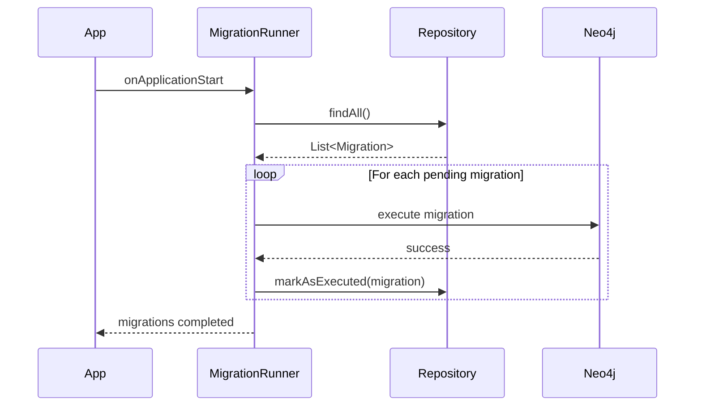
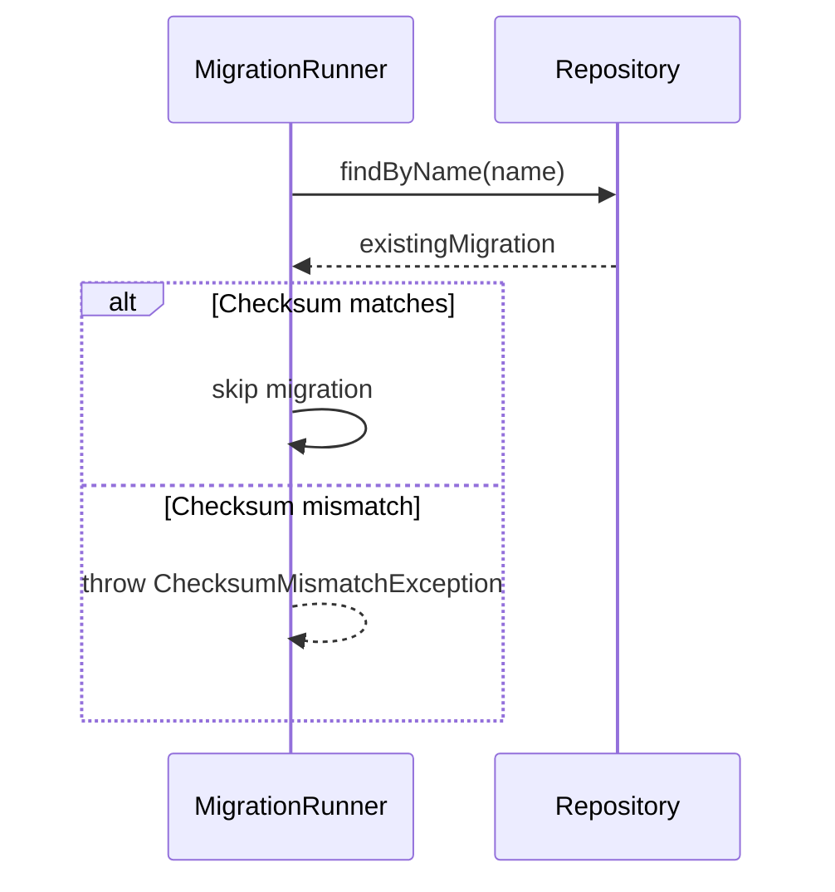

# AGENTS.md: Тестирование модуля Migration (Backend)

Правила и структура тестирования для модуля migration. Содержит тестовые профили для миграций Neo4j.

---

## Структура тестов

```
src/test/java/twin/spring/migration/
├── v0001/
│   ├── ClassMigrationTest.java
│   ├── MethodMigrationTest.java
│   └── EndpointMigrationTest.java
├── v0002/
│   └── RelationshipMigrationTest.java
├── profile/
│   └── MigrationTestProfile.java
└── service/
    └── MigrationRunnerServiceTest.java
```

---

## Тестовые профили

### MigrationTestProfile.java

```java
/**
 * Тестовый профиль для модуля Migration.
 */
@Component
public class MigrationTestProfile {
    
    /**
     * Создает тестовую миграцию для создания индексов.
     */
    public static Migration createIndexMigration() {
        return Migration.builder()
            .version("v0001")
            .name("CreateClassIndexes")
            .description("Create indexes for Class nodes")
            .order(1)
            .executed(false)
            .checksum("abc123")
            .build();
    }
    
    /**
     * Создает тестовую миграцию для создания ограничений.
     */
    public static Migration createConstraintMigration() {
        return Migration.builder()
            .version("v0001")
            .name("CreateClassConstraints")
            .description("Create unique constraints for Class nodes")
            .order(2)
            .executed(false)
            .checksum("def456")
            .build();
    }
    
    /**
     * Создает выполненную миграцию.
     */
    public static Migration createExecutedMigration() {
        return Migration.builder()
            .version("v0001")
            .name("CreateClassIndexes")
            .description("Create indexes for Class nodes")
            .order(1)
            .executed(true)
            .executedAt(LocalDateTime.now().minusDays(1))
            .checksum("abc123")
            .build();
    }
    
    /**
     * Создает список всех миграций.
     */
    public static List<Migration> createAllMigrations() {
        return List.of(
            createIndexMigration(),
            createConstraintMigration()
        );
    }
}
```

---

## Unit тесты

### ClassMigrationTest.java

```java
/**
 * Тесты для миграции Class узлов.
 */
@Testcontainers
class ClassMigrationTest {
    
    @Container
    static Neo4jContainer<?> neo4jContainer = new Neo4jContainer<>("neo4j:5.13");
    
    private Driver driver;
    
    private ClassMigration migration;
    
    @BeforeEach
    void setUp() {
        driver = GraphDatabase.driver(
            neo4jContainer.getBoltUrl(),
            AuthTokens.basic("neo4j", neo4jContainer.getAdminPassword())
        );
        migration = new ClassMigration(driver);
    }
    
    @AfterEach
    void tearDown() {
        driver.close();
    }
    
    @Test
    @DisplayName("Should create Class index")
    void migrate_shouldCreateClassIndex() {
        // When
        migration.migrate();
        
        // Then
        try (Session session = driver.session()) {
            var result = session.run("SHOW INDEXES WHERE name = 'class_fullName_index'");
            assertThat(result.hasNext()).isTrue();
        }
    }
    
    @Test
    @DisplayName("Should create unique constraint on fullName")
    void migrate_shouldCreateUniqueConstraint() {
        // When
        migration.migrate();
        
        // Then
        try (Session session = driver.session()) {
            var result = session.run(
                "SHOW CONSTRAINTS WHERE name = 'class_fullName_unique'"
            );
            assertThat(result.hasNext()).isTrue();
        }
    }
    
    @Test
    @DisplayName("Should be idempotent")
    void migrate_shouldBeIdempotent() {
        // When - run twice
        migration.migrate();
        migration.migrate();
        
        // Then - should not throw
        try (Session session = driver.session()) {
            var result = session.run("SHOW INDEXES");
            assertThat(result.stream().count()).isGreaterThanOrEqualTo(1);
        }
    }
}
```

### MethodMigrationTest.java

```java
/**
 * Тесты для миграции Method узлов.
 */
@Testcontainers
class MethodMigrationTest {
    
    @Container
    static Neo4jContainer<?> neo4jContainer = new Neo4jContainer<>("neo4j:5.13");
    
    private Driver driver;
    private MethodMigration migration;
    
    @BeforeEach
    void setUp() {
        driver = GraphDatabase.driver(
            neo4jContainer.getBoltUrl(),
            AuthTokens.basic("neo4j", neo4jContainer.getAdminPassword())
        );
        migration = new MethodMigration(driver);
    }
    
    @Test
    @DisplayName("Should create Method index")
    void migrate_shouldCreateMethodIndex() {
        // When
        migration.migrate();
        
        // Then
        try (Session session = driver.session()) {
            var result = session.run("SHOW INDEXES WHERE name = 'method_signature_index'");
            assertThat(result.hasNext()).isTrue();
        }
    }
    
    @Test
    @DisplayName("Should create relationship index for CALLS")
    void migrate_shouldCreateCallsIndex() {
        // When
        migration.migrate();
        
        // Then
        try (Session session = driver.session()) {
            var result = session.run("SHOW INDEXES WHERE name = 'calls_relationship_index'");
            assertThat(result.hasNext()).isTrue();
        }
    }
}
```

### EndpointMigrationTest.java

```java
/**
 * Тесты для миграции Endpoint узлов.
 */
@Testcontainers
class EndpointMigrationTest {
    
    @Container
    static Neo4jContainer<?> neo4jContainer = new Neo4jContainer<>("neo4j:5.13");
    
    private Driver driver;
    private EndpointMigration migration;
    
    @BeforeEach
    void setUp() {
        driver = GraphDatabase.driver(
            neo4jContainer.getBoltUrl(),
            AuthTokens.basic("neo4j", neo4jContainer.getAdminPassword())
        );
        migration = new EndpointMigration(driver);
    }
    
    @Test
    @DisplayName("Should create Endpoint index")
    void migrate_shouldCreateEndpointIndex() {
        // When
        migration.migrate();
        
        // Then
        try (Session session = driver.session()) {
            var result = session.run(
                "SHOW INDEXES WHERE name = 'endpoint_path_method_index'"
            );
            assertThat(result.hasNext()).isTrue();
        }
    }
    
    @Test
    @DisplayName("Should create composite index on path and httpMethod")
    void migrate_shouldCreateCompositeIndex() {
        // When
        migration.migrate();
        
        // Then
        try (Session session = driver.session()) {
            var result = session.run(
                "SHOW INDEXES WHERE name = 'endpoint_path_method_index'"
            );
            var record = result.single();
            assertThat(record.get("properties").asList())
                .contains("path", "httpMethod");
        }
    }
}
```

### MigrationRunnerServiceTest.java

```java
/**
 * Unit тесты для MigrationRunnerService.
 */
@ExtendWith(MockitoExtension.class)
class MigrationRunnerServiceTest {
    
    @Mock
    private MigrationRepository migrationRepository;
    
    @Mock
    private List<Migration> migrations;
    
    @InjectMocks
    private MigrationRunnerService runnerService;
    
    @Test
    @DisplayName("Should run pending migrations")
    void runPendingMigrations_shouldExecutePending() {
        // Given
        Migration pending = MigrationTestProfile.createIndexMigration();
        Migration executed = MigrationTestProfile.createExecutedMigration();
        
        when(migrationRepository.findAll())
            .thenReturn(Flux.fromIterable(List.of(pending, executed)));
        when(migrationRepository.markAsExecuted(any()))
            .thenReturn(Mono.empty());
        
        // When & Then
        StepVerifier.create(runnerService.runPendingMigrations())
            .verifyComplete();
        
        verify(migrationRepository).markAsExecuted(pending);
        verify(migrationRepository, never()).markAsExecuted(executed);
    }
    
    @Test
    @DisplayName("Should skip already executed migrations")
    void runPendingMigrations_shouldSkipExecuted() {
        // Given
        Migration executed = MigrationTestProfile.createExecutedMigration();
        
        when(migrationRepository.findAll())
            .thenReturn(Flux.just(executed));
        
        // When & Then
        StepVerifier.create(runnerService.runPendingMigrations())
            .verifyComplete();
        
        verify(migrationRepository, never()).markAsExecuted(any());
    }
    
    @Test
    @DisplayName("Should record migration execution")
    void runPendingMigrations_shouldRecordExecution() {
        // Given
        Migration pending = MigrationTestProfile.createIndexMigration();
        
        when(migrationRepository.findAll())
            .thenReturn(Flux.just(pending));
        when(migrationRepository.markAsExecuted(pending))
            .thenReturn(Mono.empty());
        
        // When & Then
        StepVerifier.create(runnerService.runPendingMigrations())
            .verifyComplete();
        
        verify(migrationRepository).markAsExecuted(argThat(m -> 
            m.isExecuted() && m.getExecutedAt() != null
        ));
    }
    
    @Test
    @DisplayName("Should validate migration checksum")
    void validateChecksum_shouldDetectChanges() {
        // Given
        Migration original = MigrationTestProfile.createIndexMigration();
        Migration modified = Migration.builder()
            .version("v0001")
            .name("CreateClassIndexes")
            .checksum("different")
            .build();
        
        when(migrationRepository.findByName("CreateClassIndexes"))
            .thenReturn(Mono.just(original));
        
        // When & Then
        StepVerifier.create(runnerService.validateChecksum(modified))
            .expectError(MigrationChecksumMismatchException.class)
            .verify();
    }
}
```

---

## Интеграционные тесты

### MigrationIntegrationTest.java

```java
/**
 * Интеграционные тесты для системы миграций.
 */
@SpringBootTest
@Testcontainers
class MigrationIntegrationTest {
    
    @Container
    static Neo4jContainer<?> neo4jContainer = new Neo4jContainer<>("neo4j:5.13");
    
    @Autowired
    private MigrationRunnerService migrationRunner;
    
    @Autowired
    private MigrationRepository migrationRepository;
    
    @Autowired
    private Driver driver;
    
    @BeforeEach
    void setUp() {
        // Clean database
        try (Session session = driver.session()) {
            session.run("MATCH (n) DETACH DELETE n").consume();
        }
    }
    
    @Test
    @DisplayName("Should run all migrations on startup")
    void shouldRunMigrationsOnStartup() {
        // When
        migrationRunner.runPendingMigrations().block();
        
        // Then
        try (Session session = driver.session()) {
            // Check indexes exist
            var indexes = session.run("SHOW INDEXES").stream().count();
            assertThat(indexes).isGreaterThanOrEqualTo(3);
            
            // Check constraints exist
            var constraints = session.run("SHOW CONSTRAINTS").stream().count();
            assertThat(constraints).isGreaterThanOrEqualTo(2);
        }
    }
    
    @Test
    @DisplayName("Should record migration history")
    void shouldRecordMigrationHistory() {
        // When
        migrationRunner.runPendingMigrations().block();
        
        // Then
        StepVerifier.create(migrationRepository.findAll())
            .expectNextMatches(Migration::isExecuted)
            .expectNextMatches(Migration::isExecuted)
            .verifyComplete();
    }
    
    @Test
    @DisplayName("Should not re-run executed migrations")
    void shouldNotRerunExecutedMigrations() {
        // Given - run migrations once
        migrationRunner.runPendingMigrations().block();
        
        // When - run again
        migrationRunner.runPendingMigrations().block();
        
        // Then - migrations should still be marked as executed
        StepVerifier.create(migrationRepository.findAll())
            .expectNextMatches(m -> m.getExecutedAt() != null)
            .verifyComplete();
    }
}
```

---

## Тестовые сценарии

### Сценарий: Выполнение миграций при старте



### Сценарий: Проверка контрольной суммы



---

## Критерии приемки

| Критерий | Описание |
|----------|----------|
| Индексы | Все необходимые индексы созданы |
| Ограничения | Уникальные ограничения созданы |
| Идемпотентность | Миграции можно запускать повторно |
| История | Выполненные миграции записываются |
| Checksum | Измененные миграции обнаруживаются |