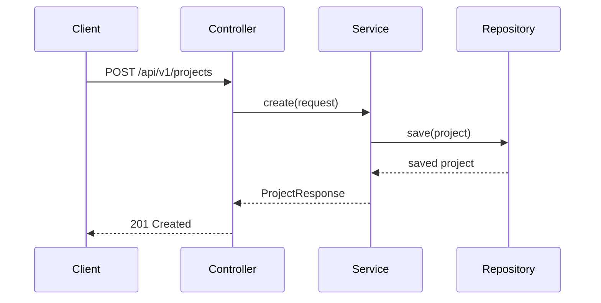
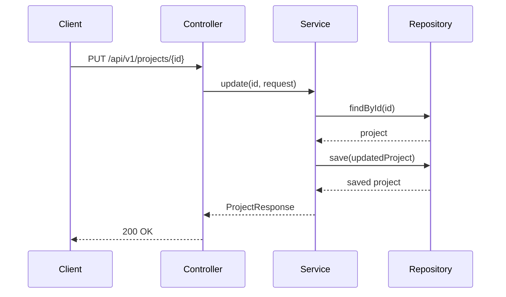

# AGENTS.md: Тестирование модуля Project (Backend)

Правила и структура тестирования для модуля project. Содержит тестовые профили, сценарии unit и интеграционных тестов.

---

## Структура тестов

```
src/test/java/twin/spring/project/
├── api/
│   ├── ProjectControllerTest.java      # Unit тесты контроллера
│   └── ProjectControllerIntegrationTest.java  # Интеграционные тесты
├── service/
│   ├── ProjectServiceTest.java         # Unit тесты сервиса
│   └── ProjectServiceIntegrationTest.java
├── repository/
│   └── ProjectRepositoryTest.java      # Тесты репозитория
├── profile/
│   ├── ProjectTestProfile.java         # Тестовый профиль для проектов
│   └── ProjectTestData.java            # Тестовые данные
└── mapper/
    └── ProjectMapperTest.java          # Тесты маппера
```

---

## Тестовые профили

### ProjectTestProfile.java

```java
/**
 * Тестовый профиль для модуля Project.
 * Предоставляет готовые тестовые данные для использования в тестах.
 */
@Component
public class ProjectTestProfile {
    
    /**
     * Создает тестовый проект с базовыми настройками.
     */
    public static Project createDefaultProject() {
        return Project.builder()
            .id(UUID.randomUUID().toString())
            .name("Test Project")
            .path("/test/project/path")
            .includePackages(List.of("com.example"))
            .excludePackages(List.of("com.example.config"))
            .createdAt(LocalDateTime.now())
            .updatedAt(LocalDateTime.now())
            .build();
    }
    
    /**
     * Создает тестовый проект с полным набором пакетов.
     */
    public static Project createFullProject() {
        return Project.builder()
            .id(UUID.randomUUID().toString())
            .name("Full Test Project")
            .path("/full/test/project")
            .includePackages(List.of(
                "com.example.api",
                "com.example.service",
                "com.example.repository"
            ))
            .excludePackages(List.of(
                "com.example.config",
                "com.example.dto"
            ))
            .createdAt(LocalDateTime.now())
            .updatedAt(LocalDateTime.now())
            .build();
    }
    
    /**
     * Создает запрос на создание проекта.
     */
    public static CreateProjectRequest createProjectRequest() {
        return CreateProjectRequest.builder()
            .name("New Project")
            .path("/new/project")
            .includePackages(List.of("org.example"))
            .excludePackages(List.of())
            .build();
    }
    
    /**
     * Создает запрос на обновление проекта.
     */
    public static UpdateProjectRequest updateProjectRequest() {
        return UpdateProjectRequest.builder()
            .name("Updated Project")
            .includePackages(List.of("org.example", "org.example.core"))
            .build();
    }
    
    /**
     * Создает список тестовых проектов.
     */
    public static List<Project> createProjectList() {
        return List.of(
            createDefaultProject(),
            createFullProject()
        );
    }
}
```

### ProjectTestData.java

```java
/**
 * Константы тестовых данных для модуля Project.
 */
public final class ProjectTestData {
    
    public static final String PROJECT_ID = "test-project-id-123";
    public static final String PROJECT_NAME = "Test Project";
    public static final String PROJECT_PATH = "/test/path";
    
    public static final List<String> DEFAULT_INCLUDE_PACKAGES = List.of(
        "com.example"
    );
    
    public static final List<String> DEFAULT_EXCLUDE_PACKAGES = List.of(
        "com.example.config"
    );
    
    private ProjectTestData() {
        // Utility class
    }
}
```

---

## Unit тесты

### ProjectServiceTest.java

```java
/**
 * Unit тесты для ProjectService.
 */
@ExtendWith(MockitoExtension.class)
class ProjectServiceTest {
    
    @Mock
    private ProjectRepository projectRepository;
    
    @Mock
    private ProjectMapper projectMapper;
    
    @InjectMocks
    private ProjectService projectService;
    
    @Test
    @DisplayName("Should return all projects")
    void findAll_shouldReturnAllProjects() {
        // Given
        List<Project> projects = ProjectTestProfile.createProjectList();
        when(projectRepository.findAll()).thenReturn(Flux.fromIterable(projects));
        
        // When
        StepVerifier.create(projectService.findAll())
            .expectNextCount(2)
            .verifyComplete();
        
        // Then
        verify(projectRepository).findAll();
    }
    
    @Test
    @DisplayName("Should return project by ID")
    void findById_shouldReturnProject() {
        // Given
        Project project = ProjectTestProfile.createDefaultProject();
        when(projectRepository.findById(project.getId()))
            .thenReturn(Mono.just(project));
        
        // When & Then
        StepVerifier.create(projectService.findById(project.getId()))
            .expectNextMatches(p -> p.getName().equals(project.getName()))
            .verifyComplete();
    }
    
    @Test
    @DisplayName("Should throw exception when project not found")
    void findById_shouldThrowWhenNotFound() {
        // Given
        String id = "non-existent-id";
        when(projectRepository.findById(id))
            .thenReturn(Mono.empty());
        
        // When & Then
        StepVerifier.create(projectService.findById(id))
            .expectError(ResourceNotFoundException.class)
            .verify();
    }
    
    @Test
    @DisplayName("Should create new project")
    void create_shouldCreateProject() {
        // Given
        CreateProjectRequest request = ProjectTestProfile.createProjectRequest();
        Project project = ProjectTestProfile.createDefaultProject();
        
        when(projectMapper.toEntity(request)).thenReturn(project);
        when(projectRepository.save(project)).thenReturn(Mono.just(project));
        when(projectMapper.toResponse(project)).thenReturn(
            ProjectResponse.builder()
                .id(project.getId())
                .name(project.getName())
                .build()
        );
        
        // When & Then
        StepVerifier.create(projectService.create(request))
            .expectNextMatches(r -> r.getName().equals(request.getName()))
            .verifyComplete();
        
        verify(projectRepository).save(any(Project.class));
    }
    
    @Test
    @DisplayName("Should update existing project")
    void update_shouldUpdateProject() {
        // Given
        String id = "test-id";
        UpdateProjectRequest request = ProjectTestProfile.updateProjectRequest();
        Project existingProject = ProjectTestProfile.createDefaultProject();
        Project updatedProject = ProjectTestProfile.createFullProject();
        
        when(projectRepository.findById(id)).thenReturn(Mono.just(existingProject));
        when(projectRepository.save(any(Project.class))).thenReturn(Mono.just(updatedProject));
        when(projectMapper.toResponse(updatedProject)).thenReturn(
            ProjectResponse.builder()
                .id(id)
                .name(request.getName())
                .build()
        );
        
        // When & Then
        StepVerifier.create(projectService.update(id, request))
            .expectNextMatches(r -> r.getName().equals(request.getName()))
            .verifyComplete();
    }
    
    @Test
    @DisplayName("Should delete project")
    void delete_shouldDeleteProject() {
        // Given
        String id = "test-id";
        when(projectRepository.existsById(id)).thenReturn(Mono.just(true));
        when(projectRepository.deleteById(id)).thenReturn(Mono.empty());
        
        // When & Then
        StepVerifier.create(projectService.delete(id))
            .verifyComplete();
        
        verify(projectRepository).deleteById(id);
    }
}
```

### ProjectMapperTest.java

```java
/**
 * Тесты для ProjectMapper.
 */
class ProjectMapperTest {
    
    private ProjectMapper mapper = new ProjectMapperImpl();
    
    @Test
    @DisplayName("Should map entity to response")
    void toResponse_shouldMapCorrectly() {
        // Given
        Project project = ProjectTestProfile.createDefaultProject();
        
        // When
        ProjectResponse response = mapper.toResponse(project);
        
        // Then
        assertThat(response).isNotNull();
        assertThat(response.getId()).isEqualTo(project.getId());
        assertThat(response.getName()).isEqualTo(project.getName());
        assertThat(response.getPath()).isEqualTo(project.getPath());
        assertThat(response.getIncludePackages()).isEqualTo(project.getIncludePackages());
    }
    
    @Test
    @DisplayName("Should map request to entity")
    void toEntity_shouldMapCorrectly() {
        // Given
        CreateProjectRequest request = ProjectTestProfile.createProjectRequest();
        
        // When
        Project project = mapper.toEntity(request);
        
        // Then
        assertThat(project).isNotNull();
        assertThat(project.getName()).isEqualTo(request.getName());
        assertThat(project.getPath()).isEqualTo(request.getPath());
        assertThat(project.getIncludePackages()).isEqualTo(request.getIncludePackages());
        assertThat(project.getId()).isNull(); // ID should be null for new entity
    }
    
    @Test
    @DisplayName("Should update entity from request")
    void updateEntity_shouldUpdateFields() {
        // Given
        Project project = ProjectTestProfile.createDefaultProject();
        UpdateProjectRequest request = ProjectTestProfile.updateProjectRequest();
        
        // When
        mapper.updateEntity(project, request);
        
        // Then
        assertThat(project.getName()).isEqualTo(request.getName());
        assertThat(project.getIncludePackages()).isEqualTo(request.getIncludePackages());
    }
}
```

---

## Интеграционные тесты

### ProjectControllerIntegrationTest.java

```java
/**
 * Интеграционные тесты для ProjectController.
 */
@SpringBootTest
@AutoConfigureWebTestClient
@Testcontainers
class ProjectControllerIntegrationTest {
    
    @Container
    static Neo4jContainer<?> neo4jContainer = new Neo4jContainer<>("neo4j:5.13");
    
    @Autowired
    private WebTestClient webTestClient;
    
    @Autowired
    private ProjectRepository projectRepository;
    
    @BeforeEach
    void setUp() {
        projectRepository.deleteAll().block();
    }
    
    @Test
    @DisplayName("GET /api/v1/projects - should return empty list")
    void getAll_shouldReturnEmptyList() {
        webTestClient.get()
            .uri("/api/v1/projects")
            .exchange()
            .expectStatus().isOk()
            .expectBody()
            .jsonPath("$").isArray()
            .jsonPath("$").isEmpty();
    }
    
    @Test
    @DisplayName("GET /api/v1/projects - should return projects")
    void getAll_shouldReturnProjects() {
        // Given
        Project project = ProjectTestProfile.createDefaultProject();
        projectRepository.save(project).block();
        
        // When & Then
        webTestClient.get()
            .uri("/api/v1/projects")
            .exchange()
            .expectStatus().isOk()
            .expectBody()
            .jsonPath("$").isArray()
            .jsonPath("$[0].name").isEqualTo(project.getName())
            .jsonPath("$[0].path").isEqualTo(project.getPath());
    }
    
    @Test
    @DisplayName("POST /api/v1/projects - should create project")
    void create_shouldCreateProject() {
        // Given
        CreateProjectRequest request = ProjectTestProfile.createProjectRequest();
        
        // When & Then
        webTestClient.post()
            .uri("/api/v1/projects")
            .contentType(MediaType.APPLICATION_JSON)
            .bodyValue(request)
            .exchange()
            .expectStatus().isCreated()
            .expectBody()
            .jsonPath("$.name").isEqualTo(request.getName())
            .jsonPath("$.path").isEqualTo(request.getPath());
    }
    
    @Test
    @DisplayName("GET /api/v1/projects/{id} - should return project")
    void getById_shouldReturnProject() {
        // Given
        Project project = ProjectTestProfile.createDefaultProject();
        Project saved = projectRepository.save(project).block();
        
        // When & Then
        webTestClient.get()
            .uri("/api/v1/projects/{id}", saved.getId())
            .exchange()
            .expectStatus().isOk()
            .expectBody()
            .jsonPath("$.name").isEqualTo(project.getName());
    }
    
    @Test
    @DisplayName("GET /api/v1/projects/{id} - should return 404 for non-existent")
    void getById_shouldReturn404() {
        webTestClient.get()
            .uri("/api/v1/projects/{id}", "non-existent-id")
            .exchange()
            .expectStatus().isNotFound();
    }
    
    @Test
    @DisplayName("PUT /api/v1/projects/{id} - should update project")
    void update_shouldUpdateProject() {
        // Given
        Project project = ProjectTestProfile.createDefaultProject();
        Project saved = projectRepository.save(project).block();
        
        UpdateProjectRequest request = ProjectTestProfile.updateProjectRequest();
        
        // When & Then
        webTestClient.put()
            .uri("/api/v1/projects/{id}", saved.getId())
            .contentType(MediaType.APPLICATION_JSON)
            .bodyValue(request)
            .exchange()
            .expectStatus().isOk()
            .expectBody()
            .jsonPath("$.name").isEqualTo(request.getName());
    }
    
    @Test
    @DisplayName("DELETE /api/v1/projects/{id} - should delete project")
    void delete_shouldDeleteProject() {
        // Given
        Project project = ProjectTestProfile.createDefaultProject();
        Project saved = projectRepository.save(project).block();
        
        // When & Then
        webTestClient.delete()
            .uri("/api/v1/projects/{id}", saved.getId())
            .exchange()
            .expectStatus().isNoContent();
        
        // Verify deleted
        webTestClient.get()
            .uri("/api/v1/projects/{id}", saved.getId())
            .exchange()
            .expectStatus().isNotFound();
    }
}
```

---

## Тестовые сценарии

### Сценарий: Создание проекта



### Сценарий: Обновление проекта



---

## Критерии приемки

| Критерий | Описание |
|----------|----------|
| Покрытие кода | Минимум 80% покрытия для service и mapper |
| Unit тесты | Все публичные методы сервисов покрыты |
| Интеграционные тесты | Все REST endpoints покрыты |
| Тестовые профили | Используются для всех тестов |
| Негативные сценарии | Ошибки и edge cases покрыты |