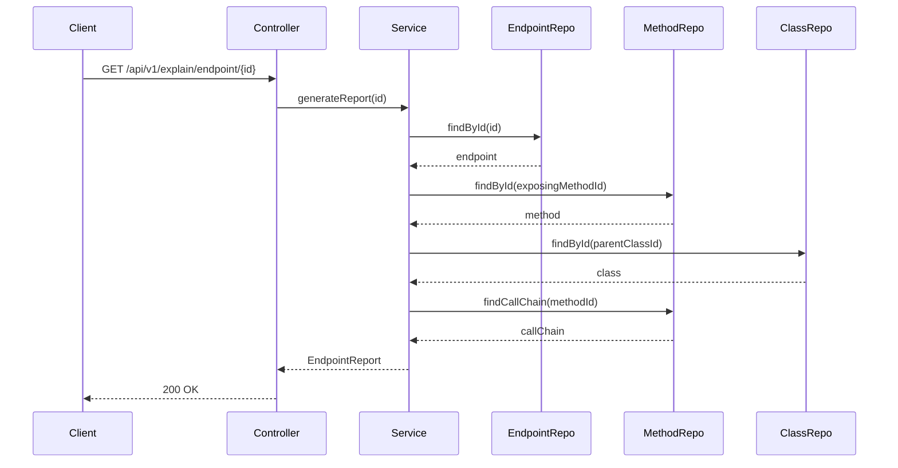
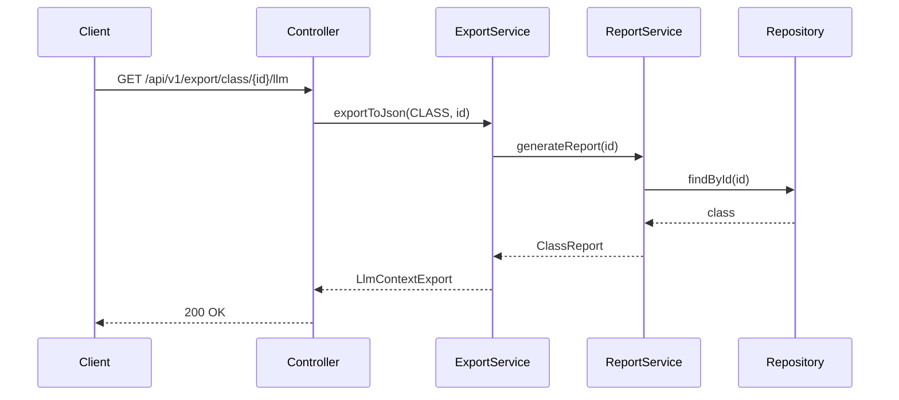

# AGENTS.md: Тестирование модуля Report (Backend)

Правила и структура тестирования для модуля report. Содержит тестовые профили для explain-отчетов и экспорта контекста для LLM.

---

## Структура тестов

```
src/test/java/twin/spring/report/
├── api/
│   ├── ExplainControllerTest.java
│   ├── ExportControllerTest.java
│   └── ReportControllerIntegrationTest.java
├── service/
│   ├── EndpointReportServiceTest.java
│   ├── ClassReportServiceTest.java
│   ├── MethodReportServiceTest.java
│   └── LlmExportServiceTest.java
├── repository/
│   └── ReportRepositoryTest.java
├── profile/
│   ├── ReportTestProfile.java
│   ├── EndpointReportTestData.java
│   ├── ClassReportTestData.java
│   └── MethodReportTestData.java
└── mapper/
    └── ReportMapperTest.java
```

---

## Тестовые профили

### ReportTestProfile.java

```java
/**
 * Тестовый профиль для модуля Report.
 */
@Component
public class ReportTestProfile {
    
    /**
     * Создает тестовый отчет по endpoint.
     */
    public static EndpointReport createEndpointReport() {
        return EndpointReport.builder()
            .elementId("test-endpoint-id")
            .reportType(ReportType.ENDPOINT)
            .summary("REST endpoint for user management")
            .generatedAt(LocalDateTime.now())
            .endpoint(EndpointInfo.builder()
                .id("test-endpoint-id")
                .path("/api/users")
                .httpMethod("GET")
                .produces("application/json")
                .consumes(null)
                .build())
            .exposingMethod(MethodInfo.builder()
                .id("test-method-id")
                .name("getUsers")
                .signature("public List<User> getUsers()")
                .returnType("List<User>")
                .build())
            .controllerClass(ClassInfo.builder()
                .id("test-class-id")
                .name("UserController")
                .fullName("com.example.controller.UserController")
                .packageName("com.example.controller")
                .labels(List.of("RestController"))
                .build())
            .callChain(List.of(
                CallChainItem.builder()
                    .methodId("method-1")
                    .methodName("getUsers")
                    .classId("class-1")
                    .className("UserController")
                    .serviceName("UserController")
                    .depth(0)
                    .build(),
                CallChainItem.builder()
                    .methodId("method-2")
                    .methodName("getAllUsers")
                    .classId("class-2")
                    .className("UserService")
                    .serviceName("UserService")
                    .depth(1)
                    .build()
            ))
            .dependencies(List.of(
                DependencyInfo.builder()
                    .id("dep-1")
                    .targetClassName("UserService")
                    .fieldName("userService")
                    .build()
            ))
            .build();
    }
    
    /**
     * Создает тестовый отчет по классу.
     */
    public static ClassReport createClassReport() {
        return ClassReport.builder()
            .elementId("test-class-id")
            .reportType(ReportType.CLASS)
            .summary("Service class for user operations")
            .generatedAt(LocalDateTime.now())
            .classInfo(ClassInfo.builder()
                .id("test-class-id")
                .name("UserService")
                .fullName("com.example.service.UserService")
                .packageName("com.example.service")
                .labels(List.of("Service"))
                .build())
            .methods(List.of(
                MethodInfo.builder()
                    .id("method-1")
                    .name("getAllUsers")
                    .signature("public List<User> getAllUsers()")
                    .returnType("List<User>")
                    .build(),
                MethodInfo.builder()
                    .id("method-2")
                    .name("findById")
                    .signature("public User findById(Long id)")
                    .returnType("User")
                    .build()
            ))
            .dependencies(List.of(
                DependencyInfo.builder()
                    .id("dep-1")
                    .targetClassName("UserRepository")
                    .fieldName("userRepository")
                    .build()
            ))
            .dependents(List.of(
                DependencyInfo.builder()
                    .id("dep-2")
                    .targetClassName("UserController")
                    .fieldName("userService")
                    .build()
            ))
            .exposedEndpoints(List.of())
            .build();
    }
    
    /**
     * Создает тестовый отчет по методу.
     */
    public static MethodReport createMethodReport() {
        return MethodReport.builder()
            .elementId("test-method-id")
            .reportType(ReportType.METHOD)
            .summary("Method for retrieving all users")
            .generatedAt(LocalDateTime.now())
            .methodInfo(MethodInfo.builder()
                .id("test-method-id")
                .name("getAllUsers")
                .signature("public List<User> getAllUsers()")
                .returnType("List<User>")
                .modifiers(List.of("public"))
                .parameters(List.of())
                .build())
            .parentClass(ClassInfo.builder()
                .id("test-class-id")
                .name("UserService")
                .fullName("com.example.service.UserService")
                .packageName("com.example.service")
                .labels(List.of("Service"))
                .build())
            .calledMethods(List.of(
                MethodCallInfo.builder()
                    .methodId("called-method-1")
                    .methodName("findAll")
                    .className("UserRepository")
                    .build()
            ))
            .callingMethods(List.of(
                MethodCallInfo.builder()
                    .methodId("calling-method-1")
                    .methodName("getUsers")
                    .className("UserController")
                    .build()
            ))
            .fieldAccesses(List.of())
            .build();
    }
    
    /**
     * Создает тестовый экспорт для LLM.
     */
    public static LlmContextExport createLlmExport() {
        return LlmContextExport.builder()
            .contextType("CLASS")
            .elementId("test-class-id")
            .summary("Service class for user operations")
            .structuredData(Map.of(
                "name", "UserService",
                "package", "com.example.service",
                "methods", List.of("getAllUsers", "findById"),
                "dependencies", List.of("UserRepository")
            ))
            .promptTemplate("Analyze the following Spring Service class:\n\n{name}")
            .build();
    }
}
```

### ClassReportTestData.java

```java
/**
 * Константы тестовых данных для отчетов по классам.
 */
public final class ClassReportTestData {
    
    public static final String CLASS_ID = "test-class-id-123";
    public static final String CLASS_NAME = "UserService";
    public static final String CLASS_FULL_NAME = "com.example.service.UserService";
    
    public static final String EXPECTED_SUMMARY = "Service class for user operations";
    
    private ClassReportTestData() {}
}
```

---

## Unit тесты

### EndpointReportServiceTest.java

```java
/**
 * Unit тесты для EndpointReportService.
 */
@ExtendWith(MockitoExtension.class)
class EndpointReportServiceTest {
    
    @Mock
    private EndpointRepository endpointRepository;
    
    @Mock
    private MethodRepository methodRepository;
    
    @Mock
    private ClassRepository classRepository;
    
    @Mock
    private ReportMapper reportMapper;
    
    @InjectMocks
    private EndpointReportService reportService;
    
    @Test
    @DisplayName("Should generate endpoint report")
    void generateReport_shouldReturnEndpointReport() {
        // Given
        String endpointId = "test-endpoint-id";
        Endpoint endpoint = Endpoint.builder()
            .id(endpointId)
            .path("/api/users")
            .httpMethod("GET")
            .exposingMethodId("method-id")
            .build();
        
        Method method = Method.builder()
            .id("method-id")
            .name("getUsers")
            .parentClassId("class-id")
            .build();
        
        Class controllerClass = Class.builder()
            .id("class-id")
            .name("UserController")
            .labels(List.of("RestController"))
            .build();
        
        when(endpointRepository.findById(endpointId))
            .thenReturn(Mono.just(endpoint));
        when(methodRepository.findById("method-id"))
            .thenReturn(Mono.just(method));
        when(classRepository.findById("class-id"))
            .thenReturn(Mono.just(controllerClass));
        when(classRepository.findDependencies("class-id"))
            .thenReturn(Flux.empty());
        when(methodRepository.findCallChain("method-id"))
            .thenReturn(Flux.empty());
        
        // When & Then
        StepVerifier.create(reportService.generateReport(endpointId))
            .expectNextMatches(report -> 
                report.getEndpoint().getPath().equals("/api/users")
            )
            .verifyComplete();
    }
    
    @Test
    @DisplayName("Should include call chain in report")
    void generateReport_shouldIncludeCallChain() {
        // Given
        String endpointId = "test-endpoint-id";
        Endpoint endpoint = Endpoint.builder()
            .id(endpointId)
            .path("/api/users")
            .httpMethod("GET")
            .exposingMethodId("method-id")
            .build();
        
        Method method = Method.builder()
            .id("method-id")
            .name("getUsers")
            .parentClassId("class-id")
            .build();
        
        Class controllerClass = Class.builder()
            .id("class-id")
            .name("UserController")
            .build();
        
        Method calledMethod = Method.builder()
            .id("called-method-id")
            .name("getAllUsers")
            .parentClassId("service-class-id")
            .build();
        
        Class serviceClass = Class.builder()
            .id("service-class-id")
            .name("UserService")
            .build();
        
        when(endpointRepository.findById(endpointId))
            .thenReturn(Mono.just(endpoint));
        when(methodRepository.findById("method-id"))
            .thenReturn(Mono.just(method));
        when(classRepository.findById("class-id"))
            .thenReturn(Mono.just(controllerClass));
        when(methodRepository.findCallChain("method-id"))
            .thenReturn(Flux.just(calledMethod));
        when(classRepository.findById("service-class-id"))
            .thenReturn(Mono.just(serviceClass));
        
        // When & Then
        StepVerifier.create(reportService.generateReport(endpointId))
            .expectNextMatches(report -> 
                report.getCallChain() != null &&
                report.getCallChain().size() >= 1
            )
            .verifyComplete();
    }
    
    @Test
    @DisplayName("Should throw when endpoint not found")
    void generateReport_shouldThrowWhenNotFound() {
        // Given
        String endpointId = "non-existent-id";
        when(endpointRepository.findById(endpointId))
            .thenReturn(Mono.empty());
        
        // When & Then
        StepVerifier.create(reportService.generateReport(endpointId))
            .expectError(ResourceNotFoundException.class)
            .verify();
    }
}
```

### ClassReportServiceTest.java

```java
/**
 * Unit тесты для ClassReportService.
 */
@ExtendWith(MockitoExtension.class)
class ClassReportServiceTest {
    
    @Mock
    private ClassRepository classRepository;
    
    @Mock
    private MethodRepository methodRepository;
    
    @Mock
    private EndpointRepository endpointRepository;
    
    @Mock
    private ReportMapper reportMapper;
    
    @InjectMocks
    private ClassReportService reportService;
    
    @Test
    @DisplayName("Should generate class report with methods")
    void generateReport_shouldIncludeMethods() {
        // Given
        String classId = "test-class-id";
        Class serviceClass = Class.builder()
            .id(classId)
            .name("UserService")
            .fullName("com.example.service.UserService")
            .labels(List.of("Service"))
            .build();
        
        List<Method> methods = List.of(
            Method.builder().id("m1").name("getAllUsers").build(),
            Method.builder().id("m2").name("findById").build()
        );
        
        when(classRepository.findById(classId))
            .thenReturn(Mono.just(serviceClass));
        when(methodRepository.findByParentClassId(classId))
            .thenReturn(Flux.fromIterable(methods));
        when(classRepository.findDependencies(classId))
            .thenReturn(Flux.empty());
        when(classRepository.findDependents(classId))
            .thenReturn(Flux.empty());
        
        // When & Then
        StepVerifier.create(reportService.generateReport(classId))
            .expectNextMatches(report -> 
                report.getClassInfo().getName().equals("UserService") &&
                report.getMethods().size() == 2
            )
            .verifyComplete();
    }
    
    @Test
    @DisplayName("Should include dependencies in report")
    void generateReport_shouldIncludeDependencies() {
        // Given
        String classId = "test-class-id";
        Class serviceClass = Class.builder()
            .id(classId)
            .name("UserService")
            .build();
        
        Class repositoryClass = Class.builder()
            .id("repo-id")
            .name("UserRepository")
            .build();
        
        when(classRepository.findById(classId))
            .thenReturn(Mono.just(serviceClass));
        when(methodRepository.findByParentClassId(classId))
            .thenReturn(Flux.empty());
        when(classRepository.findDependencies(classId))
            .thenReturn(Flux.just(repositoryClass));
        when(classRepository.findDependents(classId))
            .thenReturn(Flux.empty());
        
        // When & Then
        StepVerifier.create(reportService.generateReport(classId))
            .expectNextMatches(report -> 
                report.getDependencies().size() == 1 &&
                report.getDependencies().get(0).getTargetClassName().equals("UserRepository")
            )
            .verifyComplete();
    }
    
    @Test
    @DisplayName("Should include exposed endpoints for controllers")
    void generateReport_shouldIncludeEndpoints() {
        // Given
        String classId = "test-class-id";
        Class controllerClass = Class.builder()
            .id(classId)
            .name("UserController")
            .labels(List.of("RestController"))
            .build();
        
        Method method = Method.builder()
            .id("method-id")
            .name("getUsers")
            .build();
        
        Endpoint endpoint = Endpoint.builder()
            .id("endpoint-id")
            .path("/api/users")
            .httpMethod("GET")
            .exposingMethodId("method-id")
            .build();
        
        when(classRepository.findById(classId))
            .thenReturn(Mono.just(controllerClass));
        when(methodRepository.findByParentClassId(classId))
            .thenReturn(Flux.just(method));
        when(classRepository.findDependencies(classId))
            .thenReturn(Flux.empty());
        when(classRepository.findDependents(classId))
            .thenReturn(Flux.empty());
        when(endpointRepository.findByExposingMethodId("method-id"))
            .thenReturn(Mono.just(endpoint));
        
        // When & Then
        StepVerifier.create(reportService.generateReport(classId))
            .expectNextMatches(report -> 
                report.getExposedEndpoints() != null &&
                report.getExposedEndpoints().size() == 1
            )
            .verifyComplete();
    }
}
```

### LlmExportServiceTest.java

```java
/**
 * Unit тесты для LlmExportService.
 */
@ExtendWith(MockitoExtension.class)
class LlmExportServiceTest {
    
    @Mock
    private ClassReportService classReportService;
    
    @Mock
    private MethodReportService methodReportService;
    
    @Mock
    private EndpointReportService endpointReportService;
    
    @InjectMocks
    private LlmExportService exportService;
    
    @Test
    @DisplayName("Should export class context to JSON")
    void exportToJson_shouldExportClassContext() {
        // Given
        String classId = "test-class-id";
        ClassReport report = ReportTestProfile.createClassReport();
        
        when(classReportService.generateReport(classId))
            .thenReturn(Mono.just(report));
        
        // When & Then
        StepVerifier.create(exportService.exportToJson("CLASS", classId))
            .expectNextMatches(export -> 
                export.getContextType().equals("CLASS") &&
                export.getElementId().equals(classId) &&
                export.getStructuredData() != null
            )
            .verifyComplete();
    }
    
    @Test
    @DisplayName("Should export with prompt template")
    void exportWithPrompt_shouldIncludeTemplate() {
        // Given
        String classId = "test-class-id";
        ClassReport report = ReportTestProfile.createClassReport();
        
        when(classReportService.generateReport(classId))
            .thenReturn(Mono.just(report));
        
        // When & Then
        StepVerifier.create(exportService.exportWithPrompt("CLASS", classId))
            .expectNextMatches(export -> 
                export.getPromptTemplate() != null &&
                export.getPromptTemplate().contains("UserService")
            )
            .verifyComplete();
    }
    
    @Test
    @DisplayName("Should export endpoint context")
    void exportToJson_shouldExportEndpointContext() {
        // Given
        String endpointId = "test-endpoint-id";
        EndpointReport report = ReportTestProfile.createEndpointReport();
        
        when(endpointReportService.generateReport(endpointId))
            .thenReturn(Mono.just(report));
        
        // When & Then
        StepVerifier.create(exportService.exportToJson("ENDPOINT", endpointId))
            .expectNextMatches(export -> 
                export.getContextType().equals("ENDPOINT") &&
                export.getSummary().contains("REST endpoint")
            )
            .verifyComplete();
    }
}
```

---

## Интеграционные тесты

### ReportControllerIntegrationTest.java

```java
/**
 * Интеграционные тесты для Report API.
 */
@SpringBootTest
@AutoConfigureWebTestClient
@Testcontainers
class ReportControllerIntegrationTest {
    
    @Container
    static Neo4jContainer<?> neo4jContainer = new Neo4jContainer<>("neo4j:5.13");
    
    @Autowired
    private WebTestClient webTestClient;
    
    @Autowired
    private ClassRepository classRepository;
    
    @Autowired
    private MethodRepository methodRepository;
    
    @Autowired
    private EndpointRepository endpointRepository;
    
    @BeforeEach
    void setUp() {
        classRepository.deleteAll().block();
        methodRepository.deleteAll().block();
        endpointRepository.deleteAll().block();
    }
    
    @Test
    @DisplayName("GET /api/v1/explain/endpoint/{id} - should return endpoint report")
    void explainEndpoint_shouldReturnReport() {
        // Given
        Class controller = ArchitectureTestProfile.createControllerClass();
        Class savedController = classRepository.save(controller).block();
        
        Method method = ArchitectureTestProfile.createMethod(savedController.getId());
        Method savedMethod = methodRepository.save(method).block();
        
        Endpoint endpoint = ArchitectureTestProfile.createEndpoint(savedMethod.getId());
        Endpoint savedEndpoint = endpointRepository.save(endpoint).block();
        
        // When & Then
        webTestClient.get()
            .uri("/api/v1/explain/endpoint/{id}", savedEndpoint.getId())
            .exchange()
            .expectStatus().isOk()
            .expectBody()
            .jsonPath("$.endpoint.path").isEqualTo(endpoint.getPath())
            .jsonPath("$.endpoint.httpMethod").isEqualTo(endpoint.getHttpMethod())
            .jsonPath("$.controllerClass.name").isEqualTo(controller.getName());
    }
    
    @Test
    @DisplayName("GET /api/v1/explain/class/{id} - should return class report")
    void explainClass_shouldReturnReport() {
        // Given
        Class serviceClass = ArchitectureTestProfile.createServiceClass();
        Class savedClass = classRepository.save(serviceClass).block();
        
        Method method1 = Method.builder()
            .id(UUID.randomUUID().toString())
            .name("getAllUsers")
            .signature("public List<User> getAllUsers()")
            .parentClassId(savedClass.getId())
            .build();
        
        Method method2 = Method.builder()
            .id(UUID.randomUUID().toString())
            .name("findById")
            .signature("public User findById(Long id)")
            .parentClassId(savedClass.getId())
            .build();
        
        methodRepository.saveAll(List.of(method1, method2)).collectList().block();
        
        // When & Then
        webTestClient.get()
            .uri("/api/v1/explain/class/{id}", savedClass.getId())
            .exchange()
            .expectStatus().isOk()
            .expectBody()
            .jsonPath("$.classInfo.name").isEqualTo(serviceClass.getName())
            .jsonPath("$.methods").isArray()
            .jsonPath("$.methods.length()").isEqualTo(2);
    }
    
    @Test
    @DisplayName("GET /api/v1/explain/method/{id} - should return method report")
    void explainMethod_shouldReturnReport() {
        // Given
        Class serviceClass = ArchitectureTestProfile.createServiceClass();
        Class savedClass = classRepository.save(serviceClass).block();
        
        Method method = ArchitectureTestProfile.createMethod(savedClass.getId());
        Method savedMethod = methodRepository.save(method).block();
        
        // When & Then
        webTestClient.get()
            .uri("/api/v1/explain/method/{id}", savedMethod.getId())
            .exchange()
            .expectStatus().isOk()
            .expectBody()
            .jsonPath("$.methodInfo.name").isEqualTo(method.getName())
            .jsonPath("$.parentClass.name").isEqualTo(serviceClass.getName());
    }
    
    @Test
    @DisplayName("GET /api/v1/export/class/{id}/llm - should export for LLM")
    void exportClassForLlm_shouldReturnExport() {
        // Given
        Class serviceClass = ArchitectureTestProfile.createServiceClass();
        Class savedClass = classRepository.save(serviceClass).block();
        
        // When & Then
        webTestClient.get()
            .uri("/api/v1/export/class/{id}/llm", savedClass.getId())
            .exchange()
            .expectStatus().isOk()
            .expectBody()
            .jsonPath("$.contextType").isEqualTo("CLASS")
            .jsonPath("$.elementId").isEqualTo(savedClass.getId())
            .jsonPath("$.structuredData").exists();
    }
    
    @Test
    @DisplayName("GET /api/v1/export/endpoint/{id}/llm?format=markdown - should export markdown")
    void exportEndpointForLlm_shouldReturnMarkdown() {
        // Given
        Class controller = ArchitectureTestProfile.createControllerClass();
        Class savedController = classRepository.save(controller).block();
        
        Method method = ArchitectureTestProfile.createMethod(savedController.getId());
        Method savedMethod = methodRepository.save(method).block();
        
        Endpoint endpoint = ArchitectureTestProfile.createEndpoint(savedMethod.getId());
        Endpoint savedEndpoint = endpointRepository.save(endpoint).block();
        
        // When & Then
        webTestClient.get()
            .uri(uriBuilder -> uriBuilder
                .path("/api/v1/export/endpoint/{id}/llm")
                .queryParam("format", "markdown")
                .build(savedEndpoint.getId()))
            .exchange()
            .expectStatus().isOk()
            .expectBody()
            .jsonPath("$.contextType").isEqualTo("ENDPOINT");
    }
}
```

---

## Тестовые сценарии

### Сценарий: Генерация отчета по endpoint



### Сценарий: Экспорт контекста для LLM



---

## Критерии приемки

| Критерий | Описание |
|----------|----------|
| Покрытие кода | Минимум 80% для service |
| Unit тесты | Все методы сервисов покрыты |
| Интеграционные тесты | Все REST endpoints покрыты |
| Форматы экспорта | JSON и Markdown проверены |
| Call chain | Проверено построение цепочки вызовов |