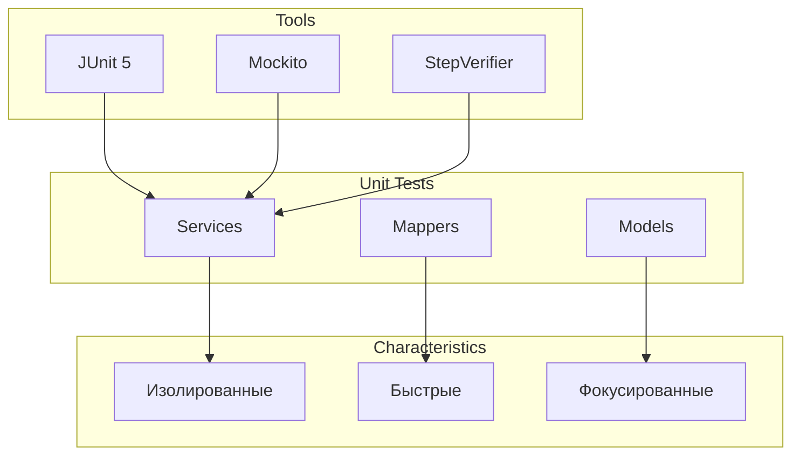

# AGENTS.md: Unit тестирование Backend (JUnit 5 + Mockito)

Данный документ содержит специфические правила и стандарты для unit тестирования backend-части проекта SpringTwin.

---

## Технологический стек

- **Фреймворк**: JUnit 5
- **Моки**: Mockito
- **Реактивность**: Reactor Test (StepVerifier)
- **Профили**: Тестовые профили для данных

---

## Принципы Unit тестирования

### Обзор



### Характеристики Unit тестов

| Характеристика | Описание |
|----------------|----------|
| **Изоляция** | Тестируют один компонент в полной изоляции |
| **Скорость** | Быстрое выполнение без Spring контекста |
| **Моки** | Все зависимости замоканы через Mockito |
| **Профили** | Тестовые данные вынесены в отдельные классы |

---

## Структура тестов

### Организация по модулям

```
src/test/java/twin/spring/unit/
├── app/
│   ├── service/
│   │   └── AppServiceTest.java
│   └── mapper/
│       └── AppMapperTest.java
├── project/
│   ├── service/
│   │   └── ProjectServiceTest.java
│   └── mapper/
│       └── ProjectMapperTest.java
├── architecture/
│   ├── service/
│   │   ├── ClassNodeServiceTest.java
│   │   └── MethodNodeServiceTest.java
│   └── mapper/
│       ├── ClassNodeMapperTest.java
│       └── MethodNodeMapperTest.java
├── analysis/
│   ├── service/
│   │   ├── AnalysisServiceTest.java
│   │   └── AstIndexerServiceTest.java
│   └── mapper/
│       └── AnalysisTaskMapperTest.java
├── report/
│   ├── service/
│   │   ├── ReportServiceTest.java
│   │   └── LlmExportServiceTest.java
│   └── mapper/
│       └── ReportMapperTest.java
├── migration/
│   └── service/
│       └── MigrationServiceTest.java
└── mcp/
    ├── service/
    │   ├── McpToolServiceTest.java
    │   └── McpExecutorServiceTest.java
    └── mapper/
        └── McpContextMapperTest.java
```

---

## Именование тестов

### Классы тестов

```java
// Формат: <Subject>Test.java
ProjectServiceTest.java
ProjectMapperTest.java
ClassNodeServiceTest.java
```

### Методы тестов

```java
// Формат: methodName_scenario_expectedResult
@Test
void findById_existingId_returnsProject() { }

@Test
void findById_nonExistingId_returnsEmpty() { }

@Test
void create_validRequest_returnsCreatedProject() { }

@Test
void update_existingProject_returnsUpdatedProject() { }
```

---

## Шаблоны тестов

### Шаблон Service теста

```java
/**
 * Unit тесты для <ServiceName>.
 * Тестирует бизнес-логику в изоляции с использованием Mockito.
 */
@ExtendWith(MockitoExtension.class)
class ServiceNameTest {
    
    @Mock
    private DependencyRepository repository;
    
    @Mock
    private DependencyMapper mapper;
    
    @InjectMocks
    private ServiceName service;
    
    @Test
    void methodName_scenario_expectedResult() {
        // Arrange
        Entity entity = TestProfile.createEntity();
        Response expected = TestProfile.createResponse();
        
        when(repository.findById(any())).thenReturn(Mono.just(entity));
        when(mapper.toResponse(entity)).thenReturn(expected);
        
        // Act & Assert
        StepVerifier.create(service.methodName(id))
            .expectNext(expected)
            .verifyComplete();
    }
}
```

### Шаблон Mapper теста

```java
/**
 * Unit тесты для <MapperName>.
 */
class MapperNameTest {
    
    private MapperName mapper = new MapperName();
    
    @Test
    void toResponse_validEntity_returnsResponse() {
        // Arrange
        Entity entity = TestProfile.createEntity();
        
        // Act
        Response response = mapper.toResponse(entity);
        
        // Assert
        assertThat(response.getId()).isEqualTo(entity.getId());
        assertThat(response.getName()).isEqualTo(entity.getName());
    }
    
    @Test
    void toEntity_validRequest_returnsEntity() {
        // Arrange
        Request request = TestProfile.createRequest();
        
        // Act
        Entity entity = mapper.toEntity(request);
        
        // Assert
        assertThat(entity.getName()).isEqualTo(request.getName());
        assertThat(entity.getId()).isNotNull();
    }
}
```

---

## Тестовые профили

### Использование профилей

```java
import twin.spring.profiles.project.ProjectTestProfile;
import twin.spring.profiles.architecture.ArchitectureTestProfile;

@Test
void testWithProfile() {
    // Используем профиль для создания тестовых данных
    Project project = ProjectTestProfile.createProject();
    ClassNode classNode = ArchitectureTestProfile.createClassNode();
    
    // ...
}
```

### Расположение профилей

Профили находятся в `src/test/java/twin/spring/profiles/<module>/`

---

## Реактивное тестирование

### StepVerifier для Mono

```java
@Test
void findById_returnsMono() {
    // Arrange
    when(repository.findById(id)).thenReturn(Mono.just(entity));
    
    // Act & Assert
    StepVerifier.create(service.findById(id))
        .expectNext(expected)
        .verifyComplete();
}
```

### StepVerifier для Flux

```java
@Test
void findAll_returnsFlux() {
    // Arrange
    when(repository.findAll()).thenReturn(Flux.fromIterable(entities));
    
    // Act & Assert
    StepVerifier.create(service.findAll())
        .expectNextCount(3)
        .verifyComplete();
}
```

### Тестирование ошибок

```java
@Test
void findById_notFound_throwsException() {
    // Arrange
    when(repository.findById(id)).thenReturn(Mono.empty());
    
    // Act & Assert
    StepVerifier.create(service.findById(id))
        .expectError(EntityNotFoundException.class)
        .verify();
}
```

---

## Критерии приемки

| Критерий | Описание |
|----------|----------|
| Покрытие сервисов | Все публичные методы покрыты |
| Покрытие мапперов | Все методы преобразования покрыты |
| Изоляция | Все зависимости замоканы |
| Профили | Тестовые данные вынесены |
| Именование | Следует конвенции methodName_scenario_expectedResult |

---

## Запуск тестов

```bash
# Все unit тесты
gradlew.bat test --tests "twin.spring.unit.*"

# Unit тесты конкретного модуля
gradlew.bat test --tests "twin.spring.unit.project.*"
gradlew.bat test --tests "twin.spring.unit.architecture.*"
gradlew.bat test --tests "twin.spring.unit.analysis.*"
gradlew.bat test --tests "twin.spring.unit.report.*"
gradlew.bat test --tests "twin.spring.unit.migration.*"
gradlew.bat test --tests "twin.spring.unit.mcp.*"
gradlew.bat test --tests "twin.spring.unit.app.*"