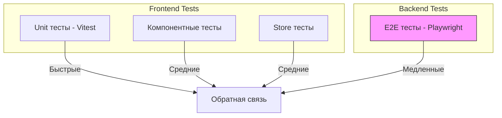

# AGENTS.md: Правила тестирования Frontend (Vitest)

Данный документ содержит специфические правила и стандарты для тестирования frontend-части проекта SpringTwin.

---

## Технологический стек

- **Unit тесты**: Vitest
- **Моки**: vi (Vitest)
- **Компонентное тестирование**: @vue/test-utils

**Примечание:** E2E тесты выполняются на backend с использованием Playwright. См. `src/test/java/AGENTS.md` для деталей.

---

## Принципы тестирования

### TDD (Test-Driven Development)

1. Пишите тесты до реализации компонентов
2. Красный тест → Зеленый тест → Рефакторинг
3. Минимальный код для прохождения теста

### Уровни тестирования



### Разделение ответственности

| Уровень | Расположение | Покрытие | Инструменты |
|---------|--------------|----------|-------------|
| **Unit** | `src/test/vue/<module>/` | Компоненты, store, сервисы | Vitest |
| **E2E** | `src/test/java/twin/spring/e2e/` | Пользовательские сценарии | Playwright (backend) |

---

## Структура тестов

### Организация по модулям

```
src/test/vue/
├── app/
│   ├── view/
│   │   ├── App.spec.ts
│   │   ├── AppFooter.spec.ts
│   │   ├── AppHeader.spec.ts
│   │   ├── AppLayout.spec.ts
│   │   ├── AppSidebar.spec.ts
│   │   └── NavItem.spec.ts
│   ├── store/
│   │   └── app.store.spec.ts
│   └── service/
│       └── app.service.spec.ts
├── project/
│   ├── view/
│   │   └── ProjectView.spec.ts
│   ├── store/
│   │   └── project.store.spec.ts
│   └── service/
│       └── project.service.spec.ts
├── architecture/
│   ├── view/
│   │   └── ArchitectureView.spec.ts
│   ├── store/
│   │   └── architecture.store.spec.ts
│   └── service/
│       └── architecture.service.spec.ts
├── analysis/
│   ├── view/
│   │   └── AnalysisView.spec.ts
│   ├── store/
│   │   └── analysis.store.spec.ts
│   └── service/
│       └── analysis.service.spec.ts
├── report/
│   ├── view/
│   │   └── ReportView.spec.ts
│   ├── store/
│   │   └── report.store.spec.ts
│   └── service/
│       └── report.service.spec.ts
└── mcp/
    ├── view/
    │   └── McpView.spec.ts
    ├── store/
    │   └── mcp.store.spec.ts
    └── service/
        └── mcp.service.spec.ts
```

**Важно:** Не должно быть папки `src/test/vue/src`! Код должен быть организован строго по модулям!

### Именование тестов

```typescript
// Файл теста
<component>.spec.ts        // Unit тесты

// Примеры
ProjectView.spec.ts
ProjectDetailView.spec.ts
project.store.spec.ts
project.service.spec.ts
```

### Именование тест-кейсов

```typescript
// Формат: should_<expectedBehavior>_when_<condition>
describe('ProjectView', () => {
  it('should render project list correctly', () => { });
  it('should display loading state when fetching data', () => { });
  it('should show error message when request fails', () => { });
});
```

---

## Тестовые профили

### Концепция

Тестовые профили - это TypeScript модули с фабриками для создания тестовых данных. Профили используются для унификации тестовых данных между frontend unit тестами и backend тестами.

### Расположение

Профили находятся в отдельных файлах внутри модулей или в общем месте:

```
src/test/vue/
├── profiles/
│   ├── project.profile.ts
│   ├── architecture.profile.ts
│   └── ...
```

### Пример профиля

```typescript
// profiles/project.profile.ts
import type { Project, CreateProjectRequest } from '@/project/domain/Project';

/**
 * Тестовый профиль для модуля Project.
 * Предоставляет фабрики тестовых данных для unit тестов.
 */
export class ProjectTestProfile {
  
  // Константы для повторного использования
  static readonly DEFAULT_PROJECT_ID = 'test-project-id';
  static readonly DEFAULT_PROJECT_NAME = 'Test Project';
  static readonly DEFAULT_PROJECT_PATH = '/path/to/project';
  
  /**
   * Создает тестовый проект с базовыми данными.
   */
  static createDefaultProject(): Project {
    return {
      id: this.DEFAULT_PROJECT_ID,
      name: this.DEFAULT_PROJECT_NAME,
      path: this.DEFAULT_PROJECT_PATH,
      includePackages: ['com.example'],
      excludePackages: ['com.example.config'],
    };
  }
  
  /**
   * Создает тестовый проект с кастомными данными.
   */
  static createProject(name: string, path: string): Project {
    return {
      id: `project-${Date.now()}`,
      name,
      path,
      includePackages: ['com.example'],
      excludePackages: [],
    };
  }
  
  /**
   * Создает список тестовых проектов.
   */
  static createProjectList(count: number): Project[] {
    return Array.from({ length: count }, (_, i) => 
      this.createProject(`Project ${i}`, `/path/${i}`)
    );
  }
  
  /**
   * Создает тестовый запрос на создание проекта.
   */
  static createDefaultRequest(): CreateProjectRequest {
    return {
      name: 'New Project',
      path: '/path/to/new/project',
      includePackages: ['com.newproject'],
      excludePackages: [],
    };
  }
}
```

### Использование профилей

```typescript
import { ProjectTestProfile } from '@/test/vue/profiles/project.profile';

describe('ProjectView', () => {
  it('should render project list', () => {
    const projects = ProjectTestProfile.createProjectList(3);
    // ... тест
  });
});
```

---

## Unit тесты (Vitest)

### Конфигурация Vitest

Конфигурация Vitest находится в `src/main/vue/vitest.config.ts`. Тесты запускаются из директории `src/main/vue`.

```typescript
// src/main/vue/vitest.config.ts
import { defineConfig } from 'vitest/config';
import vue from '@vitejs/plugin-vue';

/**
 * Vitest configuration for SpringTwin Vue.js frontend.
 * Run from src/main/vue directory: cd src/main/vue && set CI=true && npm run test
 */
export default defineConfig({
  plugins: [vue()],
  
  // Set root to current directory (src/main/vue)
  root: './',
  
  test: {
    environment: 'jsdom',
    globals: true,
    
    // Include test files pattern (relative to src/main/vue)
    include: ['../../../src/test/vue/**/*.spec.ts'],
    
    coverage: {
      provider: 'v8',
      reporter: ['text', 'json', 'html', 'lcov', 'cobertura'],
      reportsDirectory: '../../../build/reports/vue',
    },
  },
  
  // Resolve aliases (modules are directly in src/main/vue/<module>)
  resolve: {
    alias: {
      '@': '.',
      '@app': './app',
      '@project': './project',
      '@architecture': './architecture',
      '@analysis': './analysis',
      '@report': './report',
      '@mcp': './mcp',
    },
  },
});
```

### Тестирование компонентов

```typescript
// project/view/ProjectView.spec.ts
import { describe, it, expect, vi, beforeEach } from 'vitest';
import { mount } from '@vue/test-utils';
import { createPinia, setActivePinia } from 'pinia';
import ProjectView from '@/project/view/ProjectView.vue';
import { ProjectTestProfile } from '@/test/vue/profiles/project.profile';

describe('ProjectView', () => {
  beforeEach(() => {
    // Создаем новый Pinia instance для каждого теста
    setActivePinia(createPinia());
  });
  
  it('should render project list correctly', () => {
    const wrapper = mount(ProjectView, {
      global: {
        plugins: [createPinia()],
      },
    });
    
    expect(wrapper.find('[name="project-list"]').exists()).toBe(true);
  });
  
  it('should display loading state when fetching data', () => {
    const wrapper = mount(ProjectView, {
      global: {
        plugins: [createPinia()],
      },
    });
    
    // Проверяем наличие индикатора загрузки
    expect(wrapper.find('[role="status"]').exists()).toBe(true);
  });
  
  it('should call fetchProjects on mount', async () => {
    const fetchProjects = vi.fn();
    
    mount(ProjectView, {
      global: {
        plugins: [createPinia()],
        mocks: {
          $store: {
            dispatch: fetchProjects,
          },
        },
      },
    });
    
    expect(fetchProjects).toHaveBeenCalled();
  });
});
```

### Тестирование Pinia store

```typescript
// project/store/project.store.spec.ts
import { describe, it, expect, vi, beforeEach } from 'vitest';
import { setActivePinia, createPinia } from 'pinia';
import { useProjectStore } from '@/project/store/project.store';
import { ProjectTestProfile } from '@/test/vue/profiles/project.profile';

describe('Project Store', () => {
  beforeEach(() => {
    setActivePinia(createPinia());
  });
  
  it('should initialize with empty projects', () => {
    const store = useProjectStore();
    
    expect(store.projects).toEqual([]);
    expect(store.isLoading).toBe(false);
    expect(store.error).toBeNull();
  });
  
  it('should fetch projects successfully', async () => {
    const store = useProjectStore();
    const projects = ProjectTestProfile.createProjectList(2);
    
    // Мокаем API
    vi.mock('@/project/api', () => ({
      projectApi: {
        getAll: vi.fn(() => Promise.resolve(projects)),
      },
    }));
    
    await store.fetchProjects();
    
    expect(store.projects).toHaveLength(2);
    expect(store.isLoading).toBe(false);
  });
  
  it('should handle fetch error', async () => {
    const store = useProjectStore();
    const error = new Error('Network error');
    
    // Мокаем API с ошибкой
    vi.mock('@/project/api', () => ({
      projectApi: {
        getAll: vi.fn(() => Promise.reject(error)),
      },
    }));
    
    await store.fetchProjects();
    
    expect(store.error).toBe('Network error');
    expect(store.isLoading).toBe(false);
  });
  
  it('should add new project', () => {
    const store = useProjectStore();
    const newProject = ProjectTestProfile.createDefaultProject();
    
    store.addProject(newProject);
    
    expect(store.projects).toContainEqual(newProject);
  });
  
  it('should remove project by id', () => {
    const store = useProjectStore();
    const project = ProjectTestProfile.createDefaultProject();
    store.projects = [project];
    
    store.removeProject(project.id);
    
    expect(store.projects).not.toContainEqual(project);
  });
});
```

### Тестирование сервисов

```typescript
// project/service/project.service.spec.ts
import { describe, it, expect, vi } from 'vitest';
import { ProjectService } from '@/project/service/project.service';
import { ProjectTestProfile } from '@/test/vue/profiles/project.profile';

describe('ProjectService', () => {
  it('should transform project for display correctly', () => {
    const project = ProjectTestProfile.createDefaultProject();
    const service = new ProjectService();
    
    const result = service.transformProjectForDisplay(project);
    
    expect(result.displayName).toBe(ProjectTestProfile.DEFAULT_PROJECT_NAME);
    expect(result.displayPath).toBe(ProjectTestProfile.DEFAULT_PROJECT_PATH);
  });
  
  it('should format project path correctly', () => {
    const project = ProjectTestProfile.createProject('Test', '/very/long/path/to/project');
    const service = new ProjectService();
    
    const result = service.transformProjectForDisplay(project);
    
    expect(result.displayPath.length).toBeLessThanOrEqual(50);
  });
});
```

---

## Моки (Vitest)

### Мокирование модулей

```typescript
// Мок модуля API
vi.mock('@/project/api', () => ({
  projectApi: {
    getAll: vi.fn(() => Promise.resolve([])),
    getById: vi.fn((id) => Promise.resolve({ id })),
    create: vi.fn((data) => Promise.resolve(data)),
    update: vi.fn((id, data) => Promise.resolve({ id, ...data })),
    delete: vi.fn((id) => Promise.resolve()),
  },
}));

// Мок с динамическими данными
vi.mock('@/project/api', () => {
  const projects = [
    { id: '1', name: 'Project 1' },
    { id: '2', name: 'Project 2' },
  ];
  
  return {
    projectApi: {
      getAll: vi.fn(() => Promise.resolve(projects)),
    },
  };
});
```

### Мокирование функций

```typescript
// Мок функции
const mockFetch = vi.fn();
vi.stubGlobal('fetch', mockFetch);

// Мок console
const consoleSpy = vi.spyOn(console, 'log');
const consoleErrorSpy = vi.spyOn(console, 'error').mockImplementation(() => {});

// Мок localStorage
const localStorageMock = {
  getItem: vi.fn(),
  setItem: vi.fn(),
  removeItem: vi.fn(),
  clear: vi.fn(),
};
vi.stubGlobal('localStorage', localStorageMock);
```

### Мокирование Pinia store

```typescript
import { vi } from 'vitest';
import { createTestingPinia } from '@pinia/testing';

it('should work with mocked store', () => {
  const wrapper = mount(MyComponent, {
    global: {
      plugins: [
        createTestingPinia({
          createSpy: vi.fn,
          initialState: {
            project: {
              projects: ProjectTestProfile.createProjectList(2),
            },
          },
        }),
      ],
    },
  });
  
  const store = useProjectStore();
  
  // Проверка начального состояния
  expect(store.projects).toHaveLength(2);
  
  // Вызов action
  store.fetchProjects();
  
  // Проверка вызова
  expect(store.fetchProjects).toHaveBeenCalled();
});
```

---

## Покрытие тестами

### Требования

| Тип | Покрытие |
|-----|----------|
| Vue компоненты | Все компоненты должны иметь unit тесты |
| Pinia stores | Все actions и getters должны покрываться тестами |
| Сервисы | Все публичные методы должны покрываться тестами |

### Запуск тестов

Тесты запускаются из директории `src/main/vue`:

```bash
# Unit тесты
cd src\main\vue
set CI=true && npm run test

# Unit тесты с покрытием
npm run test:coverage

# Unit тесты с UI
set CI=true && npm run test:ui

# Запуск конкретного теста
npm run test -- project.store.spec.ts
```

Для запуска всех тестов проекта (backend + frontend):

```bash
# Из корня проекта
gradlew.bat test
```

**Примечание:** Gradle автоматически вызывает `set CI=true && npm run test` при сборке frontend.

---

## Best Practices

### 1. Изоляция тестов

```typescript
beforeEach(() => {
  // Сброс состояния перед каждым тестом
  vi.clearAllMocks();
  setActivePinia(createPinia());
});

afterEach(() => {
  // Очистка после теста
  vi.restoreAllMocks();
});
```

### 2. Читаемость

```typescript
// Используйте осмысленные имена
const existingProject = ProjectTestProfile.createDefaultProject();
const expectedProjectName = ProjectTestProfile.DEFAULT_PROJECT_NAME;

// Не используйте магические значения
const projectId = ProjectTestProfile.DEFAULT_PROJECT_ID;
const nonExistingId = 'non-existing-id';

// Используйте описательные названия тестов
it('should display error message when project name is empty', () => {
  // ...
});
```

### 3. Тестирование граничных случаев

```typescript
describe('ProjectView edge cases', () => {
  it('should handle empty project list', () => {
    const wrapper = mount(ProjectView, {
      global: { plugins: [createPinia()] },
    });
    
    expect(wrapper.find('[name="empty-state"]').exists()).toBe(true);
  });
  
  it('should handle long project names', () => {
    const longName = 'A'.repeat(200);
    const project = ProjectTestProfile.createProject(longName, '/path');
    
    const service = new ProjectService();
    const result = service.transformProjectForDisplay(project);
    
    expect(result.displayName.length).toBeLessThanOrEqual(100);
  });
  
  it('should handle special characters in project name', () => {
    const specialName = '<script>alert("xss")</script>';
    const project = ProjectTestProfile.createProject(specialName, '/path');
    
    const wrapper = mount(ProjectView, {
      global: {
        plugins: [createPinia()],
      },
      props: { project },
    });
    
    // Проверка что скрипт не выполняется
    expect(wrapper.html()).not.toContain('<script>');
  });
});
```

### 4. Тестирование ошибок

При исправлении ошибок добавляйте автотесты:

```typescript
describe('Bug #456: Race condition fix', () => {
  it('should handle concurrent project updates correctly', async () => {
    const store = useProjectStore();
    const project = ProjectTestProfile.createDefaultProject();
    
    // Одновременное обновление
    await Promise.all([
      store.updateProject({ ...project, name: 'Updated 1' }),
      store.updateProject({ ...project, name: 'Updated 2' }),
    ]);
    
    // Проверка что состояние консистентно
    expect(store.projects[0].name).toBeDefined();
    expect(store.error).toBeNull();
  });
});
```

### 5. Семантические селекторы

Используйте атрибуты `data-test`, `name` и `role` для селекторов:

```typescript
// Хорошо
wrapper.find('[data-test="btn-save"]');
wrapper.find('[name="project-form"]');
wrapper.find('[role="navigation"]');

// Плохо
wrapper.find('.btn-primary');
wrapper.find('#save-button');
wrapper.find('div.container > button');
```

---

## Запуск после завершения задачи

Всегда запускайте выполнение тестов после выполнения задачи:

Для проекта целиком:

```bash
gradlew.bat test
```

Отдельно для UI:

```bash
cd src\main\vue
set CI=true && npm run test
```

Задача не считается выполненной, пока все тесты не пройдут успешно.