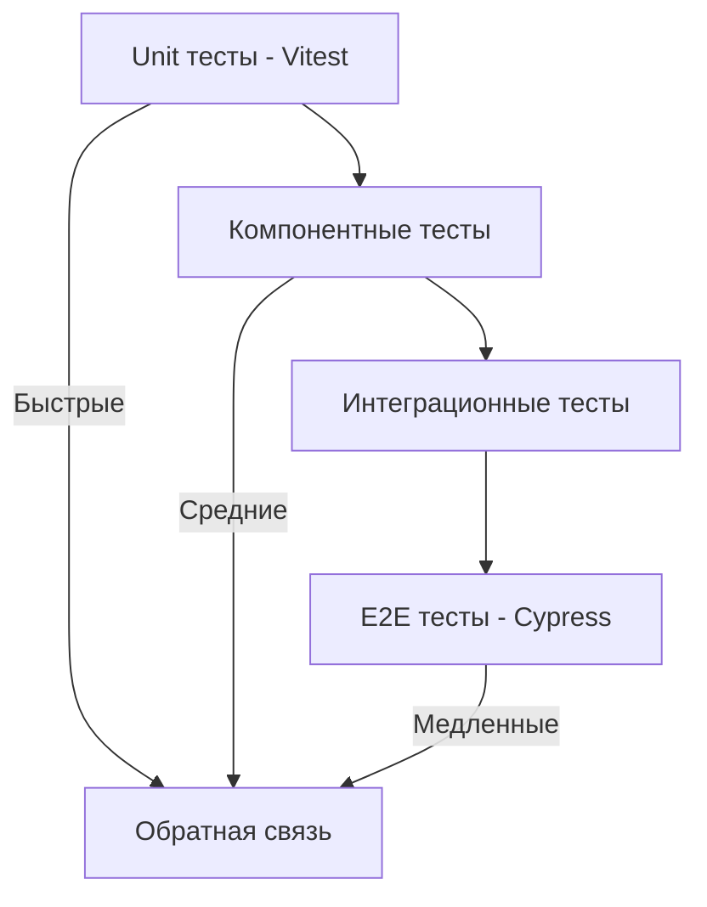

# AGENTS.md: Правила тестирования Frontend (Vitest/Cypress)

Данный документ содержит специфические правила и стандарты для тестирования frontend-части проекта SpringTwin.

---

## Технологический стек

- **Unit тесты**: Vitest
- **E2E тесты**: Cypress
- **Моки**: vi (Vitest), Cypress stubs
- **Интеграция**: Testcontainers (Spring Boot)

---

## Принципы тестирования

### TDD (Test-Driven Development)

1. Пишите тесты до реализации компонентов
2. Красный тест → Зеленый тест → Рефакторинг
3. Минимальный код для прохождения теста

### Уровни тестирования



---

## Структура тестов

### Организация по модулям

```
src/test/vue/
├── app/
│   ├── view/
│   ├── store/
│   └── service/
├── project/
│   ├── view/
│   ├── store/
│   └── service/
├── architecture/
│   ├── view/
│   ├── store/
│   └── service/
├── analysis/
│   ├── view/
│   ├── store/
│   └── service/
├── report/
│   ├── view/
│   ├── store/
│   └── service/
└── mcp/
    ├── view/
    ├── store/
    └── service/
```

Важно: не должно быть папки src/test/vue/src ! Код должен быть организован строго по модулям!

### Именование тестов

```
// Файл теста
<component>.spec.ts        // Unit тесты
<component>.cy.ts          // Cypress E2E тесты

// Примеры
ProjectListView.spec.ts
ProjectDetailView.spec.ts
project-workflow.cy.ts
```

---

## Тестовые профили

### Концепция

Тестовые профили - это TypeScript модули с фабриками для создания тестовых данных.

### Пример профиля

```typescript
// test/profiles/project.profile.ts
import { Project, CreateProjectRequest } from '@/project/domain/Project';

export class ProjectTestProfile {
  
  /**
   * Создает тестовый проект с базовыми данными.
   */
  static createDefaultProject(): Project {
    return {
      id: 'test-project-id',
      name: 'Test Project',
      path: '/path/to/project',
      includePackages: ['com.example'],
      excludePackages: ['com.example.config'],
    };
  }
  
  /**
   * Создает тестовый проект с кастомными данными.
   */
  static createProject(name: string, path: string): Project {
    return {
      id: `project-${Date.now()}`,
      name,
      path,
      includePackages: ['com.example'],
      excludePackages: [],
    };
  }
  
  /**
   * Создает список тестовых проектов.
   */
  static createProjectList(count: number): Project[] {
    return Array.from({ length: count }, (_, i) => 
      this.createProject(`Project ${i}`, `/path/${i}`)
    );
  }
  
  /**
   * Создает тестовый запрос на создание проекта.
   */
  static createDefaultRequest(): CreateProjectRequest {
    return {
      name: 'New Project',
      path: '/path/to/new/project',
      includePackages: ['com.newproject'],
      excludePackages: [],
    };
  }
}
```

---

## Unit тесты (Vitest)

### Конфигурация Vitest

Конфигурация Vitest находится в `src/main/vue/vitest.config.ts`. Тесты запускаются из директории `src/main/vue`.

```typescript
// src/main/vue/vitest.config.ts
import { defineConfig } from 'vitest/config';
import vue from '@vitejs/plugin-vue';

/**
 * Vitest configuration for SpringTwin Vue.js frontend.
 * Run from src/main/vue directory: cd src/main/vue && npm run test
 */
export default defineConfig({
  plugins: [vue()],
  
  // Set root to current directory (src/main/vue)
  root: './',
  
  test: {
    environment: 'jsdom',
    globals: true,
    
    // Include test files pattern (relative to src/main/vue)
    include: ['../../../src/test/vue/**/*.spec.ts'],
    
    coverage: {
      provider: 'v8',
      reporter: ['text', 'json', 'html', 'lcov', 'cobertura'],
      reportsDirectory: '../../../build/reports/vue',
    },
  },
  
  // Resolve aliases (modules are directly in src/main/vue/<module>)
  resolve: {
    alias: {
      '@': '.',
      '@app': './app',
      '@project': './project',
      '@architecture': './architecture',
      '@analysis': './analysis',
      '@report': './report',
      '@mcp': './mcp',
    },
  },
});
```

### Тестирование компонентов

```typescript
// project/view/ProjectListView.spec.ts
import { describe, it, expect, vi, beforeEach } from 'vitest';
import { mount } from '@vue/test-utils';
import { createStore } from 'vuex';
import ProjectListView from '@/project/view/ProjectListView.vue';
import { ProjectTestProfile } from '@/test/profiles/project.profile';

describe('ProjectListView', () => {
  let store: any;
  
  beforeEach(() => {
    store = createStore({
      modules: {
        project: {
          namespaced: true,
          state: {
            projects: ProjectTestProfile.createProjectList(3),
            isLoading: false,
            error: null,
          },
          actions: {
            fetchProjects: vi.fn(),
          },
        },
      },
    });
  });
  
  it('renders project list correctly', () => {
    const wrapper = mount(ProjectListView, {
      global: {
        plugins: [store],
      },
    });
    
    expect(wrapper.find('[name="project-list"]').exists()).toBe(true);
    expect(wrapper.findAll('[role="article"]')).toHaveLength(3);
  });
  
  it('displays loading state', () => {
    store.state.project.isLoading = true;
    
    const wrapper = mount(ProjectListView, {
      global: {
        plugins: [store],
      },
    });
    
    expect(wrapper.find('[role="status"]').exists()).toBe(true);
  });
  
  it('calls fetchProjects on mount', async () => {
    const fetchProjects = vi.fn();
    store.modules.project.actions.fetchProjects = fetchProjects;
    
    mount(ProjectListView, {
      global: {
        plugins: [store],
      },
    });
    
    expect(fetchProjects).toHaveBeenCalled();
  });
});
```

### Тестирование Vuex store

```typescript
// project/store/actions.spec.ts
import { describe, it, expect, vi } from 'vitest';
import actions from '@/project/store/actions';
import { ProjectTestProfile } from '@/test/profiles/project.profile';

describe('Project Store Actions', () => {
  it('fetchProjects commits setProjects on success', async () => {
    const projects = ProjectTestProfile.createProjectList(2);
    const commit = vi.fn();
    const dispatch = vi.fn();
    
    // Мокаем API
    vi.mock('@/project/api/projectApi', () => ({
      default: {
        getAll: () => Promise.resolve(projects),
      },
    }));
    
    await actions.fetchProjects({ commit, dispatch });
    
    expect(commit).toHaveBeenCalledWith('setLoading', true);
    expect(commit).toHaveBeenCalledWith('setProjects', projects);
    expect(commit).toHaveBeenCalledWith('setLoading', false);
  });
  
  it('fetchProjects commits setError on failure', async () => {
    const commit = vi.fn();
    const dispatch = vi.fn();
    const error = new Error('Network error');
    
    vi.mock('@/project/api/projectApi', () => ({
      default: {
        getAll: () => Promise.reject(error),
      },
    }));
    
    await actions.fetchProjects({ commit, dispatch });
    
    expect(commit).toHaveBeenCalledWith('setError', error.message);
    expect(commit).toHaveBeenCalledWith('setLoading', false);
  });
});
```

### Тестирование сервисов

```typescript
// project/service/project.service.spec.ts
import { describe, it, expect, vi } from 'vitest';
import { ProjectService } from '@/project/service/project.service';
import { ProjectTestProfile } from '@/test/profiles/project.profile';

describe('ProjectService', () => {
  it('transformProjectForDisplay formats project data correctly', () => {
    const project = ProjectTestProfile.createDefaultProject();
    const service = new ProjectService();
    
    const result = service.transformProjectForDisplay(project);
    
    expect(result.displayName).toBe('Test Project');
    expect(result.displayPath).toBe('/path/to/project');
  });
});
```

---

## E2E тесты (Cypress)

**Примечание:** На текущем этапе MVP Cypress не настроен. Интеграция E2E тестов планируется в будущих фазах.

Планируемая конфигурация Cypress (после настройки):

```typescript
// cypress.config.ts (планируется)
import { defineConfig } from 'cypress';

export default defineConfig({
  e2e: {
    baseUrl: 'http://localhost:8080',
    specPattern: '../../../src/test/vue/**/*.cy.ts',
    supportFile: '../../../src/test/vue/support/index.ts',
    setupNodeEvents(on, config) {
      // Интеграция с Spring Boot через testcontainers
    },
  },
});
```

### Семантические селекторы

Используйте атрибуты `name` и `role` для селекторов:

```typescript
// Хорошо
cy.get('[name="btn-new-project"]').click();
cy.get('[role="navigation"]').find('[name="btn-refresh"]');
cy.get('[data-id="project-123"]');

// Плохо
cy.get('.btn-primary').click();
cy.get('#new-project-btn').click();
cy.get('button').first().click();
```

### Тестирование сценариев

```typescript
// project-workflow.cy.ts
describe('Project Workflow', () => {
  
  beforeEach(() => {
    // Заполнение данных в БД через API
    cy.resetDatabase();
    cy.seedTestData();
  });
  
  it('should create a new project', () => {
    cy.visit('/projects');
    
    // Открыть форму создания
    cy.get('[name="btn-new-project"]').click();
    
    // Заполнить форму
    cy.get('[name="input-project-name"]').type('My New Project');
    cy.get('[name="input-project-path"]').type('/path/to/project');
    cy.get('[name="input-include-packages"]').type('com.example');
    
    // Сохранить
    cy.get('[name="btn-save-project"]').click();
    
    // Проверить результат
    cy.get('[role="alert"]').should('contain', 'Project created');
    cy.get('[name="project-list"]').should('contain', 'My New Project');
  });
  
  it('should display project details', () => {
    // Создать тестовый проект через API
    cy.createProject(ProjectTestProfile.createDefaultProject());
    
    cy.visit('/projects');
    cy.get('[name="project-list"]').find('[role="article"]').first().click();
    
    cy.get('[name="project-detail"]').within(() => {
      cy.get('[name="project-name"]').should('contain', 'Test Project');
      cy.get('[name="project-path"]').should('contain', '/path/to/project');
    });
  });
  
  it('should handle validation errors', () => {
    cy.visit('/projects/new');
    
    // Попытка сохранить без имени
    cy.get('[name="btn-save-project"]').click();
    
    cy.get('[role="alert"]').should('contain', 'Name is required');
  });
});
```

### Интеграция с Spring Boot

```typescript
// support/index.ts
import { ProjectTestProfile } from '@/test/profiles/project.profile';

declare global {
  namespace Cypress {
    interface Chainable {
      resetDatabase(): Chainable<void>;
      seedTestData(): Chainable<void>;
      createProject(project: any): Chainable<void>;
    }
  }
}

Cypress.Commands.add('resetDatabase', () => {
  cy.request('POST', '/api/v1/test/reset-database');
});

Cypress.Commands.add('seedTestData', () => {
  cy.request('POST', '/api/v1/test/seed-data');
});

Cypress.Commands.add('createProject', (project) => {
  cy.request('POST', '/api/v1/projects', project);
});
```

---

## Моки

### Vitest (vi)

```typescript
// Мок модуля
vi.mock('@/project/api/projectApi', () => ({
  default: {
    getAll: vi.fn(() => Promise.resolve([])),
    getById: vi.fn((id) => Promise.resolve({ id })),
  },
}));

// Мок функции
const mockFetch = vi.fn();
vi.stubGlobal('fetch', mockFetch);

// Шпион
const consoleSpy = vi.spyOn(console, 'log');
```

### Cypress

```typescript
// Мок API ответа
cy.intercept('GET', '/api/v1/projects', {
  statusCode: 200,
  body: ProjectTestProfile.createProjectList(3),
}).as('getProjects');

cy.intercept('POST', '/api/v1/projects', {
  statusCode: 201,
  body: { id: 'new-id', name: 'Created Project' },
}).as('createProject');

// Использование
cy.visit('/projects');
cy.wait('@getProjects');
```

---

## Покрытие тестами

### Требования

- Все Vue компоненты должны покрываться unit тестами
- Все Vuex actions должны покрываться unit тестами
- Все критические пользовательские сценарии должны покрываться E2E тестами (после настройки Cypress)

### Запуск тестов

Тесты запускаются из директории `src/main/vue`:

```bash
# Unit тесты (из директории src/main/vue)
cd src\main\vue
npm run test

# Unit тесты с покрытием
npm run test:coverage

# Unit тесты с UI
npm run test:ui
```

Для запуска всех тестов проекта (backend + frontend):

```bash
# Из корня проекта
gradlew.bat test
```

Примечание: Gradle автоматически вызывает `npm run test` при сборке frontend.

---

## Best Practices

### 1. Изоляция тестов

```typescript
beforeEach(() => {
  // Сброс состояния перед каждым тестом
  vi.clearAllMocks();
  cy.resetDatabase();
});

afterEach(() => {
  // Очистка после теста
  vi.restoreAllMocks();
});
```

### 2. Читаемость

```typescript
// Используйте осмысленные имена
const existingProject = ProjectTestProfile.createDefaultProject();
const expectedProjectName = 'Test Project';

// Не используйте магические значения
const projectId = 'test-project-id';
const nonExistingId = 'non-existing-id';
```

### 3. Тестирование граничных случаев

```typescript
it('handles empty project list', () => {
  store.state.project.projects = [];
  
  const wrapper = mount(ProjectListView, {
    global: { plugins: [store] },
  });
  
  expect(wrapper.find('[name="empty-state"]').exists()).toBe(true);
});

it('handles long project names', () => {
  const longName = 'A'.repeat(200);
  const project = ProjectTestProfile.createProject(longName, '/path');
  
  // Проверка обрезки или переноса
});
```

### 4. Тестирование ошибок

При исправлении ошибок добавляйте автотесты:

```typescript
it('handles concurrent project updates correctly', () => {
  // Тест для бага #456: Race condition при одновременном редактировании
  
  cy.createProject({ id: 'test-id', name: 'Original' });
  
  // Одновременное редактирование
  cy.window().then((win) => {
    win.dispatchEvent(new CustomEvent('project-update', { 
      detail: { id: 'test-id', name: 'Updated 1' } 
    }));
    win.dispatchEvent(new CustomEvent('project-update', { 
      detail: { id: 'test-id', name: 'Updated 2' } 
    }));
  });
  
  // Проверка корректной обработки
  cy.get('[name="project-name"]').should('not.be.empty');
});
```

---

## Запуск после завершения задачи

Всегда запускайте выполнение тестов после выполнения задачи:

Для проекта целиком:

```bash
gradlew.bat test
```

Отдельно для UI:
```bash
cd src\main\vue
npm run test
```

Задача не считается выполненной, пока все тесты не пройдут успешно.