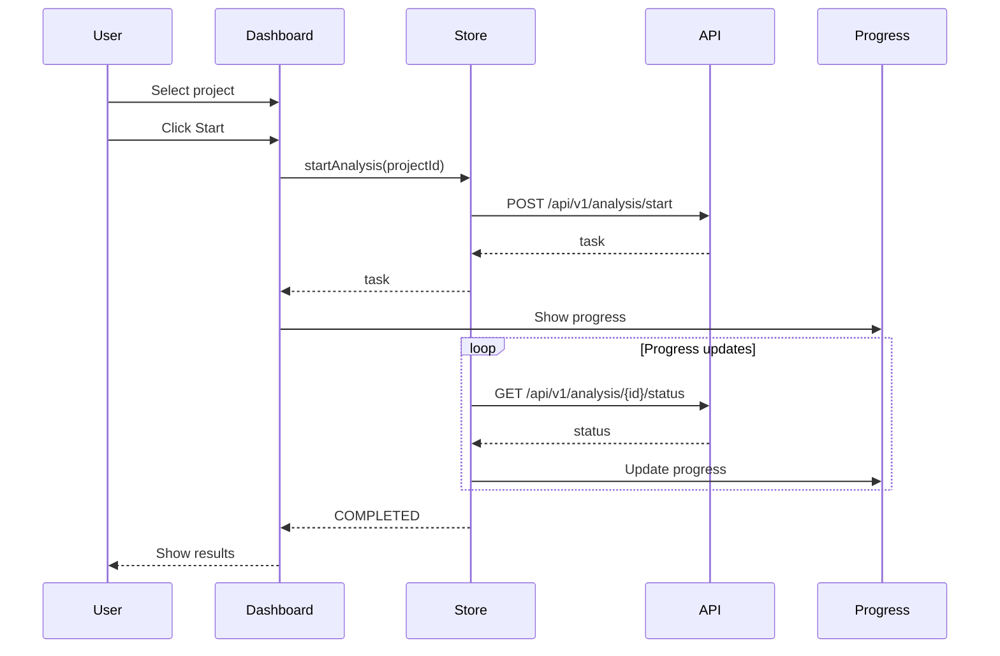
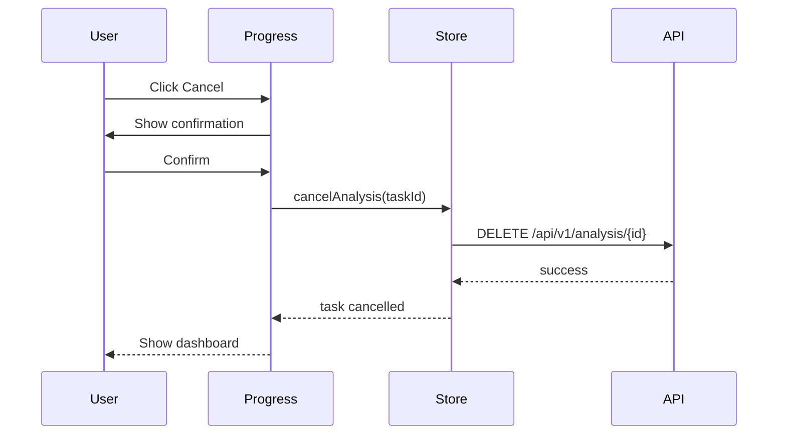

# AGENTS.md: Тестирование модуля Analysis (Frontend)

Правила и структура тестирования для модуля analysis UI. Содержит тестовые профили для Vitest unit тестов.

**Примечание:** E2E тесты выполняются на backend с использованием Playwright. См. [`src/test/java/AGENTS.md`](../../../../test/java/AGENTS.md) для деталей.

---

## Структура тестов

```
src/test/vue/analysis/
├── view/
│   ├── AnalysisView.spec.ts
│   ├── AnalysisProgress.spec.ts
│   └── AnalysisResult.spec.ts
├── store/
│   └── analysis.store.spec.ts
└── service/
    └── analysis.service.spec.ts
```

---

## Тестовые профили

### AnalysisTestProfile.ts

```typescript
/**
 * Тестовый профиль для модуля Analysis UI.
 */
export class AnalysisTestProfile {
  
  /**
   * Создает тестовую задачу анализа.
   */
  static createAnalysisTask(): AnalysisTask {
    return {
      id: 'test-task-id-123',
      projectId: 'test-project-id',
      status: 'PENDING',
      startedAt: new Date().toISOString(),
      completedAt: null,
      classesFound: 0,
      methodsFound: 0,
      endpointsFound: 0,
      errorMessage: null
    };
  }
  
  /**
   * Создает выполняющуюся задачу анализа.
   */
  static createRunningTask(): AnalysisTask {
    return {
      id: 'test-task-id-123',
      projectId: 'test-project-id',
      status: 'RUNNING',
      startedAt: new Date().toISOString(),
      completedAt: null,
      classesFound: 5,
      methodsFound: 25,
      endpointsFound: 3,
      errorMessage: null
    };
  }
  
  /**
   * Создает завершенную задачу анализа.
   */
  static createCompletedTask(): AnalysisTask {
    return {
      id: 'test-task-id-123',
      projectId: 'test-project-id',
      status: 'COMPLETED',
      startedAt: new Date(Date.now() - 300000).toISOString(),
      completedAt: new Date().toISOString(),
      classesFound: 10,
      methodsFound: 50,
      endpointsFound: 5,
      errorMessage: null
    };
  }
  
  /**
   * Создает задачу с ошибкой.
   */
  static createFailedTask(): AnalysisTask {
    return {
      id: 'test-task-id-123',
      projectId: 'test-project-id',
      status: 'FAILED',
      startedAt: new Date(Date.now() - 60000).toISOString(),
      completedAt: new Date().toISOString(),
      classesFound: 0,
      methodsFound: 0,
      endpointsFound: 0,
      errorMessage: 'Project path not found'
    };
  }
  
  /**
   * Создает результат анализа.
   */
  static createAnalysisResult(): AnalysisResult {
    return {
      taskId: 'test-task-id-123',
      projectId: 'test-project-id',
      stats: {
        classesFound: 10,
        methodsFound: 50,
        endpointsFound: 5,
        dependenciesFound: 15,
        byLabel: {
          'Service': 3,
          'RestController': 2,
          'Repository': 5
        }
      }
    };
  }
  
  /**
   * Создает прогресс анализа.
   */
  static createAnalysisProgress(): AnalysisProgress {
    return {
      taskId: 'test-task-id-123',
      stage: 'AST_INDEXING',
      percent: 45,
      message: 'Processing class files...',
      itemsProcessed: 45,
      totalItems: 100
    };
  }
  
  /**
   * Создает историю анализа.
   */
  static createAnalysisHistory(): AnalysisTask[] {
    return [
      this.createCompletedTask(),
      {
        ...this.createCompletedTask(),
        id: 'test-task-id-456',
        completedAt: new Date(Date.now() - 86400000).toISOString()
      }
    ];
  }
  
  /**
   * Создает начальное состояние store.
   */
  static createInitialState(): AnalysisState {
    return {
      currentTask: null,
      progress: null,
      result: null,
      history: [],
      loading: false,
      error: null
    };
  }
  
  /**
   * Создает состояние с активным анализом.
   */
  static createRunningState(): AnalysisState {
    return {
      currentTask: this.createRunningTask(),
      progress: this.createAnalysisProgress(),
      result: null,
      history: [],
      loading: false,
      error: null
    };
  }
}
```

---

## Unit тесты (Vitest)

### AnalysisView.spec.ts

```typescript
/**
 * Unit тесты для компонента AnalysisView.
 */
import { describe, it, expect, vi, beforeEach } from 'vitest';
import { mount } from '@vue/test-utils';
import { createTestingPinia } from '@pinia/testing';
import AnalysisView from '@/analysis/view/AnalysisView.vue';
import { AnalysisTestProfile } from './profile/AnalysisTestProfile';

describe('AnalysisView', () => {
  let wrapper: any;
  
  beforeEach(() => {
    wrapper = mount(AnalysisView, {
      global: {
        plugins: [
          createTestingPinia({
            initialState: {
              analysis: AnalysisTestProfile.createInitialState(),
              project: {
                currentProject: { id: 'test-project-id', name: 'Test Project' }
              }
            }
          })
        ]
      }
    });
  });
  
  it('should render start analysis button', () => {
    expect(wrapper.find('[data-test="start-analysis-btn"]').exists()).toBe(true);
  });
  
  it('should show project selector', () => {
    expect(wrapper.find('[data-test="project-selector"]').exists()).toBe(true);
  });
  
  it('should display analysis history', () => {
    const historyWrapper = mount(AnalysisView, {
      global: {
        plugins: [
          createTestingPinia({
            initialState: {
              analysis: {
                ...AnalysisTestProfile.createInitialState(),
                history: AnalysisTestProfile.createAnalysisHistory()
              }
            }
          })
        ]
      }
    });
    
    expect(historyWrapper.findAll('[data-test="history-item"]').length).toBe(2);
  });
  
  it('should emit start analysis event', async () => {
    const startButton = wrapper.find('[data-test="start-analysis-btn"]');
    await startButton.trigger('click');
    
    expect(wrapper.emitted('start-analysis')).toBeTruthy();
  });
  
  it('should show running analysis indicator', () => {
    const runningWrapper = mount(AnalysisView, {
      global: {
        plugins: [
          createTestingPinia({
            initialState: {
              analysis: AnalysisTestProfile.createRunningState()
            }
          })
        ]
      }
    });
    
    expect(runningWrapper.find('[data-test="analysis-running"]').exists()).toBe(true);
  });
});
```

### AnalysisProgress.spec.ts

```typescript
/**
 * Unit тесты для компонента AnalysisProgress.
 */
import { describe, it, expect, vi, beforeEach } from 'vitest';
import { mount } from '@vue/test-utils';
import { createTestingPinia } from '@pinia/testing';
import AnalysisProgress from '@/analysis/view/AnalysisProgress.vue';
import { AnalysisTestProfile } from './profile/AnalysisTestProfile';

describe('AnalysisProgress', () => {
  let wrapper: any;
  
  beforeEach(() => {
    wrapper = mount(AnalysisProgress, {
      global: {
        plugins: [
          createTestingPinia({
            initialState: {
              analysis: AnalysisTestProfile.createRunningState()
            }
          })
        ]
      }
    });
  });
  
  it('should display progress bar', () => {
    expect(wrapper.find('[data-test="progress-bar"]').exists()).toBe(true);
  });
  
  it('should show progress percentage', () => {
    expect(wrapper.find('[data-test="progress-percent"]').text()).toContain('45');
  });
  
  it('should display current stage', () => {
    expect(wrapper.find('[data-test="current-stage"]').text()).toContain('AST_INDEXING');
  });
  
  it('should show progress message', () => {
    expect(wrapper.find('[data-test="progress-message"]').text()).toContain('Processing class files');
  });
  
  it('should display items processed', () => {
    expect(wrapper.find('[data-test="items-processed"]').text()).toContain('45/100');
  });
  
  it('should show cancel button', () => {
    expect(wrapper.find('[data-test="cancel-btn"]').exists()).toBe(true);
  });
  
  it('should emit cancel event', async () => {
    const cancelButton = wrapper.find('[data-test="cancel-btn"]');
    await cancelButton.trigger('click');
    
    expect(wrapper.emitted('cancel')).toBeTruthy();
  });
});
```

### AnalysisResult.spec.ts

```typescript
/**
 * Unit тесты для компонента AnalysisResult.
 */
import { describe, it, expect, vi, beforeEach } from 'vitest';
import { mount } from '@vue/test-utils';
import { createTestingPinia } from '@pinia/testing';
import AnalysisResult from '@/analysis/view/AnalysisResult.vue';
import { AnalysisTestProfile } from './profile/AnalysisTestProfile';

describe('AnalysisResult', () => {
  let wrapper: any;
  
  beforeEach(() => {
    wrapper = mount(AnalysisResult, {
      global: {
        plugins: [
          createTestingPinia({
            initialState: {
              analysis: {
                ...AnalysisTestProfile.createInitialState(),
                result: AnalysisTestProfile.createAnalysisResult()
              }
            }
          })
        ]
      }
    });
  });
  
  it('should display statistics', () => {
    expect(wrapper.find('[data-test="stats-section"]').exists()).toBe(true);
  });
  
  it('should show classes found count', () => {
    expect(wrapper.find('[data-test="classes-count"]').text()).toBe('10');
  });
  
  it('should show methods found count', () => {
    expect(wrapper.find('[data-test="methods-count"]').text()).toBe('50');
  });
  
  it('should show endpoints found count', () => {
    expect(wrapper.find('[data-test="endpoints-count"]').text()).toBe('5');
  });
  
  it('should display label breakdown', () => {
    const labelBreakdown = wrapper.find('[data-test="label-breakdown"]');
    expect(labelBreakdown.exists()).toBe(true);
    
    expect(labelBreakdown.text()).toContain('Service: 3');
    expect(labelBreakdown.text()).toContain('RestController: 2');
    expect(labelBreakdown.text()).toContain('Repository: 5');
  });
  
  it('should show view graph button', () => {
    expect(wrapper.find('[data-test="view-graph-btn"]').exists()).toBe(true);
  });
  
  it('should show generate report button', () => {
    expect(wrapper.find('[data-test="generate-report-btn"]').exists()).toBe(true);
  });
  
  it('should emit view graph event', async () => {
    const viewGraphBtn = wrapper.find('[data-test="view-graph-btn"]');
    await viewGraphBtn.trigger('click');
    
    expect(wrapper.emitted('view-graph')).toBeTruthy();
  });
});
```

### analysisStore.spec.ts

```typescript
/**
 * Unit тесты для analysis store.
 */
import { describe, it, expect, vi, beforeEach } from 'vitest';
import { setActivePinia, createPinia } from 'pinia';
import { useAnalysisStore } from '@/analysis/store/analysis.store';
import { analysisApi } from '@/analysis/api';
import { AnalysisTestProfile } from './profile/AnalysisTestProfile';

vi.mock('@/analysis/api');

describe('analysisStore', () => {
  let store: ReturnType<typeof useAnalysisStore>;
  
  beforeEach(() => {
    setActivePinia(createPinia());
    store = useAnalysisStore();
    vi.clearAllMocks();
  });
  
  describe('startAnalysis', () => {
    it('should start analysis successfully', async () => {
      const task = AnalysisTestProfile.createAnalysisTask();
      vi.mocked(analysisApi.startAnalysis).mockResolvedValue(task);
      
      const result = await store.startAnalysis('test-project-id');
      
      expect(result).toEqual(task);
      expect(store.currentTask).toEqual(task);
    });
    
    it('should handle start error', async () => {
      vi.mocked(analysisApi.startAnalysis).mockRejectedValue(new Error('Failed to start'));
      
      await expect(store.startAnalysis('test-project-id')).rejects.toThrow();
      expect(store.error).toBe('Failed to start');
    });
  });
  
  describe('fetchTaskStatus', () => {
    it('should fetch task status', async () => {
      const task = AnalysisTestProfile.createRunningTask();
      vi.mocked(analysisApi.getTaskStatus).mockResolvedValue(task);
      
      await store.fetchTaskStatus(task.id);
      
      expect(store.currentTask).toEqual(task);
    });
  });
  
  describe('fetchResult', () => {
    it('should fetch analysis result', async () => {
      const result = AnalysisTestProfile.createAnalysisResult();
      vi.mocked(analysisApi.getResult).mockResolvedValue(result);
      
      await store.fetchResult('test-task-id');
      
      expect(store.result).toEqual(result);
    });
  });
  
  describe('cancelAnalysis', () => {
    it('should cancel analysis', async () => {
      vi.mocked(analysisApi.cancelAnalysis).mockResolvedValue(undefined);
      
      await store.cancelAnalysis('test-task-id');
      
      expect(store.currentTask).toBeNull();
    });
  });
  
  describe('fetchHistory', () => {
    it('should fetch analysis history', async () => {
      const history = AnalysisTestProfile.createAnalysisHistory();
      vi.mocked(analysisApi.getHistory).mockResolvedValue(history);
      
      await store.fetchHistory('test-project-id');
      
      expect(store.history).toEqual(history);
    });
  });
  
  describe('updateProgress', () => {
    it('should update progress', () => {
      const progress = AnalysisTestProfile.createAnalysisProgress();
      
      store.updateProgress(progress);
      
      expect(store.progress).toEqual(progress);
    });
  });
});
```

---

## Тестовые сценарии

### Сценарий: Запуск анализа



### Сценарий: Отмена анализа



---

## Критерии приемки

| Критерий | Описание |
|----------|----------|
| Unit тесты | Все компоненты покрыты |
| Store тесты | Все actions покрыты |
| Прогресс | Отображение прогресса работает |
| Результаты | Статистика отображается корректно |
| История | История анализа доступна |

---

## Запуск тестов

```bash
# Из директории src/main/vue
cd src\main\vue
set CI=true && npm run test

# Запуск тестов конкретного модуля
set CI=true && npm run test -- analysis