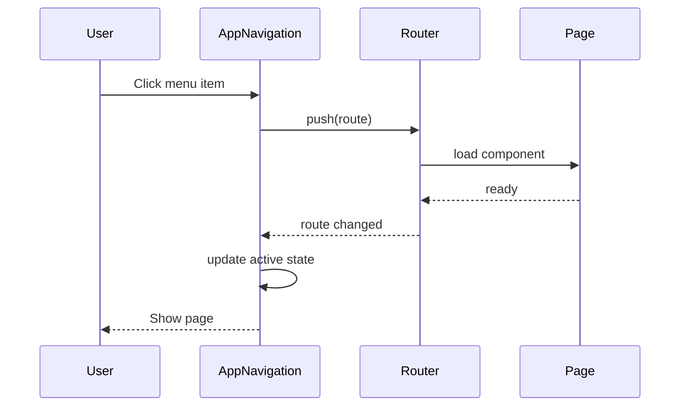
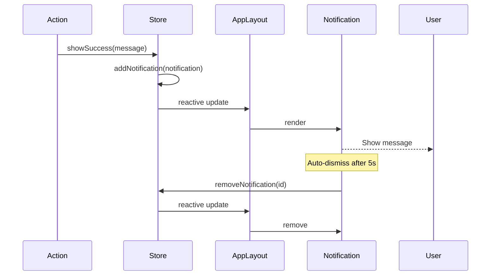

# AGENTS.md: Тестирование модуля App (Frontend)

Правила и структура тестирования для корневого модуля app UI. Содержит тестовые профили для Vitest unit тестов и Cypress E2E тестов.

---

## Структура тестов

```
src/test/vue/app/
├── unit/
│   ├── AppLayout.spec.ts
│   ├── AppNavigation.spec.ts
│   ├── AppHeader.spec.ts
│   ├── AppFooter.spec.ts
│   └── store/
│       └── appStore.spec.ts
├── e2e/
│   ├── navigation.cy.ts
│   ├── layout.cy.ts
│   └── health.cy.ts
└── profile/
    └── AppTestProfile.ts
```

---

## Тестовые профили

### AppTestProfile.ts

```typescript
/**
 * Тестовый профиль для модуля App UI.
 */
export class AppTestProfile {
  
  /**
   * Создает тестовую конфигурацию приложения.
   */
  static createAppConfig(): AppConfig {
    return {
      appName: 'Spring Twin',
      version: '1.0.0',
      neo4jMode: 'embedded',
      includePackages: ['com.example'],
      excludePackages: ['com.example.config']
    };
  }
  
  /**
   * Создает тестовое состояние навигации.
   */
  static createNavigationState(): NavigationState {
    return {
      currentRoute: '/architecture',
      breadcrumbs: [
        { label: 'Home', path: '/' },
        { label: 'Architecture', path: '/architecture' }
      ],
      sidebarCollapsed: false
    };
  }
  
  /**
   * Создает тестовый health status.
   */
  static createHealthStatus(): HealthStatus {
    return {
      status: 'UP',
      components: {
        neo4j: { status: 'UP', details: { mode: 'embedded' } },
        diskSpace: { status: 'UP', details: { free: '100GB' } }
      }
    };
  }
  
  /**
   * Создает тестовый health status с ошибкой.
   */
  static createUnhealthyStatus(): HealthStatus {
    return {
      status: 'DOWN',
      components: {
        neo4j: { status: 'DOWN', details: { error: 'Connection refused' } }
      }
    };
  }
  
  /**
   * Создает тестовые пункты меню.
   */
  static createMenuItems(): MenuItem[] {
    return [
      { label: 'Projects', path: '/projects', icon: 'folder' },
      { label: 'Architecture', path: '/architecture', icon: 'diagram' },
      { label: 'Analysis', path: '/analysis', icon: 'search' },
      { label: 'Reports', path: '/report', icon: 'file-text' },
      { label: 'MCP', path: '/mcp', icon: 'plug' }
    ];
  }
  
  /**
   * Создает начальное состояние store.
   */
  static createInitialState(): AppState {
    return {
      config: null,
      health: null,
      navigation: this.createNavigationState(),
      notifications: [],
      loading: false,
      error: null
    };
  }
  
  /**
   * Создает состояние с загруженной конфигурацией.
   */
  static createLoadedState(): AppState {
    return {
      config: this.createAppConfig(),
      health: this.createHealthStatus(),
      navigation: this.createNavigationState(),
      notifications: [],
      loading: false,
      error: null
    };
  }
  
  /**
   * Создает тестовое уведомление.
   */
  static createNotification(): Notification {
    return {
      id: 'notification-1',
      type: 'success',
      message: 'Operation completed successfully',
      timestamp: new Date().toISOString()
    };
  }
  
  /**
   * Создает тестовое уведомление об ошибке.
   */
  static createErrorNotification(): Notification {
    return {
      id: 'notification-2',
      type: 'error',
      message: 'An error occurred',
      timestamp: new Date().toISOString()
    };
  }
}
```

---

## Unit тесты (Vitest)

### AppLayout.spec.ts

```typescript
/**
 * Unit тесты для компонента AppLayout.
 */
import { describe, it, expect, vi, beforeEach } from 'vitest';
import { mount } from '@vue/test-utils';
import { createTestingPinia } from '@pinia/testing';
import AppLayout from '@/app/view/AppLayout.vue';
import { AppTestProfile } from './profile/AppTestProfile';

describe('AppLayout', () => {
  let wrapper: any;
  
  beforeEach(() => {
    wrapper = mount(AppLayout, {
      global: {
        plugins: [
          createTestingPinia({
            initialState: {
              app: AppTestProfile.createLoadedState()
            }
          })
        ],
        stubs: {
          'router-view': true
        }
      }
    });
  });
  
  it('should render header', () => {
    expect(wrapper.find('[data-test="app-header"]').exists()).toBe(true);
  });
  
  it('should render sidebar', () => {
    expect(wrapper.find('[data-test="app-sidebar"]').exists()).toBe(true);
  });
  
  it('should render main content area', () => {
    expect(wrapper.find('[data-test="main-content"]').exists()).toBe(true);
  });
  
  it('should render footer', () => {
    expect(wrapper.find('[data-test="app-footer"]').exists()).toBe(true);
  });
  
  it('should toggle sidebar', async () => {
    const toggleBtn = wrapper.find('[data-test="toggle-sidebar-btn"]');
    await toggleBtn.trigger('click');
    
    expect(wrapper.find('[data-test="app-sidebar"]').classes()).toContain('collapsed');
  });
  
  it('should show notifications', () => {
    const notificationWrapper = mount(AppLayout, {
      global: {
        plugins: [
          createTestingPinia({
            initialState: {
              app: {
                ...AppTestProfile.createLoadedState(),
                notifications: [AppTestProfile.createNotification()]
              }
            }
          })
        ],
        stubs: {
          'router-view': true
        }
      }
    });
    
    expect(notificationWrapper.find('[data-test="notification"]').exists()).toBe(true);
  });
});
```

### AppNavigation.spec.ts

```typescript
/**
 * Unit тесты для компонента AppNavigation.
 */
import { describe, it, expect, vi, beforeEach } from 'vitest';
import { mount } from '@vue/test-utils';
import { createTestingPinia } from '@pinia/testing';
import { createRouter, createWebHistory } from 'vue-router';
import AppNavigation from '@/app/view/AppNavigation.vue';
import { AppTestProfile } from './profile/AppTestProfile';

describe('AppNavigation', () => {
  let wrapper: any;
  let router: any;
  
  beforeEach(async () => {
    router = createRouter({
      history: createWebHistory(),
      routes: [
        { path: '/', component: { template: '<div>Home</div>' } },
        { path: '/architecture', component: { template: '<div>Architecture</div>' } },
        { path: '/analysis', component: { template: '<div>Analysis</div>' } }
      ]
    });
    
    await router.push('/architecture');
    await router.isReady();
    
    wrapper = mount(AppNavigation, {
      global: {
        plugins: [
          router,
          createTestingPinia({
            initialState: {
              app: AppTestProfile.createLoadedState()
            }
          })
        ]
      }
    });
  });
  
  it('should render menu items', () => {
    const menuItems = wrapper.findAll('[data-test="menu-item"]');
    expect(menuItems.length).toBe(5);
  });
  
  it('should highlight active menu item', () => {
    const activeItem = wrapper.find('[data-test="menu-item"].active');
    expect(activeItem.exists()).toBe(true);
  });
  
  it('should navigate on menu click', async () => {
    const menuItem = wrapper.findAll('[data-test="menu-item"]')[2];
    await menuItem.trigger('click');
    
    expect(router.currentRoute.value.path).toBe('/analysis');
  });
  
  it('should display menu icons', () => {
    const icons = wrapper.findAll('[data-test="menu-icon"]');
    expect(icons.length).toBe(5);
  });
  
  it('should show collapsed state', async () => {
    await wrapper.setProps({ collapsed: true });
    
    expect(wrapper.find('[data-test="menu-label"]').exists()).toBe(false);
  });
});
```

### AppHeader.spec.ts

```typescript
/**
 * Unit тесты для компонента AppHeader.
 */
import { describe, it, expect, vi, beforeEach } from 'vitest';
import { mount } from '@vue/test-utils';
import { createTestingPinia } from '@pinia/testing';
import AppHeader from '@/app/view/AppHeader.vue';
import { AppTestProfile } from './profile/AppTestProfile';

describe('AppHeader', () => {
  let wrapper: any;
  
  beforeEach(() => {
    wrapper = mount(AppHeader, {
      global: {
        plugins: [
          createTestingPinia({
            initialState: {
              app: AppTestProfile.createLoadedState()
            }
          })
        ]
      }
    });
  });
  
  it('should display app name', () => {
    expect(wrapper.find('[data-test="app-name"]').text()).toBe('Spring Twin');
  });
  
  it('should display version', () => {
    expect(wrapper.find('[data-test="app-version"]').text()).toContain('1.0.0');
  });
  
  it('should show health indicator', () => {
    const healthIndicator = wrapper.find('[data-test="health-indicator"]');
    expect(healthIndicator.exists()).toBe(true);
    expect(healthIndicator.classes()).toContain('healthy');
  });
  
  it('should show unhealthy indicator', () => {
    const unhealthyWrapper = mount(AppHeader, {
      global: {
        plugins: [
          createTestingPinia({
            initialState: {
              app: {
                ...AppTestProfile.createLoadedState(),
                health: AppTestProfile.createUnhealthyStatus()
              }
            }
          })
        ]
      }
    });
    
    const healthIndicator = unhealthyWrapper.find('[data-test="health-indicator"]');
    expect(healthIndicator.classes()).toContain('unhealthy');
  });
  
  it('should emit toggle sidebar event', async () => {
    const toggleBtn = wrapper.find('[data-test="toggle-sidebar-btn"]');
    await toggleBtn.trigger('click');
    
    expect(wrapper.emitted('toggle-sidebar')).toBeTruthy();
  });
  
  it('should show breadcrumbs', () => {
    expect(wrapper.find('[data-test="breadcrumbs"]').exists()).toBe(true);
  });
});
```

### appStore.spec.ts

```typescript
/**
 * Unit тесты для app store.
 */
import { describe, it, expect, vi, beforeEach } from 'vitest';
import { setActivePinia, createPinia } from 'pinia';
import { useAppStore } from '@/app/store/appStore';
import { appApi } from '@/app/api/appApi';
import { AppTestProfile } from './profile/AppTestProfile';

vi.mock('@/app/api/appApi');

describe('appStore', () => {
  let store: ReturnType<typeof useAppStore>;
  
  beforeEach(() => {
    setActivePinia(createPinia());
    store = useAppStore();
    vi.clearAllMocks();
  });
  
  describe('fetchConfig', () => {
    it('should fetch config successfully', async () => {
      const config = AppTestProfile.createAppConfig();
      vi.mocked(appApi.getConfig).mockResolvedValue(config);
      
      await store.fetchConfig();
      
      expect(store.config).toEqual(config);
    });
  });
  
  describe('fetchHealth', () => {
    it('should fetch health status', async () => {
      const health = AppTestProfile.createHealthStatus();
      vi.mocked(appApi.getHealth).mockResolvedValue(health);
      
      await store.fetchHealth();
      
      expect(store.health).toEqual(health);
    });
  });
  
  describe('toggleSidebar', () => {
    it('should toggle sidebar state', () => {
      const initialState = store.navigation.sidebarCollapsed;
      
      store.toggleSidebar();
      
      expect(store.navigation.sidebarCollapsed).toBe(!initialState);
    });
  });
  
  describe('addNotification', () => {
    it('should add notification', () => {
      const notification = AppTestProfile.createNotification();
      
      store.addNotification(notification);
      
      expect(store.notifications).toContainEqual(notification);
    });
  });
  
  describe('removeNotification', () => {
    it('should remove notification', () => {
      const notification = AppTestProfile.createNotification();
      store.notifications = [notification];
      
      store.removeNotification(notification.id);
      
      expect(store.notifications).not.toContainEqual(notification);
    });
  });
  
  describe('updateBreadcrumbs', () => {
    it('should update breadcrumbs', () => {
      const breadcrumbs = [
        { label: 'Home', path: '/' },
        { label: 'Test', path: '/test' }
      ];
      
      store.updateBreadcrumbs(breadcrumbs);
      
      expect(store.navigation.breadcrumbs).toEqual(breadcrumbs);
    });
  });
  
  describe('showSuccess', () => {
    it('should show success notification', () => {
      store.showSuccess('Success message');
      
      expect(store.notifications[0].type).toBe('success');
      expect(store.notifications[0].message).toBe('Success message');
    });
  });
  
  describe('showError', () => {
    it('should show error notification', () => {
      store.showError('Error message');
      
      expect(store.notifications[0].type).toBe('error');
      expect(store.notifications[0].message).toBe('Error message');
    });
  });
});
```

---

## E2E тесты (Cypress)

### navigation.cy.ts

```typescript
/**
 * E2E тесты для навигации.
 */
describe('Navigation', () => {
  beforeEach(() => {
    cy.visit('/');
  });
  
  it('should navigate to Architecture page', () => {
    cy.get('[data-test="menu-item"]').contains('Architecture').click();
    
    cy.url().should('include', '/architecture');
    cy.get('[data-test="architecture-page"]').should('be.visible');
  });
  
  it('should navigate to Analysis page', () => {
    cy.get('[data-test="menu-item"]').contains('Analysis').click();
    
    cy.url().should('include', '/analysis');
    cy.get('[data-test="analysis-page"]').should('be.visible');
  });
  
  it('should navigate to Reports page', () => {
    cy.get('[data-test="menu-item"]').contains('Reports').click();
    
    cy.url().should('include', '/report');
    cy.get('[data-test="report-page"]').should('be.visible');
  });
  
  it('should navigate to MCP page', () => {
    cy.get('[data-test="menu-item"]').contains('MCP').click();
    
    cy.url().should('include', '/mcp');
    cy.get('[data-test="mcp-page"]').should('be.visible');
  });
  
  it('should highlight active menu item', () => {
    cy.get('[data-test="menu-item"]').contains('Architecture').click();
    
    cy.get('[data-test="menu-item"].active').should('contain', 'Architecture');
  });
  
  it('should show breadcrumbs', () => {
    cy.get('[data-test="menu-item"]').contains('Architecture').click();
    
    cy.get('[data-test="breadcrumbs"]').should('be.visible');
    cy.get('[data-test="breadcrumb-item"]').should('have.length.at.least', 1);
  });
  
  it('should navigate via breadcrumb', () => {
    cy.get('[data-test="menu-item"]').contains('Architecture').click();
    cy.get('[data-test="breadcrumb-item"]').first().click();
    
    cy.url().should('eq', Cypress.config().baseUrl + '/');
  });
});

describe('Layout', () => {
  beforeEach(() => {
    cy.visit('/');
  });
  
  it('should display header', () => {
    cy.get('[data-test="app-header"]').should('be.visible');
    cy.get('[data-test="app-name"]').should('contain', 'Spring Twin');
  });
  
  it('should display sidebar', () => {
    cy.get('[data-test="app-sidebar"]').should('be.visible');
  });
  
  it('should toggle sidebar', () => {
    cy.get('[data-test="toggle-sidebar-btn"]').click();
    
    cy.get('[data-test="app-sidebar"]').should('have.class', 'collapsed');
    
    cy.get('[data-test="toggle-sidebar-btn"]').click();
    
    cy.get('[data-test="app-sidebar"]').should('not.have.class', 'collapsed');
  });
  
  it('should display footer', () => {
    cy.get('[data-test="app-footer"]').should('be.visible');
  });
  
  it('should show health indicator', () => {
    cy.get('[data-test="health-indicator"]').should('be.visible');
  });
  
  it('should show notifications', () => {
    // Trigger an action that shows notification
    cy.get('[data-test="menu-item"]').contains('Projects').click();
    
    // If there's a notification, it should be visible
    cy.get('body').then(($body) => {
      if ($body.find('[data-test="notification"]').length > 0) {
        cy.get('[data-test="notification"]').should('be.visible');
      }
    });
  });
  
  it('should dismiss notification', () => {
    // Manually trigger notification via store
    cy.window().then((win) => {
      win.$store.dispatch('app/showSuccess', 'Test notification');
    });
    
    cy.get('[data-test="notification"]').should('be.visible');
    cy.get('[data-test="dismiss-notification"]').click();
    
    cy.get('[data-test="notification"]').should('not.exist');
  });
});

describe('Health Check', () => {
  beforeEach(() => {
    cy.visit('/');
  });
  
  it('should show healthy status', () => {
    cy.get('[data-test="health-indicator"]')
      .should('have.class', 'healthy');
  });
  
  it('should show health details on hover', () => {
    cy.get('[data-test="health-indicator"]').trigger('mouseover');
    
    cy.get('[data-test="health-tooltip"]').should('be.visible');
  });
  
  it('should show neo4j status', () => {
    cy.get('[data-test="health-indicator"]').trigger('mouseover');
    
    cy.get('[data-test="health-tooltip"]').should('contain', 'neo4j');
  });
});
```

---

## Тестовые сценарии

### Сценарий: Навигация по приложению



### Сценарий: Отображение уведомления



---

## Критерии приемки

| Критерий | Описание |
|----------|----------|
| Unit тесты | Все компоненты покрыты |
| Store тесты | Все actions покрыты |
| E2E тесты | Навигация проверена |
| Layout | Header, Sidebar, Footer работают |
| Health | Индикатор здоровья работает |
| Notifications | Уведомления отображаются и скрываются |