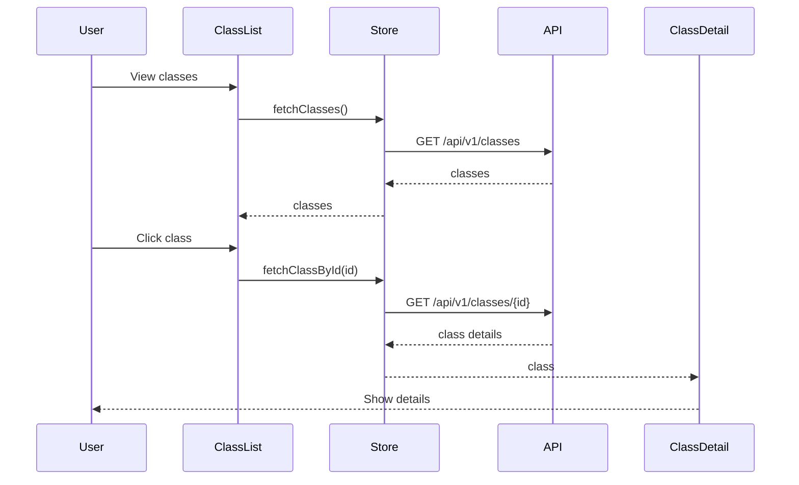
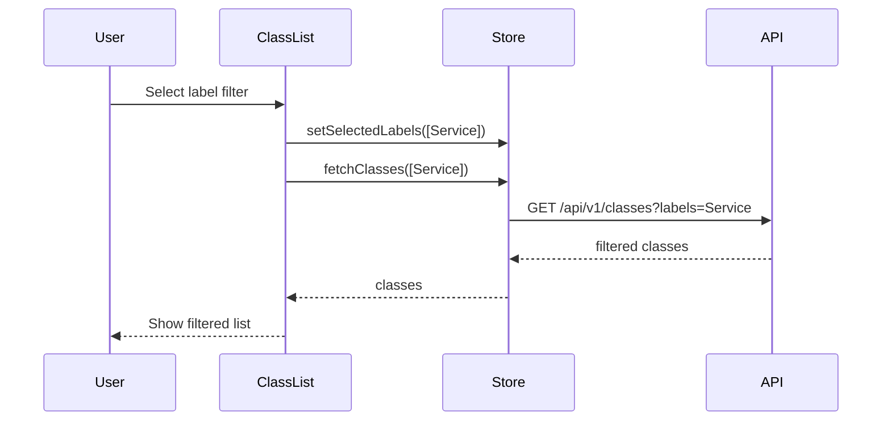

# AGENTS.md: Тестирование модуля Architecture (Frontend)

Правила и структура тестирования для модуля architecture UI. Содержит тестовые профили для Vitest unit тестов и Cypress E2E тестов.

---

## Структура тестов

```
src/test/vue/architecture/
├── unit/
│   ├── ClassList.spec.ts
│   ├── ClassCard.spec.ts
│   ├── ClassDetail.spec.ts
│   ├── GraphViewer.spec.ts
│   └── store/
│       └── architectureStore.spec.ts
├── e2e/
│   ├── class-browsing.cy.ts
│   ├── graph-visualization.cy.ts
│   └── class-filtering.cy.ts
└── profile/
    └── ArchitectureTestProfile.ts
```

---

## Тестовые профили

### ArchitectureTestProfile.ts

```typescript
/**
 * Тестовый профиль для модуля Architecture UI.
 */
export class ArchitectureTestProfile {
  
  /**
   * Создает тестовый класс.
   */
  static createClass(): ClassInfo {
    return {
      id: 'test-class-id-123',
      name: 'UserService',
      fullName: 'com.example.service.UserService',
      packageName: 'com.example.service',
      labels: ['Service'],
      modifiers: ['public']
    };
  }
  
  /**
   * Создает тестовый класс Controller.
   */
  static createControllerClass(): ClassInfo {
    return {
      id: 'test-controller-id',
      name: 'UserController',
      fullName: 'com.example.controller.UserController',
      packageName: 'com.example.controller',
      labels: ['RestController', 'Controller'],
      modifiers: ['public']
    };
  }
  
  /**
   * Создает список тестовых классов.
   */
  static createClassList(): ClassInfo[] {
    return [
      this.createControllerClass(),
      this.createClass(),
      {
        id: 'test-repo-id',
        name: 'UserRepository',
        fullName: 'com.example.repository.UserRepository',
        packageName: 'com.example.repository',
        labels: ['Repository'],
        modifiers: ['public', 'interface']
      }
    ];
  }
  
  /**
   * Создает тестовый метод.
   */
  static createMethod(): MethodInfo {
    return {
      id: 'test-method-id',
      name: 'getAllUsers',
      signature: 'public List<User> getAllUsers()',
      returnType: 'List<User>',
      modifiers: ['public'],
      parameters: []
    };
  }
  
  /**
   * Создает тестовый endpoint.
   */
  static createEndpoint(): EndpointInfo {
    return {
      id: 'test-endpoint-id',
      path: '/api/users',
      httpMethod: 'GET',
      produces: 'application/json',
      consumes: null
    };
  }
  
  /**
   * Создает данные для графа.
   */
  static createGraphData(): GraphData {
    const controller = this.createControllerClass();
    const service = this.createClass();
    
    return {
      nodes: [
        { id: controller.id, label: controller.name, type: 'class' },
        { id: service.id, label: service.name, type: 'class' }
      ],
      edges: [
        { source: controller.id, target: service.id, type: 'DEPENDS_ON' }
      ]
    };
  }
  
  /**
   * Создает начальное состояние store.
   */
  static createInitialState(): ArchitectureState {
    return {
      classes: [],
      currentClass: null,
      methods: [],
      endpoints: [],
      graphData: null,
      selectedLabels: [],
      availableLabels: [],
      loading: false,
      error: null
    };
  }
  
  /**
   * Создает состояние с загруженными данными.
   */
  static createLoadedState(): ArchitectureState {
    return {
      classes: this.createClassList(),
      currentClass: this.createClass(),
      methods: [this.createMethod()],
      endpoints: [this.createEndpoint()],
      graphData: this.createGraphData(),
      selectedLabels: [],
      availableLabels: ['Service', 'RestController', 'Repository'],
      loading: false,
      error: null
    };
  }
}
```

---

## Unit тесты (Vitest)

### ClassList.spec.ts

```typescript
/**
 * Unit тесты для компонента ClassList.
 */
import { describe, it, expect, vi, beforeEach } from 'vitest';
import { mount } from '@vue/test-utils';
import { createTestingPinia } from '@pinia/testing';
import ClassList from '@/architecture/view/ClassList.vue';
import { ArchitectureTestProfile } from './profile/ArchitectureTestProfile';

describe('ClassList', () => {
  let wrapper: any;
  
  beforeEach(() => {
    wrapper = mount(ClassList, {
      global: {
        plugins: [
          createTestingPinia({
            initialState: {
              architecture: ArchitectureTestProfile.createLoadedState()
            }
          })
        ]
      }
    });
  });
  
  it('should render class list', () => {
    const cards = wrapper.findAll('[data-test="class-card"]');
    expect(cards.length).toBe(3);
  });
  
  it('should display class names', () => {
    const firstCard = wrapper.find('[data-test="class-card"]:first-child');
    expect(firstCard.text()).toContain('UserController');
  });
  
  it('should display class labels', () => {
    const firstCard = wrapper.find('[data-test="class-card"]:first-child');
    expect(firstCard.find('[data-test="class-label"]').text()).toContain('RestController');
  });
  
  it('should filter by label', async () => {
    const labelFilter = wrapper.find('[data-test="label-filter"]');
    await labelFilter.setValue('Service');
    
    const cards = wrapper.findAll('[data-test="class-card"]');
    expect(cards.length).toBe(1);
    expect(cards[0].text()).toContain('UserService');
  });
  
  it('should search by name', async () => {
    const searchInput = wrapper.find('[data-test="search-input"]');
    await searchInput.setValue('User');
    
    const cards = wrapper.findAll('[data-test="class-card"]');
    expect(cards.length).toBe(3); // All contain 'User'
  });
  
  it('should emit select event when class clicked', async () => {
    const card = wrapper.find('[data-test="class-card"]');
    await card.trigger('click');
    
    expect(wrapper.emitted('select')).toBeTruthy();
  });
  
  it('should show empty state when no classes', () => {
    const emptyWrapper = mount(ClassList, {
      global: {
        plugins: [
          createTestingPinia({
            initialState: {
              architecture: ArchitectureTestProfile.createInitialState()
            }
          })
        ]
      }
    });
    
    expect(emptyWrapper.find('[data-test="empty-state"]').exists()).toBe(true);
  });
});
```

### ClassDetail.spec.ts

```typescript
/**
 * Unit тесты для компонента ClassDetail.
 */
import { describe, it, expect, vi, beforeEach } from 'vitest';
import { mount } from '@vue/test-utils';
import { createTestingPinia } from '@pinia/testing';
import ClassDetail from '@/architecture/view/ClassDetail.vue';
import { ArchitectureTestProfile } from './profile/ArchitectureTestProfile';

describe('ClassDetail', () => {
  let wrapper: any;
  
  beforeEach(() => {
    wrapper = mount(ClassDetail, {
      global: {
        plugins: [
          createTestingPinia({
            initialState: {
              architecture: ArchitectureTestProfile.createLoadedState()
            }
          })
        ]
      }
    });
  });
  
  it('should display class information', () => {
    expect(wrapper.find('[data-test="class-name"]').text()).toBe('UserService');
    expect(wrapper.find('[data-test="class-full-name"]').text()).toContain('com.example.service.UserService');
  });
  
  it('should display class labels', () => {
    const labels = wrapper.findAll('[data-test="label-badge"]');
    expect(labels.length).toBe(1);
    expect(labels[0].text()).toBe('Service');
  });
  
  it('should display methods list', () => {
    const methods = wrapper.findAll('[data-test="method-item"]');
    expect(methods.length).toBe(1);
    expect(methods[0].text()).toContain('getAllUsers');
  });
  
  it('should display dependencies', () => {
    const dependencies = wrapper.find('[data-test="dependencies-section"]');
    expect(dependencies.exists()).toBe(true);
  });
  
  it('should emit close event', async () => {
    const closeButton = wrapper.find('[data-test="close-btn"]');
    await closeButton.trigger('click');
    
    expect(wrapper.emitted('close')).toBeTruthy();
  });
  
  it('should navigate to dependency class', async () => {
    const dependencyLink = wrapper.find('[data-test="dependency-link"]');
    await dependencyLink.trigger('click');
    
    expect(wrapper.emitted('navigate')).toBeTruthy();
  });
  
  it('should show generate report button', () => {
    const reportButton = wrapper.find('[data-test="generate-report-btn"]');
    expect(reportButton.exists()).toBe(true);
  });
});
```

### GraphViewer.spec.ts

```typescript
/**
 * Unit тесты для компонента GraphViewer.
 */
import { describe, it, expect, vi, beforeEach } from 'vitest';
import { mount } from '@vue/test-utils';
import { createTestingPinia } from '@pinia/testing';
import GraphViewer from '@/architecture/view/GraphViewer.vue';
import { ArchitectureTestProfile } from './profile/ArchitectureTestProfile';

// Mock D3 or other graph library
vi.mock('d3', () => ({
  select: vi.fn(() => ({
    append: vi.fn(() => ({
      attr: vi.fn(() => ({
        data: vi.fn(() => ({
          enter: vi.fn(() => ({
            append: vi.fn(() => ({
              attr: vi.fn()
            }))
          }))
        }))
      }))
    }))
  }))
}));

describe('GraphViewer', () => {
  let wrapper: any;
  
  beforeEach(() => {
    wrapper = mount(GraphViewer, {
      global: {
        plugins: [
          createTestingPinia({
            initialState: {
              architecture: ArchitectureTestProfile.createLoadedState()
            }
          })
        ]
      }
    });
  });
  
  it('should render graph container', () => {
    expect(wrapper.find('[data-test="graph-container"]').exists()).toBe(true);
  });
  
  it('should display graph nodes', () => {
    const nodes = wrapper.findAll('[data-test="graph-node"]');
    expect(nodes.length).toBe(2);
  });
  
  it('should display graph edges', () => {
    const edges = wrapper.findAll('[data-test="graph-edge"]');
    expect(edges.length).toBe(1);
  });
  
  it('should highlight node on hover', async () => {
    const node = wrapper.find('[data-test="graph-node"]');
    await node.trigger('mouseover');
    
    expect(node.classes()).toContain('highlighted');
  });
  
  it('should emit node click event', async () => {
    const node = wrapper.find('[data-test="graph-node"]');
    await node.trigger('click');
    
    expect(wrapper.emitted('node-click')).toBeTruthy();
  });
  
  it('should support zoom controls', () => {
    const zoomIn = wrapper.find('[data-test="zoom-in-btn"]');
    const zoomOut = wrapper.find('[data-test="zoom-out-btn"]');
    
    expect(zoomIn.exists()).toBe(true);
    expect(zoomOut.exists()).toBe(true);
  });
  
  it('should support fullscreen mode', async () => {
    const fullscreenBtn = wrapper.find('[data-test="fullscreen-btn"]');
    await fullscreenBtn.trigger('click');
    
    expect(wrapper.emitted('fullscreen')).toBeTruthy();
  });
});
```

### architectureStore.spec.ts

```typescript
/**
 * Unit тесты для architecture store.
 */
import { describe, it, expect, vi, beforeEach } from 'vitest';
import { setActivePinia, createPinia } from 'pinia';
import { useArchitectureStore } from '@/architecture/store/architectureStore';
import { architectureApi } from '@/architecture/api/architectureApi';
import { ArchitectureTestProfile } from './profile/ArchitectureTestProfile';

vi.mock('@/architecture/api/architectureApi');

describe('architectureStore', () => {
  let store: ReturnType<typeof useArchitectureStore>;
  
  beforeEach(() => {
    setActivePinia(createPinia());
    store = useArchitectureStore();
    vi.clearAllMocks();
  });
  
  describe('fetchClasses', () => {
    it('should fetch classes successfully', async () => {
      const classes = ArchitectureTestProfile.createClassList();
      vi.mocked(architectureApi.getClasses).mockResolvedValue(classes);
      
      await store.fetchClasses();
      
      expect(store.classes).toEqual(classes);
      expect(store.loading).toBe(false);
    });
    
    it('should filter by labels', async () => {
      const classes = [ArchitectureTestProfile.createClass()];
      vi.mocked(architectureApi.getClassesByLabels).mockResolvedValue(classes);
      
      await store.fetchClasses(['Service']);
      
      expect(store.classes).toEqual(classes);
    });
  });
  
  describe('fetchClassById', () => {
    it('should fetch class details', async () => {
      const classInfo = ArchitectureTestProfile.createClass();
      vi.mocked(architectureApi.getClassById).mockResolvedValue(classInfo);
      
      await store.fetchClassById(classInfo.id);
      
      expect(store.currentClass).toEqual(classInfo);
    });
    
    it('should fetch class with dependencies', async () => {
      const classInfo = ArchitectureTestProfile.createClass();
      const dependencies = [ArchitectureTestProfile.createControllerClass()];
      
      vi.mocked(architectureApi.getClassWithDependencies).mockResolvedValue({
        ...classInfo,
        dependencies
      });
      
      await store.fetchClassWithDependencies(classInfo.id);
      
      expect(store.currentClass?.dependencies).toEqual(dependencies);
    });
  });
  
  describe('fetchGraphData', () => {
    it('should fetch graph data for class', async () => {
      const graphData = ArchitectureTestProfile.createGraphData();
      vi.mocked(architectureApi.getGraphForClass).mockResolvedValue(graphData);
      
      await store.fetchGraphForClass('test-class-id');
      
      expect(store.graphData).toEqual(graphData);
    });
  });
  
  describe('searchClasses', () => {
    it('should search classes by name', async () => {
      const classes = ArchitectureTestProfile.createClassList();
      vi.mocked(architectureApi.searchClasses).mockResolvedValue(classes);
      
      const results = await store.searchClasses('User');
      
      expect(results).toEqual(classes);
    });
  });
  
  describe('setSelectedLabels', () => {
    it('should update selected labels', () => {
      store.setSelectedLabels(['Service', 'RestController']);
      
      expect(store.selectedLabels).toEqual(['Service', 'RestController']);
    });
  });
  
  describe('fetchAvailableLabels', () => {
    it('should fetch available labels', async () => {
      const labels = ['Service', 'RestController', 'Repository'];
      vi.mocked(architectureApi.getAvailableLabels).mockResolvedValue(labels);
      
      await store.fetchAvailableLabels();
      
      expect(store.availableLabels).toEqual(labels);
    });
  });
});
```

---

## E2E тесты (Cypress)

### class-browsing.cy.ts

```typescript
/**
 * E2E тесты для просмотра классов.
 */
describe('Class Browsing', () => {
  beforeEach(() => {
    cy.resetDatabase();
    cy.seedArchitectureData();
    cy.visit('/architecture');
  });
  
  it('should display class list', () => {
    cy.get('[data-test="class-card"]').should('have.length.at.least', 1);
  });
  
  it('should show class details on click', () => {
    cy.get('[data-test="class-card"]').first().click();
    
    cy.get('[data-test="class-detail"]').should('be.visible');
    cy.get('[data-test="class-name"]').should('exist');
  });
  
  it('should display class methods', () => {
    cy.get('[data-test="class-card"]').first().click();
    
    cy.get('[data-test="method-item"]').should('have.length.at.least', 1);
  });
  
  it('should navigate to dependency', () => {
    cy.get('[data-test="class-card"]').first().click();
    
    cy.get('[data-test="dependency-link"]').first().click();
    
    cy.get('[data-test="class-detail"]').should('be.visible');
  });
  
  it('should close detail panel', () => {
    cy.get('[data-test="class-card"]').first().click();
    cy.get('[data-test="close-btn"]').click();
    
    cy.get('[data-test="class-detail"]').should('not.exist');
  });
});

describe('Class Filtering', () => {
  beforeEach(() => {
    cy.resetDatabase();
    cy.seedArchitectureData();
    cy.visit('/architecture');
  });
  
  it('should filter by single label', () => {
    cy.get('[data-test="label-filter"]').select('Service');
    
    cy.get('[data-test="class-card"]').each(($card) => {
      cy.wrap($card).find('[data-test="class-label"]').should('contain', 'Service');
    });
  });
  
  it('should filter by multiple labels', () => {
    cy.get('[data-test="label-filter"]').select(['Service', 'RestController']);
    
    cy.get('[data-test="class-card"]').each(($card) => {
      cy.wrap($card).find('[data-test="class-label"]').should('satisfy', ($el) => {
        const text = $el.text();
        return text.includes('Service') || text.includes('RestController');
      });
    });
  });
  
  it('should search by class name', () => {
    cy.get('[data-test="search-input"]').type('User');
    
    cy.get('[data-test="class-card"]').each(($card) => {
      cy.wrap($card).should('contain', 'User');
    });
  });
  
  it('should clear filters', () => {
    cy.get('[data-test="label-filter"]').select('Service');
    cy.get('[data-test="clear-filter-btn"]').click();
    
    cy.get('[data-test="class-card"]').should('have.length.gt', 1);
  });
});

describe('Graph Visualization', () => {
  beforeEach(() => {
    cy.resetDatabase();
    cy.seedArchitectureData();
    cy.visit('/architecture/graph');
  });
  
  it('should display graph', () => {
    cy.get('[data-test="graph-container"]').should('be.visible');
    cy.get('[data-test="graph-node"]').should('have.length.at.least', 1);
  });
  
  it('should highlight node on hover', () => {
    const node = cy.get('[data-test="graph-node"]').first();
    node.trigger('mouseover');
    
    node.should('have.class', 'highlighted');
  });
  
  it('should show node details on click', () => {
    cy.get('[data-test="graph-node"]').first().click();
    
    cy.get('[data-test="node-tooltip"]').should('be.visible');
  });
  
  it('should zoom in and out', () => {
    cy.get('[data-test="zoom-in-btn"]').click();
    cy.get('[data-test="graph-container"]').should('have.class', 'zoomed-in');
    
    cy.get('[data-test="zoom-out-btn"]').click();
    cy.get('[data-test="graph-container"]').should('not.have.class', 'zoomed-in');
  });
  
  it('should enter fullscreen mode', () => {
    cy.get('[data-test="fullscreen-btn"]').click();
    
    cy.get('[data-test="graph-container"]').should('have.class', 'fullscreen');
  });
});
```

---

## Тестовые сценарии

### Сценарий: Просмотр класса



### Сценарий: Фильтрация классов



---

## Критерии приемки

| Критерий | Описание |
|----------|----------|
| Unit тесты | Все компоненты покрыты |
| Store тесты | Все actions покрыты |
| E2E тесты | Просмотр и фильтрация проверены |
| Граф | Визуализация работает корректно |
| Навигация | Переходы между классами работают |