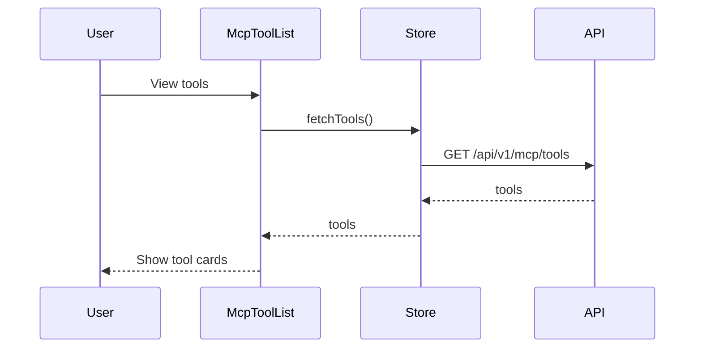
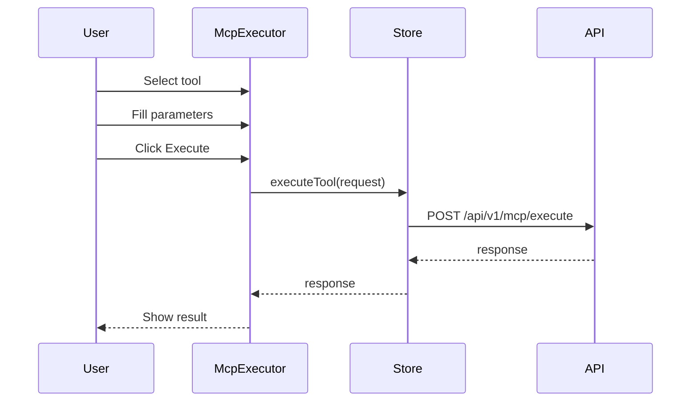

# AGENTS.md: Тестирование модуля MCP (Frontend)

Правила и структура тестирования для модуля mcp UI. Содержит тестовые профили для Vitest unit тестов и Cypress E2E тестов.

---

## Структура тестов

```
src/test/vue/mcp/
├── unit/
│   ├── McpToolList.spec.ts
│   ├── McpToolCard.spec.ts
│   ├── McpExecutor.spec.ts
│   └── store/
│       └── mcpStore.spec.ts
├── e2e/
│   ├── mcp-tools.cy.ts
│   └── mcp-execution.cy.ts
└── profile/
    └── McpTestProfile.ts
```

---

## Тестовые профили

### McpTestProfile.ts

```typescript
/**
 * Тестовый профиль для модуля MCP UI.
 */
export class McpTestProfile {
  
  /**
   * Создает тестовый MCP tool.
   */
  static createMcpTool(): McpTool {
    return {
      name: 'get_class_context',
      description: 'Get architectural context for a Spring class',
      parameters: [
        {
          name: 'fullName',
          type: 'string',
          description: 'Fully qualified class name',
          required: true
        },
        {
          name: 'includeMethods',
          type: 'boolean',
          description: 'Include methods in context',
          required: false,
          defaultValue: true
        }
      ],
      returnType: 'McpContext'
    };
  }
  
  /**
   * Создает MCP tool для метода.
   */
  static createMethodTool(): McpTool {
    return {
      name: 'get_method_context',
      description: 'Get architectural context for a method',
      parameters: [
        {
          name: 'className',
          type: 'string',
          description: 'Fully qualified class name',
          required: true
        },
        {
          name: 'methodName',
          type: 'string',
          description: 'Method name',
          required: true
        }
      ],
      returnType: 'McpContext'
    };
  }
  
  /**
   * Создает MCP tool для endpoint.
   */
  static createEndpointTool(): McpTool {
    return {
      name: 'get_endpoint_context',
      description: 'Get architectural context for a REST endpoint',
      parameters: [
        {
          name: 'path',
          type: 'string',
          description: 'Endpoint path',
          required: true
        },
        {
          name: 'httpMethod',
          type: 'string',
          description: 'HTTP method',
          required: false,
          defaultValue: 'GET'
        }
      ],
      returnType: 'McpContext'
    };
  }
  
  /**
   * Создает список всех MCP tools.
   */
  static createAllTools(): McpTool[] {
    return [
      this.createMcpTool(),
      this.createMethodTool(),
      this.createEndpointTool()
    ];
  }
  
  /**
   * Создает тестовый MCP запрос.
   */
  static createMcpRequest(): McpRequest {
    return {
      toolName: 'get_class_context',
      parameters: {
        fullName: 'com.example.service.UserService',
        includeMethods: true
      },
      requestId: 'test-request-id'
    };
  }
  
  /**
   * Создает тестовый MCP ответ.
   */
  static createMcpResponse(): McpResponse {
    return {
      requestId: 'test-request-id',
      success: true,
      context: {
        contextType: 'CLASS',
        elementId: 'test-class-id',
        elementName: 'UserService',
        summary: 'Service class for user operations',
        data: {
          name: 'UserService',
          package: 'com.example.service',
          methods: ['getAllUsers', 'findById'],
          dependencies: ['UserRepository']
        },
        relatedElements: [
          {
            id: 'repo-id',
            type: 'CLASS',
            name: 'UserRepository',
            relationship: 'DEPENDS_ON'
          }
        ]
      }
    };
  }
  
  /**
   * Создает MCP ответ с ошибкой.
   */
  static createMcpErrorResponse(): McpResponse {
    return {
      requestId: 'test-request-id',
      success: false,
      errors: [
        {
          field: 'fullName',
          message: 'Class not found'
        }
      ]
    };
  }
  
  /**
   * Создает MCP контекст.
   */
  static createMcpContext(): McpContext {
    return {
      contextType: 'CLASS',
      elementId: 'test-class-id',
      elementName: 'UserService',
      summary: 'Service class for user operations',
      data: {
        name: 'UserService',
        package: 'com.example.service',
        labels: ['Service'],
        methods: [
          { name: 'getAllUsers', returnType: 'List<User>' },
          { name: 'findById', returnType: 'User' }
        ],
        dependencies: ['UserRepository']
      },
      relatedElements: [
        {
          id: 'repo-id',
          type: 'CLASS',
          name: 'UserRepository',
          relationship: 'DEPENDS_ON'
        }
      ],
      metadata: {
        generatedAt: new Date().toISOString(),
        version: '1.0'
      }
    };
  }
  
  /**
   * Создает начальное состояние store.
   */
  static createInitialState(): McpState {
    return {
      tools: [],
      currentTool: null,
      lastRequest: null,
      lastResponse: null,
      loading: false,
      error: null
    };
  }
  
  /**
   * Создает состояние с загруженными tools.
   */
  static createLoadedState(): McpState {
    return {
      tools: this.createAllTools(),
      currentTool: this.createMcpTool(),
      lastRequest: null,
      lastResponse: null,
      loading: false,
      error: null
    };
  }
}
```

---

## Unit тесты (Vitest)

### McpToolList.spec.ts

```typescript
/**
 * Unit тесты для компонента McpToolList.
 */
import { describe, it, expect, vi, beforeEach } from 'vitest';
import { mount } from '@vue/test-utils';
import { createTestingPinia } from '@pinia/testing';
import McpToolList from '@/mcp/view/McpToolList.vue';
import { McpTestProfile } from './profile/McpTestProfile';

describe('McpToolList', () => {
  let wrapper: any;
  
  beforeEach(() => {
    wrapper = mount(McpToolList, {
      global: {
        plugins: [
          createTestingPinia({
            initialState: {
              mcp: McpTestProfile.createLoadedState()
            }
          })
        ]
      }
    });
  });
  
  it('should render tool list', () => {
    const cards = wrapper.findAll('[data-test="tool-card"]');
    expect(cards.length).toBe(3);
  });
  
  it('should display tool names', () => {
    const firstCard = wrapper.find('[data-test="tool-card"]:first-child');
    expect(firstCard.text()).toContain('get_class_context');
  });
  
  it('should display tool descriptions', () => {
    const firstCard = wrapper.find('[data-test="tool-card"]:first-child');
    expect(firstCard.text()).toContain('Get architectural context');
  });
  
  it('should emit select event on tool click', async () => {
    const card = wrapper.find('[data-test="tool-card"]');
    await card.trigger('click');
    
    expect(wrapper.emitted('select')).toBeTruthy();
  });
  
  it('should show empty state when no tools', () => {
    const emptyWrapper = mount(McpToolList, {
      global: {
        plugins: [
          createTestingPinia({
            initialState: {
              mcp: McpTestProfile.createInitialState()
            }
          })
        ]
      }
    });
    
    expect(emptyWrapper.find('[data-test="empty-state"]').exists()).toBe(true);
  });
  
  it('should filter tools by name', async () => {
    const searchInput = wrapper.find('[data-test="tool-search"]');
    await searchInput.setValue('endpoint');
    
    const cards = wrapper.findAll('[data-test="tool-card"]');
    expect(cards.length).toBe(1);
    expect(cards[0].text()).toContain('get_endpoint_context');
  });
});
```

### McpToolCard.spec.ts

```typescript
/**
 * Unit тесты для компонента McpToolCard.
 */
import { describe, it, expect, vi, beforeEach } from 'vitest';
import { mount } from '@vue/test-utils';
import McpToolCard from '@/mcp/view/McpToolCard.vue';
import { McpTestProfile } from './profile/McpTestProfile';

describe('McpToolCard', () => {
  let wrapper: any;
  
  beforeEach(() => {
    wrapper = mount(McpToolCard, {
      props: {
        tool: McpTestProfile.createMcpTool()
      }
    });
  });
  
  it('should display tool name', () => {
    expect(wrapper.find('[data-test="tool-name"]').text()).toBe('get_class_context');
  });
  
  it('should display tool description', () => {
    expect(wrapper.find('[data-test="tool-description"]').text()).toContain('Get architectural context');
  });
  
  it('should display parameters count', () => {
    expect(wrapper.find('[data-test="params-count"]').text()).toContain('2');
  });
  
  it('should show required parameters indicator', () => {
    const requiredBadge = wrapper.find('[data-test="required-badge"]');
    expect(requiredBadge.exists()).toBe(true);
    expect(requiredBadge.text()).toContain('1 required');
  });
  
  it('should emit click event', async () => {
    await wrapper.trigger('click');
    
    expect(wrapper.emitted('click')).toBeTruthy();
  });
  
  it('should show selected state', async () => {
    await wrapper.setProps({ selected: true });
    
    expect(wrapper.classes()).toContain('selected');
  });
});
```

### McpExecutor.spec.ts

```typescript
/**
 * Unit тесты для компонента McpExecutor.
 */
import { describe, it, expect, vi, beforeEach } from 'vitest';
import { mount } from '@vue/test-utils';
import { createTestingPinia } from '@pinia/testing';
import McpExecutor from '@/mcp/view/McpExecutor.vue';
import { McpTestProfile } from './profile/McpTestProfile';

describe('McpExecutor', () => {
  let wrapper: any;
  
  beforeEach(() => {
    wrapper = mount(McpExecutor, {
      global: {
        plugins: [
          createTestingPinia({
            initialState: {
              mcp: McpTestProfile.createLoadedState()
            }
          })
        ]
      }
    });
  });
  
  it('should render parameter form', () => {
    expect(wrapper.find('[data-test="parameter-form"]').exists()).toBe(true);
  });
  
  it('should display required parameters', () => {
    const requiredParams = wrapper.findAll('[data-test="required-param"]');
    expect(requiredParams.length).toBe(1);
  });
  
  it('should display optional parameters', () => {
    const optionalParams = wrapper.findAll('[data-test="optional-param"]');
    expect(optionalParams.length).toBe(1);
  });
  
  it('should disable execute without required params', () => {
    const executeBtn = wrapper.find('[data-test="execute-btn"]');
    expect(executeBtn.attributes('disabled')).toBeDefined();
  });
  
  it('should enable execute with required params', async () => {
    await wrapper.find('input[name="fullName"]').setValue('com.example.UserService');
    
    const executeBtn = wrapper.find('[data-test="execute-btn"]');
    expect(executeBtn.attributes('disabled')).toBeUndefined();
  });
  
  it('should emit execute event', async () => {
    await wrapper.find('input[name="fullName"]').setValue('com.example.UserService');
    await wrapper.find('[data-test="execute-btn"]').trigger('click');
    
    expect(wrapper.emitted('execute')).toBeTruthy();
  });
  
  it('should display response when available', () => {
    const responseWrapper = mount(McpExecutor, {
      global: {
        plugins: [
          createTestingPinia({
            initialState: {
              mcp: {
                ...McpTestProfile.createLoadedState(),
                lastResponse: McpTestProfile.createMcpResponse()
              }
            }
          })
        ]
      }
    });
    
    expect(responseWrapper.find('[data-test="mcp-response"]').exists()).toBe(true);
  });
  
  it('should display error when execution fails', () => {
    const errorWrapper = mount(McpExecutor, {
      global: {
        plugins: [
          createTestingPinia({
            initialState: {
              mcp: {
                ...McpTestProfile.createLoadedState(),
                lastResponse: McpTestProfile.createMcpErrorResponse()
              }
            }
          })
        ]
      }
    });
    
    expect(errorWrapper.find('[data-test="error-message"]').exists()).toBe(true);
  });
  
  it('should show loading state during execution', () => {
    const loadingWrapper = mount(McpExecutor, {
      global: {
        plugins: [
          createTestingPinia({
            initialState: {
              mcp: {
                ...McpTestProfile.createLoadedState(),
                loading: true
              }
            }
          })
        ]
      }
    });
    
    expect(loadingWrapper.find('[data-test="loading-spinner"]').exists()).toBe(true);
  });
});
```

### mcpStore.spec.ts

```typescript
/**
 * Unit тесты для mcp store.
 */
import { describe, it, expect, vi, beforeEach } from 'vitest';
import { setActivePinia, createPinia } from 'pinia';
import { useMcpStore } from '@/mcp/store/mcpStore';
import { mcpApi } from '@/mcp/api/mcpApi';
import { McpTestProfile } from './profile/McpTestProfile';

vi.mock('@/mcp/api/mcpApi');

describe('mcpStore', () => {
  let store: ReturnType<typeof useMcpStore>;
  
  beforeEach(() => {
    setActivePinia(createPinia());
    store = useMcpStore();
    vi.clearAllMocks();
  });
  
  describe('fetchTools', () => {
    it('should fetch tools successfully', async () => {
      const tools = McpTestProfile.createAllTools();
      vi.mocked(mcpApi.getTools).mockResolvedValue(tools);
      
      await store.fetchTools();
      
      expect(store.tools).toEqual(tools);
      expect(store.loading).toBe(false);
    });
    
    it('should handle fetch error', async () => {
      vi.mocked(mcpApi.getTools).mockRejectedValue(new Error('Failed to fetch'));
      
      await store.fetchTools();
      
      expect(store.error).toBe('Failed to fetch');
    });
  });
  
  describe('selectTool', () => {
    it('should select tool', () => {
      const tool = McpTestProfile.createMcpTool();
      
      store.selectTool(tool);
      
      expect(store.currentTool).toEqual(tool);
    });
  });
  
  describe('executeTool', () => {
    it('should execute tool successfully', async () => {
      const request = McpTestProfile.createMcpRequest();
      const response = McpTestProfile.createMcpResponse();
      
      vi.mocked(mcpApi.executeTool).mockResolvedValue(response);
      
      await store.executeTool(request);
      
      expect(store.lastRequest).toEqual(request);
      expect(store.lastResponse).toEqual(response);
    });
    
    it('should handle execution error', async () => {
      const request = McpTestProfile.createMcpRequest();
      
      vi.mocked(mcpApi.executeTool).mockRejectedValue(new Error('Execution failed'));
      
      await expect(store.executeTool(request)).rejects.toThrow();
      expect(store.error).toBe('Execution failed');
    });
    
    it('should set loading state during execution', async () => {
      const request = McpTestProfile.createMcpRequest();
      const response = McpTestProfile.createMcpResponse();
      
      vi.mocked(mcpApi.executeTool).mockImplementation(() => 
        new Promise(resolve => setTimeout(() => resolve(response), 100))
      );
      
      const promise = store.executeTool(request);
      expect(store.loading).toBe(true);
      
      await promise;
      expect(store.loading).toBe(false);
    });
  });
  
  describe('clearResponse', () => {
    it('should clear last response', () => {
      store.lastResponse = McpTestProfile.createMcpResponse();
      
      store.clearResponse();
      
      expect(store.lastResponse).toBeNull();
    });
  });
  
  describe('getToolByName', () => {
    it('should find tool by name', () => {
      store.tools = McpTestProfile.createAllTools();
      
      const tool = store.getToolByName('get_class_context');
      
      expect(tool).toBeDefined();
      expect(tool?.name).toBe('get_class_context');
    });
    
    it('should return undefined for unknown tool', () => {
      store.tools = McpTestProfile.createAllTools();
      
      const tool = store.getToolByName('unknown_tool');
      
      expect(tool).toBeUndefined();
    });
  });
});
```

---

## E2E тесты (Cypress)

### mcp-tools.cy.ts

```typescript
/**
 * E2E тесты для просмотра MCP tools.
 */
describe('MCP Tools', () => {
  beforeEach(() => {
    cy.resetDatabase();
    cy.visit('/mcp');
  });
  
  it('should display available tools', () => {
    cy.get('[data-test="tool-card"]').should('have.length.at.least', 1);
  });
  
  it('should show tool details', () => {
    cy.get('[data-test="tool-card"]').first().click();
    
    cy.get('[data-test="tool-name"]').should('be.visible');
    cy.get('[data-test="tool-description"]').should('be.visible');
  });
  
  it('should display tool parameters', () => {
    cy.get('[data-test="tool-card"]').first().click();
    
    cy.get('[data-test="parameter-form"]').should('be.visible');
    cy.get('[data-test="required-param"]').should('exist');
  });
  
  it('should search tools', () => {
    cy.get('[data-test="tool-search"]').type('endpoint');
    
    cy.get('[data-test="tool-card"]').should('have.length', 1);
    cy.get('[data-test="tool-card"]').should('contain', 'get_endpoint_context');
  });
  
  it('should show integration info', () => {
    cy.get('[data-test="integration-info"]').should('be.visible');
    cy.get('[data-test="integration-info"]').should('contain', 'Cursor AI');
    cy.get('[data-test="integration-info"]').should('contain', 'Kilo Code');
  });
});

describe('MCP Execution', () => {
  beforeEach(() => {
    cy.resetDatabase();
    cy.seedArchitectureData();
    cy.visit('/mcp');
  });
  
  it('should execute class context tool', () => {
    cy.get('[data-test="tool-card"]').first().click();
    cy.get('input[name="fullName"]').type('com.example.service.UserService');
    cy.get('[data-test="execute-btn"]').click();
    
    cy.get('[data-test="mcp-response"]').should('be.visible');
    cy.get('[data-test="context-type"]').should('contain', 'CLASS');
  });
  
  it('should show validation error', () => {
    cy.get('[data-test="tool-card"]').first().click();
    cy.get('[data-test="execute-btn"]').click();
    
    cy.get('[data-test="validation-error"]').should('be.visible');
  });
  
  it('should handle execution error', () => {
    cy.get('[data-test="tool-card"]').first().click();
    cy.get('input[name="fullName"]').type('com.nonexistent.Class');
    cy.get('[data-test="execute-btn"]').click();
    
    cy.get('[data-test="error-message"]').should('be.visible');
  });
  
  it('should copy response to clipboard', () => {
    cy.get('[data-test="tool-card"]').first().click();
    cy.get('input[name="fullName"]').type('com.example.service.UserService');
    cy.get('[data-test="execute-btn"]').click();
    
    cy.get('[data-test="copy-response-btn"]').click();
    cy.get('[data-test="notification"]').should('contain', 'Copied');
  });
  
  it('should execute endpoint context tool', () => {
    cy.get('[data-test="tool-card"]').contains('endpoint').click();
    cy.get('input[name="path"]').type('/api/users');
    cy.get('[data-test="execute-btn"]').click();
    
    cy.get('[data-test="mcp-response"]').should('be.visible');
    cy.get('[data-test="context-type"]').should('contain', 'ENDPOINT');
  });
  
  it('should show execution history', () => {
    // Execute a tool first
    cy.get('[data-test="tool-card"]').first().click();
    cy.get('input[name="fullName"]').type('com.example.service.UserService');
    cy.get('[data-test="execute-btn"]').click();
    
    // Check history
    cy.get('[data-test="history-item"]').should('have.length.at.least', 1);
  });
  
  it('should re-execute from history', () => {
    // Execute a tool first
    cy.get('[data-test="tool-card"]').first().click();
    cy.get('input[name="fullName"]').type('com.example.service.UserService');
    cy.get('[data-test="execute-btn"]').click();
    
    // Clear and re-execute from history
    cy.get('[data-test="clear-btn"]').click();
    cy.get('[data-test="history-item"]').first().click();
    
    cy.get('input[name="fullName"]').should('have.value', 'com.example.service.UserService');
  });
});
```

---

## Тестовые сценарии

### Сценарий: Просмотр MCP tools



### Сценарий: Выполнение MCP tool



---

## Критерии приемки

| Критерий | Описание |
|----------|----------|
| Unit тесты | Все компоненты покрыты |
| Store тесты | Все actions покрыты |
| E2E тесты | Просмотр и выполнение проверены |
| Валидация | Параметры проверяются |
| История | История выполнения работает |
| Copy | Копирование результата работает |