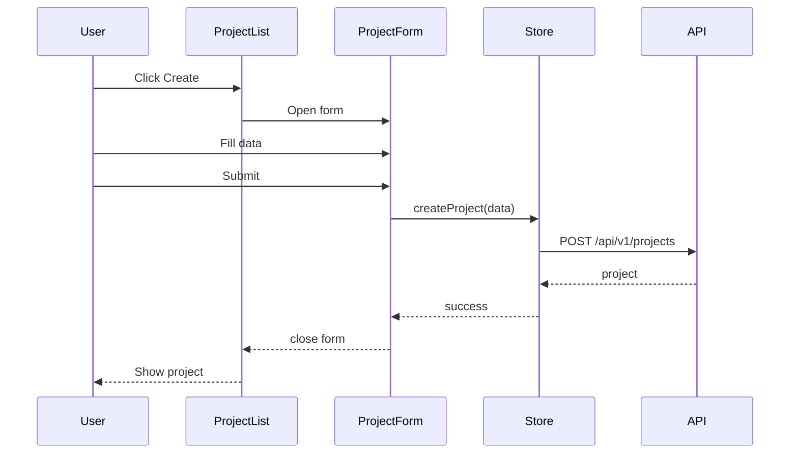
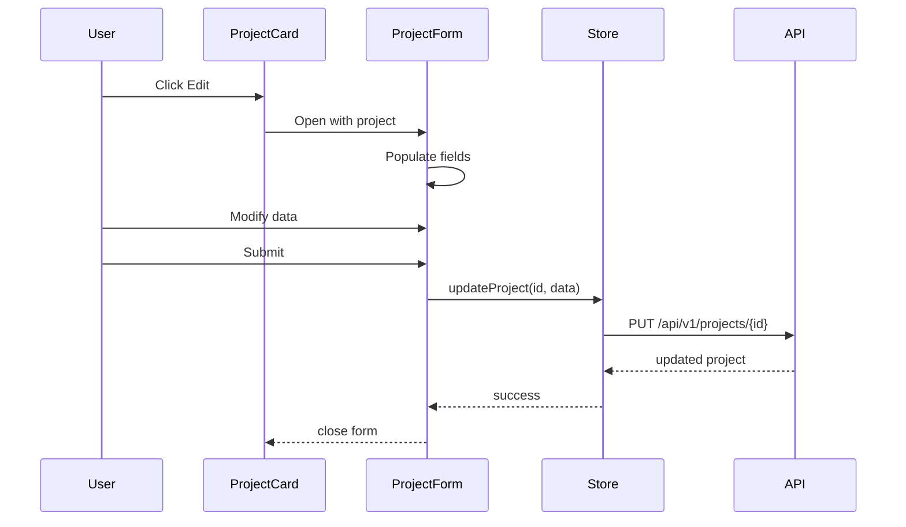

# AGENTS.md: Тестирование модуля Project (Frontend)

Правила и структура тестирования для модуля project UI. Содержит тестовые профили для Vitest unit тестов.

**Примечание:** E2E тесты выполняются на backend с использованием Playwright. См. [`src/test/java/AGENTS.md`](../../../../test/java/AGENTS.md) для деталей.

---

## Структура тестов

```
src/test/vue/project/
├── view/
│   ├── ProjectView.spec.ts
│   ├── ProjectList.spec.ts
│   └── ProjectForm.spec.ts
├── store/
│   └── project.store.spec.ts
└── service/
    └── project.service.spec.ts
```

---

## Тестовые профили

### ProjectTestProfile.ts

```typescript
/**
 * Тестовый профиль для модуля Project UI.
 */
export class ProjectTestProfile {
  
  /**
   * Создает тестовый проект.
   */
  static createProject(): Project {
    return {
      id: 'test-project-id-123',
      name: 'Test Project',
      path: '/test/project/path',
      includePackages: ['com.example'],
      excludePackages: ['com.example.config'],
      createdAt: new Date().toISOString(),
      updatedAt: new Date().toISOString()
    };
  }
  
  /**
   * Создает список тестовых проектов.
   */
  static createProjectList(): Project[] {
    return [
      this.createProject(),
      {
        id: 'test-project-id-456',
        name: 'Another Project',
        path: '/another/project',
        includePackages: ['org.example'],
        excludePackages: [],
        createdAt: new Date().toISOString(),
        updatedAt: new Date().toISOString()
      }
    ];
  }
  
  /**
   * Создает данные для создания проекта.
   */
  static createProjectFormData(): ProjectFormData {
    return {
      name: 'New Project',
      path: '/new/project/path',
      includePackages: ['com.newproject'],
      excludePackages: ['com.newproject.dto']
    };
  }
  
  /**
   * Создает данные для обновления проекта.
   */
  static updateProjectFormData(): ProjectFormData {
    return {
      name: 'Updated Project',
      path: '/test/project/path',
      includePackages: ['com.example', 'com.example.core'],
      excludePackages: ['com.example.config', 'com.example.dto']
    };
  }
  
  /**
   * Создает начальное состояние store.
   */
  static createInitialState(): ProjectState {
    return {
      projects: [],
      currentProject: null,
      loading: false,
      error: null
    };
  }
  
  /**
   * Создает состояние с загруженными проектами.
   */
  static createLoadedState(): ProjectState {
    return {
      projects: this.createProjectList(),
      currentProject: this.createProject(),
      loading: false,
      error: null
    };
  }
}
```

---

## Unit тесты (Vitest)

### ProjectList.spec.ts

```typescript
/**
 * Unit тесты для компонента ProjectList.
 */
import { describe, it, expect, vi, beforeEach } from 'vitest';
import { mount } from '@vue/test-utils';
import { createTestingPinia } from '@pinia/testing';
import ProjectList from '@/project/view/ProjectList.vue';
import { ProjectTestProfile } from './profile/ProjectTestProfile';

describe('ProjectList', () => {
  let wrapper: any;
  
  beforeEach(() => {
    wrapper = mount(ProjectList, {
      global: {
        plugins: [
          createTestingPinia({
            initialState: {
              project: ProjectTestProfile.createLoadedState()
            }
          })
        ]
      }
    });
  });
  
  it('should render project list', () => {
    const cards = wrapper.findAll('[data-test="project-card"]');
    expect(cards.length).toBe(2);
  });
  
  it('should display project names', () => {
    const firstCard = wrapper.find('[data-test="project-card"]:first-child');
    expect(firstCard.text()).toContain('Test Project');
  });
  
  it('should emit edit event when edit button clicked', async () => {
    const editButton = wrapper.find('[data-test="edit-project-btn"]');
    await editButton.trigger('click');
    
    expect(wrapper.emitted('edit')).toBeTruthy();
  });
  
  it('should emit delete event when delete button clicked', async () => {
    const deleteButton = wrapper.find('[data-test="delete-project-btn"]');
    await deleteButton.trigger('click');
    
    expect(wrapper.emitted('delete')).toBeTruthy();
  });
  
  it('should show empty state when no projects', () => {
    const emptyWrapper = mount(ProjectList, {
      global: {
        plugins: [
          createTestingPinia({
            initialState: {
              project: ProjectTestProfile.createInitialState()
            }
          })
        ]
      }
    });
    
    expect(emptyWrapper.find('[data-test="empty-state"]').exists()).toBe(true);
  });
  
  it('should show loading state', () => {
    const loadingWrapper = mount(ProjectList, {
      global: {
        plugins: [
          createTestingPinia({
            initialState: {
              project: { ...ProjectTestProfile.createInitialState(), loading: true }
            }
          })
        ]
      }
    });
    
    expect(loadingWrapper.find('[data-test="loading-spinner"]').exists()).toBe(true);
  });
});
```

### ProjectForm.spec.ts

```typescript
/**
 * Unit тесты для компонента ProjectForm.
 */
import { describe, it, expect, vi, beforeEach } from 'vitest';
import { mount } from '@vue/test-utils';
import ProjectForm from '@/project/view/ProjectForm.vue';
import { ProjectTestProfile } from './profile/ProjectTestProfile';

describe('ProjectForm', () => {
  let wrapper: any;
  
  beforeEach(() => {
    wrapper = mount(ProjectForm, {
      props: {
        project: null
      }
    });
  });
  
  it('should render form fields', () => {
    expect(wrapper.find('input[name="name"]').exists()).toBe(true);
    expect(wrapper.find('input[name="path"]').exists()).toBe(true);
    expect(wrapper.find('[data-test="include-packages"]').exists()).toBe(true);
    expect(wrapper.find('[data-test="exclude-packages"]').exists()).toBe(true);
  });
  
  it('should validate required fields', async () => {
    const submitButton = wrapper.find('[data-test="submit-btn"]');
    await submitButton.trigger('click');
    
    expect(wrapper.find('.error-message').exists()).toBe(true);
  });
  
  it('should emit submit event with form data', async () => {
    const formData = ProjectTestProfile.createProjectFormData();
    
    await wrapper.find('input[name="name"]').setValue(formData.name);
    await wrapper.find('input[name="path"]').setValue(formData.path);
    await wrapper.find('[data-test="submit-btn"]').trigger('click');
    
    expect(wrapper.emitted('submit')).toBeTruthy();
    expect(wrapper.emitted('submit')[0][0]).toMatchObject({
      name: formData.name,
      path: formData.path
    });
  });
  
  it('should populate form when editing', async () => {
    const project = ProjectTestProfile.createProject();
    
    const editWrapper = mount(ProjectForm, {
      props: { project }
    });
    
    expect(editWrapper.find('input[name="name"]').element.value).toBe(project.name);
    expect(editWrapper.find('input[name="path"]').element.value).toBe(project.path);
  });
  
  it('should add include package', async () => {
    const addPackageBtn = wrapper.find('[data-test="add-include-package"]');
    await addPackageBtn.trigger('click');
    
    const packageInputs = wrapper.findAll('[data-test="include-package-input"]');
    expect(packageInputs.length).toBe(1);
  });
  
  it('should remove include package', async () => {
    // Add a package first
    await wrapper.find('[data-test="add-include-package"]').trigger('click');
    
    // Then remove it
    const removeBtn = wrapper.find('[data-test="remove-include-package"]');
    await removeBtn.trigger('click');
    
    const packageInputs = wrapper.findAll('[data-test="include-package-input"]');
    expect(packageInputs.length).toBe(0);
  });
  
  it('should emit cancel event', async () => {
    const cancelButton = wrapper.find('[data-test="cancel-btn"]');
    await cancelButton.trigger('click');
    
    expect(wrapper.emitted('cancel')).toBeTruthy();
  });
});
```

### projectStore.spec.ts

```typescript
/**
 * Unit тесты для project store.
 */
import { describe, it, expect, vi, beforeEach } from 'vitest';
import { setActivePinia, createPinia } from 'pinia';
import { useProjectStore } from '@/project/store/project.store';
import { projectApi } from '@/project/api';
import { ProjectTestProfile } from './profile/ProjectTestProfile';

vi.mock('@/project/api');

describe('projectStore', () => {
  let store: ReturnType<typeof useProjectStore>;
  
  beforeEach(() => {
    setActivePinia(createPinia());
    store = useProjectStore();
    vi.clearAllMocks();
  });
  
  describe('fetchProjects', () => {
    it('should fetch projects successfully', async () => {
      const projects = ProjectTestProfile.createProjectList();
      vi.mocked(projectApi.getAll).mockResolvedValue(projects);
      
      await store.fetchProjects();
      
      expect(store.projects).toEqual(projects);
      expect(store.loading).toBe(false);
      expect(store.error).toBeNull();
    });
    
    it('should handle fetch error', async () => {
      const error = new Error('Failed to fetch');
      vi.mocked(projectApi.getAll).mockRejectedValue(error);
      
      await store.fetchProjects();
      
      expect(store.error).toBe('Failed to fetch');
      expect(store.loading).toBe(false);
    });
    
    it('should set loading state during fetch', async () => {
      vi.mocked(projectApi.getAll).mockImplementation(() => 
        new Promise(resolve => setTimeout(() => resolve([]), 100))
      );
      
      const promise = store.fetchProjects();
      expect(store.loading).toBe(true);
      
      await promise;
      expect(store.loading).toBe(false);
    });
  });
  
  describe('createProject', () => {
    it('should create project successfully', async () => {
      const formData = ProjectTestProfile.createProjectFormData();
      const newProject = { ...ProjectTestProfile.createProject(), ...formData };
      
      vi.mocked(projectApi.create).mockResolvedValue(newProject);
      
      await store.createProject(formData);
      
      expect(store.projects).toContainEqual(newProject);
    });
    
    it('should validate form data before create', async () => {
      const invalidData = { name: '', path: '' };
      
      await expect(store.createProject(invalidData)).rejects.toThrow();
    });
  });
  
  describe('updateProject', () => {
    it('should update project successfully', async () => {
      const project = ProjectTestProfile.createProject();
      store.projects = [project];
      
      const updateData = { name: 'Updated Name' };
      const updatedProject = { ...project, ...updateData };
      
      vi.mocked(projectApi.update).mockResolvedValue(updatedProject);
      
      await store.updateProject(project.id, updateData);
      
      expect(store.projects[0].name).toBe('Updated Name');
    });
  });
  
  describe('deleteProject', () => {
    it('should delete project successfully', async () => {
      const project = ProjectTestProfile.createProject();
      store.projects = [project];
      
      vi.mocked(projectApi.delete).mockResolvedValue(undefined);
      
      await store.deleteProject(project.id);
      
      expect(store.projects).not.toContainEqual(project);
    });
  });
  
  describe('setCurrentProject', () => {
    it('should set current project', () => {
      const project = ProjectTestProfile.createProject();
      
      store.setCurrentProject(project);
      
      expect(store.currentProject).toEqual(project);
    });
  });
});
```

---

## Тестовые сценарии

### Сценарий: Создание проекта



### Сценарий: Редактирование проекта



---

## Критерии приемки

| Критерий | Описание |
|----------|----------|
| Unit тесты | Все компоненты покрыты |
| Store тесты | Все actions и mutations покрыты |
| Валидация | Ошибки отображаются корректно |
| Состояния | Loading и empty states проверены |

---

## Запуск тестов

```bash
# Из директории src/main/vue
cd src\main\vue
set CI=true && npm run test

# Запуск тестов конкретного модуля
set CI=true && npm run test -- project